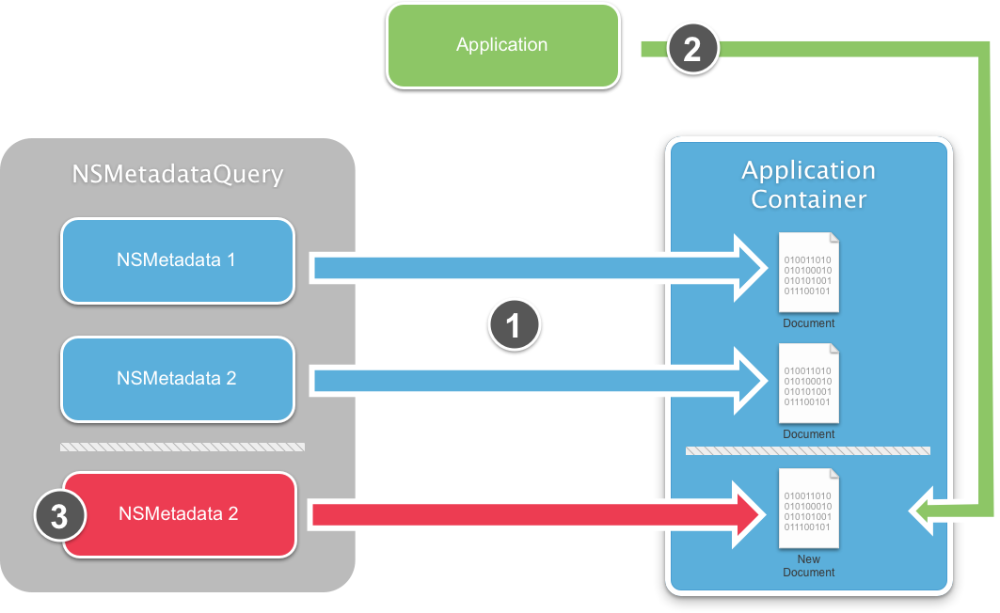
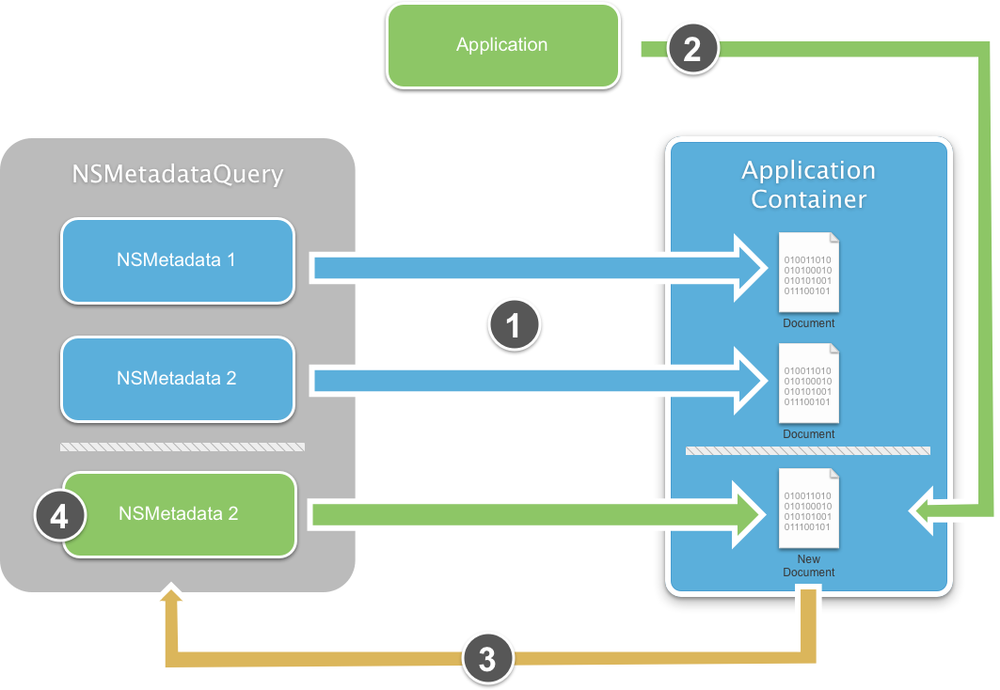
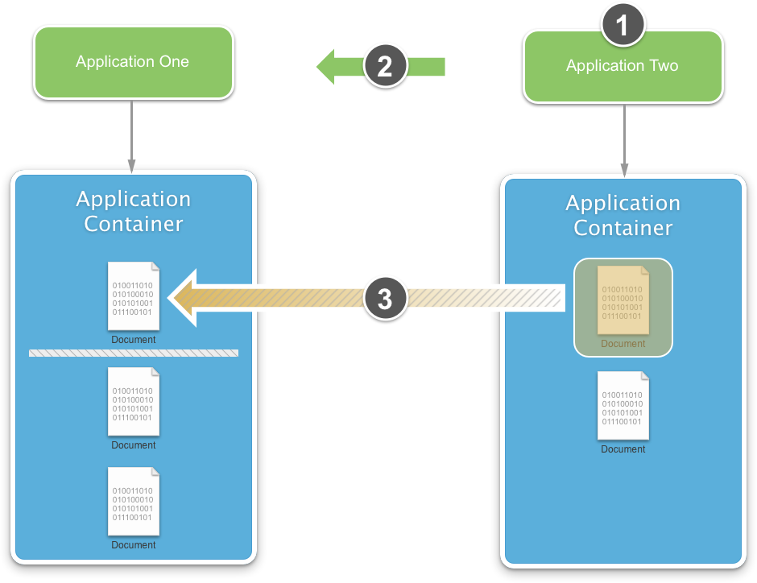
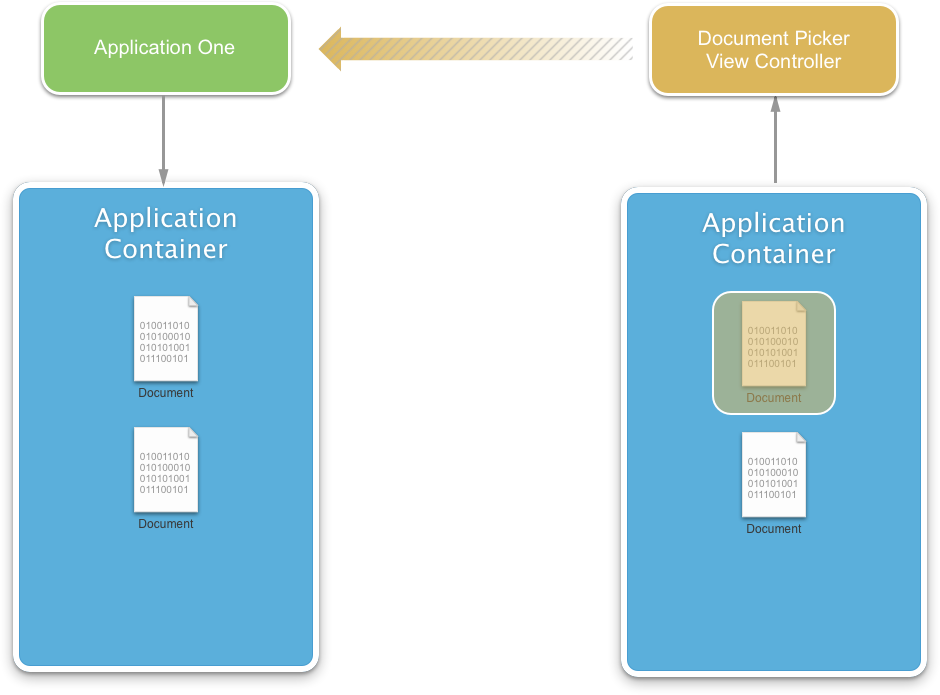
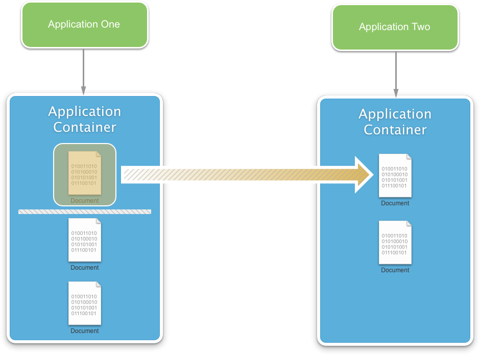
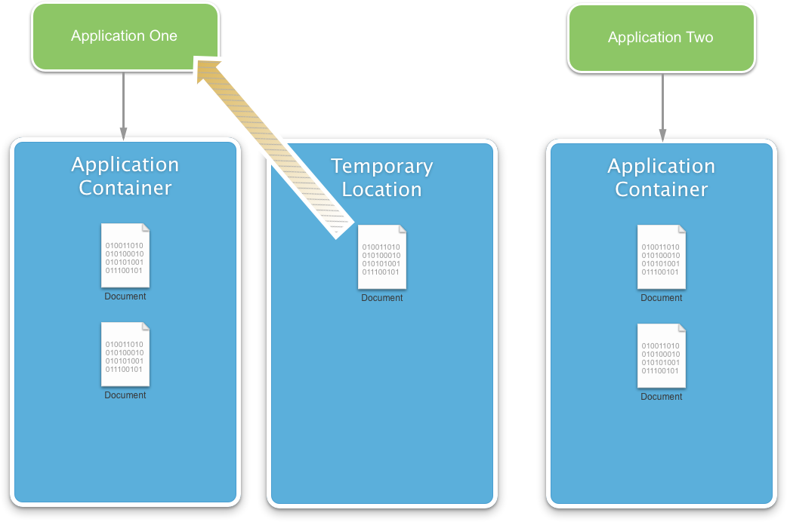
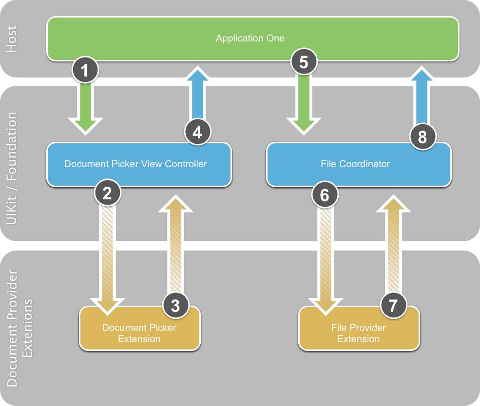
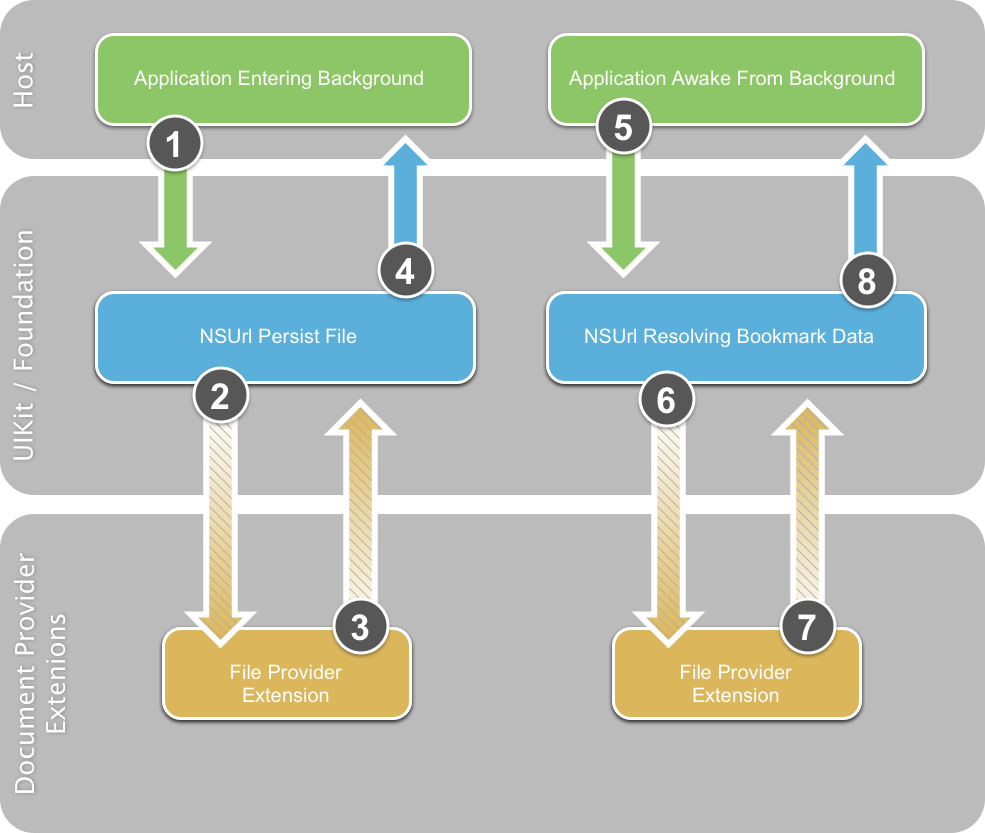

# Document Picker in Xamarin.iOS

The Document Picker allows documents to be shared between apps. These documents may be stored in iCloud or in a different app’s directory. Documents are shared via the set of [Document Provider Extensions](~/ios/platform/extensions.md) the user has installed on their device.

Because of the difficulty of keeping documents synchronized across apps and the cloud, they introduce a certain amount of necessary complexity.

## Requirements

The following is required to complete the steps presented in this article:

- **Xcode 7 and iOS 8 or newer** – Apple's Xcode 7 and iOS 8 or newer APIs need to be installed and configured on the developer's computer.
- **Visual Studio or Visual Studio for Mac** – The latest version of Visual Studio for Mac should be installed.
- **iOS Device** – An iOS device running iOS 8 or above.

## Changes to iCloud

To implement the new features of the Document Picker, the following changes have been made to Apple's iCloud Service:

- The iCloud Daemon has been completely rewritten using CloudKit.
- The existing iCloud features have been renamed iCloud Drive.
- Support for Microsoft Windows OS has been added to iCloud.
- An iCloud folder has been added in the Mac OS Finder.
- iOS devices can access the contents of the Mac OS iCloud folder.

> [!IMPORTANT]
> Apple [provides tools](https://developer.apple.com/support/allowing-users-to-manage-data/)
> to help developers properly handle the European Union's General Data
> Protection Regulation (GDPR).

## What is a Document?

When referring to a Document in iCloud, it is a single, stand-alone entity and should be perceived as such by the user. A user may wish to modify the document or share it with other users (by using email, for example).

There are several types of files that the user will immediately recognize as Documents, such as  Pages, Keynote or Numbers files. However, iCloud is not limited to this concept. For example, the state of a game (such as a Chess match) can be treated as a document and stored in iCloud. This file could be passed between a user's devices and allow them to pick up a game where they left off on a different device.

## Dealing with Documents

Before diving into the code required to use the Document Picker with Xamarin, this article is going to cover the best practices for working with iCloud Documents, and several of the modifications made to existing APIs required to support the Document Picker.

### Using File Coordination

Because a file can be modified from several different locations, coordination must be used to prevent data loss.

 [](document-picker-images/image1.png#lightbox)

Let's take a look at the above illustration:

1. An iOS device using file coordination creates a new Document and saves it to the iCloud Folder.
2. iCloud saves the modified file to the cloud for distribution to every device.
3. An attached Mac sees the modified file in the iCloud Folder and uses File Coordination to copy down the changes to the file.
4. A device not using File Coordination makes a change to the file and saves it to the iCloud Folder. These changes are instantly replicated to the other devices.

Assume the original iOS device or the Mac was editing the file, now their changes are lost and overwritten with the version of the file from the uncoordinated device. To prevent data loss, File Coordination is a must when working with cloud-based Documents.

### Using UIDocument

 `UIDocument` makes things simple (or `NSDocument` on macOS) by doing all of the heavy lifting for the developer. It provides built in File Coordination with background queues to keep from blocking the application's UI.

 `UIDocument` exposes multiple, high-level APIs that ease the development effort of a Xamarin application for any purpose the developer requires.

The following code creates a subclass of `UIDocument` to implement a generic text-based document that can be used to store and retrieve text from iCloud:

```csharp
using System;
using Foundation;
using UIKit;

namespace DocPicker
{
    public class GenericTextDocument : UIDocument
    {
        #region Private Variable Storage
        private NSString _dataModel;
        #endregion

        #region Computed Properties
        public string Contents {
            get { return _dataModel.ToString (); }
            set { _dataModel = new NSString(value); }
        }
        #endregion

        #region Constructors
        public GenericTextDocument (NSUrl url) : base (url)
        {
            // Set the default document text
            this.Contents = "";
        }

        public GenericTextDocument (NSUrl url, string contents) : base (url)
        {
            // Set the default document text
            this.Contents = contents;
        }
        #endregion

        #region Override Methods
        public override bool LoadFromContents (NSObject contents, string typeName, out NSError outError)
        {
            // Clear the error state
            outError = null;

            // Were any contents passed to the document?
            if (contents != null) {
                _dataModel = NSString.FromData( (NSData)contents, NSStringEncoding.UTF8 );
            }

            // Inform caller that the document has been modified
            RaiseDocumentModified (this);

            // Return success
            return true;
        }

        public override NSObject ContentsForType (string typeName, out NSError outError)
        {
            // Clear the error state
            outError = null;

            // Convert the contents to a NSData object and return it
            NSData docData = _dataModel.Encode(NSStringEncoding.UTF8);
            return docData;
        }
        #endregion

        #region Events
        public delegate void DocumentModifiedDelegate(GenericTextDocument document);
        public event DocumentModifiedDelegate DocumentModified;

        internal void RaiseDocumentModified(GenericTextDocument document) {
            // Inform caller
            if (this.DocumentModified != null) {
                this.DocumentModified (document);
            }
        }
        #endregion
    }
}
```

The `GenericTextDocument` class presented above will be used throughout this article when working with the Document Picker and external Documents in a Xamarin.iOS 8 application.

## Asynchronous File Coordination

iOS 8 provides several new Asynchronous File Coordination features via the new File Coordination APIs. Before iOS 8, all existing File Coordination APIs were totally synchronous. This meant the developer was responsible for implementing their own background queuing to prevent File Coordination from blocking the application's UI.

The new `NSFileAccessIntent` class contains a URL pointing to the file and several options to control the type of coordination required. The following code demonstrates moving a file from one location to another using intents:

```csharp
// Get source options
var srcURL = NSUrl.FromFilename ("FromFile.txt");
var srcIntent = NSFileAccessIntent.CreateReadingIntent (srcURL, NSFileCoordinatorReadingOptions.ForUploading);

// Get destination options
var dstURL = NSUrl.FromFilename ("ToFile.txt");
var dstIntent = NSFileAccessIntent.CreateReadingIntent (dstURL, NSFileCoordinatorReadingOptions.ForUploading);

// Create an array
var intents = new NSFileAccessIntent[] {
    srcIntent,
    dstIntent
};

// Initialize a file coordination with intents
var queue = new NSOperationQueue ();
var fileCoordinator = new NSFileCoordinator ();
fileCoordinator.CoordinateAccess (intents, queue, (err) => {
    // Was there an error?
    if (err!=null) {
        Console.WriteLine("Error: {0}",err.LocalizedDescription);
    }
});
```

## Discovering and Listing Documents

The way to discover and list Documents is by using the existing `NSMetadataQuery` APIs. This section will cover new features added to `NSMetadataQuery` that make working with Documents even easier than before.

### Existing Behavior

Prior to iOS 8, `NSMetadataQuery` was slow to pickup local file changes such as: deletes, creates and renames.

 [](document-picker-images/image2.png#lightbox)

In the above diagram:

1. For files that already exist in the Application Container,  `NSMetadataQuery` has existing  `NSMetadata` records pre-created and spooled so they are instantly available to the application.
1. The application creates a new file in the Application Container.
1. There is a delay before  `NSMetadataQuery` sees the modification to the Application Container and creates the required  `NSMetadata` record.

Because of the delay in the creation of the `NSMetadata` record, the application had to have two data sources open: one for local file changes and one for cloud based changes.

### Stitching

In iOS 8, `NSMetadataQuery` is easier to use directly with a new feature called Stitching:

 [](document-picker-images/image3.png#lightbox)

Using Stitching in the above diagram:

1. As before, for files that already exist in the Application Container,  `NSMetadataQuery` has existing  `NSMetadata` records pre-created and spooled.
1. The application creates a new file in the Application Container using File Coordination.
1. A hook in the Application Container sees the modification and calls  `NSMetadataQuery` to create the required  `NSMetadata` record.
1. The  `NSMetadata` record is created directly after the file and is made available to the application.

By using Stitching the application no longer has to open a data source to monitor local and cloud based file changes. Now the application can rely on `NSMetadataQuery` directly.

> [!IMPORTANT]
> Stitching only works if the Application is using File Coordination as presented in the section above. If File Coordination is not being used, the APIs default to the existing pre iOS 8 behavior.

### New iOS 8 Metadata Features

The following new features have been added to `NSMetadataQuery` in iOS 8:

- `NSMetatadataQuery` can now list non-local documents stored in the cloud.
- New APIs have been added to access metadata information on the cloud-based documents.
- There is a new  `NSUrl_PromisedItems` API that will to access the file attributes of files that may or may not have their content available locally.
- Use the  `GetPromisedItemResourceValue` method to get information about a given file or use the  `GetPromisedItemResourceValues` method to get information on more than one file at a time.

Two new file coordination flags have been added for dealing with metadata:

- `NSFileCoordinatorReadImmediatelyAvailableMetadataOnly`
- `NSFileCoordinatorWriteContentIndependentMetadataOnly`

With the above flags, the contents of the Document file do not need to be available locally for them to be used.

The following code segment shows how to use `NSMetadataQuery` to query for the existence of a specific file and build the file if it doesn't exist:

```csharp
using System;
using System.Collections.Generic;
using System.Linq;
using System.Threading;
using Foundation;
using UIKit;
using ObjCRuntime;
using System.IO;

#region Static Properties
public const string TestFilename = "test.txt";
#endregion

#region Computed Properties
public bool HasiCloud { get; set; }
public bool CheckingForiCloud { get; set; }
public NSUrl iCloudUrl { get; set; }

public GenericTextDocument Document { get; set; }
public NSMetadataQuery Query { get; set; }
#endregion

#region Private Methods
private void FindDocument () {
    Console.WriteLine ("Finding Document...");

    // Create a new query and set it's scope
    Query = new NSMetadataQuery();
    Query.SearchScopes = new NSObject [] {
                NSMetadataQuery.UbiquitousDocumentsScope,
                NSMetadataQuery.UbiquitousDataScope,
                NSMetadataQuery.AccessibleUbiquitousExternalDocumentsScope
            };

    // Build a predicate to locate the file by name and attach it to the query
    var pred = NSPredicate.FromFormat ("%K == %@"
        , new NSObject[] {
            NSMetadataQuery.ItemFSNameKey
            , new NSString(TestFilename)});
    Query.Predicate = pred;

    // Register a notification for when the query returns
    NSNotificationCenter.DefaultCenter.AddObserver (this,
            new Selector("queryDidFinishGathering:"),             NSMetadataQuery.DidFinishGatheringNotification,
            Query);

    // Start looking for the file
    Query.StartQuery ();
    Console.WriteLine ("Querying: {0}", Query.IsGathering);
}

[Export("queryDidFinishGathering:")]
public void DidFinishGathering (NSNotification notification) {
    Console.WriteLine ("Finish Gathering Documents.");

    // Access the query and stop it from running
    var query = (NSMetadataQuery)notification.Object;
    query.DisableUpdates();
    query.StopQuery();

    // Release the notification
    NSNotificationCenter.DefaultCenter.RemoveObserver (this
        , NSMetadataQuery.DidFinishGatheringNotification
        , query);

    // Load the document that the query returned
    LoadDocument(query);
}

private void LoadDocument (NSMetadataQuery query) {
    Console.WriteLine ("Loading Document...");    

    // Take action based on the returned record count
    switch (query.ResultCount) {
    case 0:
        // Create a new document
        CreateNewDocument ();
        break;
    case 1:
        // Gain access to the url and create a new document from
        // that instance
        NSMetadataItem item = (NSMetadataItem)query.ResultAtIndex (0);
        var url = (NSUrl)item.ValueForAttribute (NSMetadataQuery.ItemURLKey);

        // Load the document
        OpenDocument (url);
        break;
    default:
        // There has been an issue
        Console.WriteLine ("Issue: More than one document found...");
        break;
    }
}
#endregion

#region Public Methods
public void OpenDocument(NSUrl url) {

    Console.WriteLine ("Attempting to open: {0}", url);
    Document = new GenericTextDocument (url);

    // Open the document
    Document.Open ( (success) => {
        if (success) {
            Console.WriteLine ("Document Opened");
        } else
            Console.WriteLine ("Failed to Open Document");
    });

    // Inform caller
    RaiseDocumentLoaded (Document);
}

public void CreateNewDocument() {
    // Create path to new file
    // var docsFolder = Environment.GetFolderPath (Environment.SpecialFolder.Personal);
    var docsFolder = Path.Combine(iCloudUrl.Path, "Documents");
    var docPath = Path.Combine (docsFolder, TestFilename);
    var ubiq = new NSUrl (docPath, false);

    // Create new document at path
    Console.WriteLine ("Creating Document at:" + ubiq.AbsoluteString);
    Document = new GenericTextDocument (ubiq);

    // Set the default value
    Document.Contents = "(default value)";

    // Save document to path
    Document.Save (Document.FileUrl, UIDocumentSaveOperation.ForCreating, (saveSuccess) => {
        Console.WriteLine ("Save completion:" + saveSuccess);
        if (saveSuccess) {
            Console.WriteLine ("Document Saved");
        } else {
            Console.WriteLine ("Unable to Save Document");
        }
    });

    // Inform caller
    RaiseDocumentLoaded (Document);
}

public bool SaveDocument() {
    bool successful = false;

    // Save document to path
    Document.Save (Document.FileUrl, UIDocumentSaveOperation.ForOverwriting, (saveSuccess) => {
        Console.WriteLine ("Save completion: " + saveSuccess);
        if (saveSuccess) {
            Console.WriteLine ("Document Saved");
            successful = true;
        } else {
            Console.WriteLine ("Unable to Save Document");
            successful=false;
        }
    });

    // Return results
    return successful;
}
#endregion

#region Events
public delegate void DocumentLoadedDelegate(GenericTextDocument document);
public event DocumentLoadedDelegate DocumentLoaded;

internal void RaiseDocumentLoaded(GenericTextDocument document) {
    // Inform caller
    if (this.DocumentLoaded != null) {
        this.DocumentLoaded (document);
    }
}
#endregion
```

### Document Thumbnails

Apple feels that the best user experience when listing documents for an application is to use previews. This gives the end users context, so they can quickly identify the document that they want to work with.

Prior to iOS 8, showing document previews required a custom implementation. New to iOS 8 are file system attributes that allow the developer to quickly work with Document Thumbnails.

#### Retrieving Document Thumbnails

By calling the `GetPromisedItemResourceValue` or `GetPromisedItemResourceValues` methods, `NSUrl_PromisedItems` API, a `NSUrlThumbnailDictionary`, is returned. The only key currently in this dictionary is the `NSThumbnial1024X1024SizeKey` and its matching `UIImage`.

#### Saving Document Thumbnails

The easiest way to save a thumbnail is by using `UIDocument`. By calling the `GetFileAttributesToWrite` method of the `UIDocument` and setting the thumbnail, it will automatically be saved when the Document file is. The iCloud Daemon will see this change and propagate it to iCloud. On Mac OS X, thumbnails are automatically generated for the developer by the Quick Look plugin.

With the basics of working with iCloud based Documents in place, along with the modifications to existing API, we are ready to implement the Document Picker View Controller in a Xamarin iOS 8 Mobile Application.

## Enabling iCloud in Xamarin

Before the Document Picker can be used in a Xamarin.iOS Application, iCloud support needs to be enabled both in your application and via Apple.

The following steps walkthrough the process of provisioning for iCloud.

1. Create an iCloud Container.
2. Create an App ID that contains the iCloud App Service.
3. Create a Provisioning profile that includes this App ID.

The [Working with Capabilities](~/ios/deploy-test/provisioning/capabilities/icloud-capabilities.md) guide walks through the first two steps. To create a provisioning profile, follow the steps in the [Provisioning Profile](~/ios/get-started/installation/device-provisioning/index.md#provisioning-your-device) guide.

The following steps walkthrough the process of configuring your application for iCloud:

Do the following:

1. Open the project in Visual Studio for Mac or Visual Studio.
2. In the **Solution Explorer**, right-click the project and select Options.
3. In the Options Dialog Box select **iOS Application**, ensure that the **Bundle Identifier** matches the one that was defined in **App ID** created above for the application.
4. Select **iOS Bundle Signing**, select the **Developer Identity** and the **Provisioning Profile** created above.
5. Click the **OK** button to save the changes and close the dialog box.
6. Right-click on `Entitlements.plist` in the **Solution Explorer** to open it in the editor.

    > [!IMPORTANT]
    > In Visual Studio you may need to open the Entitlements editor by right-clicking on it, selecting **Open With…** and selecting Property List Editor

7. Check  **Enable iCloud** ,  **iCloud Documents** ,  **Key-value storage** and  **CloudKit** .
8. Ensure the **Container** exists for the application (as created above). Example: `iCloud.com.your-company.AppName`
9. Save the changes to the file.

For more information on Entitlements refer to the [Working with Entitlements](~/ios/deploy-test/provisioning/entitlements.md) guide.

With the above setup in place, the application can now use cloud-based documents and the new Document Picker View Controller.

## Common Setup Code

Before getting started with the Document Picker View Controller, there is some standard setup code required. Start by modifying the application's `AppDelegate.cs` file and make it look like the following:

```csharp
using System;
using System.Collections.Generic;
using System.Linq;
using System.Threading;
using Foundation;
using UIKit;
using ObjCRuntime;
using System.IO;

namespace DocPicker
{

    [Register ("AppDelegate")]
    public partial class AppDelegate : UIApplicationDelegate
    {
        #region Static Properties
        public const string TestFilename = "test.txt";
        #endregion

        #region Computed Properties
        public override UIWindow Window { get; set; }
        public bool HasiCloud { get; set; }
        public bool CheckingForiCloud { get; set; }
        public NSUrl iCloudUrl { get; set; }

        public GenericTextDocument Document { get; set; }
        public NSMetadataQuery Query { get; set; }
        public NSData Bookmark { get; set; }
        #endregion

        #region Private Methods
        private void FindDocument () {
            Console.WriteLine ("Finding Document...");

            // Create a new query and set it's scope
            Query = new NSMetadataQuery();
            Query.SearchScopes = new NSObject [] {
                NSMetadataQuery.UbiquitousDocumentsScope,
                NSMetadataQuery.UbiquitousDataScope,
                NSMetadataQuery.AccessibleUbiquitousExternalDocumentsScope
            };

            // Build a predicate to locate the file by name and attach it to the query
            var pred = NSPredicate.FromFormat ("%K == %@",
                 new NSObject[] {NSMetadataQuery.ItemFSNameKey
                , new NSString(TestFilename)});
            Query.Predicate = pred;

            // Register a notification for when the query returns
            NSNotificationCenter.DefaultCenter.AddObserver (this
                , new Selector("queryDidFinishGathering:")
                , NSMetadataQuery.DidFinishGatheringNotification
                , Query);

            // Start looking for the file
            Query.StartQuery ();
            Console.WriteLine ("Querying: {0}", Query.IsGathering);
        }

        [Export("queryDidFinishGathering:")]
        public void DidFinishGathering (NSNotification notification) {
            Console.WriteLine ("Finish Gathering Documents.");

            // Access the query and stop it from running
            var query = (NSMetadataQuery)notification.Object;
            query.DisableUpdates();
            query.StopQuery();

            // Release the notification
            NSNotificationCenter.DefaultCenter.RemoveObserver (this
                , NSMetadataQuery.DidFinishGatheringNotification
                , query);

            // Load the document that the query returned
            LoadDocument(query);
        }

        private void LoadDocument (NSMetadataQuery query) {
            Console.WriteLine ("Loading Document...");    

            // Take action based on the returned record count
            switch (query.ResultCount) {
            case 0:
                // Create a new document
                CreateNewDocument ();
                break;
            case 1:
                // Gain access to the url and create a new document from
                // that instance
                NSMetadataItem item = (NSMetadataItem)query.ResultAtIndex (0);
                var url = (NSUrl)item.ValueForAttribute (NSMetadataQuery.ItemURLKey);

                // Load the document
                OpenDocument (url);
                break;
            default:
                // There has been an issue
                Console.WriteLine ("Issue: More than one document found...");
                break;
            }
        }
        #endregion

        #region Public Methods

        public void OpenDocument(NSUrl url) {

            Console.WriteLine ("Attempting to open: {0}", url);
            Document = new GenericTextDocument (url);

            // Open the document
            Document.Open ( (success) => {
                if (success) {
                    Console.WriteLine ("Document Opened");
                } else
                    Console.WriteLine ("Failed to Open Document");
            });

            // Inform caller
            RaiseDocumentLoaded (Document);
        }

        public void CreateNewDocument() {
            // Create path to new file
            // var docsFolder = Environment.GetFolderPath (Environment.SpecialFolder.Personal);
            var docsFolder = Path.Combine(iCloudUrl.Path, "Documents");
            var docPath = Path.Combine (docsFolder, TestFilename);
            var ubiq = new NSUrl (docPath, false);

            // Create new document at path
            Console.WriteLine ("Creating Document at:" + ubiq.AbsoluteString);
            Document = new GenericTextDocument (ubiq);

            // Set the default value
            Document.Contents = "(default value)";

            // Save document to path
            Document.Save (Document.FileUrl, UIDocumentSaveOperation.ForCreating, (saveSuccess) => {
                Console.WriteLine ("Save completion:" + saveSuccess);
                if (saveSuccess) {
                    Console.WriteLine ("Document Saved");
                } else {
                    Console.WriteLine ("Unable to Save Document");
                }
            });

            // Inform caller
            RaiseDocumentLoaded (Document);
        }

        /// <summary>
        /// Saves the document.
        /// </summary>
        /// <returns><c>true</c>, if document was saved, <c>false</c> otherwise.</returns>
        public bool SaveDocument() {
            bool successful = false;

            // Save document to path
            Document.Save (Document.FileUrl, UIDocumentSaveOperation.ForOverwriting, (saveSuccess) => {
                Console.WriteLine ("Save completion: " + saveSuccess);
                if (saveSuccess) {
                    Console.WriteLine ("Document Saved");
                    successful = true;
                } else {
                    Console.WriteLine ("Unable to Save Document");
                    successful=false;
                }
            });

            // Return results
            return successful;
        }
        #endregion

        #region Override Methods
        public override void FinishedLaunching (UIApplication application)
        {

            // Start a new thread to check and see if the user has iCloud
            // enabled.
            new Thread(new ThreadStart(() => {
                // Inform caller that we are checking for iCloud
                CheckingForiCloud = true;

                // Checks to see if the user of this device has iCloud
                // enabled
                var uburl = NSFileManager.DefaultManager.GetUrlForUbiquityContainer(null);

                // Connected to iCloud?
                if (uburl == null)
                {
                    // No, inform caller
                    HasiCloud = false;
                    iCloudUrl =null;
                    Console.WriteLine("Unable to connect to iCloud");
                    InvokeOnMainThread(()=>{
                        var okAlertController = UIAlertController.Create ("iCloud Not Available", "Developer, please check your Entitlements.plist, Bundle ID and Provisioning Profiles.", UIAlertControllerStyle.Alert);
                        okAlertController.AddAction (UIAlertAction.Create ("Ok", UIAlertActionStyle.Default, null));
                        Window.RootViewController.PresentViewController (okAlertController, true, null);
                    });
                }
                else
                {    
                    // Yes, inform caller and save location the Application Container
                    HasiCloud = true;
                    iCloudUrl = uburl;
                    Console.WriteLine("Connected to iCloud");

                    // If we have made the connection with iCloud, start looking for documents
                    InvokeOnMainThread(()=>{
                        // Search for the default document
                        FindDocument ();
                    });
                }

                // Inform caller that we are no longer looking for iCloud
                CheckingForiCloud = false;

            })).Start();

        }

        // This method is invoked when the application is about to move from active to inactive state.
        // OpenGL applications should use this method to pause.
        public override void OnResignActivation (UIApplication application)
        {
        }

        // This method should be used to release shared resources and it should store the application state.
        // If your application supports background execution this method is called instead of WillTerminate
        // when the user quits.
        public override void DidEnterBackground (UIApplication application)
        {
            // Trap all errors
            try {
                // Values to include in the bookmark packet
                var resources = new string[] {
                    NSUrl.FileSecurityKey,
                    NSUrl.ContentModificationDateKey,
                    NSUrl.FileResourceIdentifierKey,
                    NSUrl.FileResourceTypeKey,
                    NSUrl.LocalizedNameKey
                };

                // Create the bookmark
                NSError err;
                Bookmark = Document.FileUrl.CreateBookmarkData (NSUrlBookmarkCreationOptions.WithSecurityScope, resources, iCloudUrl, out err);

                // Was there an error?
                if (err != null) {
                    // Yes, report it
                    Console.WriteLine ("Error Creating Bookmark: {0}", err.LocalizedDescription);
                }
            }
            catch (Exception e) {
                // Report error
                Console.WriteLine ("Error: {0}", e.Message);
            }
        }

        // This method is called as part of the transition from background to active state.
        public override void WillEnterForeground (UIApplication application)
        {
            // Is there any bookmark data?
            if (Bookmark != null) {
                // Trap all errors
                try {
                    // Yes, attempt to restore it
                    bool isBookmarkStale;
                    NSError err;
                    var srcUrl = new NSUrl (Bookmark, NSUrlBookmarkResolutionOptions.WithSecurityScope, iCloudUrl, out isBookmarkStale, out err);

                    // Was there an error?
                    if (err != null) {
                        // Yes, report it
                        Console.WriteLine ("Error Loading Bookmark: {0}", err.LocalizedDescription);
                    } else {
                        // Load document from bookmark
                        OpenDocument (srcUrl);
                    }
                }
                catch (Exception e) {
                    // Report error
                    Console.WriteLine ("Error: {0}", e.Message);
                }
            }

        }

        // This method is called when the application is about to terminate. Save data, if needed.
        public override void WillTerminate (UIApplication application)
        {
        }
        #endregion

        #region Events
        public delegate void DocumentLoadedDelegate(GenericTextDocument document);
        public event DocumentLoadedDelegate DocumentLoaded;

        internal void RaiseDocumentLoaded(GenericTextDocument document) {
            // Inform caller
            if (this.DocumentLoaded != null) {
                this.DocumentLoaded (document);
            }
        }
        #endregion
    }
}

```

> [!IMPORTANT]
> The above code includes the code from the Discovering and Listing Documents section above. It is presented here in its entirety, as it would appear in an actual application. For simplicity, this example works with a single, hard-coded file (`test.txt`) only.

The above code exposes several iCloud Drive shortcuts to make them easier to work with in the rest of the application.

Next, add the following code to any view or view container that will be using the Document Picker or working with cloud-based documents:

```csharp
using CloudKit;
...

#region Computed Properties
/// <summary>
/// Returns the delegate of the current running application
/// </summary>
/// <value>The this app.</value>
public AppDelegate ThisApp {
    get { return (AppDelegate)UIApplication.SharedApplication.Delegate; }
}
#endregion
```

This adds a shortcut to get to the `AppDelegate` and access the iCloud shortcuts created above.

With this code in place, let's take a look at implementing the Document Picker View Controller in a Xamarin iOS 8 application.

## Using the Document Picker View Controller

Prior to iOS 8, it was very difficult to access Documents from another application because there was no way to discover documents outside of the application from within the app.

### Existing Behavior

 [](document-picker-images/image31.png#lightbox)

Let's take a look at accessing an external document prior to iOS 8:

1. First the user would have to open the application that originally created the Document.
1. The Document is selected and the  `UIDocumentInteractionController` is used to send the Document to the new application.
1. Finally, a copy of the original Document is placed in the new application's Container.

From there the Document is available for the second application to open and edit.

### Discovering Documents Outside of an App's Container

In iOS 8, an application is able to access Documents outside of its own Application Container with ease:

 [](document-picker-images/image32.png#lightbox)

Using the new iCloud Document Picker ( `UIDocumentPickerViewController`), an iOS application can directly discover and access outside of its Application Container. The `UIDocumentPickerViewController` provides a mechanism for the user to grant access to and edit those discovered Documents via permissions.

An application must opt-in to have its Documents show up in the iCloud Document Picker and be available for other applications to discover and work with them. To have a Xamarin iOS 8 application share its Application Container, edit it `Info.plist` file in a standard text editor and add the following two lines to the bottom of the dictionary (between the `<dict>...</dict>` tags):

```xml
<key>NSUbiquitousContainerIsDocumentScopePublic</key>
<true/>
```

The `UIDocumentPickerViewController` provides a great new UI that allows the user to choose documents. To display the Document Picker View Controller in a Xamarin iOS 8 application, do the following:

```csharp
using MobileCoreServices;
...

// Allow the Document picker to select a range of document types
        var allowedUTIs = new string[] {
            UTType.UTF8PlainText,
            UTType.PlainText,
            UTType.RTF,
            UTType.PNG,
            UTType.Text,
            UTType.PDF,
            UTType.Image
        };

        // Display the picker
        //var picker = new UIDocumentPickerViewController (allowedUTIs, UIDocumentPickerMode.Open);
        var pickerMenu = new UIDocumentMenuViewController(allowedUTIs, UIDocumentPickerMode.Open);
        pickerMenu.DidPickDocumentPicker += (sender, args) => {

            // Wireup Document Picker
            args.DocumentPicker.DidPickDocument += (sndr, pArgs) => {

                // IMPORTANT! You must lock the security scope before you can
                // access this file
                var securityEnabled = pArgs.Url.StartAccessingSecurityScopedResource();

                // Open the document
                ThisApp.OpenDocument(pArgs.Url);

                // IMPORTANT! You must release the security lock established
                // above.
                pArgs.Url.StopAccessingSecurityScopedResource();
            };

            // Display the document picker
            PresentViewController(args.DocumentPicker,true,null);
        };

pickerMenu.ModalPresentationStyle = UIModalPresentationStyle.Popover;
PresentViewController(pickerMenu,true,null);
UIPopoverPresentationController presentationPopover = pickerMenu.PopoverPresentationController;
if (presentationPopover!=null) {
    presentationPopover.SourceView = this.View;
    presentationPopover.PermittedArrowDirections = UIPopoverArrowDirection.Down;
    presentationPopover.SourceRect = ((UIButton)s).Frame;
}
```

> [!IMPORTANT]
> The developer must call the `StartAccessingSecurityScopedResource` method of the `NSUrl` before an external document can be accessed. The `StopAccessingSecurityScopedResource` method must be called to release the security lock as soon as the document has been loaded.

### Sample Output

Here is an example of how the code above would display a Document Picker when run on an iPhone device:

1. The user starts the application and the main interface is displayed:   

    [](document-picker-images/image33.png#lightbox)
1. The user taps the **Action** Button at the top of the screen and is asked to select a **Document Provider** from the list of available providers:   

    [](document-picker-images/image34.png#lightbox)
1. The **Document Picker View Controller** is displayed for the selected **Document Provider**:   

    [](document-picker-images/image35.png#lightbox)
1. The user taps on a **Document Folder** to display its contents:   

    [](document-picker-images/image36.png#lightbox)
1. The user selects a **Document** and the **Document Picker** is closed.
1. The main interface is redisplayed, the **Document** is loaded from the external Container and its contents displayed.

The actual display of the Document Picker View Controller depends on the Document Providers that the user has installed on the device and which Document Picker Mode has been implement. The above example is using the Open Mode, the other mode types will be discussed in detail below.

## Managing External Documents

As discussed above, prior to iOS 8, an application could only access documents that were a part of its Application Container. In iOS 8 an application can access Documents from external sources:

 [](document-picker-images/image37.png#lightbox)

When the user selects a Document from an external source, a Reference Document is written to the Application Container that points to the original Document.

To assist in adding this new ability into existing applications, several new features have been added to the `NSMetadataQuery` API. Typically, an application uses the Ubiquitous Document Scope to list documents that live within its Application Container. Using this scope, only documents within the Application Container will continue to be displayed.

Using the new Ubiquitous External Document Scope will return Documents that live outside the Application Container and return the metadata for them. The `NSMetadataItemUrlKey` will point to the URL where the Document is actually located.

Sometimes an application doesn't want to work with the Documents being pointed to by th reference. Instead, the app wants to work with the Reference Document directly. For example, the app may want to display the document in the Application's folder in the UI, or to allow the user to move the references around inside a folder.

In iOS 8, a new `NSMetadataItemUrlInLocalContainerKey` has been provided to access the Reference Document directly. This key points to the actual reference to the external document in an Application Container.

The `NSMetadataUbiquitousItemIsExternalDocumentKey` is used to test whether or not a document is external to an Application's Container. The `NSMetadataUbiquitousItemContainerDisplayNameKey` is used to access the name of the Container that is housing the original copy of an external Document.

### Why Document References are Required

The main reason that iOS 8 uses references to access external Documents is security. No application is given access to any other application's Container. Only the Document Picker can do that, because is running out-of-process and has system wide access.

The only way to get to a document outside of the Application Container is by using the Document Picker, and if the URL returned by the picker is Security Scoped. The Security Scoped URL contains just enough information to selected the document along with the scoped rights required to grant an application access to the document.

It is important to note that if the Security Scoped URL was serialized into a string and then de-serialized, the Security Information would be lost and the file would be inaccessible from the URL. The Document Reference feature provides a mechanism to get back to the files pointed to by these URLs.

So if the application acquires an `NSUrl` from one of the Reference Documents, it already has the security scope attached and can be used to access the file. For this reason, it is highly suggested that the developer use `UIDocument` because it handles all of this information and processes for them.

### Using Bookmarks

It is not always feasible to enumerate an application's Documents to get back to a specific Document, for example, when doing state restoration. iOS 8 provides a mechanism to create Bookmarks that directly target a given Document.

The following code will create a Bookmark from a `UIDocument`'s `FileUrl` property:

```csharp
// Trap all errors
try {
    // Values to include in the bookmark packet
    var resources = new string[] {
        NSUrl.FileSecurityKey,
        NSUrl.ContentModificationDateKey,
        NSUrl.FileResourceIdentifierKey,
        NSUrl.FileResourceTypeKey,
        NSUrl.LocalizedNameKey
    };

    // Create the bookmark
    NSError err;
    Bookmark = Document.FileUrl.CreateBookmarkData (NSUrlBookmarkCreationOptions.WithSecurityScope, resources, iCloudUrl, out err);

    // Was there an error?
    if (err != null) {
        // Yes, report it
        Console.WriteLine ("Error Creating Bookmark: {0}", err.LocalizedDescription);
    }
}
catch (Exception e) {
    // Report error
    Console.WriteLine ("Error: {0}", e.Message);
}
```

The existing Bookmark API is used to create a Bookmark against an existing `NSUrl` that can be saved and loaded to provide direct access to an external file. The following code will restore a bookmark that was created above:

```csharp
if (Bookmark != null) {
    // Trap all errors
    try {
        // Yes, attempt to restore it
        bool isBookmarkStale;
        NSError err;
        var srcUrl = new NSUrl (Bookmark, NSUrlBookmarkResolutionOptions.WithSecurityScope, iCloudUrl, out isBookmarkStale, out err);

        // Was there an error?
        if (err != null) {
            // Yes, report it
            Console.WriteLine ("Error Loading Bookmark: {0}", err.LocalizedDescription);
        } else {
            // Load document from bookmark
            OpenDocument (srcUrl);
        }
    }
    catch (Exception e) {
        // Report error
        Console.WriteLine ("Error: {0}", e.Message);
    }
}
```

## Open vs. Import Mode and the Document Picker

The Document Picker View Controller features two different modes of operation:

1. **Open Mode** – In this mode, when the user selects and external Document, the Document Picker will create a Security Scoped Bookmark in the Application Container.   

    [](document-picker-images/image37.png#lightbox)
1. **Import Mode** – In this mode, when the user selects and external Document, the Document Picker will not create a Bookmark, but instead, copy the file into a Temporary Location and provide the application access to the Document at this location:   

    [](document-picker-images/image38.png#lightbox)   
 Once the application terminates for any reason, the Temporary Location is emptied and the file removed. If the application needs to maintain access to the file, it should make a copy and place it in its Application Container.

The Open Mode is useful when the application wishes to collaborate with another application and share any changes made to the document with that application. The Import Mode is used when the application does not want to share its modifications to a Document with other applications.

## Making a Document External

As noted above, an iOS 8 application does not have access to containers outside of its own Application Container. The application can write to its own container locally or into a Temporary Location, then use a special document mode to move the resulting Document outside of the Application Container to a user chosen location.

To move a Document to an external location, do the following:

1. First create a new Document in a local or temporary location.
1. Create a  `NSUrl` that points to the new Document.
1. Open a new Document Picker View Controller and pass it the  `NSUrl` with the Mode of `MoveToService` .
1. Once the user chooses a new location, the Document will be moved from its current location to the new location.
1. A Reference Document will be written to the app's Application Container so that the file can still be accessed by the creating application.

The following code can be used to move a Document to an external location: `var picker = new UIDocumentPickerViewController (srcURL, UIDocumentPickerMode.MoveToService);`

The Reference Document returned by the above process is exactly the same as one created by the Open Mode of the Document Picker. However, there are times that the application might wish to move a Document without keeping a reference to it.

To move a Document without generating a reference, use the `ExportToService` Mode. Example: `var picker = new UIDocumentPickerViewController (srcURL, UIDocumentPickerMode.ExportToService);`

When using the `ExportToService` mode, the Document is copied to the external Container and the existing copy is left in its original location.

## Document Provider Extensions

With iOS 8, Apple wants the end user to be able to access any of their cloud-based documents, no matter where they actually exist. To achieve this goal, iOS 8 provides a new Document Provider Extension mechanism.

### What is a Document Provider Extension?

Simply stated, a Document Provider Extension is a way for a developer, or a third-party, to provide to an application alternative document storage that can be accessed in the exact same way as the existing iCloud storage location.

The user can select one of these alternative storage locations from the Document Picker and they can use the exact same access modes (Open, Import, Move or Export) to work with files in that location.

This is implemented using two different extensions:

- **Document Picker Extension** – Provides a  `UIViewController` subclass that provides a graphical interface for the user to choose a document from an alternative storage location. This subclass will be displayed as part of the Document Picker View Controller.
- **File Provide Extension** – This is a non-UI extension that deals with actually providing the files contents. These extensions are provided through File Coordination ( `NSFileCoordinator` ). This is another important case where File Coordination is required.

The following diagram shows the typical data flow when working with Document Provider Extensions:

 [](document-picker-images/image39.png#lightbox)

The following process occurs:

1. The application presents a Document Picker Controller to allow the user to select a file to work with.
1. The user selects an alternative file location and the custom  `UIViewController` extension is called to display the user interface.
1. The user selects a file from this location and the URL is passed back to the Document Picker.
1. The Document Picker selects the file's URL and returns it to the application for the user to work on.
1. The URL is passed to the File Coordinator to return the files contents to the application.
1. The File Coordinator calls the custom File Provider Extension to retrieve the file.
1. The contents of the file are returned to the File Coordinator.
1. The contents of the file are returned to the application.

### Security and Bookmarks

This section will take a quick look at how security and persistent file access through Bookmarks works with Document Provider Extensions. Unlike the iCloud Document Provider, which automatically saves Security and Bookmarks to the Application Container, Document Provider Extensions don't because they are not a part of the Document Reference System.

For example: in an Enterprise setting that provides its own company-wide secure datastore, administrators don't want confidential corporate information accessed or processed by the public iCloud Servers. Therefore, the built-in Document Reference System cannot be used.

The Bookmark system can still be used and it is the responsibility of the File Provider Extension to correctly process a bookmarked URL and return the contents of the Document pointed to by it.

For security purposes, iOS 8 has an Isolation Layer that persists the information about which application has access to which identifier inside which File Provider. It should be noted that all file access is controlled by this Isolation Layer.

The following diagram shows the data flow when working with Bookmarks and a Document Provider Extension:

 [](document-picker-images/image40.png#lightbox)

The following process occurs:

1. The application is about to enter the background and needs to persist its state. It calls `NSUrl` to create a bookmark to a file in alternative storage.
1. `NSUrl` calls the File Provider Extension to get a persistent URL to the Document.
1. The File Provider Extension returns the URL as a string to the `NSUrl` .
1. The `NSUrl` bundles the URL into a Bookmark and returns it to the application.
1. When the Application awakes from being in the background and needs to restore state, it passes the Bookmark to `NSUrl` .
1. `NSUrl` calls the File Provider Extension with the URL of the file.
1. The File Extension Provider accesses the file and returns the location of the file to `NSUrl` .
1. The file location is bundled with security information and returned to the application.

From here, the application can access the file and work with it as normal.

### Writing Files

This section will take a quick look at how writing files to an alternative location with a Document Provider Extension works. The iOS application will use File Coordination to save information to disk inside the Application Container. Shortly after the file has been successfully written, the File Provider Extension will be notified of the change.

At this point, the File Provider Extension can start uploading the file to the alternative location (or mark the file as dirty and requiring upload).

### Creating New Document Provider Extensions

Creating new Document Provider Extensions is outside of the scope of this introductory article. This information is provided here to show that, based on the extensions a user has loaded in their iOS device, an application may have access to Document storage locations outside of the Apple provided iCloud location.

The developer should be aware of this fact when using the Document Picker and working with external Documents. They should not assume those Document are hosted in iCloud.

For more information on creating a Storage Provider or Document Picker Extension, please see the [Introduction to App Extensions](~/ios/platform/extensions.md) document.

## Migrating to iCloud Drive

On iOS 8, users can choose to continue using the existing iCloud Documents System used in iOS 7 (and prior systems) or they can choose to migrate existing Documents to the new iCloud Drive mechanism.

On Mac OS X Yosemite, Apple does not provide the backwards compatibility so all documents must be migrated to iCloud Drive or they will no longer be updated across devices.

After a user's account has been migrated to iCloud Drive, only devices using iCloud Drive will be able to propagate changes to Documents across those devices.

> [!IMPORTANT]
> Developers should be aware that the new features covered in this article are only available if the user's account has been migrated to iCloud Drive.

## Summary

This article has covered the changes to existing iCloud APIs required to support iCloud Drive and the new Document Picker View Controller. It has covered File Coordination and why it is important when working with cloud-based documents. It has covered the setup required to enable cloud-based documents in a Xamarin.iOS Application and given an introductory look at working with documents outside an app's Application Container using the Document Picker View Controller.

In addition, this article briefly covered Document Provider Extensions and why the developer should be aware of them when writing applications that can handle cloud-based documents.

## Related Links

- [DocPicker (sample)](/samples/xamarin/ios-samples/ios8-docpicker)
- [Introduction to iOS 8](~/ios/platform/introduction-to-ios8.md)
- [Introduction to App Extensions](~/ios/platform/extensions.md)