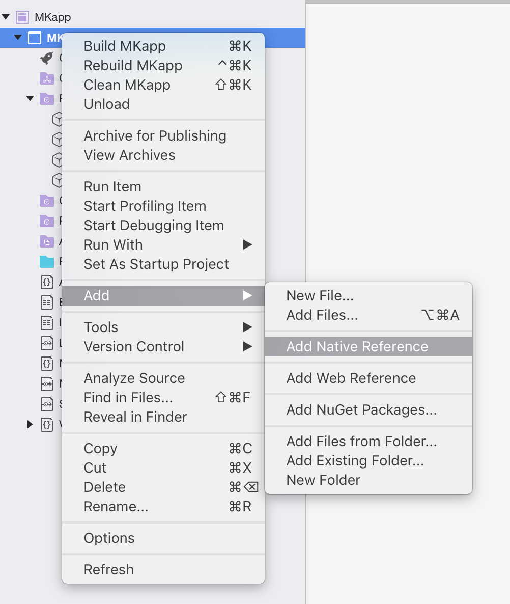
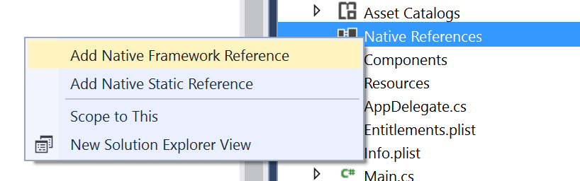

# Embedded frameworks in Xamarin.iOS

_This document describes how application developers can embed user frameworks in their apps._

With iOS 8.0 Apple made it possible to create an embedded framework to share code between
app extensions and the main app in Xcode.

Xamarin.iOS 9.0 adds support for consuming these embedded frameworks (created with Xcode)
in Xamarin.iOS apps. *It will **not** be possible to create embedded frameworks from any type
of Xamarin.iOS projects, only consume existing native (Objective-C) frameworks.*

There are two ways to consume frameworks in Xamarin.iOS:

- Pass the framework to the mtouch tool, by adding the following to the additional
  mtouch arguments in the project's **iOS Build** options:

  ```csharp
  --framework:/Path/To/My.Framework
  ```

  This has to be set for each project configuration.

- Add Native References from the context menu

# [Visual Studio for Mac](#tab/macos)

Right-click on Project and Browse to Add Native References



# [Visual Studio](#tab/windows)

Right-click on Project and Browse to Add Native References



-----

  This will work for all configurations.

In future versions of Visual Studio for Mac and the Xamarin Tools for Visual Studio it
will be possible to consume frameworks from within the IDE (without editing project
files manually).

A few sample projects can be found on [github](https://github.com/rolfbjarne/embedded-frameworks)

## Limitations

- Embedded frameworks are only supported in [Unified](~/cross-platform/macios/unified/index.md) projects.
- Embedded frameworks are only supported in projects with a deployment target of at least
  iOS 8.0.
- If an extension requires an embedded framework, then the container app must also have
  a reference to the framework, otherwise the framework will not be included in the app
  bundle.

## The Mono runtime

Internally Xamarin.iOS takes advantage of this feature to link with the Mono runtime as
a framework, instead of linking the Mono runtime statically into each extension and the
container app.

This is automatically done if the container app is a Unified app, it contains extensions
and the target deployment is iOS 8.0 or higher.

Apps without extensions will still link with the Mono runtime statically, because there
is a size penalty for using a framework if there's only one app referencing it.

This behavior can be overridden by the app developer, by adding the following as an
additional mtouch argument in the project's iOS Build options:

- `--mono:static`: Links with the Mono runtime statically.
- `--mono:framework`: Links with the Mono runtime as a framework.

One scenario for linking with the Mono runtime as a framework even for apps
without extensions is to decrease the executable size, to overcome any size
restrictions Apple enforces on the executable. For reference, the Mono runtime
adds approximately 1.7MB per architecture (as of Xamarin.iOS 8.12, however his varies
between releases, and even between apps). The Mono framework adds approximately 2.3MB
per architecture, which means that for a single-architecture app without any extensions,
making the app link with the Mono runtime as a framework will shrink the executable by
~1.7MB, but add a ~2.3MB framework, resulting in a ~0.6MB bigger app alltogether.
