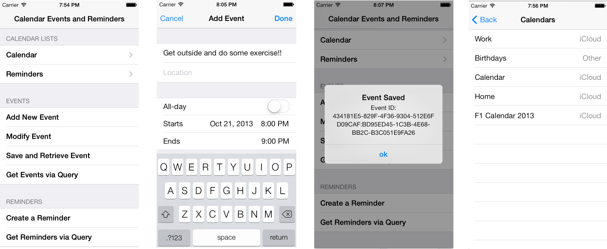

# EventKit in Xamarin.iOS

iOS has two calendar-related applications built-in: the Calendar Application,
and the Reminders Application. It’s straightforward enough to understand how the Calendar Application manages calendar data, but the Reminders Application is less obvious. Reminders can actually have dates associated with them in terms of when
they’re due, when they’re completed, etc. As such, iOS stores all calendar
data, whether it be calendar events or reminders, in one location, called the *Calendar Database*.

The EventKit framework provides a way to access the *Calendars*, *Calendar Events*, and *Reminders* data that Calendar Database
stores. Access to the calendars and calendar events has been available since iOS
4, but access to reminders is new in iOS 6.

In this guide we’re going to cover:

- **EventKit Basics** – This will introduce the fundamental pieces of EventKit via the major classes and provides an understanding of their usage. This section is required reading before tackling the next part of the document. 
- **Common Tasks** – The common tasks section is intended to be a quick reference on how to do common things such as; enumerating calendars, creating, saving and retrieving calendar events and reminders, as well as using the built-in controllers for creating and modifying calendar events. This section need not be read front-to-back, as it’s meant to be a reference for particular tasks. 

All tasks in this guide are available in the companion sample
application:

 [](eventkit-images/01.png#lightbox)

## Requirements

EventKit was introduced in iOS 4.0, but access to Reminders data was
introduced in iOS 6.0. As such, to do general EventKit development, you’ll
need to target at least version 4.0, and 6.0 for reminders.

Additionally, the Reminders application is not available on the simulator,
which means that reminders data will also not be available, unless you add them
first. Additionally, access requests are only shown to the user on the actual
device. As such, EventKit development is best tested on the Device.

## Event Kit Basics

When working with EventKit, it’s important to have a grasp of the common
classes and their usage. All of these classes can be found in the `EventKit` and `EventKitUI` (for the `EKEventEditController`).

### EventStore

The *EventStore* class is the most important class in EventKit because
it’s required to perform any operations in EventKit. It can be thought of as
the persistent storage, or database engine, for all EventKit data. From `EventStore` you have access to both the calendars and calendar
events in the Calendar Application, as well as reminders in the Reminders
Application.

Because `EventStore` is like a database engine, it should be
long-lived, meaning that it should be created and destroyed as little as
possible during the lifetime of an application instance. In fact, it’s
recommended that once you create one instance of an `EventStore` in
an application, you keep that reference around for the entire lifetime of the
application, unless you’re sure you won’t need it again. additionally, all
calls should go to a single `EventStore` instance. For this reason,
the Singleton pattern is recommended for keeping a single instance
available.

#### Creating an Event Store

The following code illustrates an efficient way to create a single
instance of the `EventStore` class and make it available statically
from within an application:

```csharp
public class App
{
    public static App Current {
            get { return current; }
    }
    private static App current;

    public EKEventStore EventStore {
            get { return eventStore; }
    }
    protected EKEventStore eventStore;

    static App ()
    {
            current = new App();
    }
    protected App () 
    {
            eventStore = new EKEventStore ( );
    }
}
```

The code above uses the Singleton pattern to instantiate an instance of the `EventStore` when the application loads. The `EventStore`
can then be accessed globally from within the application as follows:

```csharp
App.Current.EventStore;
```

Note that all examples in here use this pattern, so they reference the `EventStore` via `App.Current.EventStore`.

#### Requesting Access to Calendar and Reminder Data

Before being allowed to access any data via the EventStore, an application
must first request access to either the calendar events data or reminders data,
depending on which one you need. To facilitate this, the `EventStore` exposes a
method called `RequestAccess` which — when called — will show an alert view to the
user telling them that the application is requesting access to either the calendar
data, or reminder data, depending on which `EKEntityType` is passed to it. Because
it raises an alert view, the call is asynchronous, and will call a completion
handler passed as an `NSAction` (or Lambda) to it which will receive two
parameters; a boolean of whether or not access was granted, and an `NSError`,
which, if not-null will contain any error information in the request. For
example, the following coded will request access to calendar event data and show
an alert view if the request was not granted.

```csharp
App.Current.EventStore.RequestAccess (EKEntityType.Event, 
    (bool granted, NSError e) => {
            if (granted)
                    //do something here
            else
                    new UIAlertView ( "Access Denied", 
"User Denied Access to Calendar Data", null,
"ok", null).Show ();
            } );
```

Once the request has been granted, it will be remembered as long as the
application is installed on the device and will not pop up an alert to the user.
However, access is only given to the type of resource, either calendar events or
reminders granted. If an application needs access to both, it should request
both.

Because permission is remembered, it’s relatively cheap to make the request
each time, so it’s a good idea to always request access before performing an
operation.

Additionally, because the completion handler is called on a separate (non-UI)
thread, any updates to the UI in the completion handler should be called via `InvokeOnMainThread`, otherwise an exception will be thrown, and if
not caught, the application will crash.

### EKEntityType

`EKEntityType` is an enumeration that describes the type of `EventKit` item or data. It has two values: `Event` and
Reminder. It’s used in a number of methods, including `EventStore.RequestAccess` to tell `EventKit` what kind of
data to get access to or retrieve.

### EKCalendar

 *EKCalendar* represents a calendar, which contains a group of calendar
events. Calendars can be stored in a lot of different places, such as locally,
in *iCloud*, in a 3rd party provider location such as an *Exchange Server* or *Google*, etc. Many times `EKCalendar` is used
to tell `EventKit` where to look for events, or where to save
them.

### EKEventEditController

 *EKEventEditController* can be found in the `EventKitUI` namespace and is a built-in controller that can
be used to edit or create calendar events. Much like the built in camera
controllers, `EKEventEditController` does the heavy lifting for you
in displaying the UI and handling saving.

### EKEvent

 *EKEvent* represents a calendar event. Both `EKEvent` and `EKReminder` inherit from `EKCalendarItem` and have fields
such as `Title`, `Notes`, and so on.

### EKReminder

 *EKReminder* represents a reminder item.

### EKSpan

*EKSpan* is an enumeration that describes the span of events when
modifying events that can recur, and has two values: *ThisEvent* and *FutureEvents*. `ThisEvent` means that any changes will only
occur to the particular event in the series that is being referenced, whereas `FutureEvents` will affect that event and all future recurrences.

## Tasks

For ease of use, EventKit usage has been broken up into common tasks,
described in the following sections.

### Enumerate Calendars

To enumerate the calendars that the user has configured on the device, call `GetCalendars` on the `EventStore` and pass the type of
calendars (either reminders or events) that you wish to receive:

```csharp
EKCalendar[] calendars = 
App.Current.EventStore.GetCalendars ( EKEntityType.Event );
```

### Add or Modify an Event Using the Built-in Controller

The *EKEventEditViewController* does a lot of the heavy lifting for
you if you want to create or edit an event with the same UI that’s presented
to the user when using the Calendar Application:

 [](eventkit-images/02.png#lightbox)

To use it, you’ll want to declare it as a class-level variable so that it
doesn’t get garbage-collected if it’s declared within a method:

```csharp
public class HomeController : DialogViewController
{
        protected CreateEventEditViewDelegate eventControllerDelegate;
        ...
}
```

Then, to launch it: instantiate it, give it a reference to the `EventStore`, wire up an *EKEventEditViewDelegate* delegate to
it, and then display it using `PresentViewController`:

```csharp
EventKitUI.EKEventEditViewController eventController = 
        new EventKitUI.EKEventEditViewController ();

// set the controller's event store - it needs to know where/how to save the event
eventController.EventStore = App.Current.EventStore;

// wire up a delegate to handle events from the controller
eventControllerDelegate = new CreateEventEditViewDelegate ( eventController );
eventController.EditViewDelegate = eventControllerDelegate;

// show the event controller
PresentViewController ( eventController, true, null );
```

Optionally, if you want to pre-populate the event, you can either create a
brand new event (as shown below), or you can retrieve a saved event:

```csharp
EKEvent newEvent = EKEvent.FromStore ( App.Current.EventStore );
// set the alarm for 10 minutes from now
newEvent.AddAlarm ( EKAlarm.FromDate ( DateTime.Now.AddMinutes ( 10 ) ) );
// make the event start 20 minutes from now and last 30 minutes
newEvent.StartDate = DateTime.Now.AddMinutes ( 20 );
newEvent.EndDate = DateTime.Now.AddMinutes ( 50 );
newEvent.Title = "Get outside and exercise!";
newEvent.Notes = "This is your reminder to go and exercise for 30 minutes.”;
```

If you do wish to pre-populate the UI, make sure to set the Event property on
the controller:

```csharp
eventController.Event = newEvent;
```

To use an existing event, see the *Retrieve an Event by ID* section
later on.

The delegate should override the `Completed` method, which is called by the
controller when the user is finished with the dialog:

```csharp
protected class CreateEventEditViewDelegate : EventKitUI.EKEventEditViewDelegate
{
        // we need to keep a reference to the controller so we can dismiss it
        protected EventKitUI.EKEventEditViewController eventController;

        public CreateEventEditViewDelegate (EventKitUI.EKEventEditViewController eventController)
        {
                // save our controller reference
                this.eventController = eventController;
        }

        // completed is called when a user eith
        public override void Completed (EventKitUI.EKEventEditViewController controller, EKEventEditViewAction action)
        {
                eventController.DismissViewController (true, null);
                }
        }
}
```

Optionally, in the delegate, you can check the *Action* in the `Completed` method to modify the event and resave, or do other things, if it’s cancelled, etcetera:

```csharp
public override void Completed (EventKitUI.EKEventEditViewController controller, EKEventEditViewAction action)
{
        eventController.DismissViewController (true, null);

        switch ( action ) {

        case EKEventEditViewAction.Canceled:
                break;
        case EKEventEditViewAction.Deleted:
                break;
        case EKEventEditViewAction.Saved:
                // if you wanted to modify the event you could do so here,
// and then save:
                //App.Current.EventStore.SaveEvent ( controller.Event, )
                break;
        }
}
```

### Creating an Event Programmatically

To create an event in code, use the *FromStore* factory method on the `EKEvent` class, and set any data on it:

```csharp
EKEvent newEvent = EKEvent.FromStore ( App.Current.EventStore );
// set the alarm for 10 minutes from now
newEvent.AddAlarm ( EKAlarm.FromDate ( DateTime.Now.AddMinutes ( 10 ) ) );
// make the event start 20 minutes from now and last 30 minutes
newEvent.StartDate = DateTime.Now.AddMinutes ( 20 );
newEvent.EndDate = DateTime.Now.AddMinutes ( 50 );
newEvent.Title = "Get outside and do some exercise!";
newEvent.Notes = "This is your motivational event to go and do 30 minutes of exercise. Super important. Do this.";
```

You must set the calendar that you want the event saved in, but if you have
no preference, you can use the default:

```csharp
newEvent.Calendar = App.Current.EventStore.DefaultCalendarForNewEvents;
```

To save the event, call the *SaveEvent* method on the `EventStore`:

```csharp
NSError e;
App.Current.EventStore.SaveEvent ( newEvent, EKSpan.ThisEvent, out e );
```

After it’s saved, the *EventIdentifier* property will be updated
with a unique identifier that can be used later to retrieve the event:

```csharp
Console.WriteLine ("Event Saved, ID: " + newEvent.CalendarItemIdentifier);
```

 `EventIdentifier` is a string formatted GUID.

### Create a Reminder Programmatically

Creating a reminder in code is much the same as creating a calendar
event:

```csharp
EKReminder reminder = EKReminder.Create ( App.Current.EventStore );
reminder.Title = "Do something awesome!";
reminder.Calendar = App.Current.EventStore.DefaultCalendarForNewReminders;
```

To save, call the *SaveReminder* method on the `EventStore`:

```csharp
NSError e;
App.Current.EventStore.SaveReminder ( reminder, true, out e );
```

### Retrieving an Event by ID

To retrieve an event by it’s ID, use the *EventFromIdentifier*
method on the `EventStore` and pass it the `EventIdentifier` that was pulled from the event:

```csharp
EKEvent mySavedEvent = App.Current.EventStore.EventFromIdentifier ( newEvent.EventIdentifier );
```

For events, there is are two other identifier properties, but `EventIdentifier` is the only one that works for this.

### Retrieving a Reminder by ID

To retrieve a reminder, use the *GetCalendarItem* method on the `EventStore` and pass it the *CalendarItemIdentifier*:

```csharp
EKCalendarItem myReminder = App.Current.EventStore.GetCalendarItem ( reminder.CalendarItemIdentifier );
```

Because `GetCalendarItem` returns an `EKCalendarItem`,
it must be cast to `EKReminder` if you need to access reminder data
or use the instance as an `EKReminder` later.

Don’t use `GetCalendarItem` for calendar events, as at the time
of writing, it doesn’t work.

### Deleting an Event

To delete a calendar event, call *RemoveEvent* on your `EventStore` and pass a reference to the event, and the appropriate `EKSpan`:

```csharp
NSError e;
App.Current.EventStore.RemoveEvent ( mySavedEvent, EKSpan.ThisEvent, true, out e);
```

Note however, after an event has been deleted, the event reference will be `null`.

### Deleting a Reminder

To delete a reminder, call *RemoveReminder* on the `EventStore` and pass a reference to the reminder:

```csharp
NSError e;
App.Current.EventStore.RemoveReminder ( myReminder as EKReminder, true, out e);
```

Note that in the above code there is a cast to `EKReminder`,
because `GetCalendarItem` was used to retrieve it

### Searching for Events

To search for calendar events, you must create an *NSPredicate* object
via the *PredicateForEvents* method on the `EventStore`. An `NSPredicate` is a query data object that iOS uses to locate
matches:

```csharp
DateTime startDate = DateTime.Now.AddDays ( -7 );
DateTime endDate = DateTime.Now;
// the third parameter is calendars we want to look in, to use all calendars, we pass null
NSPredicate query = App.Current.EventStore.PredicateForEvents ( startDate, endDate, null );
```

Once you’ve created the `NSPredicate`, use the *EventsMatching* method on the `EventStore`:

```csharp
// execute the query
EKCalendarItem[] events = App.Current.EventStore.EventsMatching ( query );
```

Note that queries are synchronous (blocking) and may take a long time,
depending on the query, so you may want to spin up a new thread or task to do
it.

### Searching for Reminders

Searching for reminders is similar to events; it requires a predicate, but
the call is already asynchronous, so you needn’t worry about blocking the
thread:

```csharp
// create our NSPredicate which we'll use for the query
NSPredicate query = App.Current.EventStore.PredicateForReminders ( null );

// execute the query
App.Current.EventStore.FetchReminders (
        query, ( EKReminder[] items ) => {
                // do someting with the items
        } );
```

## Summary

This document gave an overview of both the important pieces of the EventKit framework, and a number of the most common tasks. However, the EventKit framework is very large and powerful, and includes features that haven’t been introduced here, such as: batch updates, configuring alarms, configuring recurrence on events, registering and listening for changes on the calendar database, setting GeoFences and more.  For more information see
Apple’s [Calendar and Reminders Programming Guide](https://developer.apple.com/library/prerelease/ios/#documentation/DataManagement/Conceptual/EventKitProgGuide/Introduction/Introduction.html).

## Related Links

- [Calendars (sample)](/samples/xamarin/ios-samples/calendars)
- [Introduction to iOS 6](~/ios/platform/introduction-to-ios6/index.md)
- [Introduction to Calendars and Reminders](https://developer.apple.com/library/prerelease/ios/#documentation/DataManagement/Conceptual/EventKitProgGuide/Introduction/Introduction.html)