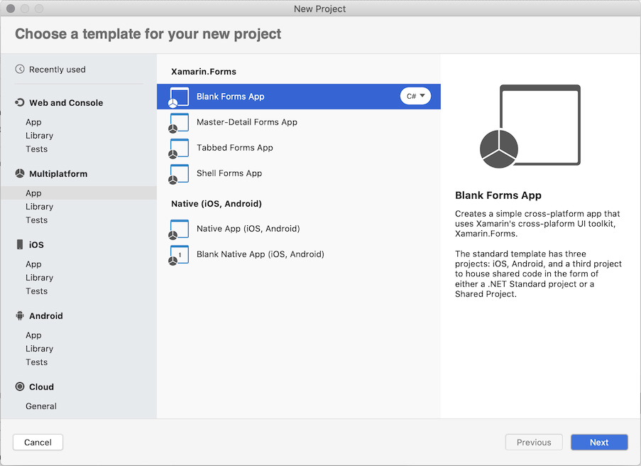
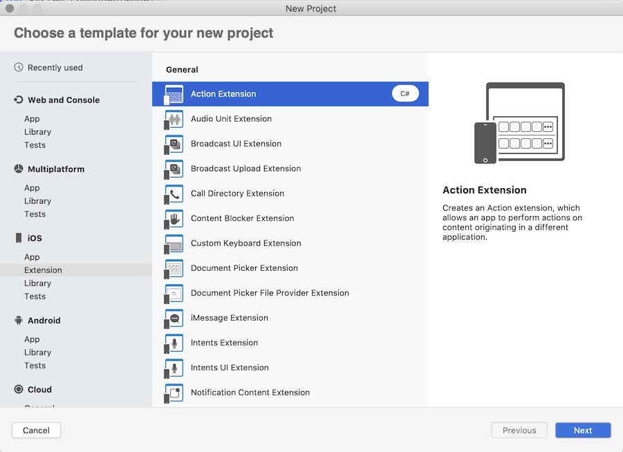
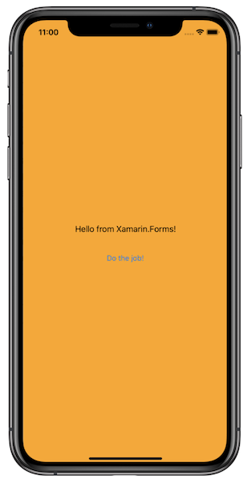
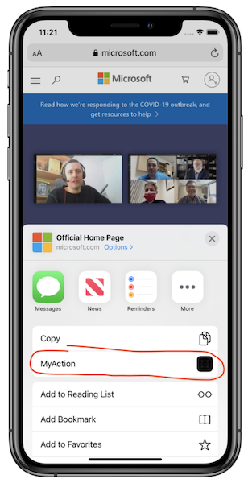
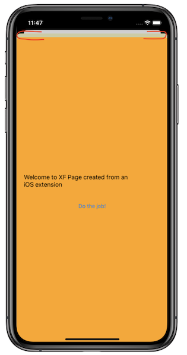
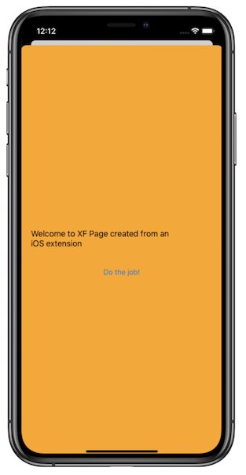

# Reuse Xamarin.Forms pages in an iOS extension

iOS extensions enable you to customize existing system behavior by adding extra functionality to [predefined by iOS and macOS Extension Points](https://developer.apple.com/library/archive/documentation/General/Conceptual/ExtensibilityPG/index.html#//apple_ref/doc/uid/TP40014214-CH20-SW2), such as custom context actions, password autofill, incoming calls filters, notification content modifiers, and more. Xamarin.iOS supports extensions and [this guide](./extensions.md) will walk you through creating an iOS extension using Xamarin tools.

Extensions are distributed as part of a Container app and activated from a specific Extension Point in a Host app. The Container app is usually a simple iOS application, which provides a user with information about the Extension, how to activate, and use it. There are three main approaches to sharing code between an Extension and a Container app:

1. Common iOS project.

    You can put all the shared code between the Container and the Extension into a shared iOS library and reference the library from both projects. Usually, the shared library contains native UIViewControllers and it has to be a Xamarin.iOS library.

1. File links.

    In some cases, the Container app provides most of the functionality while the Extension needs to render a single `UIViewController`. With few files to share, it's common to add a file link to the Extension app from the file located in the Container app.

1. Common Xamarin.Forms project.

    If app pages are already shared with another platform, such as Android, using the Xamarin.Forms framework, the common approach is to reimplement required pages natively in the Extension project, because the iOS Extension works with native UIViewControllers and not Xamarin.Forms pages. You have to perform additional steps to use Xamarin.Forms in the iOS extension, which are explained below.

## Xamarin.Forms in an iOS Extension project

The ability to use Xamarin.Forms in a native project is provided via [Native Forms](~/xamarin-forms/platform/native-forms.md). It allows `ContentPage`-derived pages to be added directly to native Xamarin.iOS projects. The `CreateViewController` extension method converts an instance of a Xamarin.Forms page to a native `UIViewController`, which could be used or modified as a regular controller. Because an iOS Extension is a special kind of a native iOS project, you can use **Native Forms** here as well.

> [!IMPORTANT]
> There are many [known limitations](./extensions.md#limitations) for iOS Extensions. Although you can use Xamarin.Forms in an iOS Extension, you should do so very carefully, monitoring memory usage and startup time. Otherwise, the Extension could be terminated by iOS without any way to handle this gracefully.

## Walkthrough

In this walkthrough, you are going to create a Xamarin.Forms application, a Xamarin.iOS Extension and reuse shared code in the Extension project:

1. Open Visual Studio for Mac, create a new Xamarin.Forms project using the **Blank Forms App** template, and name it **FormsShareExtension**:

    

1. In **FormsShareExtension/MainPage.xaml**, replace the content with the following layout:

    ```xaml
    <?xml version="1.0" encoding="utf-8" ?>
    <ContentPage
        x:Class="FormsShareExtension.MainPage"
        xmlns="http://xamarin.com/schemas/2014/forms"
        xmlns:x="http://schemas.microsoft.com/winfx/2009/xaml"
        xmlns:d="http://xamarin.com/schemas/2014/forms/design"
        xmlns:local="clr-namespace:FormsShareExtension"
        xmlns:mc="http://schemas.openxmlformats.org/markup-compatibility/2006"
        x:DataType="local:MainPageViewModel"
        BackgroundColor="Orange"
        mc:Ignorable="d">
        <ContentPage.BindingContext>
            <local:MainPageViewModel Message="Hello from Xamarin.Forms!" />
        </ContentPage.BindingContext>
        <StackLayout HorizontalOptions="Center" VerticalOptions="Center">
            <Label
                Margin="20"
                Text="{Binding Message}"
                VerticalOptions="CenterAndExpand" />
            <Button Command="{Binding DoCommand}" Text="Do the job!" />
        </StackLayout>
    </ContentPage>
    ```

1. Add a new class named **MainPageViewMode** to the **FormsShareExtension** project and replace the content of the class with the following code:

    ```csharp
    using System;
    using System.ComponentModel;
    using System.Windows.Input;
    using Xamarin.Forms;

    namespace FormsShareExtension
    {
        public class MainPageViewModel : INotifyPropertyChanged
        {
            public event PropertyChangedEventHandler PropertyChanged;

            private string _message;
            public string Message
            {
                get { return _message; }
                set
                {
                    if (_message != value)
                    {
                        _message = value;
                        PropertyChanged?.Invoke(this, new PropertyChangedEventArgs(nameof(Message)));
                    }
                }
            }

            private ICommand _doCommand;
            public ICommand DoCommand
            {
                get { return _doCommand; }
                set
                {
                    if(_doCommand != value)
                    {
                        _doCommand = value;
                        PropertyChanged?.Invoke(this, new PropertyChangedEventArgs(nameof(DoCommand)));
                    }
                }
            }

            public MainPageViewModel()
            {
                DoCommand = new Command(OnDoCommandExecuted);
            }

            private void OnDoCommandExecuted(object state)
            {
                Message = $"Job {Environment.TickCount} has been completed!";
            }
        }
    }
    ```

    The code is shared across all platforms and will also be used by an iOS Extension.

1. In solution pad, right click on the solution, select **Add > New Project > iOS > Extension > Action Extension**, name it **MyAction** and press **Create**:

    

1. To use Xamarin.Forms in the iOS Extension and the shared code, you need to add required references:

    - Right click on the iOS Extension, select **References > Add Reference > Projects > FormsShareExtension** and press **OK**.

    - Right click on the iOS Extension, select **Packages > Manage NuGet Packages... > Xamarin.Forms**  and press **Add Package**.

1. Expand the Extension project and modify an entry point to initialize Xamarin.Forms and create pages. Per iOS requirements, an Extension must define the entry point in **Info.plist** as `NSExtensionMainStoryboard` or `NSExtensionPrincipalClass`. Once the entry point is activated, in this case it is the `ActionViewController.ViewDidLoad` method, you can create an instance of a Xamarin.Forms page and show it to a user. Therefore, open the entry point and replace the `ViewDidLoad` method with the following implementation:

    ```csharp
    public override void ViewDidLoad()
    {
        base.ViewDidLoad();

        // Initialize Xamarin.Forms framework
        global::Xamarin.Forms.Forms.Init();
        // Create an instance of XF page with associated View Model
        var xfPage = new MainPage();
        var viewModel = (MainPageViewModel)xfPage.BindingContext;
        viewModel.Message = "Welcome to XF Page created from an iOS Extension";
        // Override the behavior to complete the execution of the Extension when a user press the button
        viewModel.DoCommand = new Command(() => DoneClicked(this));
        // Convert XF page to a native UIViewController which can be consumed by the iOS Extension
        var newController = xfPage.CreateViewController();
        // Present new view controller as a regular view controller
        this.PresentModalViewController(newController, false);
    }
    ```

    The `MainPage` is instantiated using a standard constructor and before you can use it in the Extension, convert it to a native `UIViewController` by using the `CreateViewController` extension method. 
    
    Build and run the application:

    

    To activate the Extension, navigate to the Safari browser, type in any web address, e.g. [microsoft.com](https://microsoft.com), press navigate and then press the **Share** icon at the bottom of the page to see the available action extensions. From the list of available extensions select the **MyAction** Extension by tapping on it:

      

    The Extension is activated and the Xamarin.Forms page is displayed to the user. All the bindings and commands work as in the Container app.

1. The original entry point view controller is visible because it is created and activated by iOS. To fix this, change the modal presentation style to `UIModalPresentationStyle.FullScreen` for the new controller by adding the following code right before the `PresentModalViewController` call:

    ```csharp
    newController.ModalPresentationStyle = UIModalPresentationStyle.FullScreen;
    ```

    Build and run in the iOS simulator or a device:

    

    > [!IMPORTANT]
    > For the device build make sure to use proper build settings and the **Release** configuration as [described here](~/iOS/platform/extensions.md#debug-and-release-versions-of-extensions).

## Related links

- [iOS Extensions in Xamarin.iOS](~/iOS/platform/extensions.md)
- [Xamarin.Forms in Xamarin Native Projects](~/xamarin-forms/platform/native-forms.md)
- [Optimize Efficiency and Performance of an iOS App Extension](https://developer.apple.com/library/archive/documentation/General/Conceptual/ExtensibilityPG/ExtensionCreation.html#//apple_ref/doc/uid/TP40014214-CH5-SW7)
- [Sample source code](https://github.com/xamcat/xamarin-forms-ios-extension)