# iOS extensions in Xamarin.iOS

> [!VIDEO https://youtube.com/embed/Sd0-ch9Udmk]

**Creating Extensions in iOS video**

Extensions, as introduced in iOS 8, are specialized `UIViewControllers` that are presented by iOS inside standard contexts such as within the **Notification Center**, as custom keyboard types requested by the user to perform specialized input or other contexts like editing a photo where the Extension can provide special effect filters.

All Extensions are installed in conjunction with a Container app (with both elements written using the 64-bit Unified APIs) and are activated from a particular Extension Point in a Host app. And since they will be used as supplements to existing system functions, they must be high performance, lean, and robust.

## Extension points

|Type|Description|Extension Point|Host App|
|--- |--- |--- |--- |
|Action|Specialized editor or viewer for a particular media type|`com.apple.ui-services`|Any|
|Document Provider|Allows app to use a remote document store|`com.apple.fileprovider-ui`|Apps using a [UIDocumentPickerViewController](xref:UIKit.UIDocumentPickerViewController)|
|Keyboard|Alternate keyboards|`com.apple.keyboard-service`|Any|
|Photo Editing|Photo manipulation and editing|`com.apple.photo-editing`|Photos.app editor|
|Share|Shares data with social networks, messaging services, etc.|`com.apple.share-services`|Any|
|Today|“Widgets” that appear on the Today screen or Notification Center|`com.apple.widget-extensions`|Today and Notification Center|

Additional extension points were added in [iOS 10](~/ios/platform/introduction-to-ios10/index.md#app-extensions) and [iOS 12](~/ios/platform/introduction-to-ios12/index.md#notification-improvements). You can find the complete table of all supported types in the [iOS App Extension Programming Guide](https://developer.apple.com/library/archive/documentation/General/Conceptual/ExtensibilityPG/index.html#//apple_ref/doc/uid/TP40014214-CH20-SW2).

## Limitations

Extensions have a number of limitations, some of which are universal to all types (for instance, no type of Extension can access the cameras or microphones) while other types of Extension may have specific limitations on their usage (for instance, custom keyboards cannot be used for secure data entry fields such as for passwords).

The universal limitations are:

- The [Health Kit](~/ios/platform/healthkit.md) and [Event Kit UI](~/ios/platform/eventkit.md) Frameworks are not available
- Extensions cannot use [extended background modes](~/ios/app-fundamentals/backgrounding/ios-backgrounding-techniques/registering-applications-to-run-in-background.md)
- Extensions cannot access the device’s cameras or microphones (although they may access existing media files)
- Extensions cannot receive Air Drop data (although they can transmit data via Air Drop)
- [UIActionSheet](xref:UIKit.UIActionSheet) and [UIAlertView](xref:UIKit.UIAlertView) are not available; extensions must use [UIAlertController](xref:UIKit.UIAlertController)
- Several members of [UIApplication](xref:UIKit.UIApplication) are unavailable: [UIApplication.SharedApplication](xref:UIKit.UIApplication.SharedApplication), [UIApplication.OpenUrl](xref:UIKit.UIApplication.OpenUrl(Foundation.NSUrl)), [UIApplication.BeginIgnoringInteractionEvents](xref:UIKit.UIApplication.BeginIgnoringInteractionEvents) and [UIApplication.EndIgnoringInteractionEvents](xref:UIKit.UIApplication.EndIgnoringInteractionEvents)
- iOS enforces a 16 MB memory usage limit on Today's extensions.
- By default keyboard extensions don't have access to the network. This affects debugging on device (the restriction is not enforced in the simulator), since Xamarin.iOS requires network access for debugging to work. It's possible to request network access by setting the `Requests Open Access` value in the project's Info.plist to `Yes`. Please see Apple's [Custom Keyboard Guide](https://developer.apple.com/library/content/documentation/General/Conceptual/ExtensibilityPG/CustomKeyboard.html) for more information about keyboard extension limitations.

For individual limitations, please see Apple's [App Extension Programming Guide](https://developer.apple.com/library/ios/documentation/General/Conceptual/ExtensibilityPG/).

## Distributing, installing, and running extensions

Extensions are distributed from within a container app, which, in turn is submitted and distributed via the App Store. The Extension(s) distributed with the app are installed at that point, but the user must enable each Extension explicitly. The different types of Extensions are enabled in different ways; several require the user to navigate to the **Settings** app and enable them from there. While others are enabled at point of use, such as enabling a Sharing Extension when sending a photo.

The app in which the Extension is used (where the user encounters the Extension Point) is referred to as the **Host app**, since it is the app that hosts the Extension when it executes. The app that installs the Extension is the **Container app**, because it is the app that contained the Extension when it was installed.  

Typically, the container app describes the extension and walks the user through the process of enabling it.

## Debug and release versions of extensions

Memory limits for running app extensions are significantly lower than the memory limits applied to a foreground app. Simulators running iOS have less restrictions applied to extensions, and you can execute your extension without any issues. However, running the same extension on a device can lead to unexpected results, including the extension crashing or being aggressively terminated by the system. Therefore, ensure you build and test the extension on a device before shipping it.

You should ensure that the following settings are applied to the container project and all referenced extensions:

1. Build a application package in **Release** configuration.
1. In the **iOS Build** project settings, set the **Linker behavior** option to **Link Framework SDKs Only** or **Link All**.
1. In the **iOS Debug** project settings, uncheck the **Enable debugging** and **Enable profiling** option.

## Extension lifecycle

An Extension can be as simple as a single [UIViewController](xref:UIKit.UIViewController) or more complex Extensions that present multiple screens of UI. When the user encounters an _Extension Points_ (such as when sharing an image), they will have an opportunity to choose from the Extensions registered for that Extension Point.

If they choose one of your app's Extensions, its `UIViewController` will be instantiated and begin the normal View Controller lifecycle. However, unlike a normal app, which are suspended but not generally terminated when the user finishes interacting with them, Extensions are loaded, executed, and then terminated repeatedly.

Extensions can communicate with their Host apps via an [NSExtensionContext](xref:Foundation.NSExtensionContext) object. Some Extensions have operations that receive asynchronous callbacks with the results. These callbacks will be executed on background threads and the Extension must take this into consideration; for instance, by using [NSObject.InvokeOnMainThread](xref:Foundation.NSObject.InvokeOnMainThread*) if they want to update the user interface. See the [Communicating with the Host App](#communicating-with-the-host-app) section below for more details.

By default, Extensions and their container apps can not communicate, despite being installed together. In some cases, the Container app is essentially an empty "shipping" container whose purpose is served once the Extension is installed. However, if circumstances dictate, the Container app and the Extension may share resources from a common area. Additionally, a **Today Extension** may request its Container app to open a URL. This behavior is shown in the [Event Countdown Widget](https://github.com/xamarin/ios-samples/tree/master/intro-to-extensions).

## Creating an extension

Extensions (and their Container apps) must be 64-bit binaries and built using the Xamarin.iOS [Unified APIs](~/cross-platform/macios/unified/index.md). When developing an Extension, your solutions will contain at least two projects: the container app and one project for each Extension the container provides.

### Container app project requirements

The Container app used to install the Extension has the following requirements:

- It must maintain a reference to the Extension project.   
- It must be a complete app (must be able to launch and run successfully) even if it does nothing more than provide a way to install an Extension.
- It must have a Bundle Identifier that is the basis for the Bundle Identifier of the Extension project (see the section below for more details).

### Extension project requirements

Additionally, the Extension's project has the following requirements:

- It must have a Bundle Identifier that starts with its Container app's Bundle Identifier. For example, if the Container app's has a Bundle Identifier of `com.myCompany.ContainerApp`, the Extension's identifier might be `com.myCompany.ContainerApp.MyExtension`:

  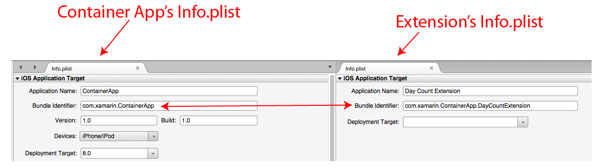
- It must define the key `NSExtensionPointIdentifier`, with an appropriate value (such as `com.apple.widget-extension` for a **Today** Notification Center widget), in its `Info.plist` file.
- It must also define *either* the `NSExtensionMainStoryboard` key or the `NSExtensionPrincipalClass` key in its `Info.plist` file with an appropriate value:
  - Use the `NSExtensionMainStoryboard` key to specify the name of the Storyboard that presents the main UI for the Extension (minus `.storyboard`). For example, `Main` for the `Main.storyboard` file.
  - Use the `NSExtensionPrincipalClass` key to specify the class that will be initialized when the Extension is started. The value must match the **Register** value of your `UIViewController`:

  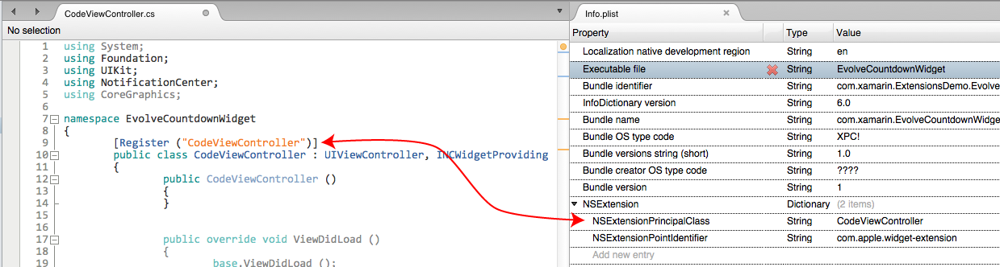

Specific types of Extensions may have additional requirements. For instance, a **Today** or **Notification Center** Extension’s principal class must implement [INCWidgetProviding](xref:NotificationCenter.INCWidgetProviding).

> [!IMPORTANT]
> If you start your project using one the Extensions templates provided by Visual Studio for Mac, most (if not all) these requirements will be provided and met for you automatically by the template.

## Walkthrough

In following walkthrough, you will create an example **Today** widget that calculates the day and number of days remaining in the year:

[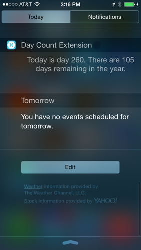](extensions-images/carpediemscreenshot.png#lightbox)

### Creating the solution

To create the required solution, do the following:

1. First, create a new iOS, **Single View App** project and click the **Next** button:

    [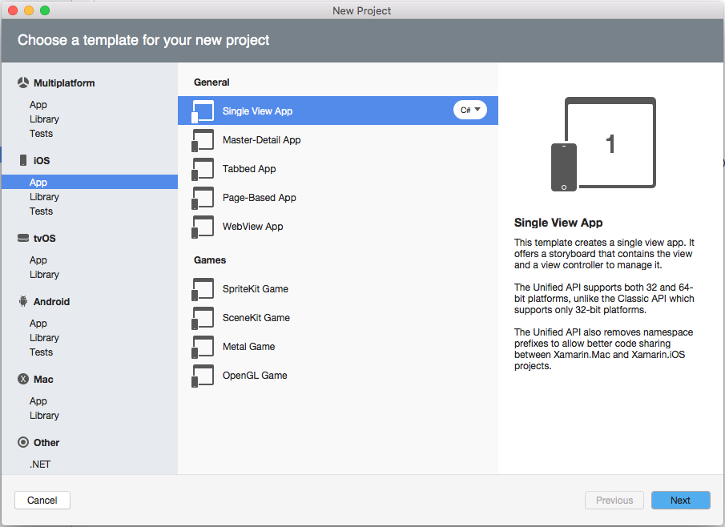](extensions-images/today01.png#lightbox)
2. Call the project `TodayContainer` and click the **Next** button:

    [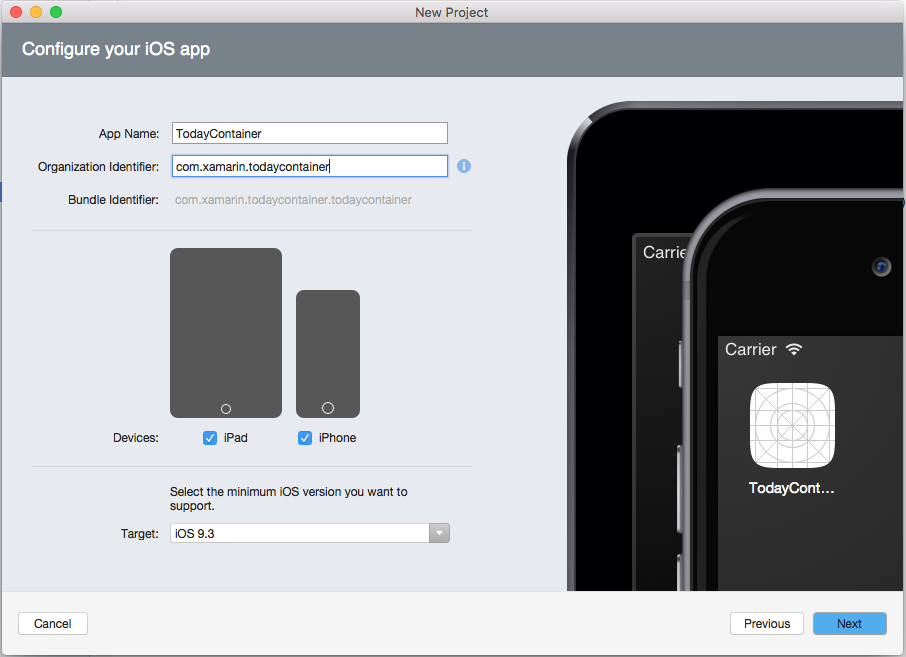](extensions-images/today02.png#lightbox)
3. Verify the **Project Name** and **SolutionName** and click the **Create** button to create the solution:

    [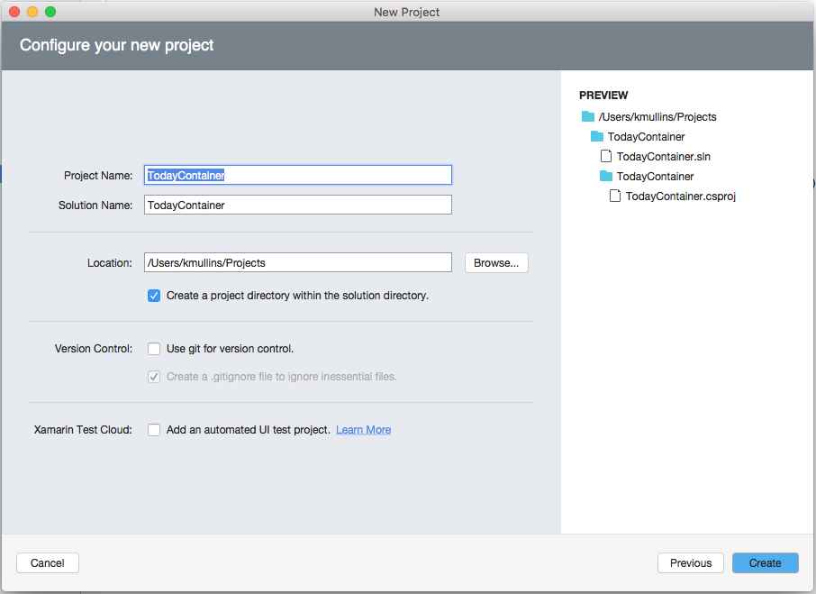](extensions-images/today03.png#lightbox)
4. Next, in the **Solution Explorer**, right-click on the Solution and add a new **iOS Extension** project from the **Today Extension** template:

    [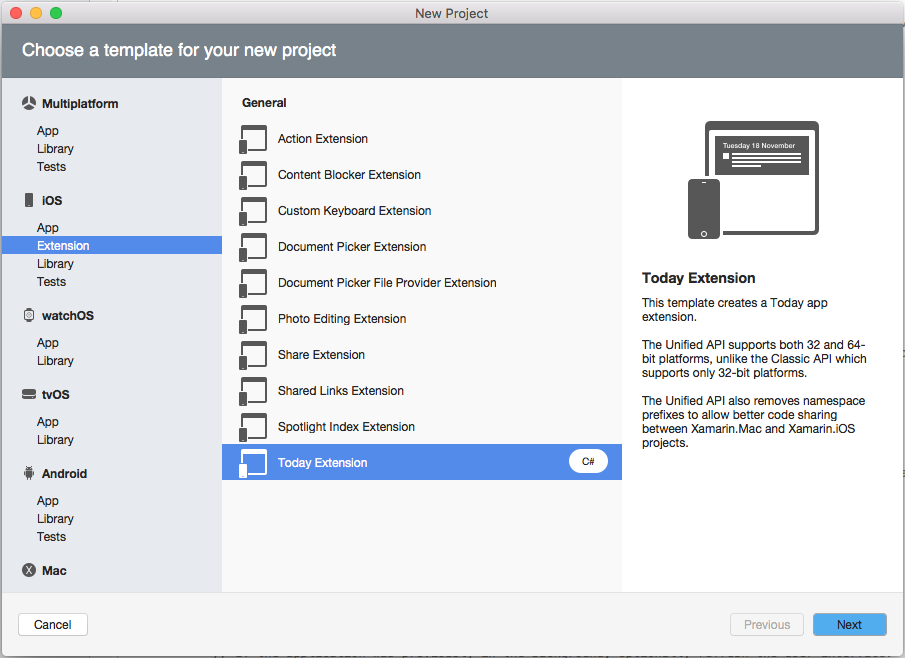](extensions-images/today04.png#lightbox)
5. Call the project `DaysRemaining` and click the **Next** button:

    [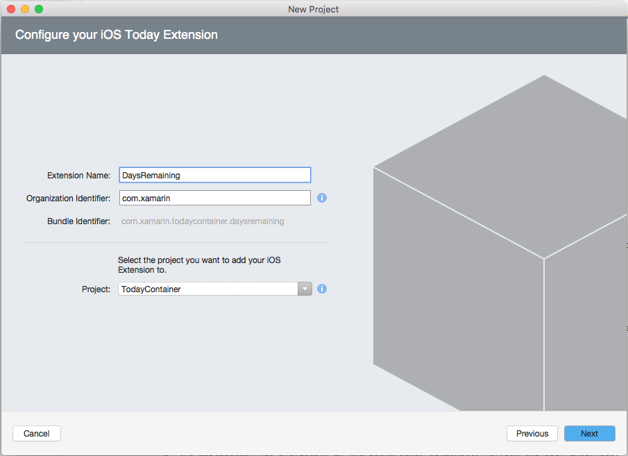](extensions-images/today05.png#lightbox)
6. Review the project and click the **Create** button to create it:

    [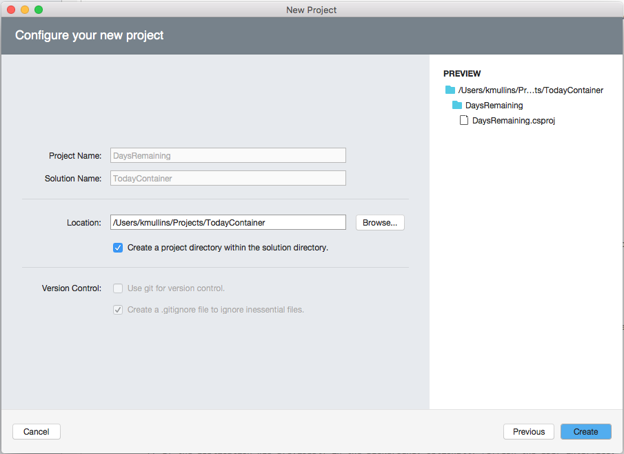](extensions-images/today06.png#lightbox)

The resulting Solution should now have two projects, as shown here:

[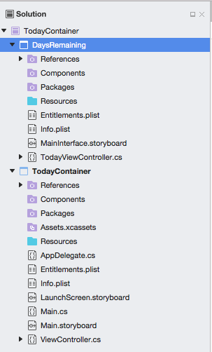](extensions-images/today07.png#lightbox)

### Creating the extension user interface

Next, you will need to design the interface for your **Today** widget. This can either be done using a Storyboard or by creating the UI in code. Both methods will be covered below in detail.

#### Using storyboards

To build the UI with a Storyboard, do the following:

1. In the **Solution Explorer**, double-click the Extension project's `Main.storyboard` file to open it for editing:

    [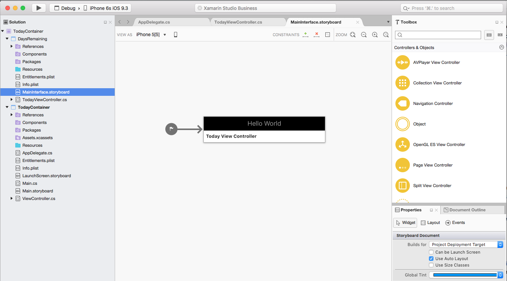](extensions-images/today08.png#lightbox)
2. Select the Label that was automatically added to the UI by template and give it the **Name** `TodayMessage` in the **Widget** tab of the **Properties Explorer**:

    [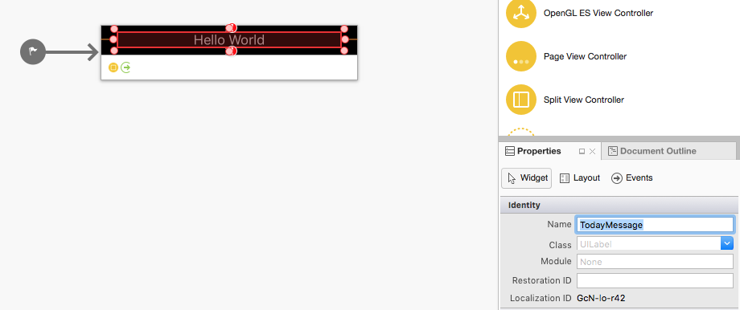](extensions-images/today09.png#lightbox)
3. Save the changes to the Storyboard.

#### Using code

To build the UI in code, do the following:

1. In the **Solution Explorer**, select the **DaysRemaining** project, add a new class and call it `CodeBasedViewController`:

    [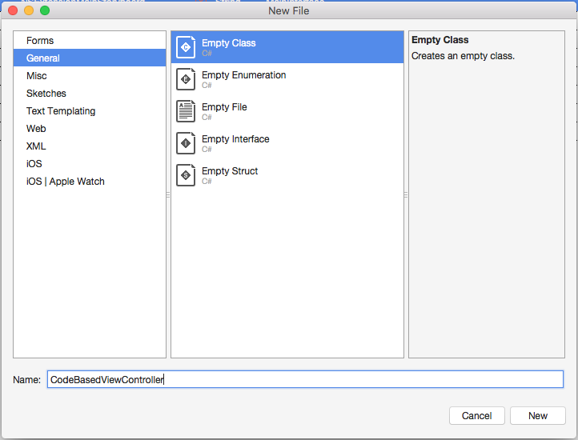](extensions-images/code01.png#lightbox)
2. Again, in the **Solution Explorer**, double-click Extension's `Info.plist` file to open it for editing:

    [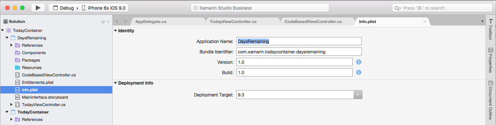](extensions-images/code02.png#lightbox)
3. Select the **Source View** (from the bottom of the screen) and open the `NSExtension` node:

    [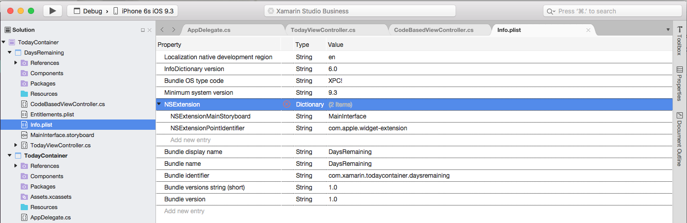](extensions-images/code03.png#lightbox)
4. Remove the `NSExtensionMainStoryboard` key and add a `NSExtensionPrincipalClass` with the value `CodeBasedViewController`:

    [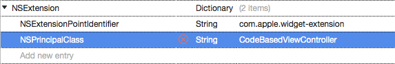](extensions-images/code04.png#lightbox)
5. Save your changes.

Next, edit the `CodeBasedViewController.cs` file and make it look like the following:

```csharp
using System;
using Foundation;
using UIKit;
using NotificationCenter;
using CoreGraphics;

namespace DaysRemaining
{
  [Register("CodeBasedViewController")]
  public class CodeBasedViewController : UIViewController, INCWidgetProviding
  {
    public CodeBasedViewController ()
    {
    }

    public override void ViewDidLoad ()
    {
      base.ViewDidLoad ();

      // Add label to view
      var TodayMessage = new UILabel (new CGRect (0, 0, View.Frame.Width, View.Frame.Height)) {
        TextAlignment = UITextAlignment.Center
      };

      View.AddSubview (TodayMessage);

      // Insert code to power extension here...

    }
  }
}
```

Note that the `[Register("CodeBasedViewController")]` matches the value that you specified for the `NSExtensionPrincipalClass` above.

### Coding the extension

With the User Interface created, open either the `TodayViewController.cs` or the `CodeBasedViewController.cs` file (based of the method used to create the User Interface above), change the **ViewDidLoad** method and make it look like the following:

```csharp
public override void ViewDidLoad ()
{
  base.ViewDidLoad ();

  // Calculate the values
  var dayOfYear = DateTime.Now.DayOfYear;
  var leapYearExtra = DateTime.IsLeapYear (DateTime.Now.Year) ? 1 : 0;
  var daysRemaining = 365 + leapYearExtra - dayOfYear;

  // Display the message
  if (daysRemaining == 1) {
    TodayMessage.Text = String.Format ("Today is day {0}. There is one day remaining in the year.", dayOfYear);
  } else {
    TodayMessage.Text = String.Format ("Today is day {0}. There are {1} days remaining in the year.", dayOfYear, daysRemaining);
  }
}
```

If using the code based User Interface method, replace the `// Insert code to power extension here...` comment with the new code from above. After calling the base implementation (and inserting a Label for the code based version), this code does a simple calculation to get the day of the year and how many days are remaining. Then it displays the message in the Label (`TodayMessage`) that you created in the UI design.

Note how similar this process is to the normal process of writing an app. An Extension's `UIViewController` has the same lifecycle as a View Controller in an app, except Extensions do not have background modes and are not suspended when the user is finished using them. Instead, Extensions are repeatedly initialized and de-allocated as required.

### Creating the container app user interface

For this walkthrough, the container app is simply used as a method to ship and install the Extension and provides no functionality of its own. Edit the TodayContainer's `Main.storyboard` file and add some text defining the Extension's function and how to install it:

[](extensions-images/today10.png#lightbox)

Save the changes to the Storyboard.

### Testing the extension

To test your Extension in the iOS Simulator, run the **TodayContainer** app. The container's main view will be displayed:

[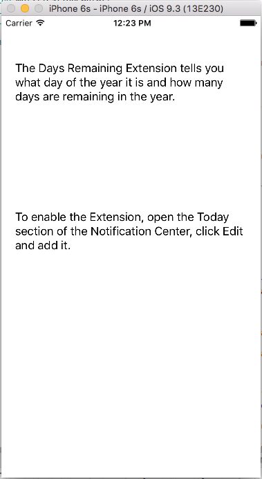](extensions-images/run01.png#lightbox)

Next, hit the **Home** button in the Simulator, swipe down from the top of the screen to open the **Notification Center**, select the **Today** tab and click the **Edit** button:

[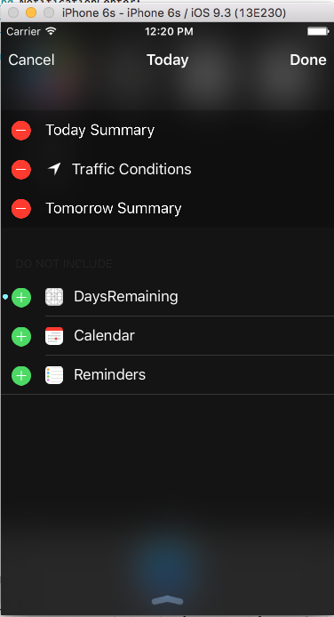](extensions-images/run02.png#lightbox)

Add the **DaysRemaining** Extension to the **Today** view and click the **Done** button:

[](extensions-images/run03.png#lightbox)

The new widget will be added to the **Today** view and the results will be displayed:

[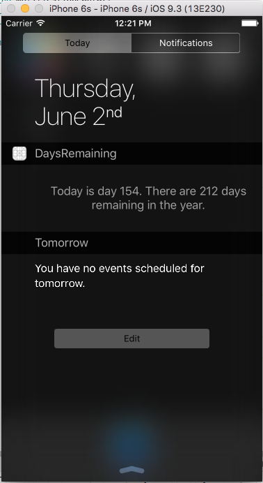](extensions-images/run04.png#lightbox)

## Communicating with the host app

The example Today Extension you created above does not communicate with its host app (the **Today** screen). If it did, it would use the [ExtensionContext](xref:Foundation.NSExtensionContext) property of the `TodayViewController` or `CodeBasedViewController` classes.

For Extensions that will receive data from their host apps, the data is in the form of an array of [NSExtensionItem](xref:Foundation.NSExtensionItem) objects stored in the [InputItems](xref:Foundation.NSExtensionContext.InputItems) property of the [ExtensionContext](xref:Foundation.NSExtensionContext) of the Extension's `UIViewController`.

Other Extensions, such as Photo Editing extensions, may distinguish between the user completing or canceling usage. This will be signaled back to the host app via the [CompleteRequest](xref:Foundation.NSExtensionContext.CompleteRequest*) and [CancelRequest](xref:Foundation.NSExtensionContext.CancelRequest*) methods of [ExtensionContext](xref:Foundation.NSExtensionContext) property.

For more information, please see Apple's [App Extension Programming Guide](https://developer.apple.com/library/ios/documentation/General/Conceptual/ExtensibilityPG/index.html#//apple_ref/doc/uid/TP40014214-CH20-SW1).

## Communicating with the parent app

An App Group allows different applications (or an application and its extensions) to access a shared file storage location. App Groups can be used for data like:

- [Apple Watch Settings](~/ios/watchos/app-fundamentals/settings.md).
- [Shared NSUserDefaults](~/ios/app-fundamentals/user-defaults.md).
- [Shared Files](~/ios/watchos/app-fundamentals/parent-app.md#files).

For more information, please see the [App Groups](~/ios/deploy-test/provisioning/capabilities/app-groups-capabilities.md) section of our **Working with Capabilities** documentation.

## MobileCoreServices

When working with extensions, use a Uniform Type Identifier (UTI) to create and manipulate data that is exchanged between the app, other apps and/or services.

The `MobileCoreServices.UTType` static class defines the following helper properties that relate to Apple's `kUTType...` definitions:

- `kUTTypeAlembic` - `Alembic`
- `kUTTypeAliasFile` - `AliasFile`
- `kUTTypeAliasRecord` - `AliasRecord`
- `kUTTypeAppleICNS` - `AppleICNS`
- `kUTTypeAppleProtectedMPEG4Audio` - `AppleProtectedMPEG4Audio`
- `kUTTypeAppleProtectedMPEG4Video` - `AppleProtectedMPEG4Video`
- `kUTTypeAppleScript` - `AppleScript`
- `kUTTypeApplication` - `Application`
- `kUTTypeApplicationBundle` - `ApplicationBundle`
- `kUTTypeApplicationFile` - `ApplicationFile`
- `kUTTypeArchive` - `Archive`
- `kUTTypeAssemblyLanguageSource` - `AssemblyLanguageSource`
- `kUTTypeAudio` - `Audio`
- `kUTTypeAudioInterchangeFileFormat` - `AudioInterchangeFileFormat`
- `kUTTypeAudiovisualContent` - `AudiovisualContent`
- `kUTTypeAVIMovie` - `AVIMovie`
- `kUTTypeBinaryPropertyList` - `BinaryPropertyList`
- `kUTTypeBMP` - `BMP`
- `kUTTypeBookmark` - `Bookmark`
- `kUTTypeBundle` - `Bundle`
- `kUTTypeBzip2Archive` - `Bzip2Archive`
- `kUTTypeCalendarEvent` - `CalendarEvent`
- `kUTTypeCHeader` - `CHeader`
- `kUTTypeCommaSeparatedText` - `CommaSeparatedText`
- `kUTTypeCompositeContent` - `CompositeContent`
- `kUTTypeConformsToKey` - `ConformsToKey`
- `kUTTypeContact` - `Contact`
- `kUTTypeContent` - `Content`
- `kUTTypeCPlusPlusHeader` - `CPlusPlusHeader`
- `kUTTypeCPlusPlusSource` - `CPlusPlusSource`
- `kUTTypeCSource` - `CSource`
- `kUTTypeData` - `Database`
- `kUTTypeDelimitedText` - `DelimitedText`
- `kUTTypeDescriptionKey` - `DescriptionKey`
- `kUTTypeDirectory` - `Directory`
- `kUTTypeDiskImage` - `DiskImage`
- `kUTTypeElectronicPublication` - `ElectronicPublication`
- `kUTTypeEmailMessage` - `EmailMessage`
- `kUTTypeExecutable` - `Executable`
- `kUTExportedTypeDeclarationsKey` - `ExportedTypeDeclarationsKey`
- `kUTTypeFileURL` - `FileURL`
- `kUTTypeFlatRTFD` - `FlatRTFD`
- `kUTTypeFolder` - `Folder`
- `kUTTypeFont` - `Font`
- `kUTTypeFramework` - `Framework`
- `kUTTypeGIF` - `GIF`
- `kUTTypeGNUZipArchive` - `GNUZipArchive`
- `kUTTypeHTML` - `HTML`
- `kUTTypeICO` - `ICO`
- `kUTTypeIconFileKey` - `IconFileKey`
- `kUTTypeIdentifierKey` - `IdentifierKey`
- `kUTTypeImage` - `Image`
- `kUTImportedTypeDeclarationsKey` - `ImportedTypeDeclarationsKey`
- `kUTTypeInkText` - `InkText`
- `kUTTypeInternetLocation` - `InternetLocation`
- `kUTTypeItem` - `Item`
- `kUTTypeJavaArchive` - `JavaArchive`
- `kUTTypeJavaClass` - `JavaClass`
- `kUTTypeJavaScript` - `JavaScript`
- `kUTTypeJavaSource` - `JavaSource`
- `kUTTypeJPEG` - `JPEG`
- `kUTTypeJPEG2000` - `JPEG2000`
- `kUTTypeJSON` - `JSON`
- `kUTType3dObject` - `k3dObject`
- `kUTTypeLivePhoto` - `LivePhoto`
- `kUTTypeLog` - `Log`
- `kUTTypeM3UPlaylist` - `M3UPlaylist`
- `kUTTypeMessage` - `Message`
- `kUTTypeMIDIAudio` - `MIDIAudio`
- `kUTTypeMountPoint` - `MountPoint`
- `kUTTypeMovie` - `Movie`
- `kUTTypeMP3` - `MP3`
- `kUTTypeMPEG` - `MPEG`
- `kUTTypeMPEG2TransportStream` - `MPEG2TransportStream`
- `kUTTypeMPEG2Video` - `MPEG2Video`
- `kUTTypeMPEG4` - `MPEG4`
- `kUTTypeMPEG4Audio` - `MPEG4Audio`
- `kUTTypeObjectiveCPlusPlusSource` - `ObjectiveCPlusPlusSource`
- `kUTTypeObjectiveCSource` - `ObjectiveCSource`
- `kUTTypeOSAScript` - `OSAScript`
- `kUTTypeOSAScriptBundle` - `OSAScriptBundle`
- `kUTTypePackage` - `Package`
- `kUTTypePDF` - `PDF`
- `kUTTypePerlScript` - `PerlScript`
- `kUTTypePHPScript` - `PHPScript`
- `kUTTypePICT` - `PICT`
- `kUTTypePKCS12` - `PKCS12`
- `kUTTypePlainText` - `PlainText`
- `kUTTypePlaylist` - `Playlist`
- `kUTTypePluginBundle` - `PluginBundle`
- `kUTTypePNG` - `PNG`
- `kUTTypePolygon` - `Polygon`
- `kUTTypePresentation` - `Presentation`
- `kUTTypePropertyList` - `PropertyList`
- `kUTTypePythonScript` - `PythonScript`
- `kUTTypeQuickLookGenerator` - `QuickLookGenerator`
- `kUTTypeQuickTimeImage` - `QuickTimeImage`
- `kUTTypeQuickTimeMovie` - `QuickTimeMovie`
- `kUTTypeRawImage` - `RawImage`
- `kUTTypeReferenceURLKey` - `ReferenceURLKey`
- `kUTTypeResolvable` - `Resolvable`
- `kUTTypeRTF` - `RTF`
- `kUTTypeRTFD` - `RTFD`
- `kUTTypeRubyScript` - `RubyScript`
- `kUTTypeScalableVectorGraphics` - `ScalableVectorGraphics`
- `kUTTypeScript` - `Script`
- `kUTTypeShellScript` - `ShellScript`
- `kUTTypeSourceCode` - `SourceCode`
- `kUTTypeSpotlightImporter` - `SpotlightImporter`
- `kUTTypeSpreadsheet` - `Spreadsheet`
- `kUTTypeStereolithography` - `Stereolithography`
- `kUTTypeSwiftSource` - `SwiftSource`
- `kUTTypeSymLink` - `SymLink`
- `kUTTypeSystemPreferencesPane` - `SystemPreferencesPane`
- `kUTTypeTabSeparatedText` - `TabSeparatedText`
- `kUTTagClassFilenameExtension` - `TagClassFilenameExtension`
- `kUTTagClassMIMEType` - `TagClassMIMEType`
- `kUTTypeTagSpecificationKey` - `TagSpecificationKey`
- `kUTTypeText` - `Text`
- `kUTType3DContent` - `ThreeDContent`
- `kUTTypeTIFF` - `TIFF`
- `kUTTypeToDoItem` - `ToDoItem`
- `kUTTypeTXNTextAndMultimediaData` - `TXNTextAndMultimediaData`
- `kUTTypeUniversalSceneDescription` - `UniversalSceneDescription`
- `kUTTypeUnixExecutable` - `UnixExecutable`
- `kUTTypeURL` - `URL`
- `kUTTypeURLBookmarkData` - `URLBookmarkData`
- `kUTTypeUTF16ExternalPlainText` - `UTF16ExternalPlainText`
- `kUTTypeUTF16PlainText` - `UTF16PlainText`
- `kUTTypeUTF8PlainText` - `UTF8PlainText`
- `kUTTypeUTF8TabSeparatedText` - `UTF8TabSeparatedText`
- `kUTTypeVCard` - `VCard`
- `kUTTypeVersionKey` - `VersionKey`
- `kUTTypeVideo` - `Video`
- `kUTTypeVolume` - `Volume`
- `kUTTypeWaveformAudio` - `WaveformAudio`
- `kUTTypeWebArchive` - `WebArchive`
- `kUTTypeWindowsExecutable` - `WindowsExecutable`
- `kUTTypeX509Certificate` - `X509Certificate`
- `kUTTypeXML` - `XML`
- `kUTTypeXMLPropertyList` - `XMLPropertyList`
- `kUTTypeXPCService` - `XPCService`
- `kUTTypeZipArchive` - `ZipArchive`

See the following example:

```csharp
using MobileCoreServices;
...

NSItemProvider itemProvider = new NSItemProvider ();
itemProvider.LoadItem(UTType.PropertyList ,null, (item, err) => {
    if (err == null) {
        NSDictionary results = (NSDictionary )item;
        NSString baseURI =
results.ObjectForKey("NSExtensionJavaScriptPreprocessingResultsKey");
    }
});
```

For more information, please see the [App Groups](~/ios/deploy-test/provisioning/capabilities/app-groups-capabilities.md) section of our **Working with Capabilities** documentation.

## Precautions and considerations

Extensions have significantly less memory available to them than apps do. They are expected to perform rapidly and with minimal intrusion to the user and the app they are hosted in. However, an Extension should also provide a distinctive, useful function to the consuming app with a branded UI that allow the user to identify the Extension's developer or Container app they belong to.

Given these tight requirement, you should only deploy Extensions that have been thoroughly tested and optimized for performance and memory consumption.

## Summary

This document has covered Extensions, what they are, the type of Extension Points and the known limitations imposed on an Extension by iOS. It discussed creating, distributing, installing and running Extensions and the Extension lifecycle. It provided a walkthrough of creating a simple **Today** widget showing two ways to create the widget's UI using either Storyboards or code. It showed how to test an extension in the iOS Simulator. Finally, it briefly discussed communicating with the Host App and a few precautions and considerations that should be taken when developing an extension.

## Related links

- [ContainerApp (sample)](/samples/xamarin/ios-samples/intro-to-extensions)
- [Creating extensions in Xamarin.iOS (video)](https://university.xamarin.com/lightninglectures/creating-extensions-in-ios)
- [Optimize Efficiency and Performance of an iOS App Extension](https://developer.apple.com/library/archive/documentation/General/Conceptual/ExtensibilityPG/ExtensionCreation.html#//apple_ref/doc/uid/TP40014214-CH5-SW7)