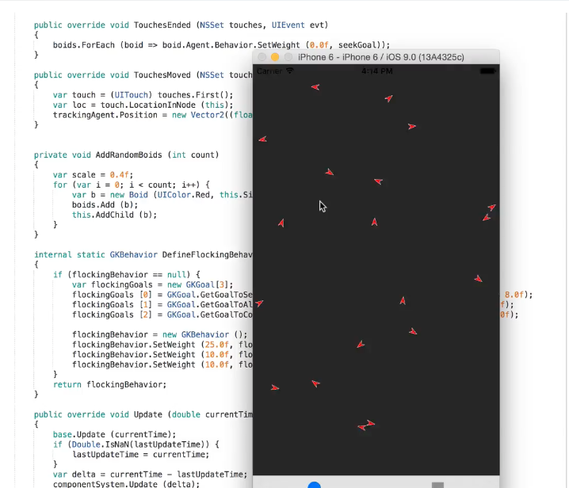
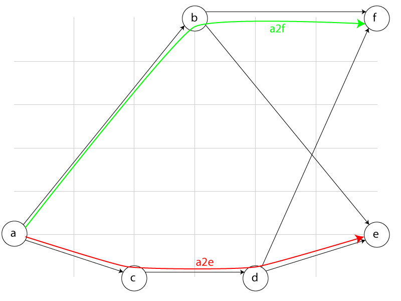

# iOS Gaming APIs in Xamarin.iOS

_This article covers the new gaming enhancements provided by iOS 9 that can be used to improve your Xamarin.iOS game's graphics and audio features._

Apple has made several technological improvements to the gaming APIs in iOS 9
that make it easier to implement game graphics and audio in a Xamarin.iOS app.
These include both ease of development through high-level frameworks and harnessing
the power of the iOS device's GPU for improved speed and graphic abilities.

[](images/flocking01.png#lightbox)

This includes GameplayKit, ReplayKit, Model I/O, MetalKit and Metal Performance
Shaders along with new, enhanced features of Metal, SceneKit and SpriteKit.

This article will introduce all of the ways to improve your Xamarin.iOS game with iOS 9's new gaming enhancements:

## Introducing GameplayKit

Apple's new GameplayKit framework provides a set of technologies that makes it easy to create games for iOS devices by reducing the amount of repetitive, common code required for implementation. GameplayKit provides tools for developing the game mechanics that can then be easily combined with a graphic engine (such as SceneKit or SpriteKit) to quickly deliver a completed game.

GameplayKit includes several, common, game play algorithms such as:

- A behavior based, agent simulation that allows you to define movements and goals that the AI will automatically pursue.
- A minmax artificial intelligence for turn-based game play.
- A rule system for data-driven game logic with fuzzy reasoning to provide emergent behavior.

Additionally, GameplayKit takes a building block approach to game development by using a modular architecture that provides the following features:

- State machine for handling complex, procedural code based systems in game play.
- Tools for providing randomized game play and unpredictability without causing debugging issues.
- A reusable, componentized entity based architecture.

To learn more about GameplayKit, please see Apple's [Gameplaykit Programming Guide](https://developer.apple.com/library/prerelease/ios/documentation/General/Conceptual/GameplayKit_Guide/index.html#//apple_ref/doc/uid/TP40015172) and [GameplayKit Framework Reference](https://developer.apple.com/library/prerelease/ios/documentation/GameplayKit/Reference/GameplayKit_Framework/index.html#//apple_ref/doc/uid/TP40015199).

## GameplayKit Examples

Let's take a quick look at implementing some simple game play mechanics in a Xamarin.iOS app using game play kit.

### Pathfinding

Pathfinding is the ability for an AI element of a game to find its way around the game board.
For example, an 2D enemy finding its way through a maze or a 3D character through a first-person-shooter world terrain.

Consider the following map:

[](images/gkpathfindpath.png#lightbox)

Using pathfinding this C# code can find a way through the map:

```csharp
var a = GKGraphNode2D.FromPoint (new Vector2 (0, 5));
var b = GKGraphNode2D.FromPoint (new Vector2 (3, 0));
var c = GKGraphNode2D.FromPoint (new Vector2 (2, 6));
var d = GKGraphNode2D.FromPoint (new Vector2 (4, 6));
var e = GKGraphNode2D.FromPoint (new Vector2 (6, 5));
var f = GKGraphNode2D.FromPoint (new Vector2 (6, 0));

a.AddConnections (new [] { b, c }, false);
b.AddConnections (new [] { e, f }, false);
c.AddConnections (new [] { d }, false);
d.AddConnections (new [] { e, f }, false);

var graph = GKGraph.FromNodes(new [] { a, b, c, d, e, f });

var a2e = graph.FindPath (a, e); // [ a, c, d, e ]
var a2f = graph.FindPath (a, f); // [ a, b, f ]

Console.WriteLine(String.Join ("->", (object[]) a2e));
Console.WriteLine(String.Join ("->", (object[]) a2f));
```

### Classical Expert System

The following snippet of C# code shows how GameplayKit can be used to implement a classical expert system:

```csharp
string output = "";
bool reset = false;
int input = 15;

public override void ViewDidLoad ()
{
    base.ViewDidLoad ();

    /*
    If reset is true, clear the output and set reset to false
    */
    var clearRule = GKRule.FromPredicate ((rules) => reset, rules => {
        output = "";
        reset = false;
    });
    clearRule.Salience = 1;

    var fizzRule = GKRule.FromPredicate (mod (3), rules => {
        output += "fizz";
    });
    fizzRule.Salience = 2;

    var buzzRule = GKRule.FromPredicate (mod (5), rules => {
        output += "buzz";
    });
    buzzRule.Salience = 2;

    /*
    This *always* evaluates to true, but is higher Salience, so evaluates after lower-salience items
    (which is counter-intuitive). Print the output, and reset (thus triggering "ResetRule" next time)
    */
    var outputRule = GKRule.FromPredicate (rules => true, rules => {
        System.Console.WriteLine(output == "" ? input.ToString() : output);
        reset = true;
    });
    outputRule.Salience = 3;

    var rs = new GKRuleSystem ();
    rs.AddRules (new [] {
        clearRule,
        fizzRule,
        buzzRule,
        outputRule
    });

    for (input = 1; input < 16; input++) {
        rs.Evaluate ();
        rs.Reset ();
    }
}

protected Func<GKRuleSystem, bool> mod(int m)
{
    Func<GKRuleSystem,bool> partiallyApplied = (rs) => input % m == 0;
    return partiallyApplied;
}
```

Based on a given set of rules (`GKRule`) and a known set of inputs, the expert system (`GKRuleSystem`) will create predictable output (`fizzbuzz` for our example above).

### Flocking

Flocking allows a group of AI controlled game entities to behave as a flock, where the group responds to the movements and actions of a lead entity like a flock of birds in flight or a school of fish swimming.

The following snippet of C# code implements flocking behavior using GameplayKit and SpriteKit for the graphics display:

```csharp
using System;
using SpriteKit;
using CoreGraphics;
using UIKit;
using GameplayKit;
using Foundation;
using System.Collections.Generic;
using System.Linq;
using OpenTK;

namespace FieldBehaviorExplorer
{
    public static class FlockRandom
    {
        private static GKARC4RandomSource rand = new GKARC4RandomSource ();

        static FlockRandom ()
        {
            rand.DropValues (769);
        }

        public static float NextUniform ()
        {
            return rand.GetNextUniform ();
        }
    }

    public class FlockingScene : SKScene
    {
        List<Boid> boids = new List<Boid> ();
        GKComponentSystem componentSystem;
        GKAgent2D trackingAgent; //Tracks finger on screen
        double lastUpdateTime = Double.NaN;
        //Hold on to behavior so it doesn't get GC'ed
        static GKBehavior flockingBehavior;
        static GKGoal seekGoal;

        public FlockingScene (CGSize size) : base (size)
        {
            AddRandomBoids (20);

            var scale = 0.4f;
            //Flocking system
            componentSystem = new GKComponentSystem (typeof(GKAgent2D));
            var behavior = DefineFlockingBehavior (boids.Select (boid => boid.Agent).ToArray<GKAgent2D>(), scale);
            boids.ForEach (boid => {
                boid.Agent.Behavior = behavior;
                componentSystem.AddComponent(boid.Agent);
            });

            trackingAgent = new GKAgent2D ();
            trackingAgent.Position = new Vector2 ((float) size.Width / 2.0f, (float) size.Height / 2.0f);
            seekGoal = GKGoal.GetGoalToSeekAgent (trackingAgent);
        }

        public override void TouchesBegan (NSSet touches, UIEvent evt)
        {
            boids.ForEach(boid => boid.Agent.Behavior.SetWeight(1.0f, seekGoal));
        }

        public override void TouchesEnded (NSSet touches, UIEvent evt)
        {
            boids.ForEach (boid => boid.Agent.Behavior.SetWeight (0.0f, seekGoal));
        }

        public override void TouchesMoved (NSSet touches, UIEvent evt)
        {
            var touch = (UITouch) touches.First();
            var loc = touch.LocationInNode (this);
            trackingAgent.Position = new Vector2((float) loc.X, (float) loc.Y);
        }

        private void AddRandomBoids (int count)
        {
            var scale = 0.4f;
            for (var i = 0; i < count; i++) {
                var b = new Boid (UIColor.Red, this.Size, scale);
                boids.Add (b);
                this.AddChild (b);
            }
        }

        internal static GKBehavior DefineFlockingBehavior(GKAgent2D[] boidBrains, float scale)
        {
            if (flockingBehavior == null) {
                var flockingGoals = new GKGoal[3];
                flockingGoals [0] = GKGoal.GetGoalToSeparate (boidBrains, 100.0f * scale, (float)Math.PI * 8.0f);
                flockingGoals [1] = GKGoal.GetGoalToAlign (boidBrains, 40.0f * scale, (float)Math.PI * 8.0f);
                flockingGoals [2] = GKGoal.GetGoalToCohere (boidBrains, 40.0f * scale, (float)Math.PI * 8.0f);

                flockingBehavior = new GKBehavior ();
                flockingBehavior.SetWeight (25.0f, flockingGoals [0]);
                flockingBehavior.SetWeight (10.0f, flockingGoals [1]);
                flockingBehavior.SetWeight (10.0f, flockingGoals [2]);
            }
            return flockingBehavior;
        }

        public override void Update (double currentTime)
        {
            base.Update (currentTime);
            if (Double.IsNaN(lastUpdateTime)) {
                lastUpdateTime = currentTime;
            }
            var delta = currentTime - lastUpdateTime;
            componentSystem.Update (delta);
        }
    }

    public class Boid : SKNode, IGKAgentDelegate
    {
        public GKAgent2D Agent { get { return brains; } }
        public SKShapeNode Sprite { get { return sprite; } }

        class BoidSprite : SKShapeNode
        {
            public BoidSprite (UIColor color, float scale)
            {
                var rot = CGAffineTransform.MakeRotation((float) (Math.PI / 2.0f));
                var path = new CGPath ();
                path.MoveToPoint (rot, new CGPoint (10.0, 0.0));
                path.AddLineToPoint (rot, new CGPoint (0.0, 30.0));
                path.AddLineToPoint (rot, new CGPoint (10.0, 20.0));
                path.AddLineToPoint (rot, new CGPoint (20.0, 30.0));
                path.AddLineToPoint (rot, new CGPoint (10.0, 0.0));
                path.CloseSubpath ();

                this.SetScale (scale);
                this.Path = path;
                this.FillColor = color;
                this.StrokeColor = UIColor.White;

            }
        }

        private GKAgent2D brains;
        private BoidSprite sprite;
        private static int boidId = 0;

        public Boid (UIColor color, CGSize size, float scale)
        {
            brains = BoidBrains (size, scale);
            sprite = new BoidSprite (color, scale);
            sprite.Position = new CGPoint(brains.Position.X, brains.Position.Y);
            sprite.ZRotation = brains.Rotation;
            sprite.Name = boidId++.ToString ();

            brains.Delegate = this;

            this.AddChild (sprite);
        }

        private GKAgent2D BoidBrains(CGSize size, float scale)
        {
            var brains = new GKAgent2D ();
            var x = (float) (FlockRandom.NextUniform () * size.Width);
            var y = (float) (FlockRandom.NextUniform () * size.Height);
            brains.Position = new Vector2 (x, y);

            brains.Rotation = (float)(FlockRandom.NextUniform () * Math.PI * 2.0);
            brains.Radius = 30.0f * scale;
            brains.MaxSpeed = 0.5f;
            return brains;
        }

        [Export ("agentDidUpdate:")]
        public void AgentDidUpdate (GameplayKit.GKAgent agent)
        {
        }

        [Export ("agentWillUpdate:")]
        public void AgentWillUpdate (GameplayKit.GKAgent agent)
        {
            var brainsIn = (GKAgent2D) agent;
            sprite.Position = new CGPoint(brainsIn.Position.X, brainsIn.Position.Y);
            sprite.ZRotation = brainsIn.Rotation;
            Console.WriteLine ($"{sprite.Name} -> [{sprite.Position}], {sprite.ZRotation}");
        }
    }
}
```

Next, implement this scene in a view controller:

```csharp
public override void ViewDidLoad ()
{
    base.ViewDidLoad ();
        // Perform any additional setup after loading the view, typically from a nib.
        this.View = new SKView {
        ShowsFPS = true,
        ShowsNodeCount = true,
        ShowsDrawCount = true
    };
}

public override void ViewWillLayoutSubviews ()
{
    base.ViewWillLayoutSubviews ();

    var v = (SKView)View;
    if (v.Scene == null) {
        var scene = new FlockingScene (View.Bounds.Size);
        scene.ScaleMode = SKSceneScaleMode.AspectFill;
        v.PresentScene (scene);
    }
}
```

When run, the little animated _"Boids"_ will flock around our finger taps:

[](images/flocking01.png#lightbox)

### Other Apple Examples

In addition to the samples presented above, Apple has provided the following sample apps that can be transcoded to C# and Xamarin.iOS:

- [FourInARow: Using the GameplayKit Minmax Strategist for Opponent AI](https://developer.apple.com/library/prerelease/ios/samplecode/FourInARow/Introduction/Intro.html#//apple_ref/doc/uid/TP40016142)
- [AgentsCatalog: Using the Agents System in GameplayKit](https://developer.apple.com/library/prerelease/ios/samplecode/AgentsCatalog/Introduction/Intro.html#//apple_ref/doc/uid/TP40016141)
- [DemoBots: Building a Cross Platform Game with SpriteKit and GameplayKit](https://developer.apple.com/library/prerelease/ios/samplecode/DemoBots/Introduction/Intro.html#//apple_ref/doc/uid/TP40015179)

## Metal

In iOS 9, Apple has made several changes and additions to Metal to provide low-overhead access to the GPU. Using Metal you can maximize the graphics and computing potential of your iOS apps.

The Metal framework includes the following new features:

- New private and depth stencil textures for OS X.
- Improved shadow quality with depth clamping and separate front and back stencil values.
- Metal Shading Language and Metal Standard Library improvements.
- Computational shaders support a wider range of pixel formats.

### The MetalKit Framework

The MetalKit framework provides a set of utility classes and features that reduce the amount of work required to use Metal in an iOS app. MetalKit provides support in three key areas:

1. Asynchronous texture loading from a variety of sources including common formats such as PNG, JPEG, KTX and PVR.
2. Easy access of Model I/O based assets for Metal specific model handling. These features have been highly optimized to provide efficient data transfer between Model I/O meshes and Metal buffers.
3. Predefined Metal views and view management that greatly reduce the amount of code required to display graphic renderings within an iOS app.

To learn more about MetalKit, please see Apple's [MetalKit Framework Reference](https://developer.apple.com/library/prerelease/ios/documentation/MetalKit/Reference/MTKFrameworkReference/index.html#//apple_ref/doc/uid/TP40015356), [Metal Programming Guide](https://developer.apple.com/library/prerelease/ios/documentation/Miscellaneous/Conceptual/MetalProgrammingGuide/Introduction/Introduction.html#//apple_ref/doc/uid/TP40014221), [Metal Framework Reference](https://developer.apple.com/library/prerelease/ios/documentation/Metal/Reference/MetalFrameworkReference/index.html#//apple_ref/doc/uid/TP40014161) and [Metal Shading Language Guide](https://developer.apple.com/library/prerelease/ios/documentation/Metal/Reference/MetalShadingLanguageGuide/Introduction/Introduction.html#//apple_ref/doc/uid/TP40014364).

### Metal Performance Shaders Framework

The Metal Performance Shader framework provides a highly-optimized set of graphics and computational based shaders for use in your Metal based iOS apps. Each shader in the Metal Performance Shader framework has been specifically tuned to provide high performance on Metal supported iOS GPUs.

By using Metal Performance Shader classes, you can achieve the highest performance possible on each specific iOS GPU without having to target and maintain individual code bases. Metal Performance Shaders can be used with any Metal resource such as textures and buffers.

The Metal Performance Shader framework provides a set of common shaders such as:

- **Gaussian Blur** (`MPSImageGaussianBlur`)
- **Sobel Edge Detection** (`MPSImageSobel`)
- **Image Histogram** (`MPSImageHistogram`)

For more information, please see Apple's [Metal Shading Language Guide](https://developer.apple.com/library/prerelease/ios/documentation/Metal/Reference/MetalShadingLanguageGuide/Introduction/Introduction.html#//apple_ref/doc/uid/TP40014364).

## Introducing Model I/O

Apple's Model I/O framework provides a deep understanding of 3D assets (such as models and their related resources). Model I/O provides your iOS games with physical-based materials, models and lighting that can be used with GameplayKit, Metal and SceneKit.

With Model I/O, you can support the following types of tasks:

- Import lighting, materials, mesh data, camera settings and other scene-based information from a variety of popular software and game engine formats.
- Process or generate scene-based information such as create procedurally textured sky domes or bake lighting into a mesh.
- Works with MetalKit, SceneKit and GLKit to efficiently load game assets into GPU buffers for rendering.
- Export scene-based information to a variety of popular software and game engine formats.

To learn more about Model I/O, please see Apple's [Model I/O Framework Reference](https://developer.apple.com/library/prerelease/ios/documentation/ModelIO/Reference/ModelIO_Framework/index.html#//apple_ref/doc/uid/TP40015421)

## Introducing ReplayKit

Apple's new ReplayKit framework allows you to easily add recording of game play to your iOS game and allow the user to quickly and easily edit and share this video from within the app.

For more information, please see Apple's [Going Social with ReplayKit and Game Center video](https://developer.apple.com/videos/wwdc/2015/?id=605) and their [DemoBots: Building a Cross Platform Game with SpriteKit and GameplayKit](https://developer.apple.com/library/prerelease/ios/samplecode/DemoBots/Introduction/Intro.html#//apple_ref/doc/uid/TP40015179) sample app.

## SceneKit

Scene Kit is a 3D scene graph API that simplifies working with 3D graphics. It was first introduced in OS X 10.8, and has now come to iOS 8. With Scene Kit creating immersive 3D visualizations and casual 3D games does not require expertise in OpenGL. Building on common scene graph concepts, Scene Kit abstracts away the complexities of OpenGL and OpenGL ES, making it very easy to add 3D content to an application. However, if you are an OpenGL expert, Scene Kit has great support for tying in directly with OpenGL as well. It also includes numerous features that complement 3D graphics, such as physics, and integrates very well with several other Apple frameworks, such as Core Animation, Core Image and Sprite Kit.

For more information, please see our [SceneKit](~/ios/platform/gaming/scenekit.md) documentation.

### SceneKit Changes

Apple has added the following new features to SceneKit for iOS 9:

- Xcode now provides a Scene Editor that allows you to quickly build games and interactive 3D apps by editing scenes directly from within Xcode.
- The `SCNView` and `SCNSceneRenderer` classes can be used to enable Metal rendering (on supported iOS devices).
- The `SCNAudioPlayer` and `SCNNode` classes can be used to add spatial audio effects that automatically track a player position to an iOS app.

For more information, please see our [SceneKit Documentation](~/ios/platform/introduction-to-ios8.md#scenekit) and Apple's [SceneKit Framework Reference](https://developer.apple.com/library/prerelease/ios/documentation/SceneKit/Reference/SceneKit_Framework/index.html#//apple_ref/doc/uid/TP40012283) and [Fox: Building a SceneKit Game with the Xcode Scene Editor](https://developer.apple.com/library/prerelease/ios/samplecode/Fox/Introduction/Intro.html#//apple_ref/doc/uid/TP40016154) sample project.

## SpriteKit

Sprite Kit, the 2D game framework from Apple, has some interesting new features in iOS 8 and OS X Yosemite. These include integration with Scene Kit, shader support, lighting, shadows, constraints, normal map generation, and physics enhancements. In particular, the new physics features make it very easy to add realistic effects to a game.

For more information, please see our [SpriteKit](~/ios/platform/gaming/spritekit.md) documentation.

### SpriteKit Changes

Apple has added the following new features to SpriteKit for iOS 9:

- Spatial audio effect that automatically track the player's position with the `SKAudioNode` class.
- Xcode now features a Scene Editor and Action Editor for easy 2D game and app creation.
- Easy scrolling game support with new Camera Nodes (`SKCameraNode`) objects.
- On iOS devices that support Metal, SpriteKit will automatically use it for rendering, even if you were already using custom OpenGL ES shaders.

For more information, please see our [SpriteKit Documentation](~/ios/platform/introduction-to-ios8.md#spritekit) Apple's [SpriteKit Framework Reference](https://developer.apple.com/library/prerelease/ios/documentation/SpriteKit/Reference/SpriteKitFramework_Ref/index.html#//apple_ref/doc/uid/TP40013041) and their [DemoBots: Building a Cross Platform Game with SpriteKit and GameplayKit](https://developer.apple.com/library/prerelease/ios/samplecode/DemoBots/Introduction/Intro.html#//apple_ref/doc/uid/TP40015179) sample app.

## Summary

This article has covered the new Gaming features that iOS 9 provides for your Xamarin.iOS apps.
It introduced GameplayKit and Model I/O; the major enhancements to Metal; and the
new features of SceneKit and SpriteKit.

## Related Links

- [iOS 9 Samples](/samples/browse/?products=xamarin&term=Xamarin.iOS%2biOS9)
- [iOS 9.0](https://developer.apple.com/library/prerelease/ios/releasenotes/General/WhatsNewIniOS/Articles/iOS9.html)