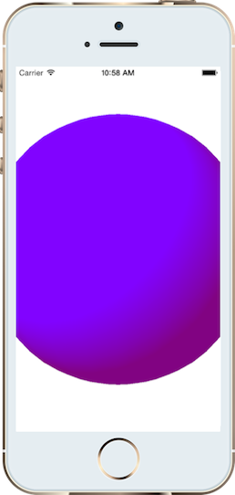
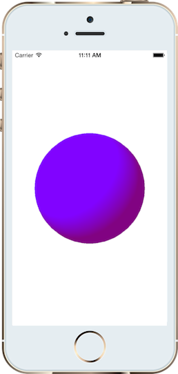

# SceneKit in Xamarin.iOS

SceneKit is a 3D scene graph API that simplifies working with 3D graphics. It was first introduced in OS X 10.8, and has now come to iOS 8. With SceneKit creating immersive 3D visualizations and casual 3D games does not require expertise in OpenGL. Building on common scene graph concepts, SceneKit abstracts away the complexities of OpenGL and OpenGL ES, making it very easy to add 3D content to an application. However, if you are an OpenGL expert, SceneKit has great support for tying in directly with OpenGL as well. It also includes numerous features that complement 3D graphics, such as physics, and integrates very well with several other Apple frameworks, such as Core Animation, Core Image and Sprite Kit.

SceneKit is extremely easy to work with. It is a declarative API that takes care of rendering. You simply set up a scene, add properties to it, and SceneKit handles the rendering of the scene.

To work with SceneKit you create a scene graph using the `SCNScene` class. A scene contains a hierarchy of nodes, represented by instances of `SCNNode`, defining locations in 3D space. Each node has properties such as geometry, lighting and materials that affect its appearance, as illustrated by the following figure:


## Create a Scene

To make a scene appear on screen, you add it to an `SCNView` by assigning it to the view’s Scene property. Additionally, if you make any changes to the scene, `SCNView` will update itself to display the changes.

```csharp
scene = SCNScene.Create ();
sceneView = new SCNView (View.Frame);
sceneView.Scene = scene;
```

Scenes can be populated from files exported via a 3d modeling tool, or programmatically from geometric primitives. For example, this is how to create a sphere and add it to the scene:

```csharp
sphere = SCNSphere.Create (10.0f);
sphereNode = SCNNode.FromGeometry (sphere);
sphereNode.Position = new SCNVector3 (0, 0, 0);
scene.RootNode.AddChildNode (sphereNode);
```

## Adding Light

At this point the sphere won’t display anything because there is no light in the scene. Attaching `SCNLight` instances to nodes creates lights in SceneKit. There are several types of lights ranging from various forms of directional lighting to ambient lighting. For example the following code creates an omnidirectional light on the side of the sphere:

```csharp
// omnidirectional light
var light = SCNLight.Create ();
var lightNode = SCNNode.Create ();
light.LightType = SCNLightType.Omni;
light.Color = UIColor.Blue;
lightNode.Light = light;
lightNode.Position = new SCNVector3 (-40, 40, 60);
scene.RootNode.AddChildNode (lightNode);
```

Omnidirectional lighting produces a diffuse reflection resulting in an even lighting, sort of like shining a flashlight. Creating ambient light is similar, although it has no direction as it shines equally in all directions. Think of it like mood lighting :)

```csharp
// ambient light
ambientLight = SCNLight.Create ();
ambientLightNode = SCNNode.Create ();
ambientLight.LightType = SCNLightType.Ambient;
ambientLight.Color = UIColor.Purple;
ambientLightNode.Light = ambientLight;
scene.RootNode.AddChildNode (ambientLightNode);
```

With the lights in place, the sphere is now visible in the scene.



## Adding a Camera

Adding a camera (SCNCamera) to the scene changes the point of view. The pattern to add the camera is similar. Create the camera, attach it to a node and add the node to the scene.

```csharp
// camera
camera = new SCNCamera {
    XFov = 80,
    YFov = 80
};
cameraNode = new SCNNode {
    Camera = camera,
    Position = new SCNVector3 (0, 0, 40)
};
scene.RootNode.AddChildNode (cameraNode);
```

As you can see from the code above, SceneKit objects can be created using constructors or from the Create factory method. The former allows using C# initializer syntax, but which one to use is largely a matter of preference.

With the camera in place, the entire sphere is visible to the user:



You can add additional lights to the scene as well. Here is what it looks like with a few more omnidirectional lights:


Additionally, by setting `sceneView.AllowsCameraControl = true`, the user can change the point of view with a touch gesture.

### Materials

Materials are created with the SCNMaterial class. For example to add an image onto the sphere’s surface, set the image to the material’s *diffuse* contents.

```csharp
material = SCNMaterial.Create ();
material.Diffuse.Contents = UIImage.FromFile ("monkey.png");
sphere.Materials = new SCNMaterial[] { material };
```

This layers the image onto the node as shown below:


A material can be set to respond to other types of lighting too. For example, the object can be made shiny and have its specular contents set to display specular reflection, resulting in a bright spot on the surface, as shown below:


Materials are very flexible, allowing you to achieve a lot with very little code. For example, instead of setting the image to the diffuse contents, set it to the reflective contents instead.

```csharp
material.Reflective.Contents = UIImage.FromFile ("monkey.png");
```

Now the monkey appears to sit visually within the sphere, independent of the point of view.

### Animation

SceneKit is designed to work well with animation. You can create both implicit or explicit animations, and can even render a scene from a Core Animation layer tree. When creating an implicit animation, SceneKit provides its own transition class, `SCNTransaction`.

Here’s an example that rotates the sphere:

```csharp
SCNTransaction.Begin ();
SCNTransaction.AnimationDuration = 2.0;
sphereNode.Rotation = new SCNVector4 (0, 1, 0, (float)Math.PI * 4);
SCNTransaction.Commit ();
```

You can animate much more than rotation though. Many properties of SceneKit are animatable. For example, the following code animates the material’s `Shininess` to increase the specular reflection.

```csharp
SCNTransaction.Begin ();
SCNTransaction.AnimationDuration = 2.0;
material.Shininess = 0.1f;
SCNTransaction.Commit ();
```

SceneKit is very straightforward to use. It offers a wealth of additional features including constraints, physics, declarative actions, 3D text, depth of field support, Sprite Kit integration and Core Image integration to name just a few.
