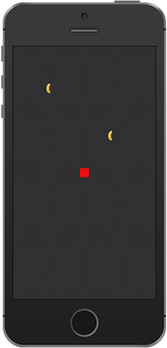

# SpriteKit in Xamarin.iOS

SpriteKit, the 2D graphics framework from Apple, has some interesting new features in iOS 8 and OS X Yosemite. These include integration with SceneKit, shader support, lighting, shadows, constraints, normal map generation, and physics enhancements. In particular, the new physics features make it very easy to add realistic effects to a game.

## Physics Bodies

SpriteKit includes a 2D, rigid body physics API. Every sprite has an associated physics body (`SKPhysicsBody`) that defines the physics properties such as mass and friction, as well as the geometry of the body in the physics world.

## Creating a Physics Body from a Texture
SpriteKit now supports deriving the physics body of a sprite from its texture. This makes it easy to implement collisions that look more natural.

For example, notice in the following collision how the banana and monkey collide nearly at the surface of each image:


SpriteKit makes creating such a physics body possible with a single line of code. Simply call `SKPhysicsBody.Create` with the texture and size:
    sprite.PhysicsBody = SKPhysicsBody.Create (sprite.Texture, sprite.Size);

## Alpha Threshold

In addition to simply setting the `PhysicsBody` property directly to the geometry derived from the texture, applications can set and alpha threshold to control how the geometry is derived. 

The alpha threshold defines the minimum alpha value a pixel must have to be included in the resulting physics body. For example, the following code results in a slightly different physics body:

```chsarp
sprite.PhysicsBody = SKPhysicsBody.Create (sprite.Texture, 0.7f, sprite.Size);
```

The effect of tweaking the alpha threshold like this fine-tunes the previous collision, such that the monkey falls over when colliding with the banana:


## Physics Fields

Another great addition to SpriteKit is the new physics field support. These allow you to add things such as vortex fields, radial gravity fields and spring fields to name just a few.

Physics fields are created using the SKFieldNode class, which is added to a scene just like any other `SKNode`. There are a variety of factory methods on `SKFieldNode` to create different physics fields. You can create a spring field by calling `SKFieldNode.CreateSpringField()`, a radial gravity field by calling `SKFieldNode.CreateRadialGravityField()`, and so on.

`SKFieldNode` also has properties to control field attributes such as the field strength, the field region, and the attenuation of field forces.

## Spring Field

For example, the following code creates a spring field and adds it to the scene:

```csharp
SKFieldNode fieldNode = SKFieldNode.CreateSpringField ();
fieldNode.Enabled = true;
fieldNode.Position = new PointF (Size.Width / 2, Size.Height / 2);
fieldNode.Strength = 0.5f;
fieldNode.Region = new SKRegion(Frame.Size);
AddChild (fieldNode);
```

You can then add sprites and set their `PhysicsBody` properties so that the physics field will affect the sprites, as the following code does when the user touches the screen:

```csharp
public override void TouchesBegan (NSSet touches, UIEvent evt)
{
    var touch = touches.AnyObject as UITouch;
    var pt = touch.LocationInNode (this);
    var node = SKSpriteNode.FromImageNamed ("TinyBanana");
    node.PhysicsBody = SKPhysicsBody.Create (node.Texture, node.Size);
    node.PhysicsBody.AffectedByGravity = false;
    node.PhysicsBody.AllowsRotation = true;
    node.PhysicsBody.Mass = 0.03f;
    node.Position = pt;
    AddChild (node);
}
```

This causes the bananas to oscillate like a spring around the field node:



## Radial Gravity Field

Adding a different field is similar. For instance, the following code creates a radial gravity field:

```csharp
SKFieldNode fieldNode = SKFieldNode.CreateRadialGravityField ();
fieldNode.Enabled = true;
fieldNode.Position = new PointF (Size.Width / 2, Size.Height / 2);
fieldNode.Strength = 10.0f;
fieldNode.Falloff = 1.0f;
```

This results in a different force field, where the bananas are pulled radially about the field:


