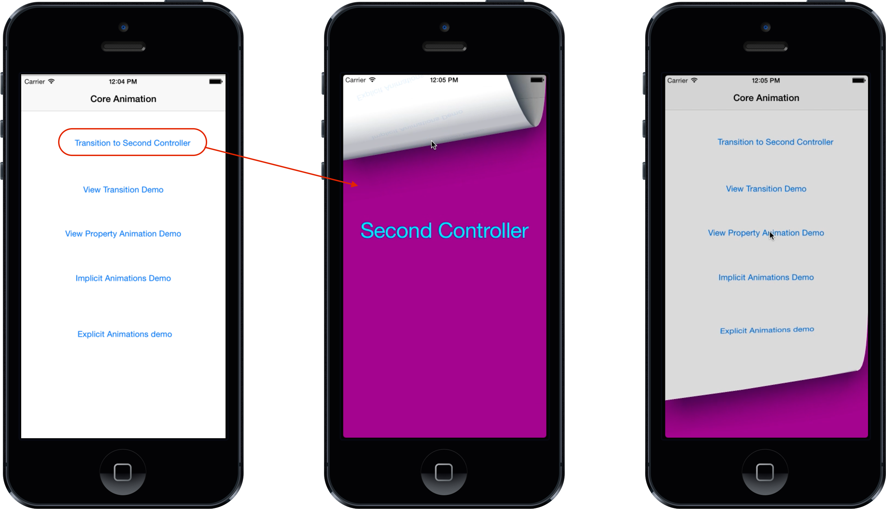

# Core Animation in Xamarin.iOS

_This article examines the Core Animation framework, showing how it enables high performance, fluid animations in UIKit, as well as how to use it directly for lower-level animation control._

iOS includes [*Core Animation*](https://developer.apple.com/library/ios/documentation/Cocoa/Conceptual/CoreAnimation_guide/Introduction/Introduction.html) to provide animation support for views in your application.
All of the ultra-smooth animations in iOS such as scrolling of tables and swiping between different views perform as well as they do because they rely on Core Animation internally.

The Core Animation and Core Graphics frameworks can work together to create beautiful, animated 2D graphics. In fact Core Animation can even transform 2D graphics in 3D space, creating amazing, cinematic experiences. However, to create true 3D graphics, you would need to use something like OpenGL ES, or for games turn to an API such as MonoGame, although 3D is beyond the scope of this article.

<a name="Using_Core_Animation"></a>

## Core Animation

iOS uses the Core Animation framework to create animation effects such as transitioning between views, sliding menus and scrolling effects to name a few. There are two ways to work with animation:

- [Via UIKit](#Using_UIKit_Animation), which includes view-based animations as well as animated transitions between controllers.
- [Via Core Animation](#Using_Core_Animation), which layers directly, allowing for finer-grained control.

<a name="Using_UIKit_Animation"></a>

## Using UIKit Animation

UIKit provides several features that make it easy to add animation to an application. Although it uses Core Animation internally, it abstracts it away so you work only with views and controllers.

This section discusses UIKit animation features including:

- Transitions between controllers
- Transitions between views
- View property animation

### View Controller Transitions

 `UIViewController` provides built-in support for transitioning between view controllers through the `PresentViewController` method. When using `PresentViewController`, the transition to the second controller can optionally be animated.

For example, consider an application with two controllers, where touching a button in the first controller calls `PresentViewController` to display a second controller. To control what transition animation is used to show the second controller, simply set its [`ModalTransitionStyle`](xref:UIKit.UIModalTransitionStyle) property as shown below:

```csharp
SecondViewController vc2 = new SecondViewController {
  ModalTransitionStyle = UIModalTransitionStyle.PartialCurl
};
```

In this case a `PartialCurl` animation is used, although several others are available, including:

- `CoverVertical` – Slides up from the bottom of the screen
- `CrossDissolve` – The old view fades out & the new view fades in
- `FlipHorizontal` - A horizontal right-to-left flip. On dismissal the transition flips left-to-right.

To animate the transition, pass `true` as the second argument to `PresentViewController`:

```csharp
PresentViewController (vc2, true, null);
```

The following screenshot shows what the transition looks like for the `PartialCurl` case:

 

### View Transitions

In addition to transitions between controllers, UIKit also supports animating transitions between views to swap one view for another.

For example, say you had a controller with `UIImageView`, where tapping on the image should display a second `UIImageView`. To animate the image view’s superview to transition to the second image view is as simple as calling `UIView.Transition`, passing it the `toView` and `fromView` as shown below:

```csharp
UIView.Transition (
  fromView: view1,
  toView: view2,
  duration: 2,
  options: UIViewAnimationOptions.TransitionFlipFromTop |
    UIViewAnimationOptions.CurveEaseInOut,
  completion: () => { Console.WriteLine ("transition complete"); });
```

`UIView.Transition` also takes a `duration` parameter that controls how long the animation runs, as well as [`options`](xref:UIKit.UIViewAnimationOptions) to specify things such as the animation to use and the easing function. Additionally, you can specify a completion handler that will be called when the animation completes.

The screenshot below show the animated transition between the image views when `TransitionFlipFromTop` is used:

 

### View Property Animations

UIKit supports animating a variety of properties on the `UIView` class for free, including:

- Frame
- Bounds
- Center
- Alpha
- Transform
- Color

These animations happen implicitly by specifying property changes in an `NSAction` delegate passed to the static `UIView.Animate` method. For example, the following code animates the center point of a `UIImageView`:

```csharp
pt = imgView.Center;

UIView.Animate (
  duration: 2, 
  delay: 0, 
  options: UIViewAnimationOptions.CurveEaseInOut | 
    UIViewAnimationOptions.Autoreverse,
  animation: () => {
    imgView.Center = new CGPoint (View.Bounds.GetMaxX () 
      - imgView.Frame.Width / 2, pt.Y);},
  completion: () => {
    imgView.Center = pt; }
);
```

This results in an image animating back and forth across the top of the screen, as shown below:

 

As with the `Transition` method, `Animate` allows the duration to be set, along with the easing function. This example also used the `UIViewAnimationOptions.Autoreverse` option, which causes the animation to animate from the value back to the initial one. However, the code also sets the `Center` back to its initial value in a completion handler. While an animation is interpolating property values over time, the actual model value of the property is always the final value that has been set. In this example, the value is a point near the right side of the superview. Without setting the `Center` to the initial point, which is where the animation completes due to the `Autoreverse` being set, the image would snap back to the right side after the animation completes, as shown below:

 

## Using Core Animation

 `UIView` animations allow a lot of capability and should be used if possible due to the ease of implementation. As mentioned earlier, UIView animations use the Core Animation framework. However, some things cannot be done with `UIView` animations, such as animating additional properties that cannot be animated with a view, or interpolating along a non-linear path. In such cases where you need finer control, Core Animation can be used directly as well.

### Layers

When working with Core Animation, animation happens via *layers*, which are of type `CALayer`. A layer is conceptually similar to a view in that there is a layer hierarchy, much like there is a view hierarchy. Actually, layers back views, with the view adding support for user interaction. You can access the layer of any view via the view’s `Layer` property. In fact, the context used in `Draw` method of `UIView` is actually created from the layer. Internally, the layer backing a `UIView` has its delegate set to the view itself, which is what calls `Draw`. So when drawing to a `UIView`, you are actually drawing to its layer.

Layer animations can be either implicit or explicit. Implicit animations are declarative. You simply declare what layer properties should change and the animation just works. Explicit animations on the other hand are created via an animation class that is added to a layer. Explicit animations allow addition control over how an animation is created. The following sections delve into implicit and explicit animations in greater depth.

### Implicit Animations

One way to animate the properties of a layer is via an implicit animation. `UIView` animations create implicit animations. However, you can create implicit animations directly against a layer as well.

For example, the following code sets a layer’s `Contents` from an image, sets a border width and color, and adds the layer as a sublayer of the view’s layer:

```csharp
public override void ViewDidLoad ()
{
  base.ViewDidLoad ();

  layer = new CALayer ();
  layer.Bounds = new CGRect (0, 0, 50, 50);
  layer.Position = new CGPoint (50, 50);
  layer.Contents = UIImage.FromFile ("monkey2.png").CGImage;
  layer.ContentsGravity = CALayer.GravityResize;
  layer.BorderWidth = 1.5f;
  layer.BorderColor = UIColor.Green.CGColor;

  View.Layer.AddSublayer (layer);
}
```

To add an implicit animation for the layer, simply wrap property changes in a `CATransaction`. This allows animating properties that would not be animatable with a view animation, such as the `BorderWidth` and `BorderColor` as shown below:

```csharp
public override void ViewDidAppear (bool animated)
{
  base.ViewDidAppear (animated);

  CATransaction.Begin ();
  CATransaction.AnimationDuration = 10;
  layer.Position = new CGPoint (50, 400);
  layer.BorderWidth = 5.0f;
  layer.BorderColor = UIColor.Red.CGColor;
  CATransaction.Commit ();
}
```

This code also animates the layer’s `Position`, which is the location of the layer’s anchor point measured from the upper left of the superlayer’s coordinates. The anchor point of a layer is a normalized point within the layer’s coordinate system.

The following figure shows the position and anchor point:

 

When the example is run, the `Position`, `BorderWidth` and `BorderColor` animate as shown in the following screenshots:

 

### Explicit Animations

In addition to implicit animations, Core Animation includes a variety of classes that inherit from `CAAnimation` that let you encapsulate animations that are then explicitly added to a layer. These allow finer-grained control over animations, such as modifying the start value of an animation, grouping animations and specifying keyframes to allow non-linear paths.

The following code shows an example of an explicit animation using a `CAKeyframeAnimation` for the layer shown earlier (in the Implicit Animation section):

```csharp
public override void ViewDidAppear (bool animated)
{
  base.ViewDidAppear (animated);
  
  // get the initial value to start the animation from
  CGPoint fromPt = layer.Position;
  
  /* set the position to coincide with the final animation value
  to prevent it from snapping back to the starting position
  after the animation completes*/
  layer.Position = new CGPoint (200, 300);
  
  // create a path for the animation to follow
  CGPath path = new CGPath ();
  path.AddLines (new CGPoint[] { fromPt, new CGPoint (50, 300), new CGPoint (200, 50), new CGPoint (200, 300) });
  
  // create a keyframe animation for the position using the path
  CAKeyFrameAnimation animPosition = (CAKeyFrameAnimation)CAKeyFrameAnimation.FromKeyPath ("position");
  animPosition.Path = path;
  animPosition.Duration = 2;
  
  // add the animation to the layer.
  /* the "position" key is used to overwrite the implicit animation created
  when the layer positino is set above*/
  layer.AddAnimation (animPosition, "position");
}
```

This code changes the `Position` of the layer by creating a path that is then used to define a keyframe animation. Notice that the layer’s `Position` is set to the final value of the `Position` from the animation. Without this, the layer would abruptly return to its `Position` before the animation because the animation only changes the presentation value and not the actual model value. By setting the model value to the final value from the animation, the layer stay in place at the end of the animation.

The following screenshots show the layer containing the image animating through the specified path:

 

## Summary

In this article we looked at the animation capabilities provided via the *Core Animation* frameworks. We examined Core Animation, showing both how it powers animations in UIKit, and how it can be used directly for lower-level animation control.

## Related Links

- [Core Animation Sample](/samples/xamarin/ios-samples/graphicsandanimation)
- [Core Graphics](~/ios/platform/graphics-animation-ios/core-graphics.md)
- [Graphics and Animation Walkthrough](~/ios/platform/graphics-animation-ios/graphics-animation-walkthrough.md)
- [Core Animation](https://github.com/xamarin/recipes/tree/master/Recipes/ios/animation/coreanimation)