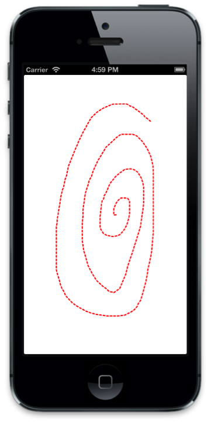

# Using Core Graphics and Core Animation in Xamarin.iOS

For this walkthrough we are going to draw a path using Core Graphics in response to touch input. Then, we will add a `CALayer` containing an image that we will animate along the path.

The following screenshot shows the completed application:


Before we begin download the *GraphicsDemo* sample that accompanies this guide. It can be downloaded [here](/samples/xamarin/ios-samples/graphicsandanimation) and is located inside the **GraphicsWalkthrough** directory Launch the project named **GraphicsDemo_starter** by double-clicking on it, and open the `DemoView` class.

## Drawing a Path

1. In `DemoView` add a `CGPath` variable to the class and instantiate it in the constructor. Also declare two `CGPoint` variables , `initialPoint` and `latestPoint`, that we will use to capture the touch point from which we construct the path:

    ```csharp
    public class DemoView : UIView
    {
        CGPath path;
        CGPoint initialPoint;
        CGPoint latestPoint;

        public DemoView ()
        {
            BackgroundColor = UIColor.White;

            path = new CGPath ();
        }
    }
    ```

2. Add the following using directives:

    ```csharp
    using CoreGraphics;
    using CoreAnimation;
    using Foundation;
    ```

3. Next, override `TouchesBegan` and `TouchesMoved,` and add the following implementations to capture the initial touch point and each subsequent touch point respectively:

    ```csharp
    public override void TouchesBegan (NSSet touches, UIEvent evt){

        base.TouchesBegan (touches, evt);

        UITouch touch = touches.AnyObject as UITouch;

        if (touch != null) {
            initialPoint = touch.LocationInView (this);
        }
    }

    public override void TouchesMoved (NSSet touches, UIEvent evt){

        base.TouchesMoved (touches, evt);

        UITouch touch = touches.AnyObject as UITouch;

        if (touch != null) {
            latestPoint = touch.LocationInView (this);
            SetNeedsDisplay ();
        }
    }
    ```

    `SetNeedsDisplay` will be called each time touches move in order for `Draw` to be called on the next run loop pass.

4. We’ll add lines to the path in the `Draw` method and use a red, dashed line to draw with. [Implement `Draw`](~/ios/platform/graphics-animation-ios/core-graphics.md) with the code shown below:

    ```csharp
    public override void Draw (CGRect rect){

        base.Draw (rect);

        if (!initialPoint.IsEmpty) {

            //get graphics context
            using(CGContext g = UIGraphics.GetCurrentContext ()){

                //set up drawing attributes
                g.SetLineWidth (2);
                UIColor.Red.SetStroke ();

                //add lines to the touch points
                if (path.IsEmpty) {
                    path.AddLines (new CGPoint[]{initialPoint, latestPoint});
                } else {
                    path.AddLineToPoint (latestPoint);
                }

                //use a dashed line
                g.SetLineDash (0, new nfloat[] { 5, 2 * (nfloat)Math.PI });

                //add geometry to graphics context and draw it
                g.AddPath (path);
                g.DrawPath (CGPathDrawingMode.Stroke);
            }
        }
    }
    ```

If we run the application now, we can touch to draw on the screen, as shown in the following screenshot:



## Animating Along a Path

Now that we have implemented the code to allow users to draw the path, let’s add the code to animate a layer along the drawn path.

1. First, add a [`CALayer`](~/ios/platform/graphics-animation-ios/core-animation.md) variable to the class and create it in the constructor:

    ```csharp
    public class DemoView : UIView
        {
            …

            CALayer layer;

            public DemoView (){
                …

                //create layer
                layer = new CALayer ();
                layer.Bounds = new CGRect (0, 0, 50, 50);
                layer.Position = new CGPoint (50, 50);
                layer.Contents = UIImage.FromFile ("monkey.png").CGImage;
                layer.ContentsGravity = CALayer.GravityResizeAspect;
                layer.BorderWidth = 1.5f;
                layer.CornerRadius = 5;
                layer.BorderColor = UIColor.Blue.CGColor;
                layer.BackgroundColor = UIColor.Purple.CGColor;
            }
    ```

2. Next, we’ll add the layer as a sublayer of the view’s layer when the user lifts up their finger from the screen. Then, we will create a keyframe animation using the path, animating the layer’s `Position`.

    To accomplish this we need to override the `TouchesEnded` and add the following code:

    ```csharp
    public override void TouchesEnded (NSSet touches, UIEvent evt)
        {
            base.TouchesEnded (touches, evt);

            //add layer with image and animate along path

            if (layer.SuperLayer == null)
                Layer.AddSublayer (layer);

            // create a keyframe animation for the position using the path
            layer.Position = latestPoint;
            CAKeyFrameAnimation animPosition = (CAKeyFrameAnimation)CAKeyFrameAnimation.FromKeyPath ("position");
            animPosition.Path = path;
            animPosition.Duration = 3;
            layer.AddAnimation (animPosition, "position");
        }
    ```

3. Run the application now and after drawing, a layer with an image is added and travels along the drawn path:


## Summary

In this article, we stepped through an example that tied graphics and animation concepts together. First, we showed how to use Core Graphics to draw a path in a `UIView` in response to user touch. Then we showed how to use Core Animation to make an image travel along that path.

## Related Links

- [Core Animation](~/ios/platform/graphics-animation-ios/core-animation.md)
- [Core Graphics](~/ios/platform/graphics-animation-ios/core-graphics.md)
- [Core Animation recipes](https://github.com/xamarin/recipes/tree/master/Recipes/ios/animation/coreanimation)