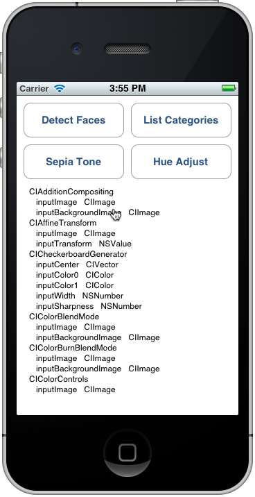

# Core Image in Xamarin.iOS

_Core Image is a new framework introduced with iOS 5 to provide image processing and live video enhancement functionality. This article introduces these features with Xamarin.iOS samples._

Core Image is a new framework introduced in iOS 5 that provides a number of
built-in filters and effects to apply to images and videos, including face
detection.

This document contains simple examples of:

- Face detection.
- Applying filters to an image
- Listing the available filters.

These examples should help get you started incorporating Core Image features
into your Xamarin.iOS applications.

## Requirements

You must use the latest version of Xcode.

## Face Detection

The Core Image face detection feature does just what it says – it attempts
to identify faces in a photo and returns the coordinates of any faces that it
recognizes. This information can be used to count the number of people in an
image, draw indicators on the image (eg. for ‘tagging’ people in a
photograph), or anything else you can think of.

This code from CoreImage\SampleCode.cs demonstrates how to create and use
face detection on an embedded image:

```csharp
var image = new UIImage("photoFace.JPG");
var context = CIContext.FromOptions(null);
var detector = CIDetector.CreateFaceDetector (context, true);
var ciImage = CIImage.FromCGImage(image.CGImage);
CIFeature[] features = detector.FeaturesInImage(ciImage);
```

The features array will be populated with `CIFaceFeature` objects
(if any faces were detected). There is a `CIFaceFeature` for each
face. `CIFaceFeature` has the following properties:

- HasMouthPosition – Whether a mouth was detected for this face.
- HasLeftEyePosition – Whether the left eye was detected for this face.
- HasRightEyePosition – Whether the right eye was detected for this face. 
- MouthPosition – The coordinates of the mouth for this face.
- LeftEyePosition – The coordinates of the left eye for this face.
- RightEyePosition – The coordinates of the right eye for this face.

The coordinates for all these properties have their origin in the bottom-left
– unlike UIKit which uses the top-left as the origin. When using the
coordinates on `CIFaceFeature` be sure to ‘flip’ them. This very
basic custom image view in CoreImage\CoreImageViewController.cs demonstrates how
to draw ‘face indicator’ triangles on the image (note the `FlipForBottomOrigin` method):

```csharp
public class FaceDetectImageView : UIView
{
    public Xamarin.iOS.CoreImage.CIFeature[] Features;
    public UIImage Image;
    public FaceDetectImageView (RectangleF rect) : base(rect) {}
    CGPath path;
    public override void Draw (RectangleF rect) {
        base.Draw (rect);
        if (Image != null)
            Image.Draw(rect);

        using (var context = UIGraphics.GetCurrentContext()) {
            context.SetLineWidth(4);
            UIColor.Red.SetStroke ();
            UIColor.Clear.SetFill ();
            if (Features != null) {
                foreach (var feature in Features) { // for each face
                    var facefeature = (CIFaceFeature)feature;
                    path = new CGPath ();
                    path.AddLines(new PointF[]{ // assumes all 3 features found
                        FlipForBottomOrigin(facefeature.LeftEyePosition, 200),
                        FlipForBottomOrigin(facefeature.RightEyePosition, 200),
                        FlipForBottomOrigin(facefeature.MouthPosition, 200)
                    });
                    path.CloseSubpath();
                    context.AddPath(path);
                    context.DrawPath(CGPathDrawingMode.FillStroke);
                }
            }
        }
    }
    /// <summary>
    /// Face recognition coordinates have their origin in the bottom-left
    /// but we are drawing with the origin in the top-left, so "flip" the point
    /// </summary>
    PointF FlipForBottomOrigin (PointF point, int height)
    {
        return new PointF(point.X, height - point.Y);
    }
}
```

Then in the SampleCode.cs file the image and features are assigned before the
image is redrawn:

```csharp
faceView.Image = image;
faceView.Features = features;
faceView.SetNeedsDisplay();
```

The screenshot shows the sample output: the locations of the detected facial
features are displayed in a UITextView and drawn onto the source image using
CoreGraphics.

Because of the way facial recognition works it will occasionally detect
things besides human faces (like these toy monkeys!).

## Filters

There are over 50 different built-in filters, and the framework is extensible
so that new filters can be implemented .

## Using Filters

Applying a filter to an image has four distinct steps: loading the image,
creating the filter, applying the filter and saving (or displaying) the
result.

First, load an image into a `CIImage` object.

```csharp
var uiimage = UIImage.FromFile ("photo.JPG");
var ciimage = new CIImage (uiimage);
```

Second, create the filter class and set its properties.

```csharp
var sepia = new CISepiaTone();
sepia.Image = ciimage;
sepia.Intensity = 0.8f;
```

Third, access the `OutputImage` property and call the `CreateCGImage` method to render the final result.

```csharp
CIImage output = sepia.OutputImage;
var context = CIContext.FromOptions(null);
var cgimage = context.CreateCGImage (output, output.Extent);
```

Finally, assign the image to a view to see the result. In a real-world
application the resulting image might be saved to the filesystem, the Photo
Album, a Tweet or email.

```csharp
var ui = UIImage.FromImage (cgimage);
imgview.Image = ui;
```

These screenshots show the result of the `CISepia` and `CIHueAdjust` filters that are demonstrated in the CoreImage.zip
sample code.

See the [Adjust Contract and Brightness of an Image Recipe](https://github.com/xamarin/recipes/tree/master/Recipes/ios/media/coreimage/adjust_contrast_and_brightness_of_an_image) for an example of the `CIColorControls` filter.

```csharp
var uiimage = UIImage.FromFile("photo.JPG");
var ciimage = new CIImage(uiimage);
var hueAdjust = new CIHueAdjust();   // first filter
hueAdjust.Image = ciimage;
hueAdjust.Angle = 2.094f;
var sepia = new CISepiaTone();       // second filter
sepia.Image = hueAdjust.OutputImage; // output from last filter, input to this one
sepia.Intensity = 0.3f;
CIFilter color = new CIColorControls() { // third filter
    Saturation = 2,
    Brightness = 1,
    Contrast = 3,
    Image = sepia.OutputImage    // output from last filter, input to this one
};
var output = color.OutputImage;
var context = CIContext.FromOptions(null);
// ONLY when CreateCGImage is called do all the effects get rendered
var cgimage = context.CreateCGImage (output, output.Extent);
var ui = UIImage.FromImage (cgimage);
imgview.Image = ui;
```

```csharp
var context = CIContext.FromOptions (null);
```

```csharp
var context = CIContext.FromOptions(new CIContextOptions() {
    UseSoftwareRenderer = true  // CPU
});
var cgimage = context.CreateCGImage (output, output.Extent);
var ui = UIImage.FromImage (cgimage);
imgview.Image = ui;
```

### Listing Filters and their Properties

This code from CoreImage\SampleCode.cs outputs the complete list of built-in
filters and their parameters.

```csharp
var filters = CIFilter.FilterNamesInCategories(new string[0]);
foreach (var filter in filters){
   display.Text += filter +"\n";
   var f = CIFilter.FromName (filter);
   foreach (var key in f.InputKeys){
     var attributes = (NSDictionary)f.Attributes[new NSString(key)];
     var attributeClass = attributes[new NSString("CIAttributeClass")];
     display.Text += "   " + key;
     display.Text += "   " + attributeClass + "\n";
   }
}
```

The [CIFilter Class Reference](https://developer.apple.com/library/prerelease/ios/#documentation/GraphicsImaging/Reference/QuartzCoreFramework/Classes/CIFilter_Class/Reference/Reference.html) describes the 50 built-in filters and their
properties. Using the code above you can query the filter classes, including
default values for parameters and the maximum and minimum allowable values
(which could be used to validate inputs before applying a filter).

The List Categories output looks like this on the simulator – you can
scroll through the list to see all the filters and their parameters.

 [](introduction-to-coreimage-images/coreimage05.png#lightbox)

Each filter listed has been exposed as a class in Xamarin.iOS, so you can also
explore the Xamarin.iOS.CoreImage API in the Assembly Browser or using
auto-complete in either Visual Studio for Mac or Visual Studio. 

## Summary

This article has shown how to use some of the new iOS 5 Core Image framework
features like face detection and applying filters to an image. There are dozens
of different image filters available in the framework for you to use.

## Related Links

- [Core Image (sample)](/samples/xamarin/ios-samples/coreimage)
- [Adjust Contract and Brightness of an Image Recipe](https://github.com/xamarin/recipes/tree/master/Recipes/ios/media/coreimage/adjust_contrast_and_brightness_of_an_image)
- [Using Core Image Filters](https://developer.apple.com/library/prerelease/ios/#documentation/GraphicsImaging/Conceptual/CoreImaging/ci_tasks/ci_tasks.html)
- [CIFilter Class Reference](https://developer.apple.com/library/prerelease/ios/#documentation/GraphicsImaging/Reference/QuartzCoreFramework/Classes/CIFilter_Class/Reference/Reference.htm)