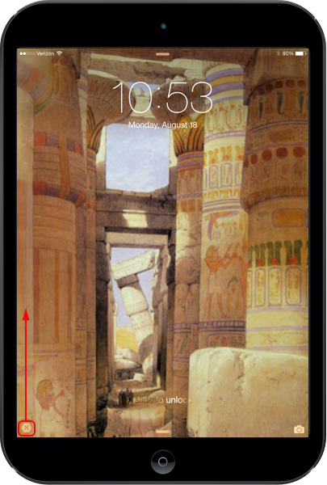
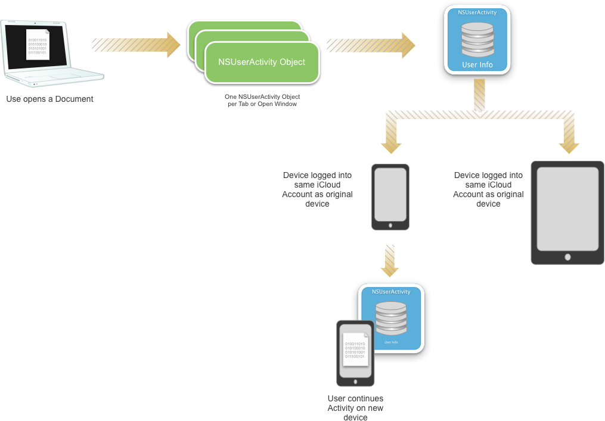
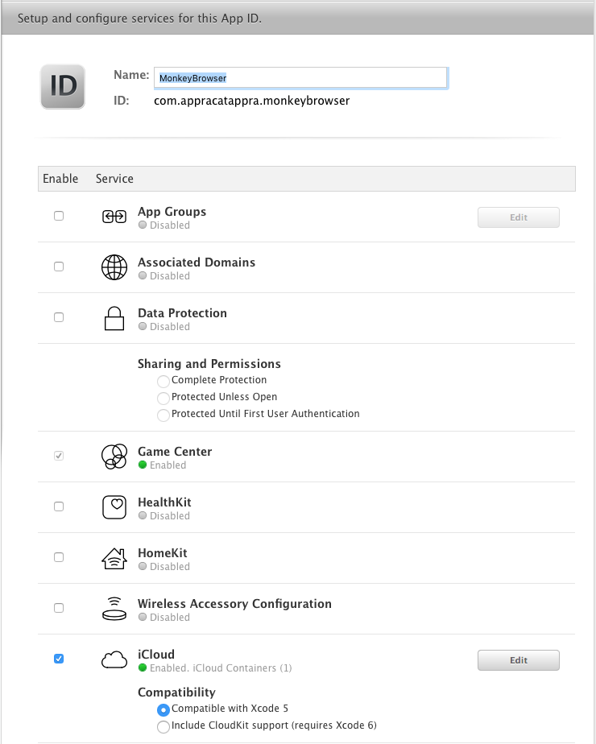
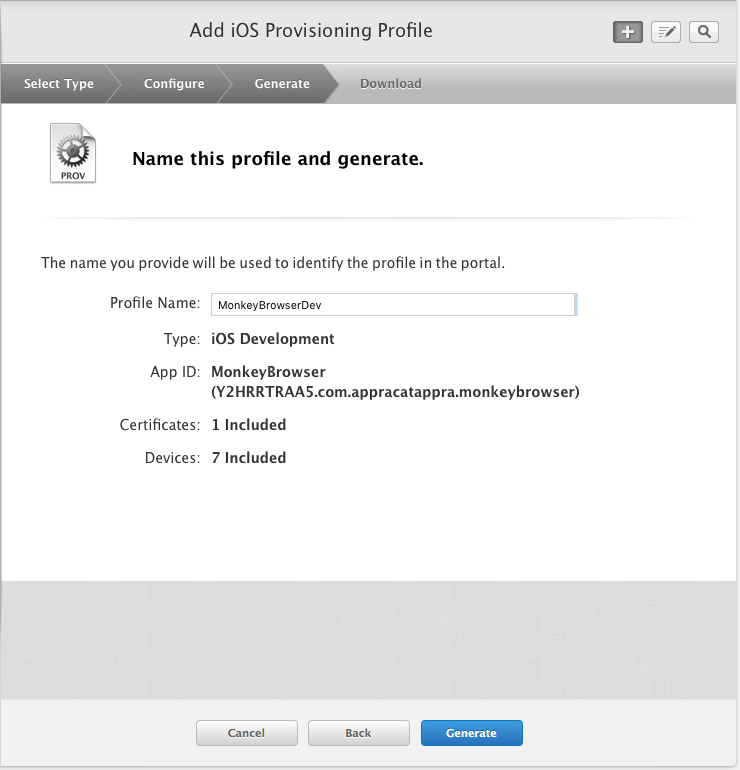
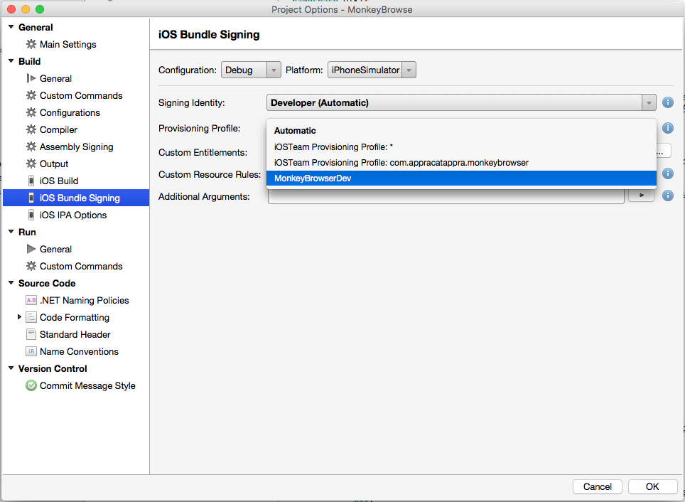
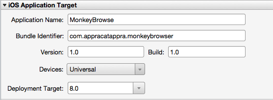
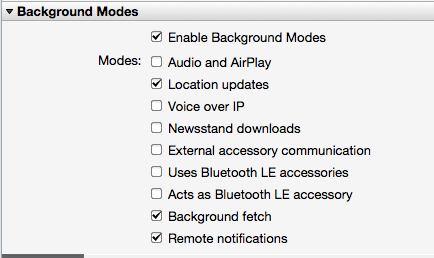
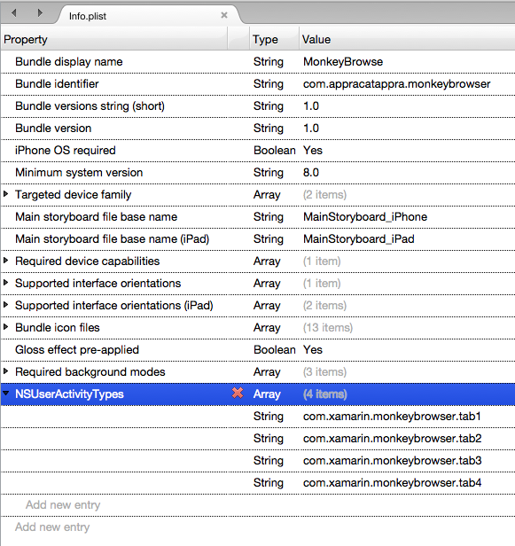
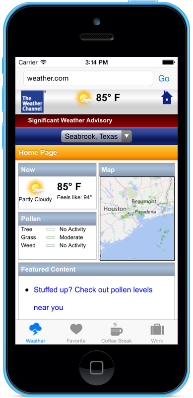

# Handoff in Xamarin.iOS

_This article covers working with Handoff in a Xamarin.iOS app to transfer user activities between apps running on the user's other devices._

Apple introduced Handoff in iOS 8 and OS X Yosemite (10.10) to provide a common
mechanism for the user to transfer activities started on one of their devices,
to another device running the same app or another app that supports the same activity.

[](handoff-images/handoff02.png#lightbox)

This article will take a quick look at enabling activity sharing in a Xamarin.iOS
app and cover the Handoff framework in detail:

## About Handoff

Handoff (also known as Continuity) was introduced by Apple in iOS 8 and OS X Yosemite (10.10) as a way for the user to start an activity on one of their devices (either iOS or Mac) and continue that same activity on another of their devices (as identified by the user's iCloud Account).

Handoff was expanded in iOS 9 to also support new, enhanced Search capabilities. For more information, please see our [Search Enhancements](~/ios/platform/search/index.md) documentation.

For example, the user can start an email on their iPhone and seamlessly continue the email on their Mac, with all of the same message information filled in and the cursor in the same location that they left it in iOS.

Any of your apps that share the same _Team ID_ are eligible for using Handoff to continue user activities across apps as long as these app are either delivered via the iTunes App Store or signed by a registered developer (for Mac, Enterprise or Ad Hoc apps).

Any `NSDocument` or `UIDocument` based apps automatically have Handoff support built-in, and require minimal changes to support Handoff.

### Continuing User Activities

The `NSUserActivity` class (along with some small changes to `UIKit` and `AppKit`) provides support for defining a user's activity that can potentially be continued on another of the user's devices.

For an activity to be passed over to another of the user's devices, it must be encapsulated in an instance `NSUserActivity`, marked as the _Current Activity_, have it's payload set (the data used to perform the continuation) and the activity must then be transmitted to that device.

Handoff passes the bare minimum of information to define the activity to be continued, with larger data packets being synced via iCloud.

On the receiving device, the user will receive a notification that an activity is available for continuation. If the user chooses to continue the activity on the new device, the specified app is launched (if not already running) and the payload from the `NSUserActivity` is used to restart the activity.

[](handoff-images/handoffinteractions.png#lightbox)

Only apps that share the same developer Team ID and respond to a given _Activity Type_ are eligible for continuation. An app defines the Activity Types that it supports under the `NSUserActivityTypes` key of its **Info.plist** file. Given this, a continuing device chooses the app to perform the continuation based on the Team ID, Activity Type and optionally the _Activity Title_.

The receiving app uses information from the `NSUserActivity`'s `UserInfo` dictionary to configure its user interface and restore the state of the given activity so that the transition appears seamless to the end user.

If the continuation requires more information than can be sent efficiently through a `NSUserActivity`, the resuming app can send a call to the originating app and establish one or more streams to transmit the required data. For example, if the activity was editing a large text document with multiple images, streaming would be required to transfer the information needed to continue the activity on the receiving device. For more information, see the [Supporting Continuation Streams](#supporting-continuation-streams) section below.

As stated above, `NSDocument` or `UIDocument` based apps automatically have Handoff support built-in. For more information, see the [Supporting Handoff in Document-Based Apps](#supporting-handoff-in-document-based-apps) section below.

### The NSUserActivity Class

The `NSUserActivity` class is the primary object in a Handoff exchange and is used to encapsulate the state of a User Activity that is available for continuation. An app will instantiate a copy of `NSUserActivity` for any activity it supports and wishes to continue on another device. For example, document editor would create an activity for each document currently open. However, only the frontmost document (displayed in the frontmost Window or Tab) is the _Current Activity_ and therefor available for continuation.

An instance of `NSUserActivity` is identified by both its `ActivityType` and `Title` properties. The `UserInfo` dictionary property is used to carry information about the state of the activity. Set the `NeedsSave` property to `true` if you want to lazy load the state information via the `NSUserActivity`'s delegate. Use the `AddUserInfoEntries` method to merge new data from other clients into the `UserInfo` dictionary as required to preserve the activity's state.

### The NSUserActivityDelegate Class

The `NSUserActivityDelegate` is used to keep information in a `NSUserActivity`'s `UserInfo` dictionary up-to-date and in sync with the current state of the activity. When the system needs the information in the activity to be updated (such as before continuation on another device), it calls the `UserActivityWillSave` method of the delegate.

You will need to implement the `UserActivityWillSave` method and make any changes to the `NSUserActivity` (such as `UserInfo`, `Title`, etc.) to ensure that it still reflects the state of the Current Activity. When the system calls the `UserActivityWillSave` method, the `NeedsSave` flag will be cleared. If you modify any of the data properties of the activity, you'll need to set `NeedsSave` to `true` again.

Instead of using the `UserActivityWillSave` method presented above, you can optionally have `UIKit` or `AppKit` manage the user activity automatically. To do this, set the responder object's `UserActivity` property and implement the `UpdateUserActivityState` method. See the [Supporting Handoff in Responders](#supporting-handoff-in-responders) section below for more information.

### App Framework Support

Both `UIKit` (iOS) and `AppKit` (OS X) provide built-in support for Handoff in the `NSDocument`, Responder (`UIResponder`/`NSResponder`), and `AppDelegate` classes. While each OS implements Handoff slightly differently, the basic mechanism and the APIs are the same.

#### User Activities in Document-Based Apps

Document-based iOS and OS X apps automatically have Handoff support built-in. To activate this support, you'll need to add an `NSUbiquitousDocumentUserActivityType` key and value for each `CFBundleDocumentTypes` entry in the app's **Info.plist** file.

If this key is present, both `NSDocument` and `UIDocument` automatically create `NSUserActivity` instances for iCloud-based documents of the type specified. You will need to provide an activity type for each type of document that the app supports and multiple document types can use the same activity type. Both `NSDocument` and `UIDocument` automatically populate the `UserInfo` property of the `NSUserActivity` with their `FileURL` property's value.

On OS X, the `NSUserActivity` managed by `AppKit` and associated with responders automatically become the Current Activity when the document’s window becomes the main window. On iOS, for `NSUserActivity` objects managed by `UIKit`, you must either call `BecomeCurrent` method explicitly or have the document’s `UserActivity` property set on a `UIViewController` when the app comes to the foreground.

`AppKit` will automatically restore any `UserActivity` property created in this way on OS X. This occurs if the `ContinueUserActivity` method returns `false` or if it is unimplemented. In this situation, the document is opened with the `OpenDocument` method of the `NSDocumentController` and it will then receive a `RestoreUserActivityState` method call.

See the [Supporting Handoff in Document-Based Apps](#supporting-handoff-in-document-based-apps) section below for more information.

#### User Activities and Responders

Both `UIKit` and `AppKit` can automatically manage a user activity if you set it as a responder object’s `UserActivity` property. If the state has been modified, you'll need to set the `NeedsSave` property of the responder's `UserActivity` to `true`. The system will automatically save the `UserActivity` when required, after giving the responder time to update the state by calling its `UpdateUserActivityState` method.

If multiple responders share a single `NSUserActivity` instance, they receive an `UpdateUserActivityState` callback when the system updates the user activity object. The responder needs to call the `AddUserInfoEntries` method to update the `NSUserActivity`'s `UserInfo` dictionary to reflect the current activity state at this point. The `UserInfo` dictionary is cleared before each `UpdateUserActivityState` call.

To disassociate itself from an activity, a responder can set its `UserActivity` property to `null`. When an app framework managed `NSUserActivity` instance has no more associated responders or documents, it is automatically invalidated.

See the [Supporting Handoff in Responders](#supporting-handoff-in-responders) section below for more information.

#### User Activities and the AppDelegate

Your app's `AppDelegate` is its primary entry point when handling a Handoff continuation. When the user responds to a Handoff notification, the appropriate app is launched (if not already running) and the `WillContinueUserActivityWithType` method of the `AppDelegate` will be called. At this point, the app should inform the user that the continuation is starting.

The `NSUserActivity` instance is delivered when the `AppDelegate`'s `ContinueUserActivity` method is called. At this point, you should configure the app's user interface and continue the given activity.

See the [Implementing Handoff](#implementing-handoff) section below for more information.

## Enabling Handoff in a Xamarin App

Because of the security requirements imposed by Handoff, a Xamarin.iOS app that uses the Handoff framework must be properly configured in both the Apple Developer Portal and in the Xamarin.iOS project file.

Do the following:

1. Log into the [Apple Developer Portal](https://developer.apple.com).
2. Click on **Certificates, Identifiers & Profiles**.
3. If you haven't already done so, click on **Identifiers** and create an ID for your app (e.g. `com.company.appname`), else edit your existing ID.
4. Ensure that the **iCloud** service has been checked for the given ID:

    [](handoff-images/provision01.png#lightbox)
5. Save your changes.
6. Click on **Provisioning Profiles** > **Development** and create a new development provisioning profile for you app:

    [](handoff-images/provision02.png#lightbox)
7. Either download and install the new provisioning profile or use Xcode to download and install the profile.
8. Edit your Xamarin.iOS project options and ensure that you are using the provisioning profile that you just created:

    [](handoff-images/provision03.png#lightbox)
9. Next, edit your **Info.plist** file and ensure that you are using the App ID that was used to create the provisioning profile:

    [](handoff-images/provision04.png#lightbox)
10. Scroll to the **Background Modes** section and check the following items:

    [](handoff-images/provision05.png#lightbox)
11. Save the changes to all files.

With these settings in place, the application is now ready to access the Handoff Framework APIs. For detailed information on provisioning, please see our [Device Provisioning](~/ios/get-started/installation/device-provisioning/index.md) and [Provisioning Your App](~/ios/get-started/installation/device-provisioning/index.md) guides.

## Implementing Handoff

User activities can be continued among apps that are signed with the same developer Team ID and support the same Activity Type. Implementing Handoff in a Xamarin.iOS app requires you to create a User Activity Object (either in `UIKit` or `AppKit`), update the object's state to track the activity, and continuing the activity on a receiving device.

### Identifying User Activities

The first step in implementing Handoff is to identify the types of user activities that your app supports, and seeing which of those activities are good candidates for continuation on another device. For example: a ToDo app might support editing items as one _User Activity Type_, and support browsing the available items list as another.

An app can create as many User Activity Types as are required, one for any function that the app provides. For each User Activity Type, the app will need to track when an activity of the type begins and ends, and need to maintain up-to-date state information to continue that task on another device.

User Activities can be continued on any app signed with the same Team ID without any one-to-one mapping between the sending and receiving apps. For example, a given app can create four different types of activities, that are consumed by different, individual apps on another device. This is a common occurrence between a Mac version of the app (that might have many features and functions) and iOS apps, where each app is smaller and focused on a specific task.

### Creating Activity Type Identifiers

The _Activity Type Identifier_ is a short string added to the `NSUserActivityTypes` array of the app's **Info.plist** file used to uniquely identify a given User Activity Type. There will be one entry in the array for each activity that the app supports. Apple suggests using a reverse-DNS-style notation for the Activity Type Identifier to avoid collisions. For example: `com.company-name.appname.activity` for specific app based activities or `com.company-name.activity` for activities that can run across multiple apps.

The Activity Type Identifier is used when creating a `NSUserActivity` instance to identify the type of activity. When an activity is continued on another device, the Activity Type (along with the app’s Team ID) determines which app to launch to continue the activity.

As an example, we are going to create a sample app called **MonkeyBrowser** ([download here](/samples/xamarin/ios-samples/ios8-monkeybrowser)). This app will present four tabs, each with a different URL open in a web browser view. The user will be able to continue any tab on a different iOS device running the app.

To create the required Activity Type Identifiers to support this behavior, edit the **Info.plist** file and switch to the **Source** view. Add a `NSUserActivityTypes` key and create the following identifiers:

[](handoff-images/type01.png#lightbox)

We created four new Activity Type Identifiers, one for each of the tabs in the example **MonkeyBrowser** app. When creating your own apps, replace the contents of the `NSUserActivityTypes` array with the Activity Type Identifiers specific to the activities your app supports.

### Tracking User Activity Changes

When we create a new instance of the `NSUserActivity` class, we will specify a `NSUserActivityDelegate` instance to track changes to the activity's state. For example, the follow code can be used to track state changes:

```csharp
using System;
using CoreGraphics;
using Foundation;
using UIKit;

namespace MonkeyBrowse
{
    public class UserActivityDelegate : NSUserActivityDelegate
    {
        #region Constructors
        public UserActivityDelegate ()
        {
        }
        #endregion

        #region Override Methods
        public override void UserActivityReceivedData (NSUserActivity userActivity, NSInputStream inputStream, NSOutputStream outputStream)
        {
            // Log
            Console.WriteLine ("User Activity Received Data: {0}", userActivity.Title);
        }

        public override void UserActivityWasContinued (NSUserActivity userActivity)
        {
            Console.WriteLine ("User Activity Was Continued: {0}", userActivity.Title);
        }

        public override void UserActivityWillSave (NSUserActivity userActivity)
        {
            Console.WriteLine ("User Activity will be Saved: {0}", userActivity.Title);
        }
        #endregion
    }
}
```

The `UserActivityReceivedData` method is called when a Continuation Stream has received data from a sending device. For more information, see the [Supporting Continuation Streams](#supporting-continuation-streams) section below.

The `UserActivityWasContinued` method is called when another device has taken over an activity from the current device. Depending on the type of activity, like adding a new item to a ToDo list, the app might need abort the activity on the sending device.

The `UserActivityWillSave` method is called before any changes to the activity are saved and synced across locally available devices. You can use this method to make any last minute changes to the `UserInfo` property of the `NSUserActivity` instance before it is sent.

### Creating a NSUserActivity Instance

Each activity that your app wishes to provide the possibility of continuing on another device must be encapsulated in a `NSUserActivity` instance. The app can create as many activities as required and the nature of those activities is dependent on the functionality and features of the app in question. For example, an email app might create one activity for creating a new message, and another for reading a message.

For our example app, a new `NSUserActivity` is created every time the user enters a new URL in one of the tabbed web browser view. The following code stores the state of a given tab:

```csharp
public NSString UserActivityTab1 = new NSString ("com.xamarin.monkeybrowser.tab1");
public NSUserActivity UserActivity { get; set; }
...

UserActivity = new NSUserActivity (UserActivityTab1);
UserActivity.Title = "Weather Tab";
UserActivity.Delegate = new UserActivityDelegate ();

// Update the activity when the tab's URL changes
var userInfo = new NSMutableDictionary ();
userInfo.Add (new NSString ("Url"), new NSString (url));
UserActivity.AddUserInfoEntries (userInfo);

// Inform Activity that it has been updated
UserActivity.BecomeCurrent ();
```

It creates a new `NSUserActivity` using one of the User Activity Type created above and provides a human-readable title for the Activity. It attaches to an instance of the `NSUserActivityDelegate` created above to watch for state changes and informs iOS that this User Activity is the Current Activity.

### Populating the UserInfo Dictionary

As we have seen above, the `UserInfo` property of the `NSUserActivity` class is a `NSDictionary` of key-value pairs used to define the state of a given activity. The values stored in `UserInfo` must be one of the following types: `NSArray`, `NSData`, `NSDate`, `NSDictionary`, `NSNull`, `NSNumber`, `NSSet`, `NSString`, or `NSURL`. `NSURL` data values that point to iCloud documents will automatically be adjusted so that they point to the same documents on a receiving device.

In the example above, we created a `NSMutableDictionary`  object and populated it with a single key providing URL that the user was currently viewing on the given tab. The `AddUserInfoEntries` method of the User Activity was used to update the activity with the data that will be used to restore the activity on the receiving device:

```csharp
// Update the activity when the tab's URL changes
var userInfo = new NSMutableDictionary ();
userInfo.Add (new NSString ("Url"), new NSString (url));
UserActivity.AddUserInfoEntries (userInfo);
```

Apple suggest keeping the information sent to the barest minimum to ensure that the activity is sent in a timely fashion to the receiving device. If larger information is required, like an image attached to a document be edited needs to be sent, the you should use Continuation Streams. See the [Supporting Continuation Streams](#supporting-continuation-streams) section below for more details.

### Continuing an Activity

Handoff will automatically inform local iOS and OS X devices that are in physical proximity to the originating device and signed into the same iCloud account, of the availability of continuable User Activities. If the user chooses to continue an activity on a new device, the system will launch the appropriate app (based on the Team ID and Activity Type) and information its `AppDelegate` that continuation needs to occur.

First, the `WillContinueUserActivityWithType` method is called so the app can inform the user that the continuation is about to begin. We use the following code in the **AppDelegate.cs** file of our example app to handle a continuation starting:

```csharp
public NSString UserActivityTab1 = new NSString ("com.xamarin.monkeybrowser.tab1");
public NSString UserActivityTab2 = new NSString ("com.xamarin.monkeybrowser.tab2");
public NSString UserActivityTab3 = new NSString ("com.xamarin.monkeybrowser.tab3");
public NSString UserActivityTab4 = new NSString ("com.xamarin.monkeybrowser.tab4");
...

public FirstViewController Tab1 { get; set; }
public SecondViewController Tab2 { get; set;}
public ThirdViewController Tab3 { get; set; }
public FourthViewController Tab4 { get; set; }
...

public override bool WillContinueUserActivity (UIApplication application, string userActivityType)
{
    // Report Activity
    Console.WriteLine ("Will Continue Activity: {0}", userActivityType);

    // Take action based on the user activity type
    switch (userActivityType) {
    case "com.xamarin.monkeybrowser.tab1":
        // Inform view that it's going to be modified
        Tab1.PreparingToHandoff ();
        break;
    case "com.xamarin.monkeybrowser.tab2":
        // Inform view that it's going to be modified
        Tab2.PreparingToHandoff ();
        break;
    case "com.xamarin.monkeybrowser.tab3":
        // Inform view that it's going to be modified
        Tab3.PreparingToHandoff ();
        break;
    case "com.xamarin.monkeybrowser.tab4":
        // Inform view that it's going to be modified
        Tab4.PreparingToHandoff ();
        break;
    }

    // Inform system we handled this
    return true;
}
```

In the above example, each View Controller registers with the `AppDelegate` and has a public `PreparingToHandoff` method that displays an Activity Indicator and a message letting the user know that the activity is about to be handed off to the current device. Example:

```csharp
private void ShowBusy(string reason) {

    // Display reason
    BusyText.Text = reason;

    //Define Animation
    UIView.BeginAnimations("Show");
    UIView.SetAnimationDuration(1.0f);

    Handoff.Alpha = 0.5f;

    //Execute Animation
    UIView.CommitAnimations();
}
...

public void PreparingToHandoff() {
    // Inform caller
    ShowBusy ("Continuing Activity...");
}
```

The `ContinueUserActivity` of the `AppDelegate` will be called to actually continue the given activity. Again, from our example app:

```csharp
public override bool ContinueUserActivity (UIApplication application, NSUserActivity userActivity, UIApplicationRestorationHandler completionHandler)
{

    // Report Activity
    Console.WriteLine ("Continuing User Activity: {0}", userActivity.ToString());

    // Get input and output streams from the Activity
    userActivity.GetContinuationStreams ((NSInputStream arg1, NSOutputStream arg2, NSError arg3) => {
        // Send required data via the streams
        // ...
    });

    // Take action based on the Activity type
    switch (userActivity.ActivityType) {
    case "com.xamarin.monkeybrowser.tab1":
        // Preform handoff
        Tab1.PerformHandoff (userActivity);
        completionHandler (new NSObject[]{Tab1});
        break;
    case "com.xamarin.monkeybrowser.tab2":
        // Preform handoff
        Tab2.PerformHandoff (userActivity);
        completionHandler (new NSObject[]{Tab2});
        break;
    case "com.xamarin.monkeybrowser.tab3":
        // Preform handoff
        Tab3.PerformHandoff (userActivity);
        completionHandler (new NSObject[]{Tab3});
        break;
    case "com.xamarin.monkeybrowser.tab4":
        // Preform handoff
        Tab4.PerformHandoff (userActivity);
        completionHandler (new NSObject[]{Tab4});
        break;
    }

    // Inform system we handled this
    return true;
}
```

The public `PerformHandoff` method of each View Controller actually preforms the handoff and restores the activity on the current device. In the case of the example, it displays the same URL in a given tab that the user was browsing on a different device. Example:

```csharp
private void HideBusy() {

    //Define Animation
    UIView.BeginAnimations("Hide");
    UIView.SetAnimationDuration(1.0f);

    Handoff.Alpha = 0f;

    //Execute Animation
    UIView.CommitAnimations();
}
...

public void PerformHandoff(NSUserActivity activity) {

    // Hide busy indicator
    HideBusy ();

    // Extract URL from dictionary
    var url = activity.UserInfo ["Url"].ToString ();

    // Display value
    URL.Text = url;

    // Display the give webpage
    WebView.LoadRequest(new NSUrlRequest(NSUrl.FromString(url)));

    // Save activity
    UserActivity = activity;
    UserActivity.BecomeCurrent ();

}
```

The `ContinueUserActivity` method includes a `UIApplicationRestorationHandler` that you can call for document or responder based activity resuming. You'll need to pass a `NSArray` or restorable objects to the Restoration Handler when called. For example:

```csharp
completionHandler (new NSObject[]{Tab4});
```

For each object passed, its `RestoreUserActivityState` method will be called. Each object can then use the data in the `UserInfo` dictionary to restore its own state. For example:

```csharp
public override void RestoreUserActivityState (NSUserActivity activity)
{
    base.RestoreUserActivityState (activity);

    // Log activity
    Console.WriteLine ("Restoring Activity {0}", activity.Title);
}
```

For document-based apps, if you do not implement the `ContinueUserActivity` method or it returns `false`, `UIKit` or `AppKit` can automatically resume the activity. See the [Supporting Handoff in Document-Based Apps](#supporting-handoff-in-document-based-apps) section below for more information.

### Failing Handoff Gracefully

Since Handoff relies on the transmission of information between a collection loosely connected iOS and OS X devices, the transfer process can sometimes fail. You should design your app to handle these failures gracefully and inform the user of any situations that arise.

In the event of a failure, the `DidFailToContinueUserActivitiy` method of the `AppDelegate` will be called. For example:

```csharp
public override void DidFailToContinueUserActivitiy (UIApplication application, string userActivityType, NSError error)
{
    // Log information about the failure
    Console.WriteLine ("User Activity {0} failed to continue. Error: {1}", userActivityType, error.LocalizedDescription);
}
```

You should use the supplied `NSError` to provide information to the user about the failure.

## Native App to Web Browser Handoff

A user may want to continue an activity without having an appropriate native app installed on the desired device. In some situations, a web based interface may provide the required functionality and the activity can still be continued. For example, the user's email account may provide a web-base UI for composing and reading messages.

If the originating, native app knows the URL for the web interface (and the required syntax for identifying the given item being continued), it can encode this information in the `WebpageURL` property of the `NSUserActivity` instance. If the receiving device doesn't have an appropriate native app installed to handle the continuation, the provided web interface can be called.

## Web Browser to Native App Handoff

If the user was using a web-based interface on the originating device, and a native app on the receiving device claims the domain portion of the `WebpageURL` property, then the system will use that app the handle the continuation. The new device will receive a `NSUserActivity` instance that marks the Activity Type as `BrowsingWeb` and the `WebpageURL` will contain the URL the user was visiting, the `UserInfo` dictionary will be empty.

For an app to participate in this type of Handoff, it must claim the domain in a `com.apple.developer.associated-domains` entitlement with the format `<service>:<fully qualified domain name>` (for example: `activity continuation:company.com`).

If the specified domain matches a `WebpageURL` property's value, Handoff downloads a list of approved app IDs from the website at that domain. The website must provide a list of approved IDs in a signed JSON file named **apple-app-site-association** (for example, `https://company.com/apple-app-site-association`).

This JSON file contains a dictionary that specifies a list of app IDs in the form `<team identifier>.<bundle identifier>`. For example:

```csharp
{
    "activitycontinuation": {
        "apps": [    "YWBN8XTPBJ.com.company.FirstApp",
            "YWBN8XTPBJ.com.company.SecondApp" ]
    }
}
```

To sign the JSON file (so that it has the correct `Content-Type` of `application/pkcs7-mime`), use the **Terminal** app and a `openssl` command with a certificate and key issued by a certificate authority trusted by iOS (see [https://support.apple.com/kb/ht5012](https://support.apple.com/kb/ht5012) for a list). For example:

```csharp
echo '{"activitycontinuation":{"apps":["YWBN8XTPBJ.com.company.FirstApp",
"YWBN8XTPBJ.com.company.SecondApp"]}}' > json.txt

cat json.txt | openssl smime -sign -inkey company.com.key
-signer company.com.pem
-certfile intermediate.pem
-noattr -nodetach
-outform DER > apple-app-site-association
```

The `openssl` command outputs a signed JSON file that you place on your website at the **apple-app-site-association** URL. For example:

```csharp
https://example.com/apple-app-site-association.
```

The app will receive any activity whose `WebpageURL` domain is in its `com.apple.developer.associated-domains` entitlement. Only the `http` and `https` protocols are support, any other protocol will raise an exception.

## Supporting Handoff in Document-Based Apps

As stated above, on iOS and OS X, document-based apps will automatically support Handoff of iCloud-based documents if the app’s **Info.plist** file contains a `CFBundleDocumentTypes` key of `NSUbiquitousDocumentUserActivityType`. For example:

```xml
<key>CFBundleDocumentTypes</key>
<array>
    <dict>
        <key>CFBundleTypeName</key>
        <string>NSRTFDPboardType</string>
        . . .
        <key>LSItemContentTypes</key>
        <array>
        <string>com.myCompany.rtfd</string>
        </array>
        . . .
        <key>NSUbiquitousDocumentUserActivityType</key>
        <string>com.myCompany.myEditor.editing</string>
    </dict>
</array>
```

In this example the string is a reverse-DNS app designator with the name of the activity appended. If entered this way, the activity type entries do not need to be repeated in the `NSUserActivityTypes` array of the **Info.plist** file.

The automatically-created User Activity object (available through the document’s `UserActivity` property) can be referenced by other objects in the app and used to restore state on continuation. For example, to track item selection and document position. You need to set this activities `NeedsSave` property to `true` whenever the state changes and update the `UserInfo` dictionary in the `UpdateUserActivityState` method.

The `UserActivity` property can be used from any thread and conforms to the key-value observing (KVO) protocol, so it can be used to keep a document in sync as it moves in and out of iCloud. The `UserActivity` property will be invalidated when the document is closed.

For more information, please see Apple’s [User Activity Support in Document-Based Apps](https://developer.apple.com/library/prerelease/ios/documentation/UserExperience/Conceptual/Handoff/HandoffFundamentals/HandoffFundamentals.html#//apple_ref/doc/uid/TP40014338-CH3-SW5) documentation.

## Supporting Handoff in Responders

You can associate responders (inherited from either `UIResponder` on iOS or `NSResponder` on OS X) to activities by setting their `UserActivity` properties. The system automatically saves the `UserActivity` property at the appropriate times, calling the responder’s `UpdateUserActivityState` method to add current data to the User Activity object using the  `AddUserInfoEntriesFromDictionary` method.

## Supporting Continuation Streams

The might be situations where the amount of information required to continue an activity cannot be efficiently transferred by the initial Handoff payload. In these situations, the receiving app can establish one or more stream between itself and the originating app to transfer the data.

The originating app will set the `SupportsContinuationStreams` property of the `NSUserActivity` instance to `true`. For example:

```csharp
// Create a new user Activity to support this tab
UserActivity = new NSUserActivity (ThisApp.UserActivityTab1){
    Title = "Weather Tab",
    SupportsContinuationStreams = true
};
UserActivity.Delegate = new UserActivityDelegate ();

// Update the activity when the tab's URL changes
var userInfo = new NSMutableDictionary ();
userInfo.Add (new NSString ("Url"), new NSString (url));
UserActivity.AddUserInfoEntries (userInfo);

// Inform Activity that it has been updated
UserActivity.BecomeCurrent ();
```

The receiving app can then call the `GetContinuationStreams` method of the `NSUserActivity` in its `AppDelegate` to establish the stream. For example:

```csharp
public override bool ContinueUserActivity (UIApplication application, NSUserActivity userActivity, UIApplicationRestorationHandler completionHandler)
{

    // Report Activity
    Console.WriteLine ("Continuing User Activity: {0}", userActivity.ToString());

    // Get input and output streams from the Activity
    userActivity.GetContinuationStreams ((NSInputStream arg1, NSOutputStream arg2, NSError arg3) => {
        // Send required data via the streams
        // ...
    });

    // Take action based on the Activity type
    switch (userActivity.ActivityType) {
    case "com.xamarin.monkeybrowser.tab1":
        // Preform handoff
        Tab1.PerformHandoff (userActivity);
        completionHandler (new NSObject[]{Tab1});
        break;
    case "com.xamarin.monkeybrowser.tab2":
        // Preform handoff
        Tab2.PerformHandoff (userActivity);
        completionHandler (new NSObject[]{Tab2});
        break;
    case "com.xamarin.monkeybrowser.tab3":
        // Preform handoff
        Tab3.PerformHandoff (userActivity);
        completionHandler (new NSObject[]{Tab3});
        break;
    case "com.xamarin.monkeybrowser.tab4":
        // Preform handoff
        Tab4.PerformHandoff (userActivity);
        completionHandler (new NSObject[]{Tab4});
        break;
    }

    // Inform system we handled this
    return true;
}
```

On the originating device, the User Activity Delegate receives the streams by calling its `DidReceiveInputStream` method to provide the data requested to continue the user activity on the resuming device.

You will use a `NSInputStream` to provide read-only access to stream data, and a `NSOutputStream` provide write-only access. The streams should be used in a request and response fashion, where the receiving app requests more data and the originating app provides it. So that, data written to the output stream on the originating device is read from the input stream on the continuing device, and vice versa.

Even in situations where Continuation Stream are required, there should be a minimal of back and forth communication between the two apps.

For more information, see Apple’s [Using Continuation Streams](https://developer.apple.com/library/prerelease/ios/documentation/UserExperience/Conceptual/Handoff/AdoptingHandoff/AdoptingHandoff.html#//apple_ref/doc/uid/TP40014338-CH2-SW13) documentation.

## Handoff Best Practices

The successful implementation of the seamless continuation of a User Activity via Handoff requires careful design because of all the various components involved. Apple suggests adopting the follow best practices for your Handoff enabled apps:

- Design your User Activities to require the smallest payload possible to relate the state of the activity to be continued. The larger the payload, the longer it takes the continuation to start.
- If you must transfer large amounts of data for successful continuation, take into account the costs involved in configuration and network overhead.
- It is common for a large Mac app to create User Activities that are handled by several, smaller, task-specific apps on iOS devices. The different app and OS versions should be designed to work well together or fail gracefully.
- When specifying your Activity Types, use reverse-DNS notation to avoid collisions. If an activity is specific to a given app, its name should be included in the type definition (for example `com.myCompany.myEditor.editing`). If the activity can work across multiple apps, drop the app name from the definition (for example `com.myCompany.editing`).
- If your app needs to update the state of a User Activity (`NSUserActivity`) set the `NeedsSave` property to `true`. At appropriate times, Handoff will call the delegate's `UserActivityWillSave` method so you can update the `UserInfo` dictionary as required.
- Because the Handoff process might not initialize instantly on the receiving device, you should implement the `AppDelegate`'s `WillContinueUserActivity` and inform the user that a continuation is about to start.

## Example Handoff App

As an example of using Handoff in a Xamarin.iOS app, we have included the [**MonkeyBrowser**](/samples/xamarin/ios-samples/ios8-monkeybrowser) sample app with this guide. The app has four tabs that the user can use to browse the web, each with a given activity type: Weather, Favorite, Coffee Break and Work.

On any tab, when the user enters a new URL and taps the **Go** button, a new `NSUserActivity` is created for that tab that contains the URL that the user is currently browsing:

[](handoff-images/handoff01.png#lightbox)

If another of the user’s devices has the **MonkeyBrowser** app installed, is signed into iCloud using the same user account, is on the same network and in close proximity to the above device, the Handoff Activity will be displayed on the home screen (in the lower left hand corner):

[](handoff-images/handoff02.png#lightbox)

If the user drags upward on the Handoff icon, the app will be launched and the User Activity specified in the `NSUserActivity` will be continued on the new device:

[](handoff-images/handoff03.png#lightbox)

When the User Activity has been successfully sent to another Apple device, the sending device’s `NSUserActivity` will receive a call to the `UserActivityWasContinued`  method on its `NSUserActivityDelegate` to let it know that the User Activity has been successfully transferred to another device.

## Summary

This article has given an introduction to the Handoff framework used to continue a
User Activity between multiple of the user's Apple devices. Next, it showed how
to enable and implement Handoff in a Xamarin.iOS app. Finally, it discussed the
different types of Handoff continuations available and the Handoff best practices.

## Related Links

- [iOS 9 Samples](/samples/browse/?products=xamarin&term=Xamarin.iOS%2biOS9)
- [MonkeyBrowser Sample](/samples/xamarin/ios-samples/ios8-monkeybrowser)
- [What's New in iOS 9.0](https://developer.apple.com/library/prerelease/ios/releasenotes/General/WhatsNewIniOS/Articles/iOS9.html)
- [HomeKitDeveloper Guide](https://developer.apple.com/library/ios/documentation/NetworkingInternet/Conceptual/HomeKitDeveloperGuide/Introduction/Introduction.html)
- [HomeKit User Interface Guidelines](https://developer.apple.com/homekit/ui-guidelines/)
- [HomeKit Framework Reference](https://developer.apple.com/library/ios/home_kit_framework_ref)