# HealthKit in Xamarin.iOS

Health Kit provides a secure datastore for the user’s health-related information. Health Kit apps may, with the user’s explicit permission, read and write to this datastore and receive notifications when pertinent data is added. Apps can present the data, or user’s can use the Apple's provided Health app to view a dashboard of all their data.

Because health-related data is so sensitive and crucial, Health Kit is strongly typed, with units of measure and an explicit association with the type of information being recorded (for instance, blood glucose level or heart rate). Additionally, Health Kit apps must use explicit entitlements, must request access to the particular types of information , and the user must explicitly grant the app access to those types of data.

This article will introduce:

- Health Kit’s security requirements, including application provisioning and requesting user permission to access the Health Kit database;
- Health Kit’s type system, which minimizes the possibility of mis-applying or misinterpreting data;
- Writing to the shared, system-wide Health Kit datastore.

This article will not cover more advanced topics, such as querying the database, converting between units of measure, or receiving notifications of new data.

In this article, we will be creating a sample application to record the user's heart rate:

[](healthkit-images/image01.png#lightbox)

## Requirements

The following are required to complete the steps presented in this article:

- **Xcode 7 and iOS 8 (or greater)** – Apple’s latest Xcode and iOS APIs need to be installed and configured on the developer’s computer.
- **Visual Studio for Mac or Visual Studio** – The latest version of Visual Studio for Mac should be installed and configured on the developer’s computer.
- **iOS 8 (or greater) Device** – An iOS device running the latest version of iOS 8 or greater for testing.

> [!IMPORTANT]
> Health Kit was introduced in iOS 8. Currently, Health Kit is not available on the iOS simulator, and debugging requires connection to a physical iOS device.

## Creating and Provisioning A Health Kit App
Before a Xamarin iOS 8 application can use the HealthKit API, it must be properly configured and provisioned. This section will cover the steps required to properly setup your Xamarin Application.

Health Kit apps require:

- An explicit **App ID**.
- A **Provisioning Profile** associated with that explicit **App ID** and with **Health Kit** permissions.
- An `Entitlements.plist` with a `com.apple.developer.healthkit` property of type `Boolean` set to `Yes`.
- An `Info.plist` whose `UIRequiredDeviceCapabilities` key contains an entry with the `String` value `healthkit`.
- The `Info.plist` must also have appropriate privacy-explanation entries: a `String` explanation for the key `NSHealthUpdateUsageDescription` if the app is going to write data and a `String` explanation for the key `NSHealthShareUsageDescription` if the app is going to read Health Kit data.

To find out more about provisioning an iOS app, the [Device Provisioning](~/ios/get-started/installation/device-provisioning/index.md) article in Xamarin’s **Getting Started** series describes the relationship between Developer Certificates, App IDs, Provisioning Profiles, and App Entitlements.

<a name="explicit-appid"></a>

### Explicit App ID and Provisioning Profile

The creation of an explicit **App ID** and an appropriate **Provisioning Profile** is done within Apple’s iOS Dev Center. 

Your current **App IDs** are listed within the [Certificates, Identifiers & Profiles](https://developer.apple.com/account/ios/identifiers/bundle/bundleList.action) section of the Dev Center. Often, this list will show **ID** values of `*`, indicating that the **App ID** - **Name** can be used with any number of suffixes. Such *Wildcard App IDs* cannot be used with Health Kit.

To create an explicit **App ID**, click the **+** button in the upper-right to take you to the **Register iOS App ID** page:

[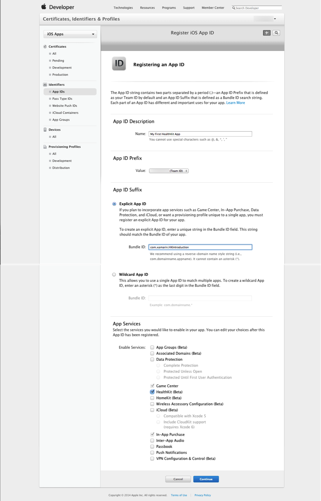](healthkit-images/image02.png#lightbox)

As shown in the image above, after creating an app description, use the **Explicit App ID** section to create an ID for your application. In the **App Services** section, check **Health Kit** in the **Enable Services** section.

When you are done, press the **Continue** button to register the **App ID** in your account. You will be brought back to the **Certificates, Identifiers, and Profiles** page. Click **Provisioning Profiles** to take you to the list of your current provisioning profiles, and click the **+** button in the upper-right corner to take you to the **Add iOS Provisioning Profile** page. Select the **iOS App Development** option and click **Continue** to get to the **Select App ID** page. Here, select the explicit **App ID** that you previously specified:

[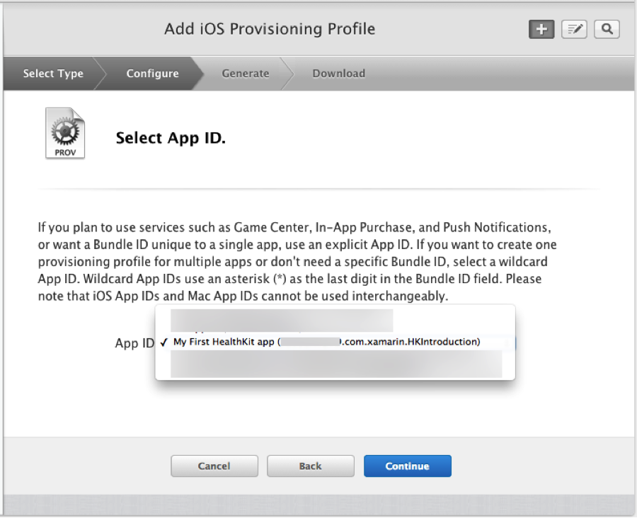](healthkit-images/image03.png#lightbox)

Click **Continue** and work through the remaining screens, where you will specify your **Developer Certificate(s)**, **Device(s)**, and a **Name** for this **Provisioning Profile**:

[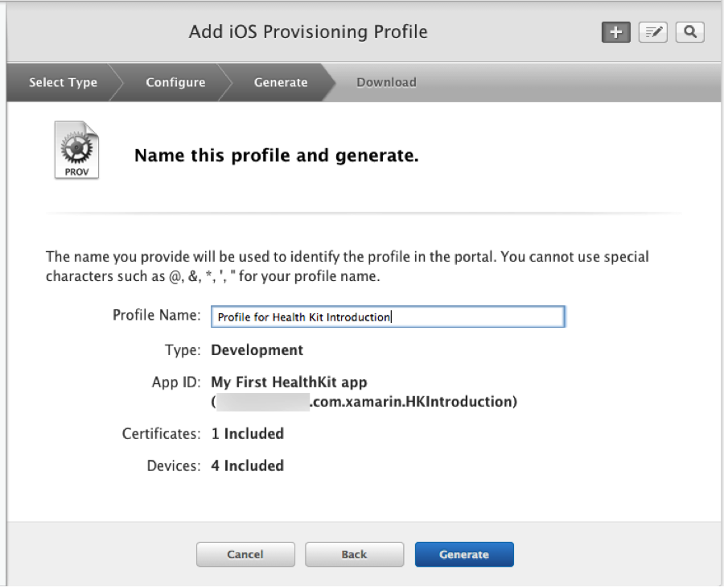](healthkit-images/image04.png#lightbox)

Click **Generate** and await the creation of your profile. Download the file and double-click it to install in Xcode. You can confirm it’s installation under **Xcode > Preferences > Accounts > View Details…** You should see your just-installed provisioning profile, and it should have the icon for Health Kit and any other special services in its **Entitlements** row:

[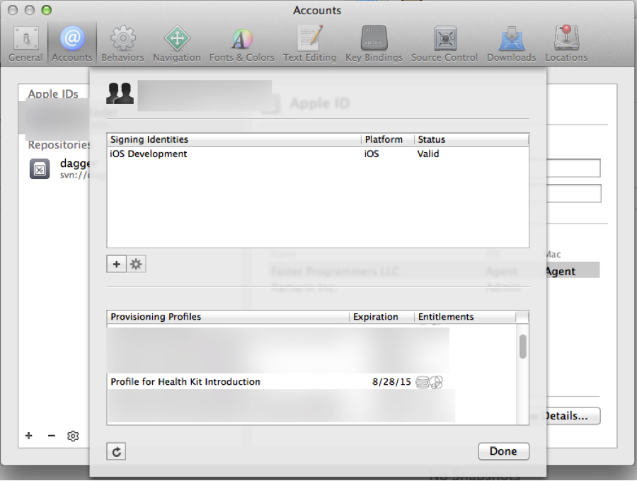](healthkit-images/image05.png#lightbox)

<a name="associating-appid"></a>

### Associating the App ID and Provisioning Profile With Your Xamarin.iOS App

Once you’ve created and installed an appropriate **Provisioning Profile** as described, it would normally be time to create a solution in Visual Studio for Mac or Visual Studio. Health Kit access is available to any iOS C# or F# project.

Rather than walk through the process of creating a Xamarin iOS 8 project by hand, open the sample app attached to this article (which includes a prebuilt Storyboard and code). To associate the sample app with your Health Kit enabled **Provisioning Profile**, in the **Solution Pad**, right-click on your Project and bring up its **Options** dialog. Switch to the **iOS Application** panel and enter the explicit **App ID** you created previously as the app’s **Bundle Identifier**:

[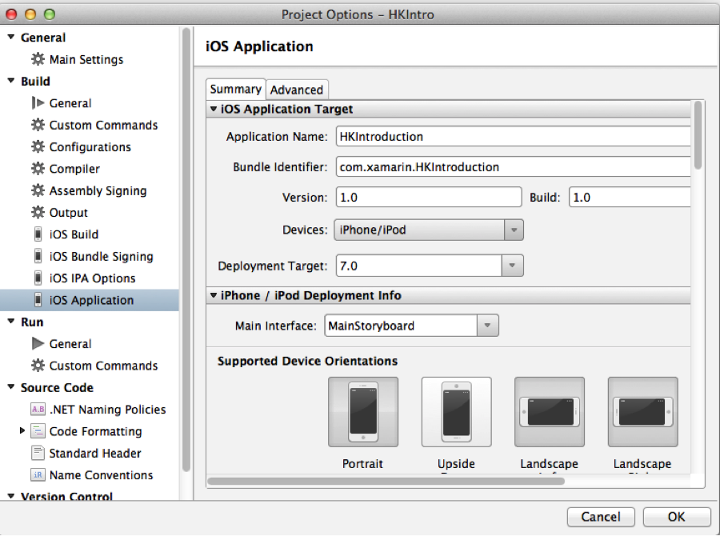](healthkit-images/image06.png#lightbox)

Now switch to the **iOS Bundle Signing** panel. Your recently-installed **Provisioning Profile**, with its association to the explicit **App ID**, will now be available as the **Provisioning Profile**:

[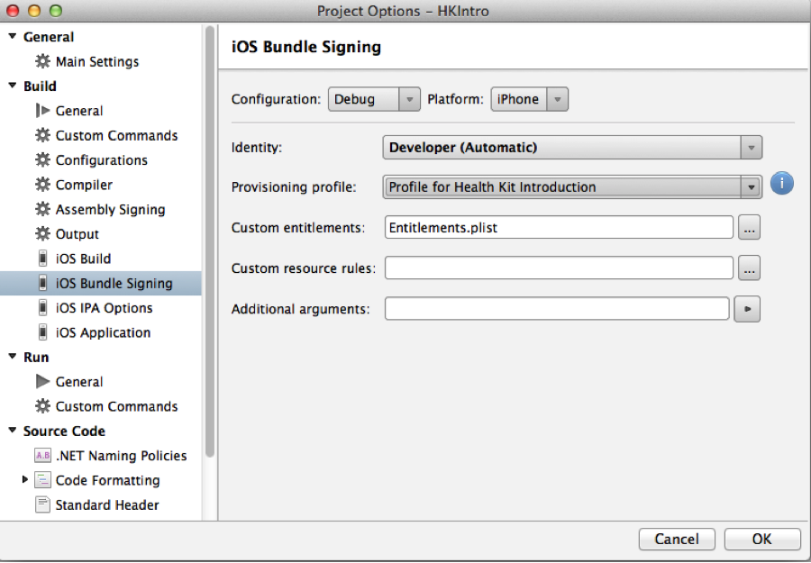](healthkit-images/image07.png#lightbox)

If the **Provisioning Profile** is not available, double-check the **Bundle Identifier** in the **iOS Application** panel versus that specified in the **iOS Dev Center** and that the **Provisioning Profile** is installed (**Xcode > Preferences > Accounts > View Details…**).

When the Health Kit-enabled **Provisioning Profile** is selected, click **OK** to close the Project Options dialog.

### Entitlements.plist and Info.plist Values

The sample app includes an `Entitlements.plist` file (which is necessary for Health Kit enabled apps), and not included in every Project Template. If your project does not include entitlements, right-click on your project, choose **File > New File… > iOS > Entitlements.plist** to add one manually.

Ultimately, your `Entitlements.plist` must have the following key and value pair:

```xml
<?xml version="1.0" encoding="UTF-8"?>
<!DOCTYPE plist PUBLIC "-//Apple//DTD PLIST 1.0//EN" "http://www.apple.com/DTDs/PropertyList-1.0.dtd">
<plist version="1.0">
<dict>
    <key>com.apple.developer.HealthKit</key>
    <true/>
</dict>
</plist>

```

Similarly, the `Info.plist` for the app must have a value of `healthkit` associated with the `UIRequiredDeviceCapabilities` key:

```xml
<key>UIRequiredDeviceCapabilities</key>
<array>
<string>armv7</string>
    <string>healthkit</string>
</array>

```

The sample application provided with this article includes a preconfigured `Entitlements.plist` that includes all of the required keys.

<a name="programming"></a>

## Programming Health Kit

The Health Kit datastore is a private, user-specific datastore that is shared among apps. Because health information is so sensitive, the user must take positive steps to allow data access. This access may be partial (write but not read, access for some types of data but not others, etc.) and may be revoked at any time. Health Kit applications should be written defensively, with the understanding that many users will be hesitant about storing their health-related information.

Health Kit data is limited to Apple specified types. These types are strictly defined: some, such as blood type, are limited to the particular values of an Apple supplied enumeration, while others combine a magnitude with a unit of measure (such as grams, calories, and liters). Even data that share a compatible unit of measure are distinguished by their `HKObjectType`; for instance, the type system will catch a mistaken attempt to store an `HKQuantityTypeIdentifier.NumberOfTimesFallen` value to a field expecting an `HKQuantityTypeIdentifier.FlightsClimbed` even though both use the `HKUnit.Count` unit of measure.

The types storable in the Health Kit datastore are all subclasses of `HKObjectType`. `HKCharacteristicType` objects store Biological Sex, Blood Type, and Date of Birth. More common though, are `HKSampleType` objects, which represent data that is sampled at a specific time or over a period of time. 

[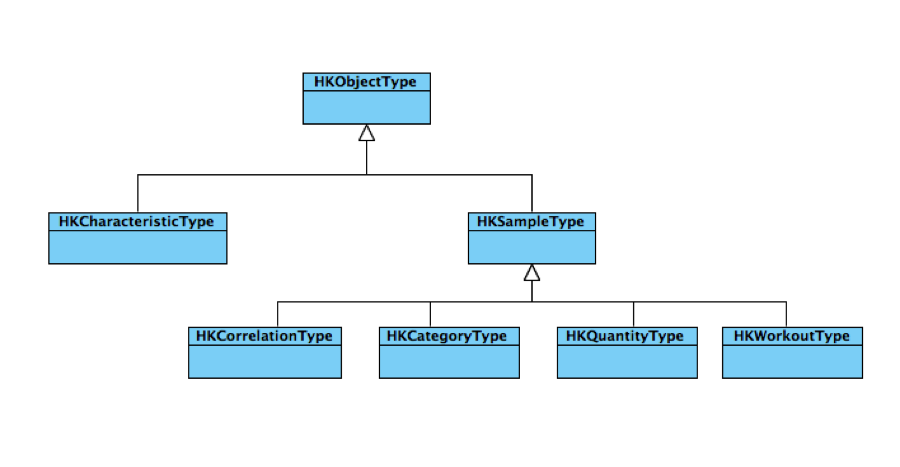](healthkit-images/image08.png#lightbox)

`HKSampleType` is abstract and has four concrete subclasses. There is currently only one type of `HKCategoryType` data, which is Sleep Analysis. The large majority of data in Health Kit are of type `HKQuantityType` and store their data in `HKQuantitySample` objects, which are created using the familiar Factory design pattern:

[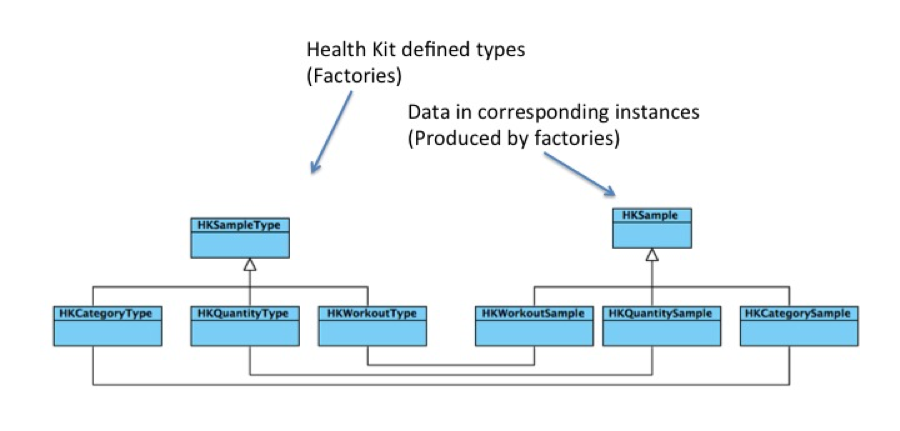](healthkit-images/image09.png#lightbox)

`HKQuantityType` types range from `HKQuantityTypeIdentifier.ActiveEnergyBurned` to `HKQuantityTypeIdentifier.StepCount`. 

<a name="requesting-permission"></a>

### Requesting Permission From the User

End users must take positive steps to allow an app to read or write Health Kit data. This is done via the Health app that comes pre-installed on iOS 8 devices. The first time a Health Kit app is run, the user is presented with a system-controlled **Health Access** dialog:

[](healthkit-images/image10.png#lightbox)

Later, the user can change permissions using Health app’s **Sources** dialog:

[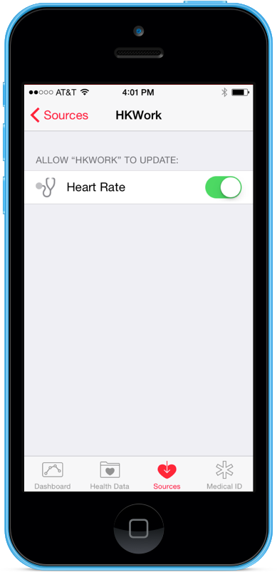](healthkit-images/image11.png#lightbox)

Since health information is extremely sensitive, app developers should write their programs defensively, with the expectation that permissions will be refused and changed while the app is running. The most common idiom is to request permissions in the `UIApplicationDelegate.OnActivated` method and then modify the user interface as appropriate.

### Permissions Walkthrough

In your Health Kit-provisioned project, open the `AppDelegate.cs` file. Notice the statement using `HealthKit`; at the top of the file.

The following code relates to Health Kit permissions:

```csharp
private HKHealthStore healthKitStore = new HKHealthStore ();

public override void OnActivated (UIApplication application)
{
        base.OnActivated(application);
        ValidateAuthorization ();
}

private void ValidateAuthorization ()
{
        var heartRateId = HKQuantityTypeIdentifierKey.HeartRate;
        var heartRateType = HKObjectType.GetQuantityType (heartRateId);
        var typesToWrite = new NSSet (new [] { heartRateType });
        var typesToRead = new NSSet ();
        healthKitStore.RequestAuthorizationToShare (
                typesToWrite, 
                typesToRead, 
                ReactToHealthCarePermissions);
}

void ReactToHealthCarePermissions (bool success, NSError error)
{
        var access = healthKitStore.GetAuthorizationStatus (HKObjectType.GetQuantityType (HKQuantityTypeIdentifierKey.HeartRate));
        if (access.HasFlag (HKAuthorizationStatus.SharingAuthorized)) {
                HeartRateModel.Instance.Enabled = true;
        } else {
                HeartRateModel.Instance.Enabled = false;
        }
}

```

All of the code in these methods could be done inline in `OnActivated`, but the sample app uses separate methods to make their intent clearer: `ValidateAuthorization()` has the steps necessary to request access to the specific types being written (and read, if the app desired) and `ReactToHealthCarePermissions()` is a callback that is activated after the user has interacted with the permissions dialog in the Health.app.

The job of `ValidateAuthorization()` is to build the set of `HKObjectTypes` that the app will write and request authorization to update that data. In the sample app, the `HKObjectType` is for the key `KHQuantityTypeIdentifierKey.HeartRate`. This type is added to the set `typesToWrite`, while the set `typesToRead` is left empty. These sets, and a reference to the `ReactToHealthCarePermissions()` callback, is passed to `HKHealthStore.RequestAuthorizationToShare()`.

The `ReactToHealthCarePermissions()` callback will be called after the user has interacted with the permissions dialog and is passed two pieces of information: a `bool` value that will be `true` if the user has interacted with the permissions dialog and an `NSError` which, if non-null, indicates some kind of error associated with presenting the permissions dialog.

> [!IMPORTANT]
> To be clear about the arguments to this function: the _success_ and _error_ parameters do not indicate whether the user has granted permission to access Health Kit data! They only indicate that the user has been given the opportunity to permit access to the data.

To confirm whether the app has access to the data, the `HKHealthStore.GetAuthorizationStatus()` is used, passing in `HKQuantityTypeIdentifierKey.HeartRate`. Based on the status returned, the app enables or disables the ability to enter data. There is no standard user experience for dealing with a denial of access and there are many possible options. In the example app, the status is set on a `HeartRateModel` singleton object that, in turn, raises relevant events.

## Model, View, and Controller

To review the `HeartRateModel` singleton object, open the `HeartRateModel.cs` file:

```csharp
using System;
using HealthKit;
using Foundation;

namespace HKWork
{
        public class GenericEventArgs<T> : EventArgs
        {
                public T Value { get; protected set; }
                public DateTime Time { get; protected set; }

                public GenericEventArgs (T value)
                {
                        this.Value = value;
                        Time = DateTime.Now;
                }
        }

        public delegate void GenericEventHandler<T> (object sender,GenericEventArgs<T> args);

        public sealed class HeartRateModel : NSObject
        {
                private static volatile HeartRateModel singleton;
                private static object syncRoot = new Object ();

                private HeartRateModel ()
                {
                }

                public static HeartRateModel Instance {
                        get {
                                //Double-check lazy initialization
                                if (singleton == null) {
                                        lock (syncRoot) {
                                                if (singleton == null) {
                                                        singleton = new HeartRateModel ();
                                                }
                                        }
                                }

                                return singleton;
                        }
                }

                private bool enabled = false;

                public event GenericEventHandler<bool> EnabledChanged;
                public event GenericEventHandler<String> ErrorMessageChanged;
                public event GenericEventHandler<Double> HeartRateStored;

                public bool Enabled { 
                        get { return enabled; }
                        set {
                                if (enabled != value) {
                                        enabled = value;
                                        InvokeOnMainThread(() => EnabledChanged (this, new GenericEventArgs<bool>(value)));
                                }
                        }
                }

                public void PermissionsError(string msg)
                {
                        Enabled = false;
                        InvokeOnMainThread(() => ErrorMessageChanged (this, new GenericEventArgs<string>(msg)));
                }

                //Converts its argument into a strongly-typed quantity representing the value in beats-per-minute
                public HKQuantity HeartRateInBeatsPerMinute(ushort beatsPerMinute)
                {
                        var heartRateUnitType = HKUnit.Count.UnitDividedBy (HKUnit.Minute);
                        var quantity = HKQuantity.FromQuantity (heartRateUnitType, beatsPerMinute);

                        return quantity;
                }
                        
                public void StoreHeartRate(HKQuantity quantity)
                {
                        var bpm = HKUnit.Count.UnitDividedBy (HKUnit.Minute);
                        //Confirm that the value passed in is of a valid type (can be converted to beats-per-minute)
                        if (! quantity.IsCompatible(bpm))
                        {
                                InvokeOnMainThread(() => ErrorMessageChanged(this, new GenericEventArgs<string> ("Units must be compatible with BPM")));
                        }

                        var heartRateId = HKQuantityTypeIdentifierKey.HeartRate;
                        var heartRateQuantityType = HKQuantityType.GetQuantityType (heartRateId);
                        var heartRateSample = HKQuantitySample.FromType (heartRateQuantityType, quantity, new NSDate (), new NSDate (), new HKMetadata());

                        using (var healthKitStore = new HKHealthStore ()) {
                                healthKitStore.SaveObject (heartRateSample, (success, error) => {
                                        InvokeOnMainThread (() => {
                                                if (success) {
                                                        HeartRateStored(this, new GenericEventArgs<Double>(quantity.GetDoubleValue(bpm)));
                                                } else {
                                                        ErrorMessageChanged(this, new GenericEventArgs<string>("Save failed"));
                                                }
                                                if (error != null) {
                                                        //If there's some kind of error, disable 
                                                        Enabled = false;
                                                        ErrorMessageChanged (this, new GenericEventArgs<string>(error.ToString()));
                                                }
                                        });
                                });
                        }
                }
        }
}

```

The first section is boilerplate code for creating generic events and handlers. The initial portion of the `HeartRateModel` class is also boilerplate for creating a thread-safe singleton object.

Then, `HeartRateModel` exposes 3 events: 

- `EnabledChanged` - Indicates that heart rate storage has been enabled or disabled (note that storage is initially disabled). 
- `ErrorMessageChanged` - For this sample app, we have a very simple error-handling model: a string with the last error . 
- `HeartRateStored` - Raised when a heart rate is stored in the Health Kit database.

Note that the whenever these events are fired, it is done via `NSObject.InvokeOnMainThread()`, which allows subscribers to update the UI. Alternatively, the events could be documented as being raised on background threads and the responsibility of ensuring compatibility could be left to their handlers. Thread considerations are important in Health Kit applications because many of the functions, such as the permission request, are asynchronous and execute their callbacks on non-main threads.

The Heath Kit specific code in `HeartRateModel` is in the two functions `HeartRateInBeatsPerMinute()` and `StoreHeartRate()`. 

`HeartRateInBeatsPerMinute()` converts its argument into a strongly-typed Health Kit `HKQuantity`. The type of the quantity is that specified by the `HKQuantityTypeIdentifierKey.HeartRate` and the units of the quantity are `HKUnit.Count` divided by `HKUnit.Minute` (in other words, the unit is *beats per minute*). 

The `StoreHeartRate()` function takes an `HKQuantity` (in the sample app, one created by `HeartRateInBeatsPerMinute()` ). To validate its data, it uses the `HKQuantity.IsCompatible()` method, which returns `true` if the object’s units can be converted into the units in the argument. If the quantity was created with `HeartRateInBeatsPerMinute()` this will obviously return `true`, but it would also return `true` if the quantity were created as, for instance, *Beats Per Hour*. More commonly, `HKQuantity.IsCompatible()` can be used to validate mass, distance, and energy which the user or a device might input or display in one system of measurement (such as Imperial units) but which might be stored in another system (such as metric units). 

Once the compatibility of the quantity has been validated, the `HKQuantitySample.FromType()` factory method is used to create a strongly-typed `heartRateSample` object. `HKSample` objects have a start and end date; for instantaneous readings, these values should be the same, as they are in the example. The sample also does not set any key-value data in its `HKMetadata` argument, but one could use code such as the following code to specify sensor location:

```csharp
var hkm = new HKMetadata();
hkm.HeartRateSensorLocation = HKHeartRateSensorLocation.Chest;

```

Once the `heartRateSample` has been created, the code creates a new connection to the database with the using block. Within that block, the `HKHealthStore.SaveObject()` method attempts the asynchronous write to the database. The resulting call to the lambda expression triggers relevant events, either `HeartRateStored` or `ErrorMessageChanged`.

Now that the model has been programmed, it’s time to see how the controller reflects the state of the model. Open up the `HKWorkViewController.cs` file. The constructor simply wires up the `HeartRateModel` singleton to event-handling methods (again, this could be done inline with lambda expressions, but separate methods make the intent a little more obvious):

```csharp
public HKWorkViewController (IntPtr handle) : base (handle)
{
     HeartRateModel.Instance.EnabledChanged += OnEnabledChanged;
     HeartRateModel.Instance.ErrorMessageChanged += OnErrorMessageChanged;
     HeartRateModel.Instance.HeartRateStored += OnHeartBeatStored;
}

```

Here are the relevant handlers:

```csharp
void OnEnabledChanged (object sender, GenericEventArgs<bool> args)
{
        StoreData.Enabled = args.Value;
        PermissionsLabel.Text = args.Value ? "Ready to record" : "Not authorized to store data.";
        PermissionsLabel.SizeToFit ();
}

void OnErrorMessageChanged (object sender, GenericEventArgs<string> args)
{
        PermissionsLabel.Text = args.Value;
}

void OnHeartBeatStored (object sender, GenericEventArgs<double> args)
{
        PermissionsLabel.Text = String.Format ("Stored {0} BPM", args.Value);
}

```

Obviously, in an application with a single controller, it would be possible to avoid the creation of a separate model object and the use of events for control flow, but the use of model objects is more appropriate for real-world apps.

## Running The Sample App

The iOS Simulator does not support Health Kit. Debugging must be done on a physical device running iOS 8.

Attach a properly-provisioned iOS 8 development device to your system. Select it as the deployment target in Visual Studio for Mac and from the menu choose **Run > Debug**.

> [!IMPORTANT]
> Mistakes relating to provisioning will surface at this point. To troubleshoot errors, review the Creating and Provisioning a Health Kit App section above. The components are: 
>
> - **iOS Dev Center** - Explicit App ID & Health Kit enabled Provisioning Profile. 
> - **Project Options** - Bundle Identifier (explicit App ID) & Provisioning Profile.
> - **Source code** - Entitlements.plist & Info.plist

Assuming that provisions have been properly set, your application will start. When it reaches its `OnActivated` method, it will request Health Kit authorization. The first time this is encountered by the operating system, your user will be presented with the following dialog:

[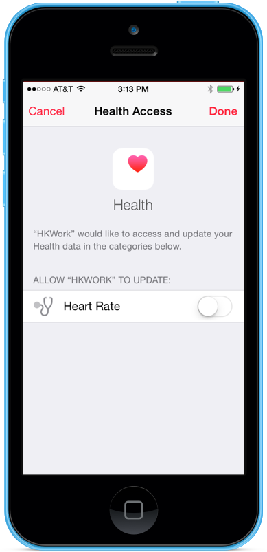](healthkit-images/image12.png#lightbox)

Enable your app to update Heart Rate data and your app will reappear. The `ReactToHealthCarePermissions` callback will be activated asynchronously. This will cause the `HeartRateModel’s` `Enabled` property to change, which will raise the `EnabledChanged` event, which will cause the `HKPermissionsViewController.OnEnabledChanged()` event handler to run, which enables the `StoreData` button. The following diagram shows the sequence:

[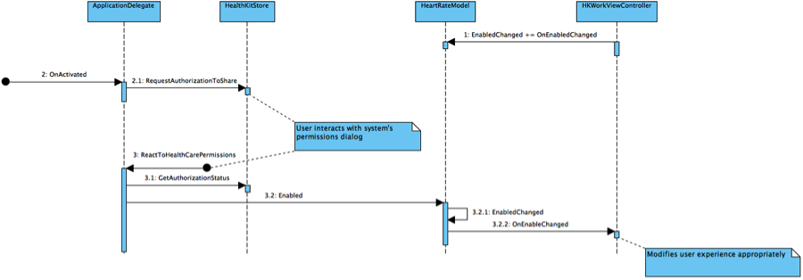](healthkit-images/image13.png#lightbox)

Press the **Record** button. This will cause the `StoreData_TouchUpInside()` handler to run, which will attempt to parse the value of the `heartRate` text field, convert into a `HKQuantity` via the previously discussed `HeartRateModel.HeartRateInBeatsPerMinute()` function and pass that quantity to `HeartRateModel.StoreHeartRate()`. As discussed previously, this will attempt to store the data and will raise either a `HeartRateStored` or `ErrorMessageChanged` event.

Double-click the **Home** button on your device and open Health app. Click the **Sources** tab and you will see the sample app listed. Choose it and disallow permission to update heart rate data. Double-click the **Home** button and switch back to your app. Once again, `ReactToHealthCarePermissions()` will be called, but this time, because access is denied, the **StoreData** button will become disabled (note that this occurs asynchronously and the change in the user interface may be visible to the end user).

## Advanced Topics

Reading data from the Health Kit database is very similar to writing data: one specifies the types of data one is trying to access, requests authorization, and if that authorization is granted, the data are available, with automatic conversion to compatible units of measure.

There are a number of more sophisticated query functions which allow predicate-based queries and queries that perform updates when relevant data is updated. 

Developers of Health Kit applications should review the Health Kit section of Apple’s [App Review Guidelines](https://developer.apple.com/app-store/review/guidelines/#healthkit).

Once the security and type-system models are understood, storing and reading data in the shared Health Kit database is quite straightforward. Many of the functions within Health Kit operate asynchronously and application developers must write their programs appropriately.

As of the writing of this article, there is currently no equivalent to Health Kit in Android or Windows Phone.

## Summary

In this article we've seen how Health Kit allows applications to store, retrieve, and share health related information, while also providing a standard Health app that allows the user access and control over this data. 

We have also seen how privacy, security, and data integrity are overriding concerns for health-related information and apps using Health Kit must deal with the increase in complexity in application management aspects (provisioning), coding (Health Kit’s type system), and user experience (user control of permissions via system dialogs and Health app). 

Finally, we've taking a look at a simple implementation of Health Kit using the included sample app that writes heartbeat data to the Health Kit store and has an asynchronous-aware design.

## Related Links

- [HKWork (sample)](/samples/xamarin/ios-samples/ios8-introtohealthkit)
- [Introduction to iOS 8](~/ios/platform/introduction-to-ios8.md)
