# HomeKit in Xamarin.iOS

_HomeKit is Apple's framework for controlling home automation devices. This article introduces HomeKit and covers configuring test accessories in the HomeKit Accessory Simulator and writing a simple Xamarin.iOS app to interact with these accessories._

[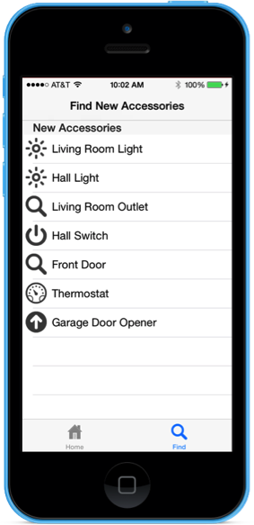](homekit-images/accessory01.png#lightbox)

Apple introduced HomeKit in iOS 8 as a way to seamlessly integrate multiple home automation devices from a variety vendors into a single, coherent unit. By promoting a common protocol for discovering, configuring and controlling home automation devices, HomeKit allows devices from non-related vendors to work together, all without the individual vendors having to coordinate efforts.

With HomeKit, you can create a Xamarin.iOS app that controls any HomeKit enabled device without using vendor supplied APIs or apps. Using HomeKit, you can do the following:

- Discover new HomeKit enabled home automation devices and add them to a database that will persist across all of the user's iOS devices.
- Setup, configure, display and control any device in the HomeKit _Home Configuration Database_.
- Communicate with any pre-configured HomeKit device and command them to perform individual actions or work in concert, such as turning on all of the lights in the kitchen.

In addition to serving devices in the Home Configuration Database to HomeKit enabled apps, HomeKit provides access to Siri voice commands. Given an appropriately configured HomeKit setup, the user can issue voice commands such as "Siri, turn on the lights in the living room."

<a name="Home-Configuration-Database"></a>

## The Home Configuration Database

HomeKit organizes all automation devices in a given location into a Home Collection. This collection provides a way for the user to group their home automation devices into logically arranged units with meaningful, human-readable labels.

The Home Collection is stored in a Home Configuration Database that will automatically be backed-up and synced across all of the user's iOS devices. HomeKit provides the following classes for working with the Home Configuration Database:

- `HMHome` - This is the top-level container that holds all information and configurations for all home automation devices in a single physical location (eg. a single family residence). The user might have more than one residence, such as their main home and a vacation house. Or they might have different "houses" on the same property, such as the main house and a guest house over the garage. Either way, at least one `HMHome` object _must_ be setup and stored before any other HomeKit info can be entered.
- `HMRoom` - While optional, a `HMRoom` allows the user to define specific rooms inside of a home (`HMHome`) such as: Kitchen, Bathroom, Garage or Living Room. The user can group all of the home automation devices in a specific location in their house into a `HMRoom` and act upon them as a unit. For example, asking Siri to turn off the garage lights.
- `HMAccessory` - This represents an individual, physical HomeKit enabled automation device that has been installed in the user's residence (such as a smart thermostat). Each `HMAccessory` is assigned to a `HMRoom`. If the user hasn't configured any rooms, HomeKit assigns accessories to a special default room.
- `HMService` - Represents a service provided by a given `HMAccessory`, such as the on/off state of a light or its color (if color changing is supported). Each `HMAccessory` can have more than one service, such as a garage door opener that also includes a light. Additionally, an given `HMAccessory` might have services, such as firmware update, that are outside of user control.
- `HMZone` - Allows the user to group a collection of `HMRoom` objects into logical zones, such as Upstairs, Downstairs or Basement. While optional, this allows for interactions like asking Siri to turn all of the light downstairs off.

<a name="Provisioning-a-HomeKit-App"></a>

## Provisioning a HomeKit App

Because of the security requirements imposed by HomeKit, a Xamarin.iOS app that uses the HomeKit framework must be properly configured in both the Apple Developer Portal and in the Xamarin.iOS project file.

Do the following:

1. Log into the [Apple Developer Portal](https://developer.apple.com).
2. Click on **Certificates, Identifiers & Profiles**.
3. If you haven't already done so, click on **Identifiers** and create an ID for your app (e.g. `com.company.appname`), else edit your existing ID.
4. Ensure that the **HomeKit** service has been checked for the given ID: 

    [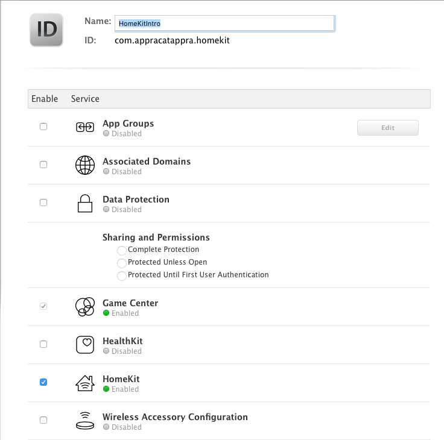](homekit-images/provision01.png#lightbox)
5. Save your changes.
6. Click on **Provisioning Profiles** > **Development** and create a new development provisioning profile for your app: 

    [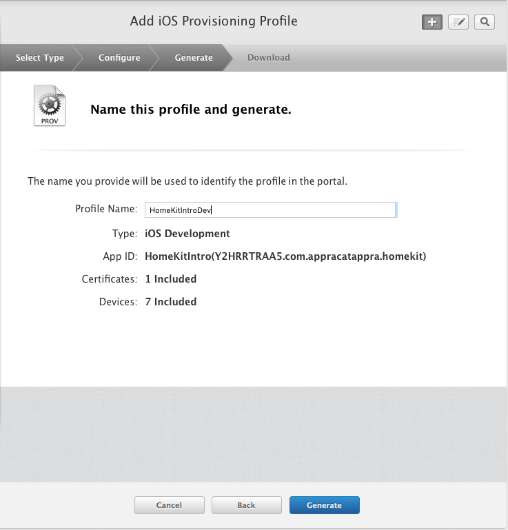](homekit-images/provision02.png#lightbox)
7. Either download and install the new provisioning profile or use Xcode to download and install the profile.
8. Edit your Xamarin.iOS project options and ensure that you are using the provisioning profile that you just created: 

    [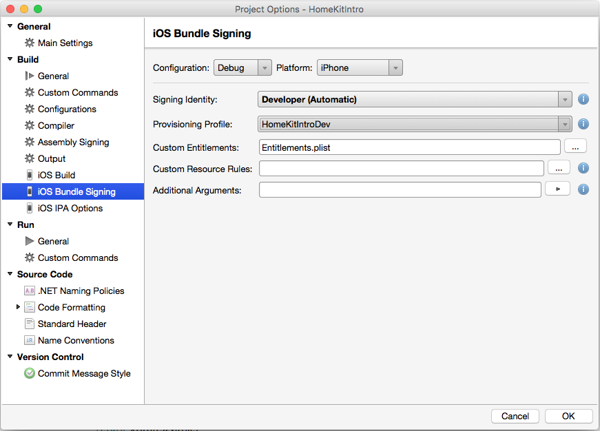](homekit-images/provision03.png#lightbox)
9. Next, edit your **Info.plist** file and ensure that you are using the App ID that was used to create the provisioning profile: 

    [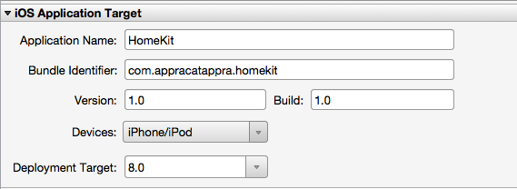](homekit-images/provision04.png#lightbox)
10. Finally, edit your **Entitlements.plist** file and ensure that the **HomeKit** entitlement has been selected: 

    [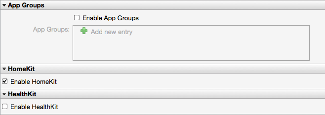](homekit-images/provision05.png#lightbox)
11. Save the changes to all files.

With these settings in place, the application is now ready to access the HomeKit Framework APIs. For detailed information on provisioning, please see our [Device Provisioning](~/ios/get-started/installation/device-provisioning/index.md) and [Provisioning Your App](~/ios/get-started/installation/device-provisioning/index.md) guides.

> [!IMPORTANT]
> Testing a HomeKit enabled app requires a real iOS device that has been properly provisioned for development. HomeKit cannot be tested from the iOS Simulator.

## The HomeKit Accessory Simulator

To provide a way to test all of the possible home automation devices and services, without having to have a physical device, Apple created the _HomeKit Accessory Simulator_. Using this simulator, you can setup and configure virtual HomeKit devices.

### Installing the Simulator

Apple provides the HomeKit Accessory Simulator as a separate download from Xcode, so you will need to install it before continuing.

Do the following:

1. In a web browser, visit [Downloads for Apple Developers](https://developer.apple.com/download/more/?name=for%20Xcode)
2. Download the **Additional Tools for Xcode xxx** (where xxx is the version of Xcode that you have installed): 

    [](homekit-images/simulator01.png#lightbox)
3. Open the disk image and install the tools in your **Applications** directory.

With the HomeKit Accessory Simulator installed, virtual accessories can be created for testing.

### Creating Virtual Accessories

To start the HomeKit Accessory Simulator and create a few virtual accessories, do the following:

1. From the Applications folder, start the HomeKit Accessory Simulator: 

    [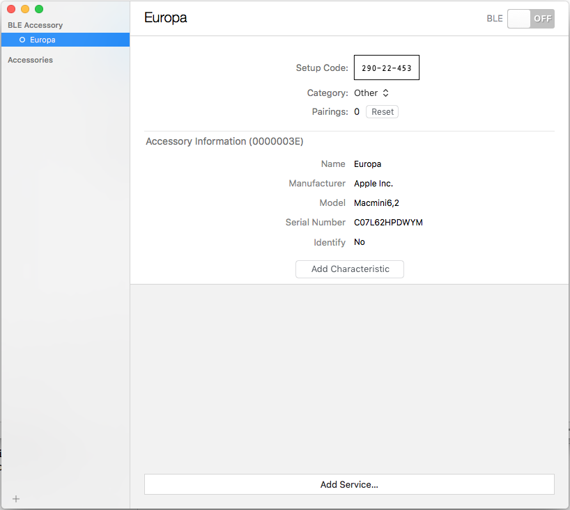](homekit-images/simulator02.png#lightbox)
2. Click the **+** button and select **New Accessory...**: 

    [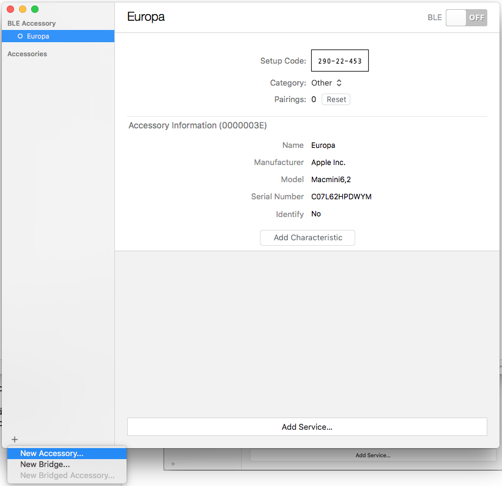](homekit-images/simulator03.png#lightbox)
3. Fill out the information about the new accessory and click the **Finish** button: 

    [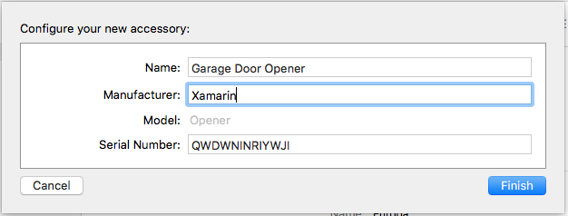](homekit-images/simulator04.png#lightbox)
4. Click the **Add Service..** button, and select a service type from the dropdown: 

    [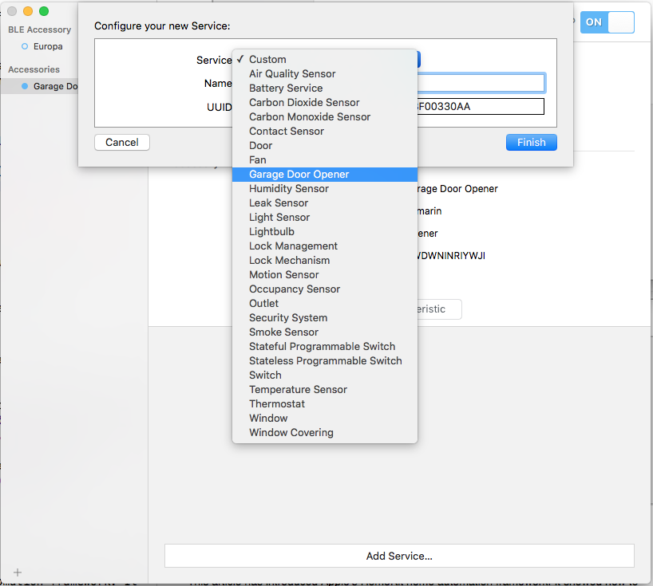](homekit-images/simulator05.png#lightbox)
5. Provide a **Name** for the service and click the **Finish** button: 

    [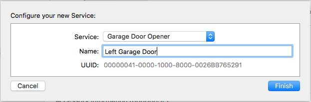](homekit-images/simulator06.png#lightbox)
6. You can provide optional characteristics for a service by clicking the **Add Characteristic** button and configuring the required settings: 

    [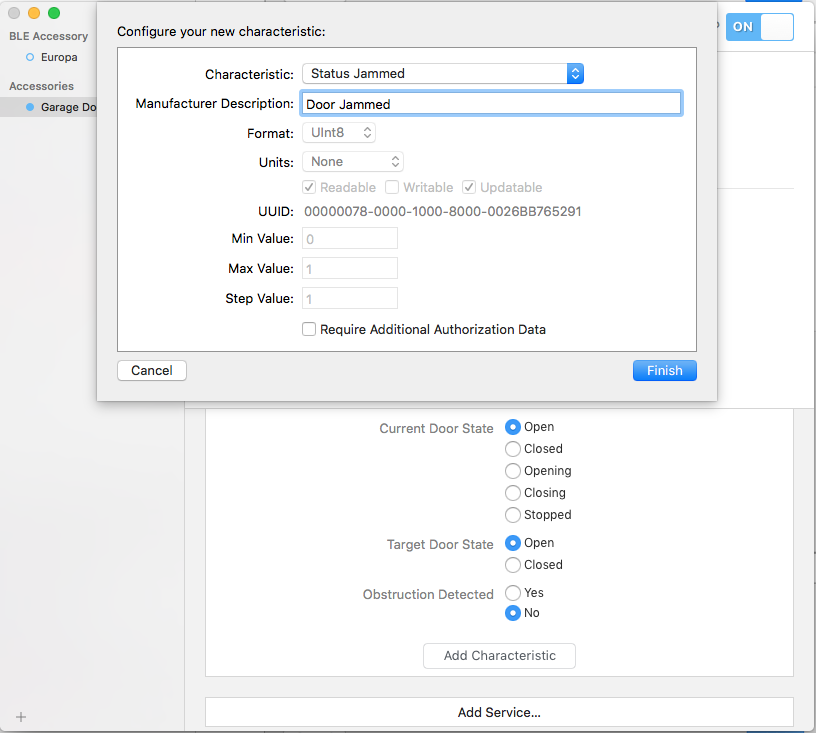](homekit-images/simulator07.png#lightbox)
7. Repeat the steps above to create one of each type of virtual home automation device that HomeKit supports.

With some sample virtual HomeKit accessories created and configured, you can now consume and control these devices from your Xamarin.iOS app.

## Configuring the Info.plist File

New for iOS 10 (and greater), the developer will need to add the `NSHomeKitUsageDescription` key to the app's `Info.plist` file and provide a string declaring why the app wants to access the user's HomeKit database. This string will be presented to the user the first time they run the app:

[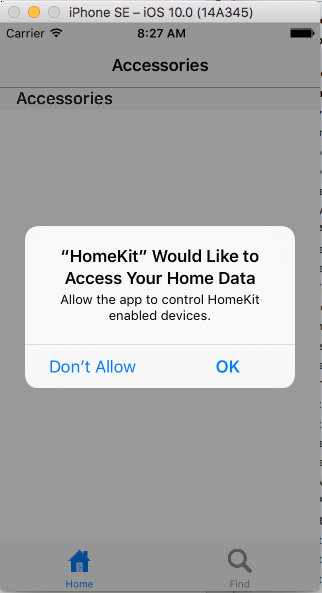](homekit-images/info01.png#lightbox)

To set this key, do the following:

1. Double-click the `Info.plist` file in the **Solution Explorer** to open it for editing.
2. At the bottom of the screen, switch to the **Source** view.
3. Add a new **Entry** to the list.
4. From the dropdown list, select **Privacy - HomeKit Usage Description**: 

    [](homekit-images/info02.png#lightbox)
5. Enter a description for why the app wants to access the user's HomeKit database: 

    [](homekit-images/info03.png#lightbox)
6. Save the changes to the file.

> [!IMPORTANT]
> Failure to set the `NSHomeKitUsageDescription` key in the `Info.plist` file will result in the app _silently failing_ (being closed by the system at runtime) without error when run in iOS 10 (or greater).

## Connecting to HomeKit

To communicate with HomeKit, your Xamarin.iOS app needs to first instantiate an instance of the `HMHomeManager` class. The Home Manager is the central entry point into HomeKit and is responsible for providing a list of available homes, updating and maintaining that list and returning the user’s _Primary Home_.

The `HMHome` object contains all information about a give home including any rooms, groups or zones that it may contain, along with any home automation accessories that have been installed. Before any operations can be performed in HomeKit, at least one `HMHome` must be created and assigned as the Primary Home.

Your app is responsible for checking if a Primary Home exists and creating and assigning one if it does not.

### Adding a Home Manager

To add HomeKit awareness to a Xamarin.iOS app, edit the **AppDelegate.cs** file to edit it and make it look like the following:

```csharp
using HomeKit;
...

public HMHomeManager HomeManager { get; set; }
...

public override void FinishedLaunching (UIApplication application)
{
    // Attach to the Home Manager
    HomeManager = new HMHomeManager ();
    Console.WriteLine ("{0} Home(s) defined in the Home Manager", HomeManager.Homes.Count());

    // Wire-up Home Manager Events
    HomeManager.DidAddHome += (sender, e) => {
        Console.WriteLine("Manager Added Home: {0}",e.Home);
    };

    HomeManager.DidRemoveHome += (sender, e) => {
        Console.WriteLine("Manager Removed Home: {0}",e.Home);
    };
    HomeManager.DidUpdateHomes += (sender, e) => {
        Console.WriteLine("Manager Updated Homes");
    };
    HomeManager.DidUpdatePrimaryHome += (sender, e) => {
        Console.WriteLine("Manager Updated Primary Home");
    };
}
```

When the application is first run, the user will be asked if they want to allow it to access their HomeKit information:

[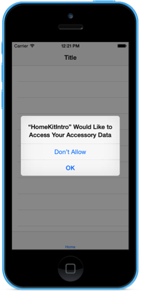](homekit-images/home01.png#lightbox)

If the user answers **OK**, then the application will be able to work with their HomeKit Accessories otherwise it will not and any calls to HomeKit will fail with an error.

With the Home Manager in place, next the application will need to see if a Primary Home has been configured, and if not, provide a way for the user to create and assign one.

### Accessing the Primary Home

As stated above, a Primary Home must be created and configured before  HomeKit is available and it is the app's responsibility to provide a way for the user to create and assign a Primary Home if one does not already exist.

When your app first starts or returns from the background, it needs to monitor the `DidUpdateHomes` event of the `HMHomeManager` class to check for the existence of a Primary Home. If one does not exist, it should provide an interface for the user to create one.

The following code can be added to a view controller to check for the Primary Home:

```csharp
using HomeKit;
...

public AppDelegate ThisApp {
    get { return (AppDelegate)UIApplication.SharedApplication.Delegate; }
}
...

// Wireup events
ThisApp.HomeManager.DidUpdateHomes += (sender, e) => {

    // Was a primary home found?
    if (ThisApp.HomeManager.PrimaryHome == null) {
        // Ask user to add a home
        PerformSegue("AddHomeSegue",this);
    }
};
```

When the Home Manager makes a connection to HomeKit, the `DidUpdateHomes` event will be fired, any existing homes will be loaded to the manager’s collection of homes and the Primary Home will be loaded, if available.

### Adding a Primary Home

If the `PrimaryHome` property of the `HMHomeManager` is `null` after a `DidUpdateHomes` event, you need to provide a way for the user to create and assign a Primary Home before continuing.

Typically the app will present a form for the user to name a new home which then gets passed to the Home Manager to setup as the Primary Home. For the **HomeKitIntro** sample app, a modal view was created in Xcode Interface Builder and called by the `AddHomeSegue` segue from the main interface of the app.

It provides a text field for the user to enter a name for the new home and a button to add the home. When the user taps the **Add Home** button, the following code calls the Home Manager to add the home:

```csharp
// Add new home to HomeKit
ThisApp.HomeManager.AddHome(HomeName.Text,(home,error) =>{
    // Did an error occur
    if (error!=null) {
        // Yes, inform user
        AlertView.PresentOKAlert("Add Home Error",string.Format("Error adding {0}: {1}",HomeName.Text,error.LocalizedDescription),this);
        return;
    }

    // Make the primary house
    ThisApp.HomeManager.UpdatePrimaryHome(home,(err) => {
        // Error?
        if (err!=null) {
            // Inform user of error
            AlertView.PresentOKAlert("Add Home Error",string.Format("Unable to make this the primary home: {0}",err.LocalizedDescription),this);
            return ;
        }
    });

    // Close the window when the home is created
    DismissViewController(true,null);
});
```

The `AddHome` method will attempt to create new home and return it to the given callback routine. If the `error` property is not `null`, an error has occurred and it should be presented to the user. The most common errors are caused by either a non-unique home name or the Home Manager not being able to communicate with HomeKit.

If the home was created successfully, you need to call the `UpdatePrimaryHome` method to set the new home as the Primary Home. Again, if the `error` property is not `null`, an error has occurred and it should be presented to the user.

You should also monitor the Home Manager’s `DidAddHome` and `DidRemoveHome` events and update the app's user interface as required.

> [!IMPORTANT]
> The `AlertView.PresentOKAlert` method used in the sample code above is a helper class in the HomeKitIntro application that makes working with the iOS Alerts easier.

## Finding New Accessories

Once a Primary Home has been defined or loaded from the Home Manager, your Xamarin.iOS app can call the `HMAccessoryBrowser` to find any new home automation accessories and add them to a home.

Call the `StartSearchingForNewAccessories` method to start looking for new accessories and the `StopSearchingForNewAccessories` method when finished.

> [!IMPORTANT]
> `StartSearchingForNewAccessories` should not be left running for long periods of time because it will negatively affect both battery life and performance of the iOS device. Apple suggests calling `StopSearchingForNewAccessories` after a minute or only searching when the Find Accessory UI is presented to the user.

The `DidFindNewAccessory` event will be called when new accessories are discovered and they will be added to the `DiscoveredAccessories` list in the Accessory Browser.

The `DiscoveredAccessories` list will contain a collection of `HMAccessory` objects that define a give HomeKit enabled home automation device and its available services, such as lights or garage door control.

Once the new accessory has been found, it should be presented to the user and so they can select it and add it to a home. Example:

[](homekit-images/accessory01.png#lightbox)

Call the `AddAccessory` method to add the selected accessory to the home's collection. For example:

```csharp
// Add the requested accessory to the home
ThisApp.HomeManager.PrimaryHome.AddAccessory (_controller.AccessoryBrowser.DiscoveredAccessories [indexPath.Row], (err) => {
    // Did an error occur
    if (err !=null) {
        // Inform user of error
        AlertView.PresentOKAlert("Add Accessory Error",err.LocalizedDescription,_controller);
    }
});
```

If the `err` property is not `null`, an error has occurred and it should be presented to the user. Otherwise, the user will be asked to enter the setup code for the device to add:

[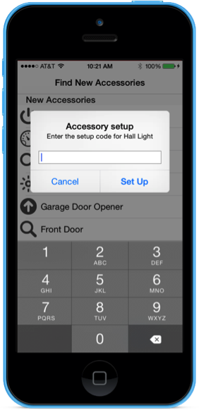](homekit-images/accessory02.png#lightbox)

In the HomeKit Accessory Simulator this number can be found under the **Setup Code** field:

[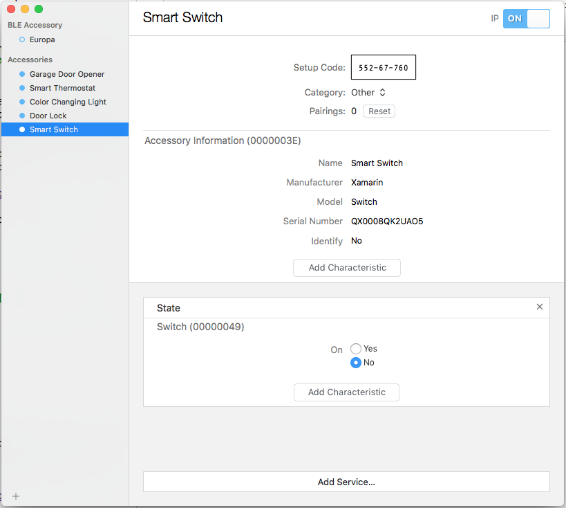](homekit-images/accessory03.png#lightbox)

For real HomeKit accessories, the setup code will either be printed on a label on the device itself, on the product box or in the accessory’s user manual.

You should monitor the Accessory Browser’s `DidRemoveNewAccessory` event and update the user interface to remove an accessory from the available list once the user has added it to their Home Collection.

## Working with Accessories

Once a Primary Home and been established and accessories have been added to it, you can present a list of accessories (and optionally rooms) for the user to work with.

The `HMRoom` object contains all information about a given room and any accessories that belong to it. Rooms can optionally be organized into one or more zones. A `HMZone` contains all information about a given zone and all of the rooms that belong to it.

For the sake of this example, we'll be keeping things simple and work with a home's accessories directly, instead of organizing them into rooms or zones.

The `HMHome` object contains a list of assigned accessory that can be presented to the user in its `Accessories` property. For example:

[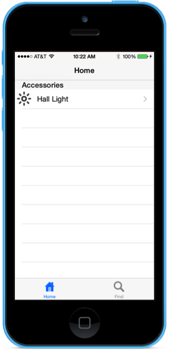](homekit-images/accessory04.png#lightbox)

Form here, the user can select a given accessory and work with the services that it provides.

## Working with Services

When the user interacts with a given HomeKit enabled home automation device, it's usually through the services that it provides. The `Services` property of the `HMAccessory` class contains a collection of `HMService` objects that define the services a device offers.

Services are things like lights, thermostats, garage door openers, switches, or locks. Some devices (like a garage door opener) will provide more than one service, such as a light and the ability to open or close a door.

In addition to the specific services that a given accessory provides, each accessory contains an `Information Service` that defines properties such as its Name, Manufacturer, Model and Serial Number.

### Accessory Service Types

The following Service Types are available via the `HMServiceType` enum:

- **AccessoryInformation** - Provides information about the given home automation device (accessory).
- **AirQualitySensor** - Defines an air quality sensor.
- **Battery** - Defines the state of an accessory's battery.
- **CarbonDioxideSensor** - Defines a carbon Dioxide Sensor.
- **CarbonMonoxideSensor** - Defines a Carbon Monoxide Sensor.
- **ContactSensor** - Defines a contact sensor (such as a window being opened or closed).
- **Door** - Defines a door state sensor (such as opened or closed).
- **Fan** - Defines a remote controlled fan.
- **GarageDoorOpener** - Defines a garage door opener.
- **HumiditySensor** - Defines a humidity sensor.
- **LeakSensor** - Defines a leak sensor (like for a hot water heater or washing machine).
- **LightBulb** - Defines a stand alone light or a light that is part of another accessory (like a garage door opener).
- **LightSensor** - Defines a light sensor.
- **LockManagement** - Defines a service that manages an automated door lock.
- **LockMechanism** - Defines a remote controlled lock (like a door lock).
- **MotionSensor** - Defines a motion sensor.
- **OccupancySensor** - Defines an occupancy sensor.
- **Outlet** - Defines a remote controlled wall outlet.
- **SecuritySystem** - Defines a home security system.
- **StatefulProgrammableSwitch** - Defines a programmable switch that remains in a give state once triggered (like a flip switch).
- **StatelessProgrammableSwitch** - Defines a programmable switch that returns to its initial state after being triggered (like a push button).
- **SmokeSensor** - Defines a smoke sensor.
- **Switch** - Defines an on/off switch like a standard wall switch.
- **TemperatureSensor** - Defines a temperature sensor.
- **Thermostat** - Defines a smart thermostat used to control an HVAC system.
- **Window** - Defines an automated window that cane be remotely opened or closed.
- **WindowCovering** - Defines a remotely controlled window covering, like blinds that can be opened or closed.

### Displaying Service Information

After you load a `HMAccessory` you can query the individual `HNService` objects it provides and display that information to the user:

[](homekit-images/accessory05.png#lightbox)

You should always should check the `Reachable` property of a `HMAccessory` before attempting to work with it. An accessory can be unreachable the user is not within range of the device or if it has been unplugged.

Once a service has been selected, the user can view or modify one or more characteristics of that service to monitor or control a given home automation device.

<a name="Working-with-Characteristics"></a>

## Working with Characteristics

Each `HMService` object can contain a collection of `HMCharacteristic` objects that can either provide information about the state of the service (like a door being opened or closed) or allow the user to adjust a state (like setting the color of a light).

`HMCharacteristic` not only provides information about a characteristic and its state, but also provides methods for working with the state via _Characteristic Metadata_ (`HMCharacteristisMetadata`). This metadata can provide properties (such as minimal and maximal value ranges) that are useful when displaying information to the user or allowing them to modify states.

The `HMCharacteristicType` enum provides a set of Characteristic Metadata values that can be defined or modified as follows:

- AdminOnlyAccess
- AirParticulateDensity
- AirParticulateSize
- AirQuality
- AudioFeedback
- BatteryLevel
- Brightness
- CarbonDioxideDetected
- CarbonDioxideLevel
- CarbonDioxidePeakLevel
- CarbonMonoxideDetected
- CarbonMonoxideLevel
- CarbonMonoxidePeakLevel
- ChargingState
- ContactState
- CoolingThreshold
- CurrentDoorState
- CurrentHeatingCooling
- CurrentHorizontalTilt
- CurrentLightLevel
- CurrentLockMechanismState
- CurrentPosition
- CurrentRelativeHumidity
- CurrentSecuritySystemState
- CurrentTemperature
- CurrentVerticalTilt
- FirmwareVersion
- HardwareVersion
- HeatingCoolingStatus
- HeatingThreshold
- HoldPosition
- Hue
- Identify
- InputEvent
- LeakDetected
- LockManagementAutoSecureTimeout
- LockManagementControlPoint
- LockMechanismLastKnownAction
- Logs
- Manufacturer
- Model
- MotionDetected
- Name
- ObstructionDetected
- OccupancyDetected
- OutletInUse
- OutputState
- PositionState
- PowerState
- RotationDirection
- RotationSpeed
- Saturation
- SerialNumber
- SmokeDetected
- SoftwareVersion
- StatusActive
- StatusFault
- StatusJammed
- StatusLowBattery
- StatusTampered
- TargetDoorState
- TargetHeatingCooling
- TargetHorizontalTilt
- TargetLockMechanismState
- TargetPosition
- TargetRelativeHumidity
- TargetSecuritySystemState
- TargetTemperature
- TargetVerticalTilt
- TemperatureUnits
- Version

### Working with a Characteristic’s Value

To ensure that you app has the latest state of a given characteristic, call the `ReadValue` method of the `HMCharacteristic` class. If the `err` property is not `null`, an error has occurred and it may or may not be presented to the user.

The Characteristic’s `Value` property contains the current state of the given characteristic as an `NSObject`, and as such cannot be worked with directly in C#.

To read the value, the following helper class was added to the **HomeKitIntro** sample application:

```csharp
using System;
using Foundation;
using System.Globalization;
using CoreGraphics;

namespace HomeKitIntro
{
    /// <summary>
    /// NS object converter is a helper class that helps to convert NSObjects into
    /// C# objects
    /// </summary>
    public static class NSObjectConverter
    {
        #region Static Methods
        /// <summary>
        /// Converts to an object.
        /// </summary>
        /// <returns>The object.</returns>
        /// <param name="nsO">Ns o.</param>
        /// <param name="targetType">Target type.</param>
        public static Object ToObject (NSObject nsO, Type targetType)
        {
            if (nsO is NSString) {
                return nsO.ToString ();
            }

            if (nsO is NSDate) {
                var nsDate = (NSDate)nsO;
                return DateTime.SpecifyKind ((DateTime)nsDate, DateTimeKind.Unspecified);
            }

            if (nsO is NSDecimalNumber) {
                return decimal.Parse (nsO.ToString (), CultureInfo.InvariantCulture);
            }

            if (nsO is NSNumber) {
                var x = (NSNumber)nsO;

                switch (Type.GetTypeCode (targetType)) {
                case TypeCode.Boolean:
                    return x.BoolValue;
                case TypeCode.Char:
                    return Convert.ToChar (x.ByteValue);
                case TypeCode.SByte:
                    return x.SByteValue;
                case TypeCode.Byte:
                    return x.ByteValue;
                case TypeCode.Int16:
                    return x.Int16Value;
                case TypeCode.UInt16:
                    return x.UInt16Value;
                case TypeCode.Int32:
                    return x.Int32Value;
                case TypeCode.UInt32:
                    return x.UInt32Value;
                case TypeCode.Int64:
                    return x.Int64Value;
                case TypeCode.UInt64:
                    return x.UInt64Value;
                case TypeCode.Single:
                    return x.FloatValue;
                case TypeCode.Double:
                    return x.DoubleValue;
                }
            }

            if (nsO is NSValue) {
                var v = (NSValue)nsO;

                if (targetType == typeof(IntPtr)) {
                    return v.PointerValue;
                }

                if (targetType == typeof(CGSize)) {
                    return v.SizeFValue;
                }

                if (targetType == typeof(CGRect)) {
                    return v.RectangleFValue;
                }

                if (targetType == typeof(CGPoint)) {
                    return v.PointFValue;
                }
            }

            return nsO;
        }

        /// <summary>
        /// Convert to string
        /// </summary>
        /// <returns>The string.</returns>
        /// <param name="nsO">Ns o.</param>
        public static string ToString(NSObject nsO) {
            return (string)ToObject (nsO, typeof(string));
        }

        /// <summary>
        /// Convert to date time
        /// </summary>
        /// <returns>The date time.</returns>
        /// <param name="nsO">Ns o.</param>
        public static DateTime ToDateTime(NSObject nsO){
            return (DateTime)ToObject (nsO, typeof(DateTime));
        }

        /// <summary>
        /// Convert to decimal number
        /// </summary>
        /// <returns>The decimal.</returns>
        /// <param name="nsO">Ns o.</param>
        public static decimal ToDecimal(NSObject nsO){
            return (decimal)ToObject (nsO, typeof(decimal));
        }

        /// <summary>
        /// Convert to boolean
        /// </summary>
        /// <returns><c>true</c>, if bool was toed, <c>false</c> otherwise.</returns>
        /// <param name="nsO">Ns o.</param>
        public static bool ToBool(NSObject nsO){
            return (bool)ToObject (nsO, typeof(bool));
        }

        /// <summary>
        /// Convert to character
        /// </summary>
        /// <returns>The char.</returns>
        /// <param name="nsO">Ns o.</param>
        public static char ToChar(NSObject nsO){
            return (char)ToObject (nsO, typeof(char));
        }

        /// <summary>
        /// Convert to integer
        /// </summary>
        /// <returns>The int.</returns>
        /// <param name="nsO">Ns o.</param>
        public static int ToInt(NSObject nsO){
            return (int)ToObject (nsO, typeof(int));
        }

        /// <summary>
        /// Convert to float
        /// </summary>
        /// <returns>The float.</returns>
        /// <param name="nsO">Ns o.</param>
        public static float ToFloat(NSObject nsO){
            return (float)ToObject (nsO, typeof(float));
        }

        /// <summary>
        /// Converts to double
        /// </summary>
        /// <returns>The double.</returns>
        /// <param name="nsO">Ns o.</param>
        public static double ToDouble(NSObject nsO){
            return (double)ToObject (nsO, typeof(double));
        }
        #endregion
    }
}
```

The `NSObjectConverter` is used whenever the application needs to read the current state of a characteristic. For Example:

```csharp
var value = NSObjectConverter.ToFloat (characteristic.Value);
```

The above line converts the value into a `float` that can then be used in the Xamarin C# code.

To modify a `HMCharacteristic`, call its `WriteValue` method and wrap the new value in a `NSObject.FromObject` call. For Example:

```csharp
Characteristic.WriteValue(NSObject.FromObject(value),(err) =>{
    // Was there an error?
    if (err!=null) {
        // Yes, inform user
        AlertView.PresentOKAlert("Update Error",err.LocalizedDescription,Controller);
    }
});
```

If the `err` property is not `null`, an error has occurred and should be presented to the user.

### Testing Characteristic Value Changes

When working with `HMCharacteristics` and simulated accessories, modifications to the `Value` property can be monitored inside the HomeKit Accessory Simulator.

With the **HomeKitIntro** app running on real iOS Device Hardware, changes to a characteristic’s value should be seen nearly instantly in the HomeKit Accessory Simulator. For example, changing the state of a light in the iOS app:

[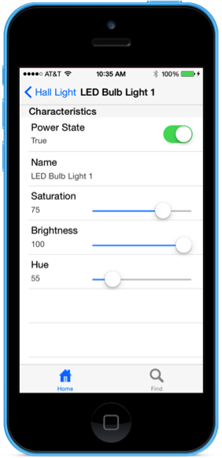](homekit-images/test01.png#lightbox)

Should change the state of the light in the HomeKit Accessory Simulator. If the value does not change, check the state of the error message when writing new characteristic values and ensure that the accessory is still reachable.

## Advanced HomeKit Features

This article has covered the basic features required for working with HomeKit accessories in a Xamarin.iOS app. However, there are several advanced features of HomeKit that are not covered in this introduction:

- **Rooms** - HomeKit enabled accessories can optionally organized into rooms by the end user. This allows HomeKit to present accessories in a way that's easy for the user to understand and work with. For more information on creating and maintaining rooms, see Apple’s [HMRoom](https://developer.apple.com/library/prerelease/ios/documentation/HomeKit/Reference/HMRoom_Class/index.html#//apple_ref/occ/cl/HMRoom) documentation.
- **Zones** - Rooms can optionally be organized into zones by the end user. A zone refers to a collection of rooms that the user might treat as a single unit. For example: Upstairs, Downstairs or Basement. Again, this allows HomeKit to present and work with accessories in a way that makes sense to the end user. For more information on creating and maintaining zones, see Apple’s [HMZone](https://developer.apple.com/library/prerelease/ios/documentation/HomeKit/Reference/HMZone_Class/index.html#//apple_ref/occ/cl/HMZone) documentation.
- **Actions and Action Sets** - Actions modify accessory service characteristics and can be grouped into sets. Action Sets act as scripts to control a group of accessories and coordinate their actions. For example, a "Watch TV" script might close the blinds, dim the lights, and turn on the television and its sound system. For more information about creating and maintaining Actions and Action Sets, see Apple’s [HMAction](https://developer.apple.com/library/prerelease/ios/documentation/HomeKit/Reference/HMAction_Class/index.html#//apple_ref/occ/cl/HMAction) and [HMActionSet](https://developer.apple.com/library/prerelease/ios/documentation/HomeKit/Reference/HMActionSet_Class/index.html#//apple_ref/occ/cl/HMActionSet) documentation.
- **Triggers** - A trigger can activate one or more Action Set when a given set of conditions have been met. For example, turn on the portch light and lock all external doors when it gets dark outside. For more information about creating and maintaining Triggers, see Apple’s [HMTrigger](https://developer.apple.com/library/prerelease/ios/documentation/HomeKit/Reference/HMTrigger_Class/index.html#//apple_ref/occ/cl/HMTrigger) documentation.

Since these features use the same techniques presented above, they should be easy to implement by following Apple's [HomeKitDeveloper Guide](https://developer.apple.com/library/ios/documentation/NetworkingInternet/Conceptual/HomeKitDeveloperGuide/Introduction/Introduction.html), [HomeKit User Interface Guidelines](https://developer.apple.com/homekit/ui-guidelines/) and [HomeKit Framework Reference](https://developer.apple.com/library/ios/home_kit_framework_ref).

## HomeKit App Review Guidelines

Before submitting a HomeKit enabled Xamarin.iOS app to iTunes Connect for release in the iTunes App Store, ensure that you follow Apple's guidelines for HomeKit enabled apps:

- The app's primary purpose _must_ be home automation if using the HomeKit framework.
- The app's marketing text must notify users that HomeKit is being used and they must provide a privacy policy.
- Gathering user information or using HomeKit for advertising is strictly prohibited.

For the full review guidelines, please see Apple's [App Store Review Guidelines](https://developer.apple.com/app-store/review/guidelines/).

## What's New in iOS 9

Apple has made the following changes and additions to HomeKit for iOS 9:

- **Maintaining Existing Objects** - If an existing accessory is modified, the Home Manager (`HMHomeManager`) will inform you of the specific item that was modified.
- **Persistent Identifiers** - All relevant HomeKit classes now include a `UniqueIdentifier` property to uniquely identify a given item across HomeKit enabled apps (or instances of the same app).
- **User Management** - Added a built-in view controller to provide user management over users that have access to the HomeKit devices in the primary user's home.
- **User Capabilities** - HomeKit users now have a set of privileges that control what functions they are able to use in HomeKit and HomeKit enabled accessories. Your app should only display relevant capabilities to the current user. For example, only an admins should be able to maintain other users.
- **Predefined Scenes** - Predefined scenes have been created for four common events that occur for the average HomeKit user: Get Up, Leave, Return, Go to Bed. These predefined scenes cannot be deleted from a home.
- **Scenes and Siri** - Siri has deeper support for Scenes in iOS 9 and can recognize the name of any Scene defined in HomeKit. A user can execute a scene simply by speaking its name to Siri.
- **Accessory Categories** - A set of predefined categories has been added to all Accessories and helps to identify the type of Accessory being added to a Home or worked on from within your app. These new categories are available during Accessory setup.
- **Apple Watch Support** - HomeKit is now available for watchOS and the Apple Watch will be able to control HomeKit enabled devices without an iPhone being near the watch. HomeKit for watchOS supports the following capabilities: Viewing Homes, Controlling Accessories and Executing Scenes.
- **New Event Trigger Type** - In addition to the timer type triggers supported in iOS 8, iOS 9 now supports Event Triggers based on Accessory State (such as  sensor data) or geolocation. Event Triggers use `NSPredicates` to set conditions for their execution.
- **Remote Access** - With Remote Access, the user is now able to control their HomeKit enabled Home Automation Accessories when they are away from the house at a remote location. In iOS 8 this was only supported if the user had a 3rd generation Apple TV in the home. In iOS 9, this limitation is lifted and remote access is supported via iCloud and the HomeKit Accessory Protocol (HAP).
- **New Bluetooth Low Energy (BLE) Abilities** - HomeKit now supports more accessory types that can communicate via the Bluetooth Low Energy (BLE) protocol. Using HAP Secure Tunneling, a HomeKit Accessory can expose another Bluetooth Accessory over Wi-Fi (if it is out of Bluetooth range). In iOS 9, BLE Accessories have full support for notifications and metadata.
- **New Accessory Categories** - Apple added the following new Accessory Categories in iOS 9: Window Coverings, Motorized Doors and Windows, Alarm Systems, Sensors and Programmable Switches.

For more information about the new features of HomeKit in iOS 9, please see Apple's [HomeKit Index](https://developer.apple.com/homekit/) and [What's New in HomeKit](https://developer.apple.com/videos/wwdc/2015/?id=210) video.

## Summary

This article has introduced Apple's HomeKit home automation framework. It showed how to setup and configure test devices using the HomeKit Accessory Simulator and how to create a simple Xamarin.iOS app to discover, communicate with and control home automation devices using HomeKit.

## Related Links

- [iOS 9 Samples](/samples/browse/?products=xamarin&term=Xamarin.iOS%2biOS9)
- [What's New in iOS 9.0](https://developer.apple.com/library/prerelease/ios/releasenotes/General/WhatsNewIniOS/Articles/iOS9.html)
- [HomeKitDeveloper Guide](https://developer.apple.com/library/ios/documentation/NetworkingInternet/Conceptual/HomeKitDeveloperGuide/Introduction/Introduction.html)
- [HomeKit User Interface Guidelines](https://developer.apple.com/homekit/ui-guidelines/)
- [HomeKit Framework Reference](https://developer.apple.com/library/ios/home_kit_framework_ref)
