# In-App Purchase Basics and Configuration in Xamarin.iOS

Implementing in-app purchases requires the application to utilize the
StoreKit API on the device. StoreKit manages all communication with Apple’s
iTunes servers to get product information and perform transactions. The
provisioning profile must be configured for in-app purchasing and product
information must be entered in iTunes Connect.

 [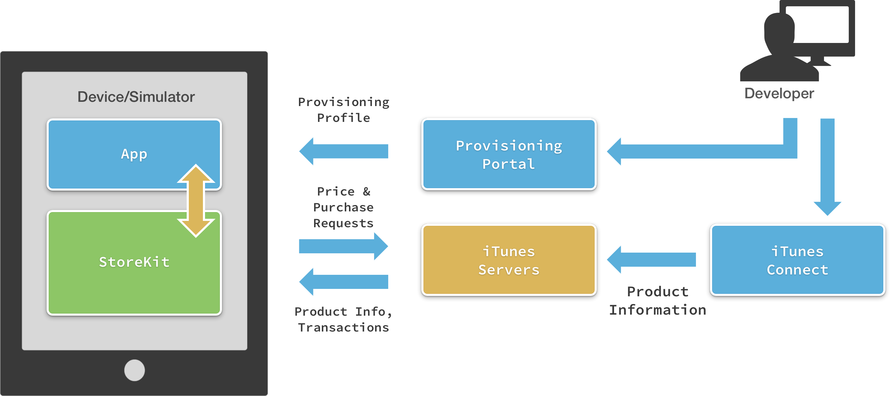](in-app-purchase-basics-and-configuration-images/image1.png#lightbox)

Using the App Store to provide in-app purchasing requires the
following setup and configuration:

- **iTunes Connect** – Configuring the products to sell and setting up sandbox user accounts to test purchasing. You must also have provided your banking and tax information to Apple so they can remit funds collected on your behalf.
- **iOS Provisioning Portal** – Creating a Bundle Identifier and enabling App Store access for your app.
- **Store Kit** – Adding code to your app for displaying products, purchasing products and restoring transactions.
- **Custom code** – To track purchases made by customers and provide the products or services they’ve purchased. You may also need implement a server-side process to validate receipts if your products consist of content downloaded from a server (such as books and magazine issues).

There are two Store Kit “server environments”:

- **Production** – Transactions with real money. Only accessible via applications that have been submitted and approved by Apple. In-app purchase products must also be reviewed and approved before they are available on the production environment.
- **Sandbox** – Where your testing happens. Products are available here immediately after creation (the approval process only applies to the Production environment). Transactions in the sandbox require test users (not real Apple IDs) to perform transactions.

## In-App Purchase Rules

You cannot accept other forms of payment for digital products or services
inside your app, nor mention them or refer your users to them from within an
app. This means you cannot accept credit cards or PayPal when in-app purchasing
is the most appropriate payment mechanism. There is a special case for
purchasing digital products outside the app but for use in the app, such as
purchasing books on a website that are associated with a specific “login”
and using that “login” in the app lets the user access the purchased books.
Applications that operate this way are not allowed to mention or link to the
external purchasing feature – developers must communicate this capability to
their users in other ways (perhaps via email marketing or some other direct
channel).

However, since you can’t use in-app purchases for
physical goods, in that case you are allowed use an alternate payment mechanism
(eg. credit card, PayPal) from within the app.

Apple must
approve every product before it goes on-sale – the name, description and a
screenshot of the ‘product’ is required for review. Product review times are
the same as for application reviews.

You cannot choose any
price for your product – you may only select a ‘price tier’ that has a
specific value in each country/currency that Apple supports. You cannot have a
different price tier in different markets.

## Configuration

Before writing any in-app purchasing code you must do some set-up work in
iTunes Connect ( [itunesconnect.apple.com](https://itunesconnect.apple.com)) and the iOS Provisioning Portal ( [developer.apple.com/iOS](https://developer.apple.com/iOS)).

These three steps
should be complete before writing any code:

- **Apple Developer Account** – Submit your banking and taxation information to Apple.
- **iOS Provisioning Portal** – Ensure your app has a valid App ID (not a wildcard with an asterisk * in it) and has In App Purchasing enabled.
- **iTunes Connect Application Management** – Add products to your application.

### Apple Developer Account

Building and distributing free apps requires very little configuration in [iTunes Connect](https://itunesconnect.apple.com), however to sell paid apps or in-app purchases requires you to
provide Apple with banking and taxation information. Click on **Agreements, Tax and Banking** from the main menu shown here:

 [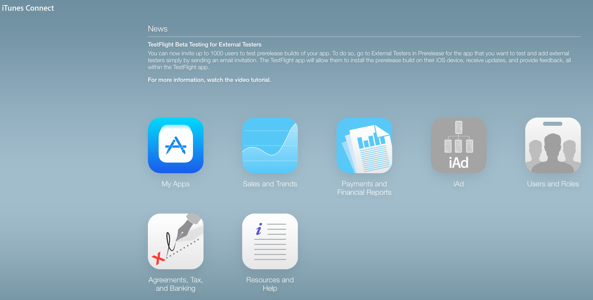](in-app-purchase-basics-and-configuration-images/image2.png#lightbox)

Your Developer Account should have an **iOS Paid Applications** contract in effect, as shown in this screenshot:

 [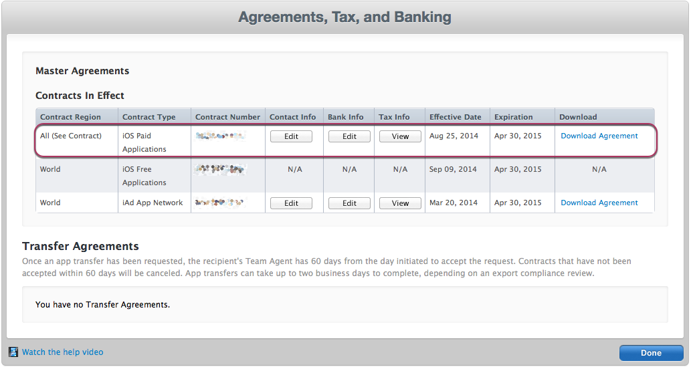](in-app-purchase-basics-and-configuration-images/image3.png#lightbox)

You will not be able to test any StoreKit functionality until you
have an **iOS Paid Applications** contract – StoreKit calls in
your code will fail until Apple has processed your **Contracts, Tax, and Banking** information.

### iOS Provisioning Portal

New applications are set up in the **App IDs** section of the **iOS Provisioning Portal**. To create a new App ID, go to the [Member Center of the iOS Provisioning Portal](https://developer.apple.com/membercenter/index.action), navigate to **Certificates, Identifiers, and Profiles** section of the Portal, and click on **Identifiers** under *iOS Apps*. Then, click the "+" on the top right to generate a new App ID.

The form for creating new **App IDs**

 looks like this:

 [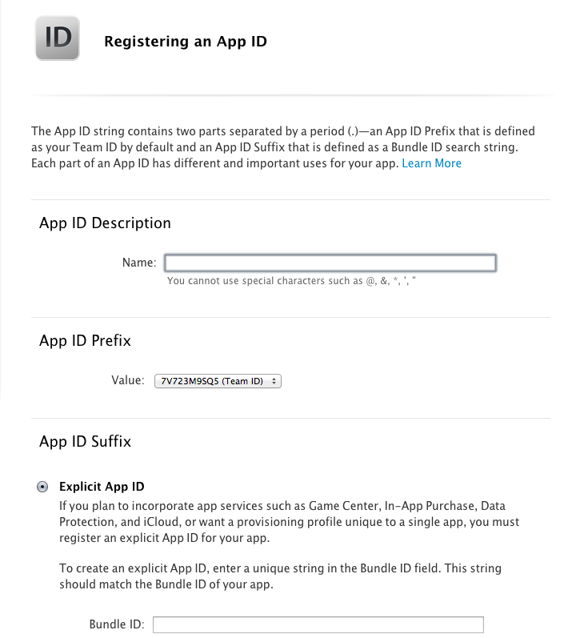](in-app-purchase-basics-and-configuration-images/image4.png#lightbox)

Enter something appropriate for the *Description*, so you can easily identify this App ID in a list. For the *App ID Prefix*, select the Team ID.

#### Bundle Identifier/App ID Suffix Format

You can use any string you like for your **Bundle Identifier**
(as long as it’s unique in your account), however Apple recommends you follow
the reverse-DNS format rather than use any arbitrary string. The sample
application that accompanies this article uses com.xamarin.storekit.testing for
the Bundle Identifier, however it would be equally valid to use an identifier
like my_store_example (even though Apple doesn’t recommend it).

> [!IMPORTANT]
> Apple also allows wild-card asterisk to be added to the end of a **Bundle Identifier** so that a single App ID can be used for
multiple applications, however _wild-card App IDs cannot be used for In-AppPurchase_. An example wild-card Bundle Identifier might be com.xamarin.*

#### Enabling App Services

Note that **In-App Purchase** will be automatically enabled in the Services list:

 [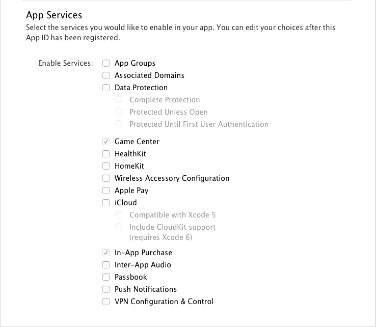](in-app-purchase-basics-and-configuration-images/image5.png#lightbox)

#### Provisioning Profiles

Create
Development and Production Provisioning Profiles as you normally would,
selecting the App ID that you’ve set up for In-App Purchasing. Refer to the [iOS Device Provisioning](~/ios/get-started/installation/device-provisioning/index.md) and [Publishing to the App Store](~/ios/deploy-test/app-distribution/app-store-distribution/publishing-to-the-app-store.md) guides 
for more information.

## iTunes Connect

Click **My Apps** in iTunes Connect to create
or edit an iOS application entry. The application overview page is shown
here:

 [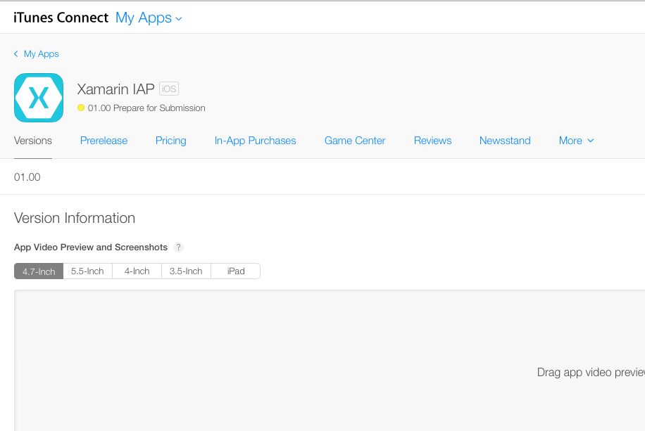](in-app-purchase-basics-and-configuration-images/image6.png#lightbox)

Click **In-App Purchases** to create or edit
your products for sale. This screenshot shows the sample app with several products
already added:

 [](in-app-purchase-basics-and-configuration-images/image7.png#lightbox)

The process to add new products has two steps:

1. Choose the product type: 
    [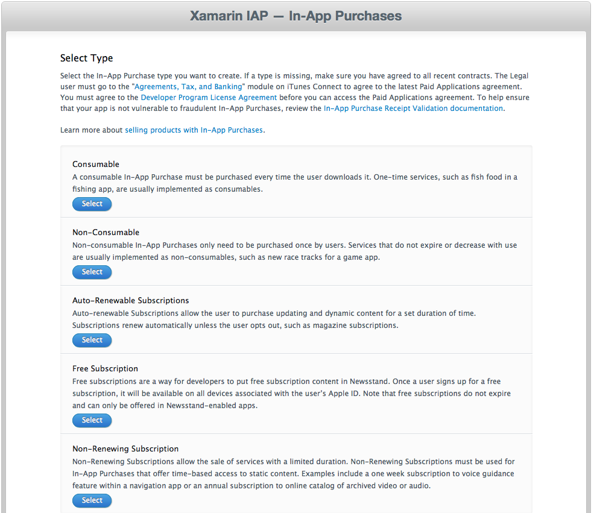](in-app-purchase-basics-and-configuration-images/image8.png#lightbox) 
2. Enter the product’s attributes, including the Product Id, pricing tier and localized descriptions: 
    [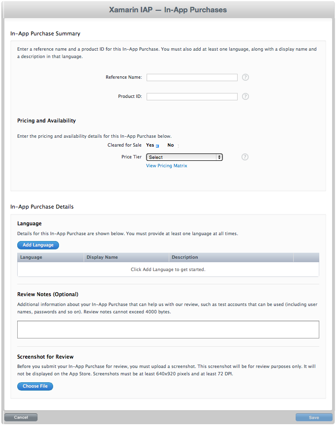](in-app-purchase-basics-and-configuration-images/image9.png#lightbox)

The fields required for each in-app purchase product are described
below:

### Reference Name

The Reference Name is not displayed to your users; it is for internal use and
only appears in iTunes Connect.

### Product ID Format

A Product Identifier can only contain alphanumeric (A-Z,a-z,0-9), underscore
(_), and period (.) characters. Although you can use any string for your
identifiers, Apple recommends the reverse-DNS format. For example, the sample
application uses this Bundle Identifier:

 `com.xamarin.storekit.testing`

Therefore the convention to
identify in-app purchase products would be as follows:

```csharp
com.xamarin.storekit.testing.consume5credits
com.xamarin.storekit.testing.consume10credits
com.xamarin.storekit.testing.sepia
com.xamarin.storekit.testing.greyscale
```

This naming convention is not enforced, simply a recommendation to help you
manage your products. Further, despite following the same reverse-DNS
convention, the Product Identifiers are *not related* to the Bundle
Identifier and are not required to start with the same string. It would still be
valid to use identifiers like photo_product_greyscale (even though Apple
doesn’t recommend it).

Product ID is not displayed to your
users, but it is used to reference the product in your application code.

### Product Type

There are five types of in-app purchase product you can offer:

1. **Consumable** – Things that are ‘used up’, such as in-game currency that the player can spend. If the user does a backup/restore or otherwise has their device refreshed, a consumable transaction does NOT get restored as well (which would effectively give the player the same benefit over again). Application code must be sure to provide the ‘consumable item’ as soon as the transaction is completed.
1. **Non-consumable** – Products that the user ‘owns’ once purchased, such as a digital magazine issue or a game level.
1. **Auto-Renewable Subscriptions** – Just like a real-world magazine subscription, at the end of the subscription period Apple automatically charges the customer again and extends the subscription term, forever or until the customer explicitly cancels it. This is the preferred payment method for Newsstand apps (in fact, apps MUST support this payment method to be approved for Newsstand distribution).
1. **Free Subscription** – Can only be offered in Newsstand-enabled apps, and allows the customer to access subscription content on all their devices. Free subscriptions never expire.
1. **Non-Renewing Subscription** – Should be used to sell time-limited access to static content, such as one month’s access to a photo archive.

 *This document currently covers only the first two product types (Consumable and Non-Consumable).*

 <a name="Price_Tiers"></a>

### Price Tiers

The App Store does not let you choose an arbitrary price for your products
– Apple provides fixed price tiers that you can choose from. Prices are fixed
in each currency, and Apple reserves the right to adjust the relative prices
(for example, after a sustained change in the relative foreign exchange rate
between a particular currency and the US Dollar).

Apple
provides a price matrix to help you select the correct tier for the
currency/price that you want. An excerpt of the price matrix (August 2012) is
shown here:

 [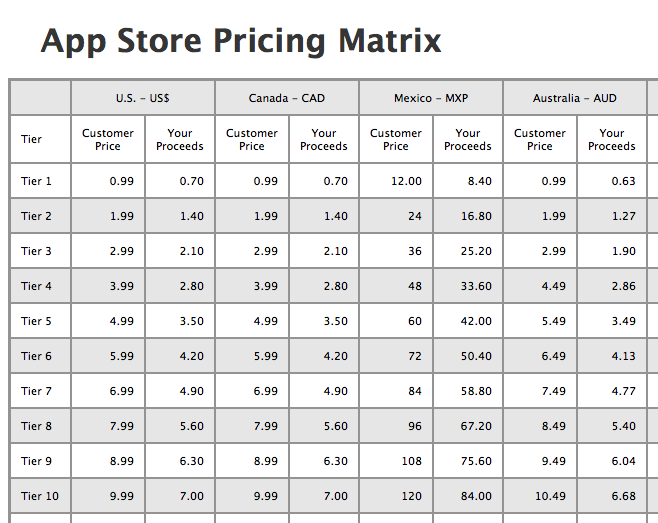](in-app-purchase-basics-and-configuration-images/image10.png#lightbox)

At the time of writing (June 2013) there are 87 tiers from USD
0.99 to USD 999.99. The Pricing Matrix shows the price that your customers will
pay and also the amount you will receive from Apple – this is less their 30%
charge and also any local taxes they are required to collect (notice in the
example that U.S. and Canadian sellers receive 70c for a 99c product, while
Australian sellers receive only 63c due to ‘Goods &amp; Services Tax’ levied
on the sale price).

Your product’s pricing can be updated
at any time, including scheduled price changes that take effect on a future
date. This screenshot shows how a future-dated price change is added – the
price is being temporarily changed from tier 1 to tier 3 for the month of
September only:

 [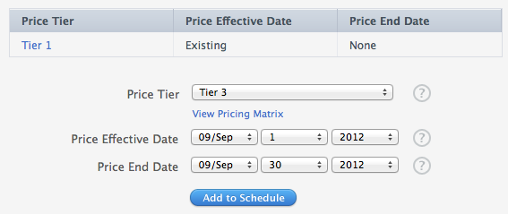](in-app-purchase-basics-and-configuration-images/image11.png#lightbox)

### Free Products Not Supported

Although Apple has provided a special Free Subscription option for Newsstand
apps, it is not possible to set a zero (free) price for any other in-app
purchase types. While you can edit (ie. lower) prices for sales promotions, you
cannot make in-app purchases ‘free’ via iTunes Connect.

### Localization

In iTunes Connect you can enter different Name and Description text for any
number of supported languages. Each language can be added/edited in via a
popup:

 [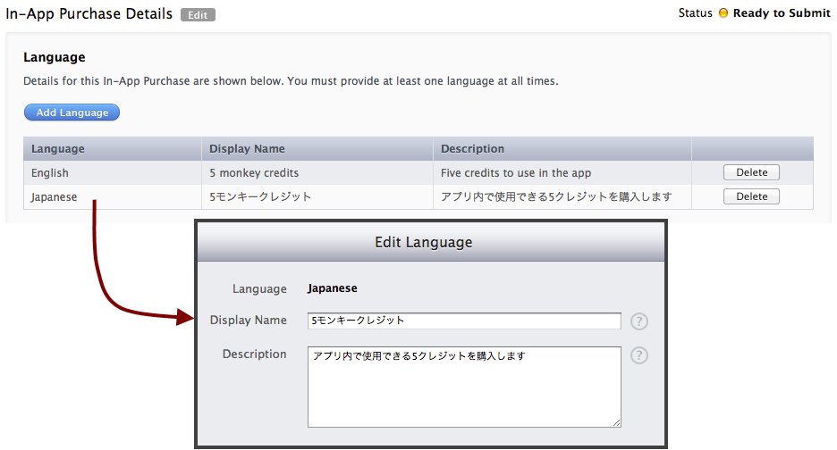](in-app-purchase-basics-and-configuration-images/image12.png#lightbox)   

When you display product information in your app, the localized
text is available for you to display via StoreKit. The currency display must
also be localized to show the correct symbol and decimal formatting – this
formatting is covered later in the document.

### App Store Review

Same as apps – each product is reviewed by Apple before being allowed to go
on-sale. Products may be rejected for inappropriate content in the Name or
Description, or Apple may decide that you’ve chosen the wrong product type
(eg. you’ve created a book or magazine issue but used the Consumable product
type). Product reviews can take as long as an app review.

The
first time an app is submitted with in-app purchasing enabled (whether it’s a
new app, or the functionality has been added to an existing one) you must also
choose some products to submit with it. The iTunes Connect portal will prompt
you to do this, as shown in this screenshot:

 [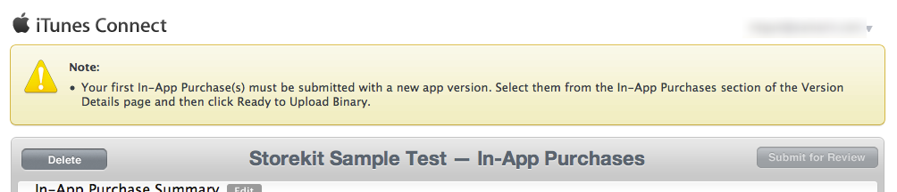](in-app-purchase-basics-and-configuration-images/image13.png#lightbox)   

The application and the in-app purchases will be reviewed
together, so that they all get approved at once (so that app doesn’t go into
the store without any approved products!).

After your first
version with in-app purchase capability has been approved, you can add further
products and submit them for review at any time. You can also choose to submit a
new version together with specific in-app purchase products, using the **Version Details** page as the prompt suggests.

Refer to the [App Store Review Guidelines](https://developer.apple.com/appstore/guidelines.html) for more information.

 [Part 2 - Store Kit Overview and Retreiving Product Information](~/ios/platform/in-app-purchasing/store-kit-overview-and-retreiving-product-information.md)
