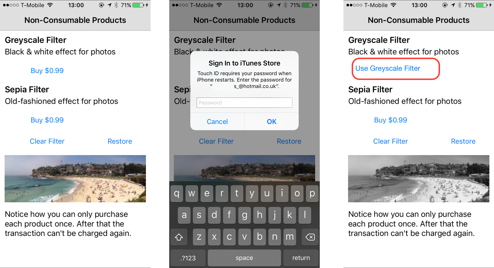
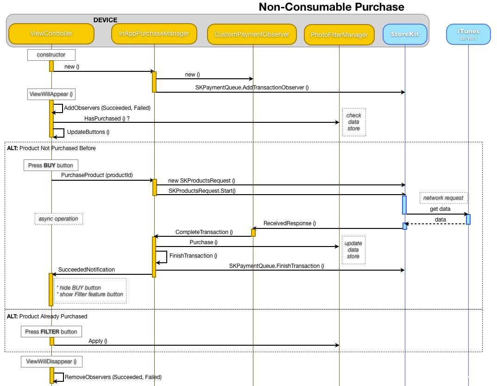

# Purchasing Non-Consumable Products in Xamarin.iOS

Non-consumable products are ‘owned’ by the customer. The expectation is
that they will always have access to them, even if their device is lost/stolen
or they buy a new one. They are useful for books, magazine issues, game levels,
photo filters, ‘pro-features’, etc. Once a user has purchased a
non-consumable product, they never have to pay for it again. If your code
accidentally lets them try, StoreKit will show a message that it has already
been purchased.

## Non-Consumable Products Sample

The [InAppPurchaseSample code](/samples/xamarin/ios-samples/storekit) contains a project called *NonConsumables*. The code sample
demonstrates how to implement non-consumable products using photo-filters as an
example. Once you’ve purchased a filter you can apply it to the photo over and
over again. You never need to re-purchase it.   

The purchase
process is shown in this series of screenshots – the **Buy**
button becomes the feature-activation button:   

    

The purchasing process is the same as a consumable product; the key
difference is in how the purchase is tracked in the application code. In this
example the Buy button is only available if the product has not already been
purchased, otherwise the button activates the feature itself.   

The following diagram shows the interactions between classes and the App Store
server to perform a non-consumable product purchase:   

    

The key difference from the Consumable example is that once the
purchase is complete the user-interface is updated to prevent re-purchasing. In
this example, the notification of a successful transaction updates the
user-interface so that the **Buy** button is converted into a
button that activates the feature itself.

## Re-Purchasing Non-Consumable Products

Your code should normally hide or repurpose a purchase button once the
product has been successfully purchased, to prevent the user from attempting to
purchase the product again. The sample application does this by changing the **Buy** button into the button that makes the example photo filter
work.   

There are situations where an application cannot tell
whether a non-consumable product has already been purchased:

- If an application is deleted and re-installed on a device, all purchase records will be gone (unless/until the user does a backup-restore). 
- If the user has the application installed on two (or more) devices and makes a purchase on one of the devices. The other devices will continue to show the product available for purchase. 
- If a customer attempts to re-purchase a non-consumable product in these situations, the App Store will fulfill the product again without charge. The user interface will initially appear to perform a purchase (for example, a confirmation alert is displayed and the Apple ID will be required) however the user will then see a message advising them that the product has already been purchased.  

The code path in this scenario is exactly the same as a regular
purchase, the only differences are:

- The user does not get charged again for the product.
- The  `SKPaymentTransaction` object passed to the application will have an  `OriginalTransaction` property that refers to the transaction that was generated when the product was initially purchased. 
- Applications that sell Non-Consumable products must also implement StoreKit’s  **Restore** feature to help users retrieve existing purchases.