# StoreKit Overview and Retrieving Product Info in Xamarin.iOS

The user interface for an in-app purchase is shown in the screenshots below.
Before any transaction takes place, the application must retrieve the
product’s price and description for display. Then when the user presses **Buy**, the application makes a request to StoreKit which manages
the confirmation dialog and Apple ID login. Assuming the transaction then
succeeds, StoreKit notifies the application code, which must store the
transaction result and provide the user with access to their purchase.   

 [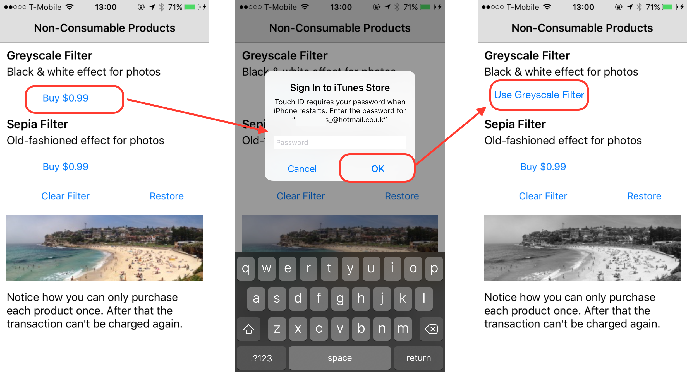](store-kit-overview-and-retreiving-product-information-images/image14.png#lightbox)

## Classes

Implementing in-app purchases requires the following classes from the
StoreKit framework:   

 **SKProductsRequest** – A request to
StoreKit for approved products to sell (App Store). Can be configured with a
number of product Ids.

- **SKProductsRequestDelegate** – Declares methods to handle product requests and responses.
- **SKProductsResponse** – Sent back to the delegate from StoreKit (App Store). Contains the SKProducts that match the product Ids sent with the request.
- **SKProduct** – A product retrieved from StoreKit (that you’ve configured in iTunes Connect). Contains information about the product, such as Product ID, Title, Description and Price.
- **SKPayment** – Created with a Product ID and added to the payment queue to perform a purchase.
- **SKPaymentQueue** – Queued payment requests to be sent to Apple. Notifications are triggered as a result of each payment being processed.
- **SKPaymentTransaction** – Represents a completed transaction (a purchase request that has been processed by the App Store and sent back to your application via StoreKit). The transaction could be Purchased, Restored or Failed.
- **SKPaymentTransactionObserver** – Custom subclass that responds to events generated by the StoreKit payment queue.
- **StoreKit operations are asynchronous** – after a SKProductRequest is started or a SKPayment is added to the queue, control is returned to your code. StoreKit will call methods on your SKProductsRequestDelegate or SKPaymentTransactionObserver subclass when it receives data from Apple’s servers.

The following diagram shows the relationships between the various StoreKit
classes (abstract classes must be implemented in your application):   

 [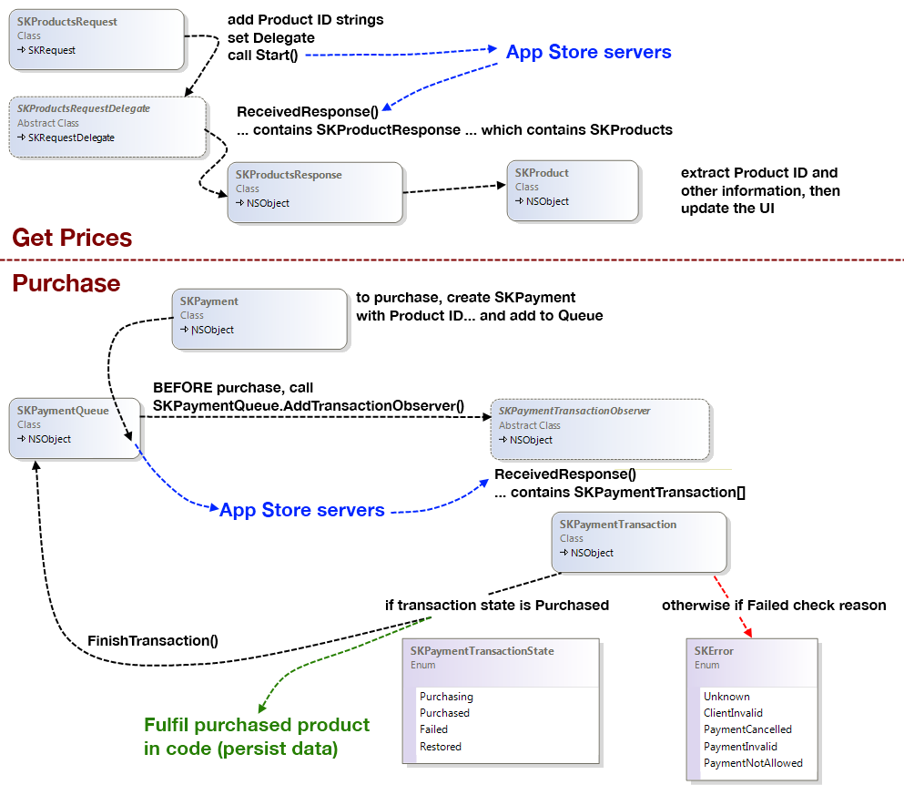](store-kit-overview-and-retreiving-product-information-images/image15.png#lightbox)   

These classes are explained in more detail later in this
document.

## Testing

Most StoreKit operations require a real device for testing. Retrieving
product information (ie. price &amp; description) will work in the simulator but
purchase and restore operations will return an error (such as FailedTransaction
Code=5002 An unknown error has occurred).

Note: StoreKit does not operate in iOS Simulator. When running your
application in iOS Simulator, StoreKit logs a warning if your application
attempts to retrieve the payment queue. Testing the store must be done on actual
devices.   

Important: Do not sign in with your test account in
the Settings application. You can use the Settings application to Sign Out of
any existing Apple ID account, then you must wait to be prompted *within your In-App Purchase sequence* to login using a test Apple ID.   

If you attempt to sign-in to the real store with a test account, it will be
automatically converted to a real Apple ID. That account will no longer be
useable for testing.

To test StoreKit code you must logout of your regular iTunes test account and
login with a special test account (created in iTunes Connect) that is linked to
the test store. To sign out of the current account visit **Settings > iTunes and App Store** as shown here:

 [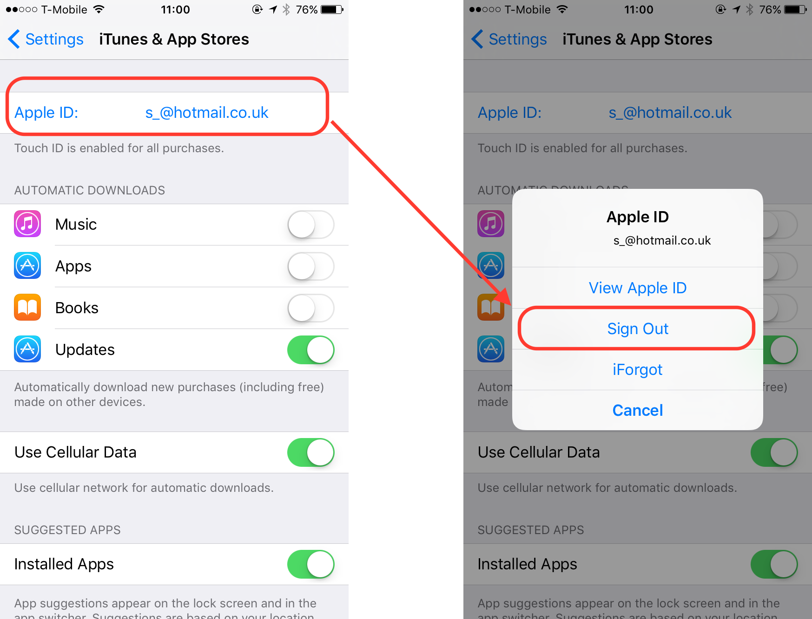](store-kit-overview-and-retreiving-product-information-images/image16.png#lightbox)

then sign in with a test account *when requested by StoreKit within your app*:

To create test users in iTunes Connect click on **Users and Roles**
on the main page.

 [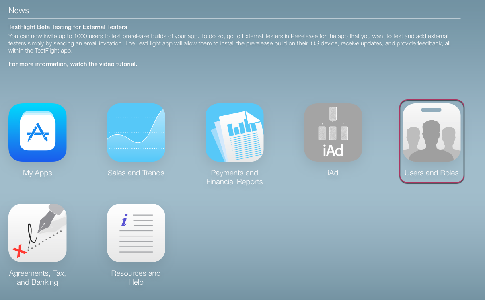](store-kit-overview-and-retreiving-product-information-images/image17.png#lightbox)

Select **Sandbox Testers**

 [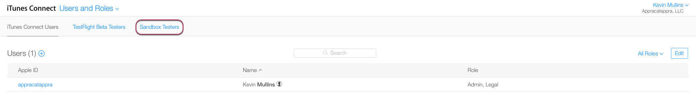](store-kit-overview-and-retreiving-product-information-images/image18.png#lightbox)

The list of existing users is displayed. You can add a new user or delete an
existing record. The portal does not (currently) let you view or edit existing
test users, so it’s recommended that you keep a good record of each test user
that is created (especially the password you assign). Once you delete a test
user the email address cannot be re-used for another test account.  

 [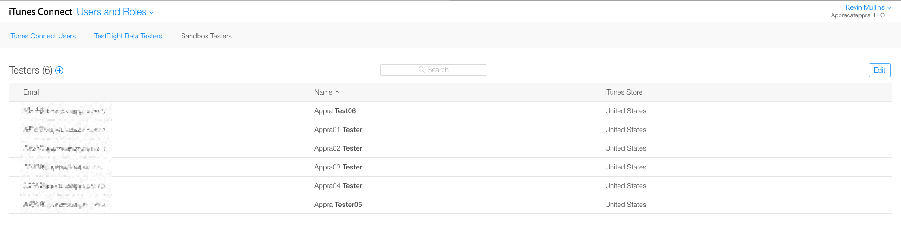](store-kit-overview-and-retreiving-product-information-images/image19.png#lightbox)   

 New test users have similar attributes to a real Apple
ID (such as name, password, secret question and answer). Keep a record of all
the details entered here. The **Select iTunes Store** field will
determine which currency and language the in-app purchases will use when
logged-in as that user.

 [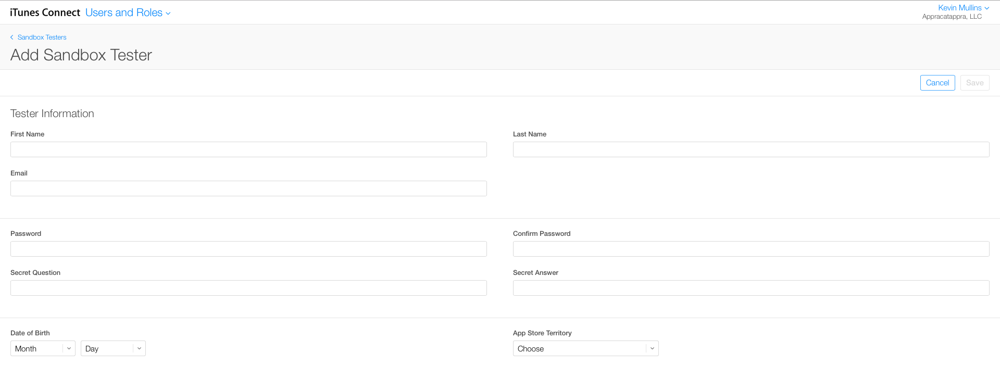](store-kit-overview-and-retreiving-product-information-images/image20.png#lightbox)

## Retrieving Product Information

The first step in selling an in-app purchase product is displaying it:
retrieving the current price and description from the App Store for display.   

Regardless of which type of products an app sells (Consumable,
Non-Consumable or a type of Subscription), the process of retrieving product
information for display is the same. The InAppPurchaseSample
code that accompanies this article contains a project named *Consumables* that demonstrates how to retrieve production information
for display. It shows how to:

- Create an implementation of  `SKProductsRequestDelegate` and implement the  `ReceivedResponse` abstract method. The example code calls this the  `InAppPurchaseManager` class.
- Check with StoreKit to see whether payments are allowed (using  `SKPaymentQueue.CanMakePayments` ).
- Instantiate an  `SKProductsRequest` with the Product Ids that have been defined in iTunes Connect. This is done in the example’s  `InAppPurchaseManager.RequestProductData` method.
- Call the Start method on the  `SKProductsRequest` . This triggers an asynchronous call to the App Store servers. The Delegate ( `InAppPurchaseManager` ) will be called-back with the results.
- The Delegate’s ( `InAppPurchaseManager` )  `ReceivedResponse` method updates the UI with the data returned from the App Store (product prices & descriptions, or messages about invalid products).

The overall interaction looks like this ( **StoreKit** is
built-in to iOS, and the **App Store** represents Apple’s
servers):

 [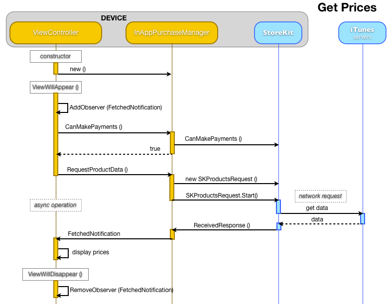](store-kit-overview-and-retreiving-product-information-images/image21.png#lightbox)

### Displaying Product Information Example

The [InAppPurchaseSample](/samples/xamarin/ios-samples/storekit) *Consumables* sample-code demonstrates how
product information can be retrieved. The main screen of the sample displays
information for two products that is retrieved from the App Store:   

 [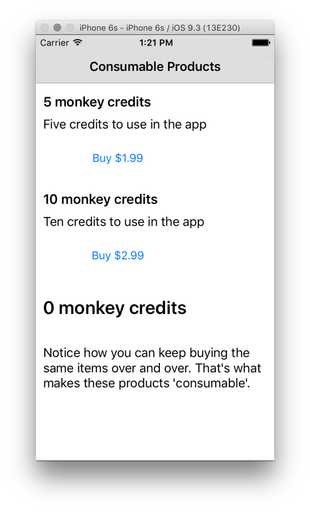](store-kit-overview-and-retreiving-product-information-images/image23.png#lightbox)   

The sample code to retrieve and display product information
is explained in more detail below.

#### ViewController Methods

The `ConsumableViewController` class will manage the display of
prices for two products whose Product IDs are hardcoded in the class.

```csharp
public static string Buy5ProductId = "com.xamarin.storekit.testing.consume5credits",
   Buy10ProductId = "com.xamarin.storekit.testing.consume10credits";
List<string> products;
InAppPurchaseManager iap;
public ConsumableViewController () : base()
{
   // two products for sale on this page
   products = new List<string>() {Buy5ProductId, Buy10ProductId};
   iap = new InAppPurchaseManager();
}
```

At the class level there should also be an NSObject declared that will be
used to setup a `NSNotificationCenter` observer:

```csharp
NSObject priceObserver;
```

In the ViewWillAppear method the observer is created and assigned using the
default notification center:

```csharp
priceObserver = NSNotificationCenter.DefaultCenter.AddObserver (
  InAppPurchaseManager.InAppPurchaseManagerProductsFetchedNotification,
(notification) => {
   // display code goes here, to handle the response from the App Store
}
```

At the end of the `ViewWillAppear` method, call the `RequestProductData` method to initiate the StoreKit request. Once
this request has been made, StoreKit will asynchronously contact Apple’s
servers to get the information and feed it back to your app. This is achieved by
the `SKProductsRequestDelegate` subclass
( `InAppPurchaseManager`) that is explained in the next section.

```csharp
iap.RequestProductData(products);
```

The code to display the price and description simply retrieves the
information from the SKProduct and assigns it to UIKit controls (notice that we
display the `LocalizedTitle` and `LocalizedDescription`
– StoreKit automatically resolves the correct text and prices based on the
user’s account settings). The following code belongs in the notification we
created above:

```csharp
priceObserver = NSNotificationCenter.DefaultCenter.AddObserver (
  InAppPurchaseManager.InAppPurchaseManagerProductsFetchedNotification,
(notification) => {
   // display code goes here, to handle the response from the App Store
   var info = notification.UserInfo;
   if (info.ContainsKey(NSBuy5ProductId)) {
       var product = (SKProduct) info.ObjectForKey(NSBuy5ProductId);
       buy5Button.Enabled = true;
       buy5Title.Text = product.LocalizedTitle;
       buy5Description.Text = product.LocalizedDescription;
       buy5Button.SetTitle("Buy " + product.Price, UIControlState.Normal); // price display should be localized
   }
}
```

Finally, the `ViewWillDisappear` method should ensure the observer
is removed:

```csharp
NSNotificationCenter.DefaultCenter.RemoveObserver (priceObserver);
```

#### SKProductRequestDelegate (InAppPurchaseManager) Methods

The `RequestProductData` method is called when the application
wishes to retrieve product prices and other information. It parses the
collection of Product Ids into the correct data type then creates a `SKProductsRequest` with that information. Calling the Start method
causes a network request to be made to Apple’s servers. The request will run
asynchronously and call the `ReceivedResponse` method of the Delegate
when it has completed successfully.

```csharp
public void RequestProductData (List<string> productIds)
{
   var array = new NSString[productIds.Count];
   for (var i = 0; i < productIds.Count; i++) {
       array[i] = new NSString(productIds[i]);
   }
   NSSet productIdentifiers = NSSet.MakeNSObjectSet<NSString>(array);​​​
   productsRequest = new SKProductsRequest(productIdentifiers);
   productsRequest.Delegate = this; // for SKProductsRequestDelegate.ReceivedResponse
   productsRequest.Start();
}
```

iOS will automatically route the request to the ‘sandbox’ or
‘production’ version of the App Store depending on what provisioning profile
the application is running with – so when you are developing or testing your
app the request will have access to every product configured in iTunes Connect
(even those that have not yet been submitted or approved by Apple). When your
application is in production, StoreKit requests will only return information for **Approved** products.   

The `ReceivedResponse` overridden method is called after Apple’s
servers have responded with data. Because this is called in the background, the
code should parse out the valid data and use a notification to send the product
information to any ViewControllers that are ‘listening’ for that
notification. The code to collect valid product information and send a
notification is shown below:

```csharp
public override void ReceivedResponse (SKProductsRequest request, SKProductsResponse response)
{
   SKProduct[] products = response.Products;
   NSDictionary userInfo = null;
   if (products.Length > 0) {
       NSObject[] productIdsArray = new NSObject[response.Products.Length];
       NSObject[] productsArray = new NSObject[response.Products.Length];
       for (int i = 0; i < response.Products.Length; i++) {
           productIdsArray[i] = new NSString(response.Products[i].ProductIdentifier);
           productsArray[i] = response.Products[i];
       }
       userInfo = NSDictionary.FromObjectsAndKeys (productsArray, productIdsArray);
   }
   NSNotificationCenter.DefaultCenter.PostNotificationName (InAppPurchaseManagerProductsFetchedNotification, this, userInfo);
}
```

Although not shown in the diagram, the `RequestFailed` method
should also be overridden so that you can provide some feedback to the user in
case the App Store servers are not reachable (or some other error occurs). The
example code merely writes to the console, but a real application might choose
to query to `error.Code` property and implement custom behavior (such
as an alert to the user).

```csharp
public override void RequestFailed (SKRequest request, NSError error)
{
   Console.WriteLine (" ** InAppPurchaseManager RequestFailed() " + error.LocalizedDescription);
}
```

This screenshot shows the sample application immediately after loading (when
no product information is available):

 [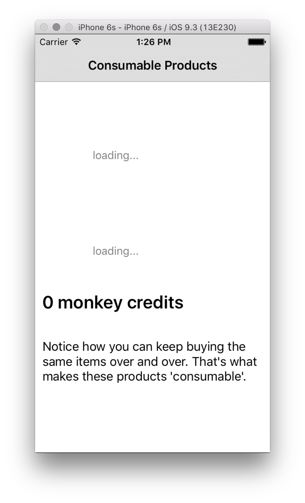](store-kit-overview-and-retreiving-product-information-images/image24.png#lightbox)

## Invalid Products

An `SKProductsRequest` may also return a list of invalid Product
IDs. Invalid products are usually returned due to one of the following:   

**Product ID has been mistyped** – Only valid Product
IDs are accepted.   

 **Product has not been approved** –
While testing, all products that are Cleared for Sale should be returned by an `SKProductsRequest`; however in production only Approved products are
returned.   

 **App ID is not explicit** – Wildcard App IDs
(with an asterisk) do not allow in-app purchasing.   

 **Incorrect provisioning profile** – If you make changes to your application
configuration in the provisioning portal (such as enabling in-app purchases),
remember to re-generate and use the correct provisioning profile when building
the app.   

 **iOS Paid Applications contract is not in place** – StoreKit features will not work at all unless there is a
valid contract for your Apple Developer Account.   

 **The binary is in the Rejected state** – If there is a previously submitted binary in
the Rejected state (either by the App Store team, or by the developer) then
StoreKit features will not work.

The `ReceivedResponse` method in the sample code outputs the
invalid products to the console:

```csharp
public override void ReceivedResponse (SKProductsRequest request, SKProductsResponse response)
{
   // code removed for clarity
   foreach (string invalidProductId in response.InvalidProducts) {
       Console.WriteLine("Invalid product id: " + invalidProductId );
   }
}
```

## Displaying Localized Prices

Price tiers specify a specific price for each product across all
international App Stores. To ensure prices are displayed correctly for each
currency, use the following extension method (defined in `SKProductExtension.cs`) rather than the Price property of each `SKProduct`:

```csharp
public static class SKProductExtension {
   public static string LocalizedPrice (this SKProduct product)
   {
       var formatter = new NSNumberFormatter ();
       formatter.FormatterBehavior = NSNumberFormatterBehavior.Version_10_4;  
       formatter.NumberStyle = NSNumberFormatterStyle.Currency;
       formatter.Locale = product.PriceLocale;
       var formattedString = formatter.StringFromNumber(product.Price);
       return formattedString;
   }
}
```

The code that sets the button’s Title uses the extension method like
this:

```csharp
string Buy = "Buy {0}"; // or a localizable string
buy5Button.SetTitle(String.Format(Buy, product.LocalizedPrice()), UIControlState.Normal);
```

Using two different iTunes test accounts (one for the American store and one
for the Japanese store) results in the following screenshots:   

 [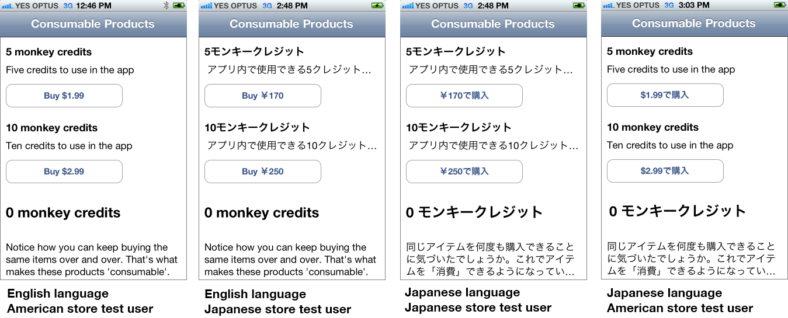](store-kit-overview-and-retreiving-product-information-images/image25.png#lightbox)   

Notice that the store affects the language that is used
for product information and price currency, while the device’s language
setting affects labels and other localized content.   

Recall
that to use a different store test account you must **Sign Out** in
the **Settings > iTunes and App Store** and re-start the application to sign-in
with a different account. To change the device’s language go to **Settings > General > International > Language**.