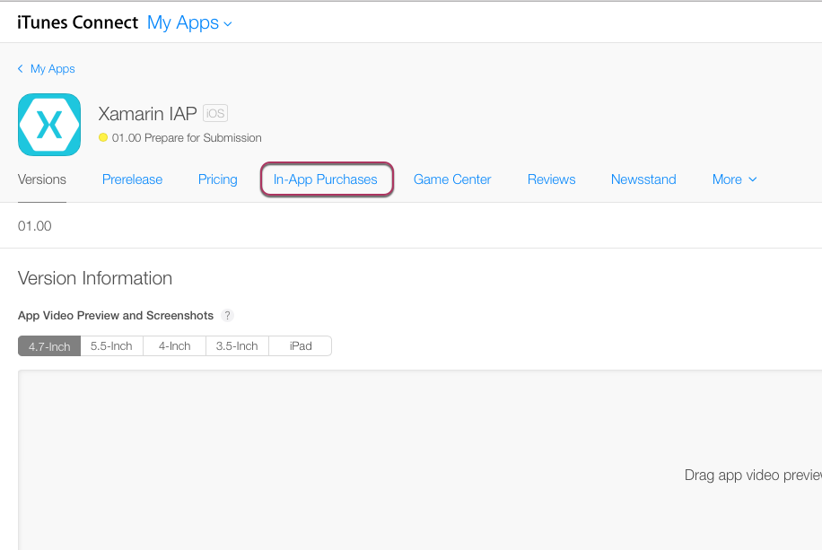
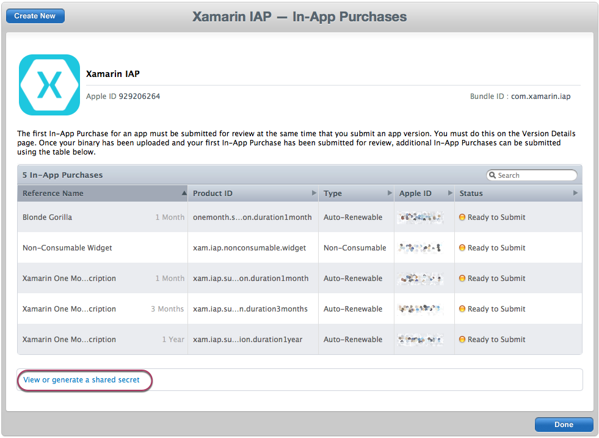
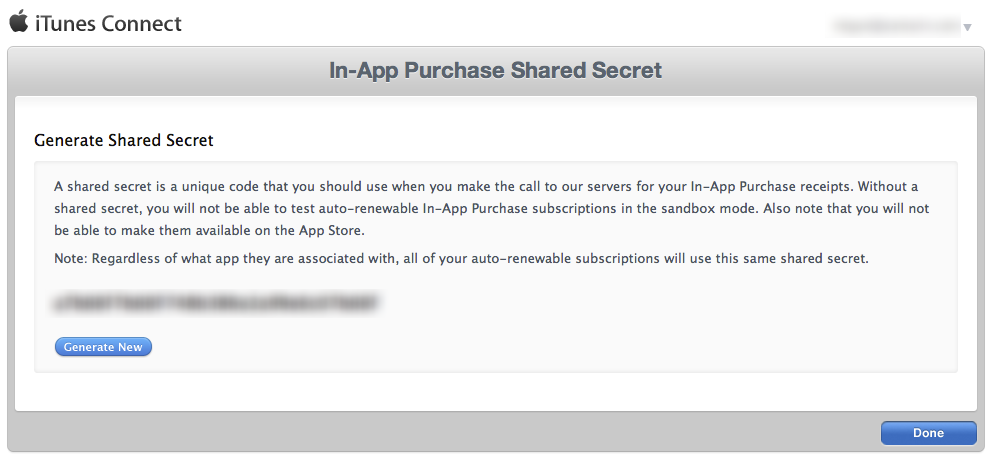
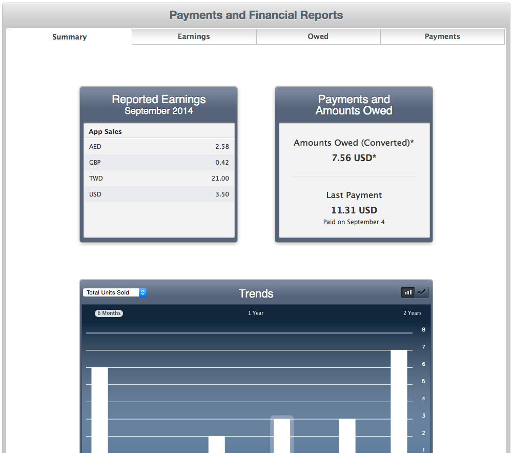
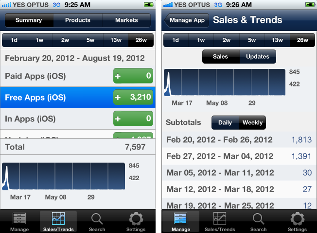

# Subscriptions and Reporting in Xamarin.iOS

## About Non-Renewing Subscriptions

Non-renewing subscriptions are intended for products that represent the sale
of a service with a time restriction (such as one week’s access to a
navigation application or time-limited access to a data archive).   

Key differences between non-renewing subscriptions and other product
types:

- The product definition in iTunes Connect does not include the term. The application code must be able to infer the validity period from the Product ID.
- They can be purchased multiple times (like a consumable product). Applications are required to manage the subscription term/expiry and renewal, and prevent the user from buying overlapping subscriptions.
- The purchases are not supported by the StoreKit Restore function. If the subscription should be available across all a user’s devices, the application will have to design and implement this feature in conjunction with a remote server. Applications are also responsible for backing-up the subscription status for cases when a device is backed-up then restored-from-backup.
- Implementation Overview
- Non-Renewing Subscriptions should normally be implemented using the Server-Delivered workflow and managed like Consumable products.

## About Free Subscriptions

Free subscriptions allow developers to put free content in Newsstand apps
(they cannot be used in non-Newsstand apps). Once a free subscription is started
it will be available on all the user’s devices. Free subscriptions never
expire; they only end when the application is uninstalled.

### Implementation Overview

Free subscriptions behave much like Auto-Renewable subscriptions. The
application must have a Free Subscription product available for ‘purchase’
in iTunes Connect. When purchased by the user, the free subscription purchase
should be validated like an auto-renewable subscription product. Free
subscription transactions can be Restored.

## About Auto-Renewable Subscriptions

Auto-Renewable subscriptions are mainly used in Newsstand applications. They
represent a product that grants the user access to dynamic content for a given
period of time, which is configured in iTunes Connect (set periods ranging from
7 days to 1 year). Subscriptions renew automatically, charging the users Apple
ID at the end of each subscription period, unless the user opts-out. This
product type works well for magazine or news subscriptions, where the user gets
access to each issue published while their subscription is valid.

### Implementation Overview

Auto-Renewable Subscriptions should be implemented using the Server-Delivered
Products workflow (refer to the *Receipt Verification and Server-Delivered Products* section).

#### Shared Secret

The In-App Purchase Shared Secret must be used in the JSON request when
verifying auto-renewable subscriptions on your server. The shared secret is
created/accessed via iTunes Connect.

From the iTunes Connect home page select **My Apps**:   

 [](subscriptions-and-reporting-images/image2.png#lightbox)  

Select an application and click on the **In-App Purchases** tab:

[](subscriptions-and-reporting-images/image6.png#lightbox)

From the bottom of the page, select **View or generate a shared secret**:

 [](subscriptions-and-reporting-images/image40.png#lightbox)

 [](subscriptions-and-reporting-images/image41.png#lightbox)   

To use the shared secret, include it in the JSON payload that is sent to
Apple’s servers when validating an in-app purchase receipt for an
auto-renewable subscription, like this:

```csharp
{
   "receipt-data" : "(receipt bytes here)",
   "password"     : "(shared secret bytes here)"
}
```

The response’s status field will be zero if the purchase is valid, as with
other product types.

#### Downloading Items After the Initial Subscription Term

As part of delivering subscription products, the code should frequently
verify the latest known receipt against Apple’s servers. If a subscription has
auto-renewed since the last verification, the JSON response will contain
additional fields that notify the application of the transaction that has
occurred (which should extend the subscriptions validity). The JSON response
will contain:

```csharp
{
   "status" : 0,
   "receipt" : { (receipt here) },
   "latest_receipt" : "(base-64 encoded receipt here)",
   "latest_receipt_info" : { (latest receipt info here) }
}
```

If the status is zero then the subscription is still valid and the other
fields hold valid data. If the status is 21006 then the subscription has
expired. See the [Verifying an Auto-renewable Subscription Receipt](https://developer.apple.com/library/ios/releasenotes/General/ValidateAppStoreReceipt/Chapters/ValidateRemotely.html)
documentation for other error codes.

#### Restoring auto-Renewable Subscriptions

You’ll get back multiple transactions – the original purchase transaction
plus a separate transaction for each period of time the subscription was
renewed. You need to track the start dates and terms to understand what the
validity period is.   

The SKPaymentTransaction object does NOT
include the subscription term – you should use a different Product ID for each
term and write code that can extrapolate the subscription period from the
purchase date of the transaction.

#### Testing Auto-Renewal

To make it easier to test subscriptions, their durations are compressed when
testing in the sandbox. 1 week subscriptions renew every 3 minutes, 1 year
subscriptions renew every hour. Subscriptions will auto-renew a maximum of 6
times while testing in the sandbox.

## Reporting

iTunes Connect ( [itunesconnect.apple.com](https://itunesconnect.apple.com)) provides:   

 **Sales and Trends** – Displays details of app downloads, updates and in-app
purchases.   

 **Payments and Financial Reports** – Details
the income earned by your apps as well as listing payments that have been made
to you and how much you are owed.

An example Sales and Trends report is shown below:   

 [](subscriptions-and-reporting-images/image42.png#lightbox)   

 There’s also an **ITC Connect Mobile** iOS app. iPhone screenshots for some of the statistics available are shown here:   

 [](subscriptions-and-reporting-images/image43.png#lightbox)
