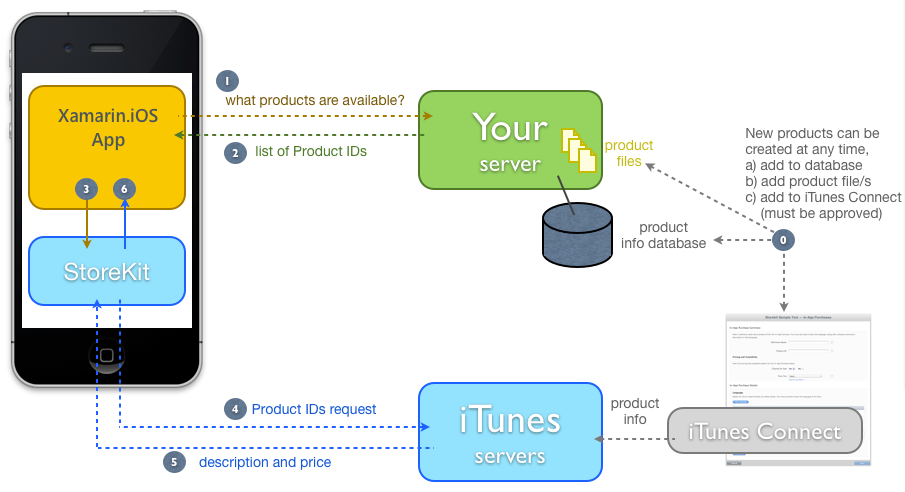
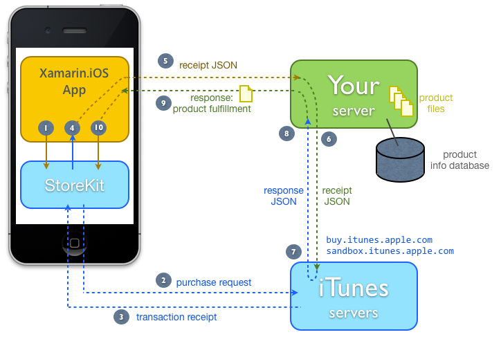

# Transactions and Verification in Xamarin.iOS

## Restoring Past Transactions

If your application supports product types that are restorable, you must
include some user-interface elements to allow users to restore those purchases.
This functionality allows a customer to add the product to additional devices or
to restore the product to the same device after being wiped clean or removing
and re-installing the app. The following product types are restorable:

- Non-consumable products
- Auto-renewable subscriptions
- Free subscriptions

The restore process should update the records you keep on the device to
fulfill your products. The customer can choose to restore at any time, on any of
their devices. The restore process re-sends all prior transactions for that
user; the application code must then determine what action to take with that
information (for example, checking if there is already a record of that purchase
on the device, and if not, creating a record of the purchase and enabling the
product for the user).

### Implementing Restore

The user interface **Restore** button calls the following
method, which triggers RestoreCompletedTransactions on the `SKPaymentQueue`.

```csharp
public void Restore()
{
   // theObserver will be notified of when the restored transactions start arriving <- AppStore
   SKPaymentQueue.DefaultQueue.RestoreCompletedTransactions();​​​
}
```

StoreKit will send the restore request to Apple’s servers
asynchronously.   
   
Because the `CustomPaymentObserver` is registered as a transaction observer, it
will receive messages when Apple’s servers respond. The response will contain
all the transactions this user has ever performed in this application (across
all their devices). The code loops through each transaction, detects the
Restored state and calls the `UpdatedTransactions` method to process
it as shown below:

```csharp
// called when the transaction status is updated
public override void UpdatedTransactions (SKPaymentQueue queue, SKPaymentTransaction[] transactions)
{
   foreach (SKPaymentTransaction transaction in transactions)
   {
       switch (transaction.TransactionState)
       {
       case SKPaymentTransactionState.Purchased:
          theManager.CompleteTransaction(transaction);
           break;
       case SKPaymentTransactionState.Failed:
          theManager.FailedTransaction(transaction);
           break;
       case SKPaymentTransactionState.Restored:
           theManager.RestoreTransaction(transaction);
           break;
​default:
           break;
       }
   }
}
```

If there are no restorable products for the user, `UpdatedTransactions` is not called.   
   
The simplest
possible code to restore a given transaction in the sample does the same actions
as when a purchase takes place, except that the `OriginalTransaction`
property is used to access the Product ID:

```csharp
public void RestoreTransaction (SKPaymentTransaction transaction)
{
   // Restored Transactions always have an 'original transaction' attached
   var productId = transaction.OriginalTransaction.Payment.ProductIdentifier;
   // Register the purchase, so it is remembered for next time
   PhotoFilterManager.Purchase(productId); // it's as though it was purchased again
   FinishTransaction(transaction, true);
}
```

A more sophisticated implementation may check other `transaction.OriginalTransaction` properties, such as the original
date and receipt number. This information will be useful for some product types
(such as subscriptions).

#### Restore Completion

The `CustomPaymentObserver` has two additional methods that will
be called by StoreKit when the restore process has completed (either
successfully or with a failure), shown below:

```csharp
public override void PaymentQueueRestoreCompletedTransactionsFinished (SKPaymentQueue queue)
{
   Console.WriteLine(" ** RESTORE Finished ");
}
public override void RestoreCompletedTransactionsFailedWithError (SKPaymentQueue queue, NSError error)
{
   Console.WriteLine(" ** RESTORE FailedWithError " + error.LocalizedDescription);
}
```

In the example these methods do nothing, however a real application may
choose to implement a message to the user or some other functionality.

## Securing Purchases

The two examples in this document use `NSUserDefaults` to track
purchases:   
   
 **Consumables** – the ‘balance’
of credit purchases is a simple `NSUserDefaults` integer value that
is incremented with each purchase.   
   
 **Non-Consumables** –
each photo filter purchase is stored as a key-value pair in `NSUserDefaults`.

Using `NSUserDefaults` keeps the example code simple, but does not
offer a very secure solution as it may be possible for technically-minded users
to update the settings (bypassing the payment mechanism).   
   
Note: Real-world applications should adopt a secure mechanism for storing
purchased content that is not subject to user tampering. This may involve
encryption and/or other techniques including remote-server authentication.   
   
 The mechanism should also be designed to take advantage of the
built-in backup and recovery features of iOS, iTunes and iCloud. This will
ensure that after a user restores a backup their previous purchases will be
immediately available.   
   
Refer to Apple’s Secure Coding Guide
for more iOS-specific guidelines.

## Receipt Verification and Server-Delivered Products

The examples in this document so far have consisted solely of the application
communicating directly with the App Store servers to conduct purchase
transactions, which unlock features or capabilities already coded into the
app.   
   
Apple provides for an additional level of purchase
security by allowing purchase receipts to be independently verified by another
server, which can be useful to validate a request before delivering digital
content as part of a purchase (such as a digital book or magazine).   
   
 **Built-In Products** – Like the examples in this
document, the product being purchased exists as functionality shipped with the
application. An in-app purchase enables the user to access the functionality.
Product IDs are hardcoded.   
   
 **Server-Delivered Products**
– The product consists of downloadable content that is stored on a remote
server until a successful transaction causes the content to be downloaded.
Examples might include books or magazine issues. Product IDs are usually sourced
from an external server (where the product content is also hosted). Applications
must implement a robust way of recording when a transaction has completed, so
that if content download fails it can be re-attempted without confusing the
user.

### Server-Delivered Products

Some product’s content, such as books and magazines (or even a game level)
need to be downloaded from a remote server during the purchase process. This
means an additional server is required to store and deliver the product content
after it is purchased.

#### Getting Prices for Server-Delivered Products

Because the products are remotely delivered, it is also possible to add more
products over time (without updating the app code), such as adding more books or
new issues of a magazine. So that the application can discover these news
products and display them to the user, the additional server should store and
deliver this information.   
   
[](transactions-and-verification-images/image38.png#lightbox)   
   
1. Product information must be stored in multiple places: on your server
and in iTunes Connect. In addition, each product will have content files
associated with it. These files will be delivered after a successful
purchase.   
   
2. When the user wishes to purchase a product, the
application must determine what products are available. This information may be
cached, but should be delivered from a remote server where the master list of
products is stored.   
   
3. The server returns a list of Product IDs for the
application to parse.   
   
4. The application then determines which of these
Product IDs to send to StoreKit to retrieve prices and descriptions.   
   
5. StoreKit sends the list of Product IDs to Apple’s servers.   
   
6. The
iTunes servers respond with valid product information (description and current
price).   
   
7. The application’s `SKProductsRequestDelegate`
is passed the product information for display to the user.

#### Purchasing Server-Delivered Products

Because the remote server requires some way of validating that a content
request is valid (ie. has been paid for), the receipt information is passed
along for authentication. The remote server forwards that data to iTunes for
verification and, if successful, includes the product content in the response to
the application.   
   
 [](transactions-and-verification-images/image39.png#lightbox)   
   
1. The app adds an `SKPayment` to the queue. If required the
user will be prompted for their Apple ID, and asked to confirm the payment.   
   
2. StoreKit sends the request to the server for processing.   
   
3. When the transaction is complete, the server responds with a transaction
receipt.   
   
4. The `SKPaymentTransactionObserver` subclass
receives the receipt and processes it. Because the product must be downloaded
from a server, the application initiates a network request to the remote
server.   
   
5. The download request is accompanied by the receipt data so
that the remote server can verify it is authorized to access the content. The
application’s network client waits for a response to this request.   
   
6. When the server receives a request for content, it parses out the receipt data and sends a request directly to the iTunes servers to verify the receipt is for a valid transaction. The server should use some logic to determine whether to send the request to the production or sandbox URL. Apple suggests always using the production URL and switching to sandbox if your receive status 21007 (sandbox receipt sent to production server). Refer to Apple's [Receipt Validation Programming Guide](https://developer.apple.com/library/archive/releasenotes/General/ValidateAppStoreReceipt/Chapters/ValidateRemotely.html) for more details.
   
7. iTunes will check
the receipt and return a status of zero if it is valid.   
   
8. The server
waits for iTunes’ response. If it receives a valid response, the code should
locate the associated product content file to include in the response to the
application.   
  
9. The application receives and parses the response,
saving the product content to the device’s filesystem.   
   
10. The
application enables the product, and then calls StoreKit’s `FinishTransaction`. The application may then optionally display the
purchased content (for example, show the first page of a purchased book or
magazine issue).

An alternative implementation for very large product content files could
involve simply storing the transaction receipt in step #9 so that the
transaction can be quickly completed, and providing a user-interface for the
user to download the actual product content at some later time. The subsequent
download request can re-send the stored receipt to access the required product
content file.

### Writing Server-Side Receipt Verification Code

Validating a receipt in server-side code can be done with a simple HTTP POST
request/response that encompasses steps #5 through #8 in the workflow
diagram.   
   
Extract the `SKPaymentTansaction.TransactionReceipt` property in the app. This is
the data that needs to be sent to iTunes for verification (step #5).

Base64-encode the transaction receipt data (either in step #5 or #6).

Create a simple JSON payload like this:

```csharp
{
   "receipt-data" : "(base-64 encoded receipt here)"
}
```

HTTP POST the JSON to [https://buy.itunes.apple.com/verifyReceipt](https://buy.itunes.apple.com/verifyReceipt) for production or [https://sandbox.itunes.apple.com/verifyReceipt](https://sandbox.itunes.apple.com/verifyReceipt) for testing.   
   
 The JSON response will contain the following keys:

```csharp
{
   "status" : 0,
   "receipt" : { (receipt repeated here) }
}
```

A status of zero indicates a valid receipt. Your server can proceed to
fulfill the purchased product’s content. The receipt key contains a JSON
dictionary with the same properties as the `SKPaymentTransaction`
object that was received by the app, so the server code can query this
dictionary to retrieve information such as the product_id and quantity of the
purchase.

See Apple’s [Receipt Validation Programming Guide](https://developer.apple.com/library/archive/releasenotes/General/ValidateAppStoreReceipt/Introduction.html) documentation for additional
information.
