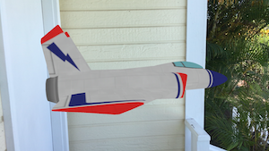
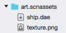

# Introduction to ARKit in Xamarin.iOS

_Augmented Reality for iOS 11_

ARKit enables a wide variety of augmented reality applications and games

<a name="gettingstarted"></a>

## Getting Started with ARKit

To get started with augmented reality, the following instructions walk through a simple application: positioning a 3D model and letting ARKit keep the model in place with its tracking functionality.



### 1. Add a 3D model

Assets should be added to the project with the **SceneKitAsset** build action.



### 2. Configure the view

In the view controller's `ViewDidLoad` method, load the scene asset and set the `Scene` property on the view:

```csharp
ARSCNView SceneView = (View as ARSCNView);

// Create a new scene
var scene = SCNScene.FromFile("art.scnassets/ship");

// Set the scene to the view
SceneView.Scene = scene;
```

### 3. Optionally implement a session delegate

Although not required for simple cases, implementing a session delegate can be helpful for debugging the state of the ARKit session (and in real applications, providing feedback to the user). Create a simple delegate using the code below:

```csharp
public class SessionDelegate : ARSessionDelegate
{
  public SessionDelegate() {}
  public override void CameraDidChangeTrackingState(ARSession session, ARCamera camera)
  {
    Console.WriteLine("{0} {1}", camera.TrackingState, camera.TrackingStateReason);
  }
}
```

Assign the delegate in the in the `ViewDidLoad` method:

```csharp
// Track changes to the session
SceneView.Session.Delegate = new SessionDelegate();
```

### 4. Position the 3D model in the world

In `ViewWillAppear`, the following code establishes an ARKit session
and sets the position of the 3D model in space relative to the device's camera:

```csharp
// Create a session configuration
var configuration = new ARWorldTrackingConfiguration {
  PlaneDetection = ARPlaneDetection.Horizontal,
  LightEstimationEnabled = true
};

// Run the view's session
SceneView.Session.Run(configuration, ARSessionRunOptions.ResetTracking);

// Find the ship and position it just in front of the camera
var ship = SceneView.Scene.RootNode.FindChildNode("ship", true);

ship.Position = new SCNVector3(2f, -2f, -9f);
```

Each time the application is run or resumed, the 3D model will be positioned in front of the camera. Once the model is positioned, move the camera and watch as ARKit keeps the model positioned.

### 5. Pause the augmented reality session

It is good practice to pause the ARKit session when the view controller is not visible (in the `ViewWillDisappear` method:

```csharp
SceneView.Session.Pause();
```

## Summary

The above code results in a simple ARKit application. More complex examples
would expect the view controller hosting the augmented reality session to
implement `IARSCNViewDelegate`, and additional methods be implemented.

ARKit provides lots of more sophisticated features, such as surface tracking, and user interaction.

## Related Links

- [Augmented Reality (Apple)](https://developer.apple.com/arkit/)
- [Simple ARKit (Jet) Sample](/samples/xamarin/ios-samples/ios11-arkitsample)
- [ARKit Placing Objects (sample)](/samples/xamarin/ios-samples/ios11-arkitplacingobjects)
- [Introducing ARKit - Augmented Reality for iOS (WWDC) (video)](https://developer.apple.com/videos/play/wwdc2017/602/)
