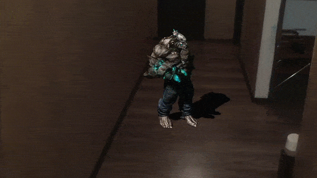
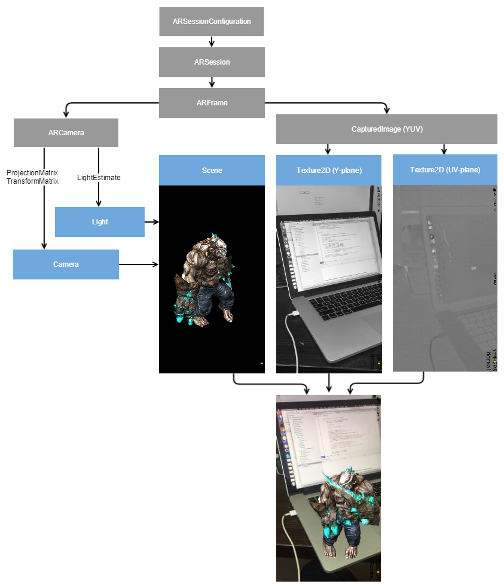
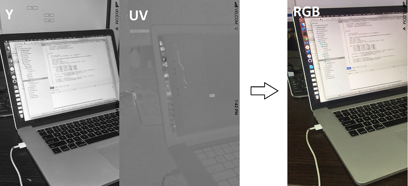
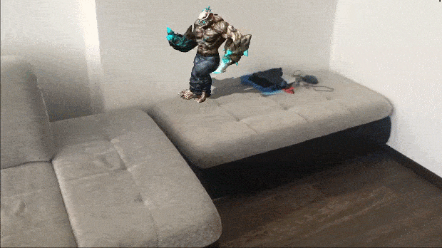

# Using ARKit with UrhoSharp in Xamarin.iOS

With the introduction of [ARKit](https://developer.apple.com/arkit/), Apple has made it simple for developers to create augmented reality applications. ARKit can track the exact position of your device and detect various surfaces on the world, and it is then up to the developer to blend the data coming out of ARKit into your code.

[UrhoSharp](~/graphics-games/urhosharp/index.md) provides a comprehensive and easy to use 3D API that  you can use to create 3D applications.   Both of these can be blended together, ARKit to provide the physical information about the world, and Urho to render the results.

This page explains how to connect these two worlds together to create great augmented reality applications.


## The Basics

What we want to do is present 3D content on top of the world as seen by the iPhone/iPad.   The idea is to blend the contents coming from the device’s camera with the 3D content, and as the user of the device moves around the room to ensure that the 3D object behave as is they part of that room - this is done by anchoring the objects into this world.




We will be using the Urho library to load our 3D assets and place them on the world, and we will be using ARKit to get the video stream coming from the camera as well as the location of the phone in the world.   As the user moves with his phone, we will use the changes in the location to update the coordinate system that the Urho engine is displaying.

This way, when you place an object in the 3D space and the user moves, the location of the 3D object reflects the place and location where it was placed.

## Setting up your application

### iOS Application Launch

Your iOS application needs to create and launch your 3D content, you do this by creating an implementing a subclass of the [`Urho.Application`](https://developer.xamarin.com/api/type/Urho.Application/) and provide your setup code by overriding the `Start` method.  This is where your scene gets populated with data, event handlers are setup and so on.

We have introduced an `Urho.ArkitApp` class that subclasses `Urho.Application` and on its `Start` method does the heavy lifting.   All you need to do to your existing Urho application is change the base class to be of type `Urho.ArkitApp` and you have an application that will run your urho Scene in the world.

### The ArkitApp Class

This class provides a set of convenient defaults, both a scene with some key objects as well as the processing of ARKit events as they are delivered by the operating system.

The setup takes place in the `Start`  virtual method.   When you override this method on your subclass, you need to make sure to chain to your parent by using `base.Start()` on your own implementation.

The `Start`  method sets up the scene, viewport, camera and a directional light, and surfaces those as public properties:

- a [`Scene`](https://developer.xamarin.com/api/type/Urho.Scene/) to hold your objects,
- a directional [`Light`](https://developer.xamarin.com/api/type/Urho.Light/) with shadows, and whose location is available via the `LightNode`  property
- a [`Camera`](https://developer.xamarin.com/api/type/Urho.Camera/) whose components are updated when ARKit delivers an update to the application and
- a [`ViewPort`](https://developer.xamarin.com/api/type/Urho.Viewport/) displaying the results.


### Your code

You then need to subclass the `ArkitApp` class and override the `Start` method.   The first thing that your method should do is chain up to the `ArkitApp.Start` by calling `base.Start()`.  After that, you can use any of the properties setup by ArkitApp to add your objects to the scene, customize the lights, shadows or events that you want to handle.

The ARKit/UrhoSharp sample loads an animated character with textures and plays the animation, with the following implementation:

    ```csharp
    public class MutantDemo : ArkitApp
    {
        [Preserve]
        public MutantDemo(ApplicationOptions opts) : base(opts) { }

        Node mutantNode;

        protected override void Start()
        {
            base.Start ();

            // Mutant
            mutantNode = Scene.CreateChild();
            mutantNode.Rotation = new Quaternion(x: 0, y:15, z:0);
            mutantNode.Position = new Vector3(0, -1f, 2f); /*two meters away*/
            mutantNode.SetScale(0.5f);

            var mutant = mutantNode.CreateComponent<AnimatedModel>();
            mutant.Model = ResourceCache.GetModel("Models/Mutant.mdl");
            mutant.Material = ResourceCache.GetMaterial("Materials/mutant_M.xml");

            var animation = mutantNode.CreateComponent<AnimationController>();
            animation.Play("Animations/Mutant_HipHop1.ani", 0, true, 0.2f);
        }
    }
    ```

And that is really all that you have to do at this point to have your 3D content displayed in augmented reality.

Urho uses custom formats for 3D models and animations, so you need to export your assets into this format.   You can use tools like the [Urho3D Blender Add-in](https://github.com/reattiva/Urho3D-Blender) and [UrhoAssetImporter](https://github.com/EgorBo/UrhoAssetImporter) that can convert these assets from popular formats like DBX, DAE, OBJ, Blend, 3D-Max into the format required by Urho.

To learn more about creating 3D applications using Urho, visit the [Introduction to UrhoSharp](~/graphics-games/urhosharp/introduction.md) guide.

## ArkitApp in Depth

> [!NOTE]
> This section is intended for developers that want to customize the default experience of UrhoSharp and ARKit or want to get a deeper insight on how the integration works.   It is not necessary to read this section.

The ARKit API is pretty simple, you create and configure an [ARSession](https://developer.apple.com/documentation/arkit/arsession) object which then start delivering [ARFrame](https://developer.apple.com/documentation/arkit/arframe) objects.   These contain both the image captured by the camera as well as the estimated real-world position of the device.

We will be composing the images being delivered by the camera to us with our 3D content, and adjust the camera in UrhoSharp to match the chances in the device location and position.

The following diagram shows what is taking place in the `ArkitApp` class:

[](urhosharp-images/image2.png#lightbox)

### Rendering the Frames

The idea is simple, combine the video coming out of the camera with our 3D graphics to produce the combined image.     We will be getting a series of these captured images in sequence, and we will mix this input with the Urho scene.

The simplest way to do it is to insert a [`RenderPathCommand`](https://developer.xamarin.com/api/type/Urho.RenderPathCommand/) into the main [`RenderPath`](https://developer.xamarin.com/api/type/Urho.RenderPath/).  This is a set of commands that are performed to draw a single frame.  This command will fill the viewport with any texture we pass to it.    We set this up on the first frame that is process, and the actual definition is done in th **ARRenderPath.xml** file that is loaded at this point.

However, we are faced with two problems to blend these two worlds together:


1. On iOS, GPU Textures must have a resolution that is a power of two, but the frames that we will get from the camera do not have resolution that are a power of two, for example: 1280x720.
2. The frames are encoded in [YUV](https://en.wikipedia.org/wiki/YUV) format, represented by two images - luma and chroma.

The YUV frames come in two different resolutions.  a 1280x720 image representing luminance (basically a gray scale image) and much smaller 640x360 for the chrominance component:




To draw a full colored image using OpenGL ES we have to write a small shader that takes luminance (Y component) and chrominance (UV planes) from the texture slots.  In UrhoSharp they have names - “sDiffMap” and “sNormalMap”  and convert them into RGB format:

```csharp
mat4 ycbcrToRGBTransform = mat4(
    vec4(+1.0000, +1.0000, +1.0000, +0.0000),
    vec4(+0.0000, -0.3441, +1.7720, +0.0000),
    vec4(+1.4020, -0.7141, +0.0000, +0.0000),
    vec4(-0.7010, +0.5291, -0.8860, +1.0000));

vec4 ycbcr = vec4(texture2D(sDiffMap, vTexCoord).r,
                    texture2D(sNormalMap, vTexCoord).ra, 1.0);
gl_FragColor = ycbcrToRGBTransform * ycbcr;
```

To render the texture that does not have a power of two resolution we have to define Texture2D with the following parameters:

```chsarp
// texture for UV-plane;
cameraUVtexture = new Texture2D();
cameraUVtexture.SetNumLevels(1);
cameraUVtexture.SetSize(640, 360, Graphics.LuminanceAlphaFormat, TextureUsage.Dynamic);
cameraUVtexture.FilterMode = TextureFilterMode.Bilinear;
cameraUVtexture.SetAddressMode(TextureCoordinate.U, TextureAddressMode.Clamp);
cameraUVtexture.SetAddressMode(TextureCoordinate.V, TextureAddressMode.Clamp);
```

Thus we are able to render captured images as a background and render any scene above it like that scary mutant.

### Adjusting the Camera

The `ARFrame` objects also contain the estimated device position.  We now we need to move game camera ARFrame - before ARKit it was not a big deal to track device orientation (roll, pitch and yaw) and render a pinned hologram on top of the video - but if you move your device a bit - holograms will drift.

That happens because built-in sensors such as gyroscope are not able to track movements, they can only acceleration.  ARKit analyses each frame and extracts feature points to track and thus is able to give us an accurate Transform matrix containing movement and rotation data.

For example, this is how we can obtain current position:

```csharp
var row = arCamera.Transform.Row3;
CameraNode.Position = new Vector3(row.X, row.Y, -row.Z);
```

We use `-row.Z` because ARKit uses a right-handed coordinate system.


### Plane detection

ARKit is able to detect horizontal planes and this ability allows you to interact with the real world, for example, we can place the mutant on a real table or a floor. The simplest way to do that is to use HitTest method (raycasting). It converts screen coordinates (0.5;0.5 is the center) into the real world coordinates (0;0;0 is the first frame's location).

```chsarp
protected Vector3? HitTest(float screenX = 0.5f, float screenY = 0.5f)
{
    var result = ARSession.CurrentFrame.HitTest(new CGPoint(screenX, screenY),
        ARHitTestResultType.ExistingPlaneUsingExtent)?.FirstOrDefault();
    if (result != null)
    {
        var row = result.WorldTransform.Row3;
        return new Vector3(row.X, row.Y, -row.Z);
    }
    return null;
}
```

now we can place the mutant on a horizontal surface depending on where on the device screen we tap:

```chsarp
void OnTouchEnd(TouchEndEventArgs e)
{
    float x = e.X / (float)Graphics.Width;
    float y = e.Y / (float)Graphics.Height;
    var pos = HitTest(x, y);
    if (pos != null)
    mutantNode.Position = pos.Value;
}
```



### Realistic lighting

Depending on the real world lighting conditions, the virtual scene should be lighter or darker to better match its surroundings. ARFrame contains a LightEstimate property that we can use to adjust the Urho ambient light, this is done like this:


    var ambientIntensity = (float) frame.LightEstimate.AmbientIntensity / 1000f;
    var zone = Scene.GetComponent<Zone>();
    zone.AmbientColor = Color.White * ambientIntensity;


### Beyond iOS - HoloLens

UrhoSharp [runs on all major operating systems](~/graphics-games/urhosharp/platform/index.md), so you can reuse your existing code elsewhere.

HoloLens is one of the most exciting platforms it runs on.   This means that you can easily switch between iOS and HoloLens to build awesome Augmented Reality applications using UrhoSharp.

You can find the MutantDemo source at [github.com/EgorBo/ARKitXamarinDemo](https://github.com/EgorBo/ARKitXamarinDemo).


## Related Links

- [UrhoSharp](~/graphics-games/urhosharp/index.md)
- [ARKitXamarinDemo (with UrhoSharp) (sample)](https://github.com/EgorBo/ARKitXamarinDemo)
