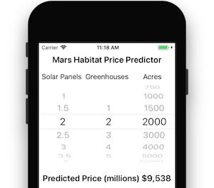
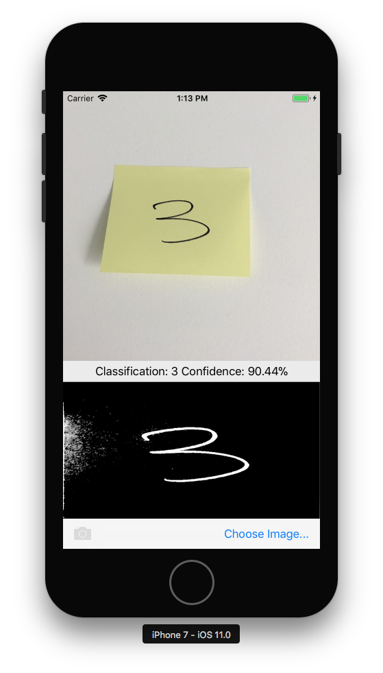
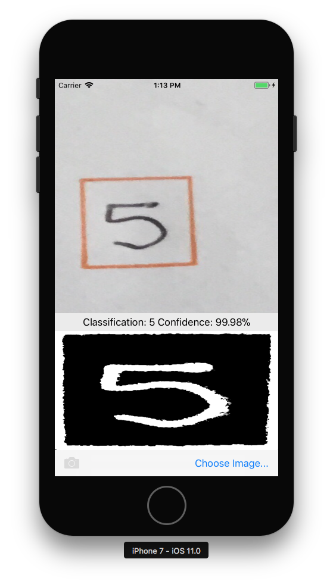

# Introduction to CoreML in Xamarin.iOS

CoreML brings machine learning to iOS – apps can take advantage of
trained machine learning models to perform all sorts of tasks, from
problem solving to image recognition.

This introduction covers the following:

- [Getting Started with CoreML](#coreml)
- [Using CoreML with the Vision framework](#coremlvision)

<a name="coreml"></a>

## Getting Started with CoreML

These steps describe how to add CoreML to an iOS project. Refer to the [Mars Habitat Pricer sample](/samples/xamarin/ios-samples/ios12-marshabitatcoremltimer/) for a practical example.



### 1. Add the CoreML model to the project

Add a CoreML model (a file with the **.mlmodel** extension) to the **Resources** directory of the project. 

In the model file's properties, its **Build action** is set to **CoreMLModel**. This means that it will be compiled into an **.mlmodelc** file when the application is built.

### 2. Load the model

Load the model using the `MLModel.Create` static method:

```csharp
var assetPath = NSBundle.MainBundle.GetUrlForResource("NameOfModel", "mlmodelc");
model = MLModel.Create(assetPath, out NSError error1);
```

### 3. Set the parameters

Model parameters are passed in and out using a container class that implements
`IMLFeatureProvider`.

Feature provider classes behave like a dictionary of string and `MLFeatureValue`s, where each feature value could be a simple string or number, an array or data, or a pixel buffer containing an image.

Code for a single-value feature provider is shown below:

```csharp
public class MyInput : NSObject, IMLFeatureProvider
{
  public double MyParam { get; set; }
  public NSSet<NSString> FeatureNames => new NSSet<NSString>(new NSString("myParam"));
  public MLFeatureValue GetFeatureValue(string featureName)
  {
    if (featureName == "myParam")
      return MLFeatureValue.FromDouble(MyParam);
    return MLFeatureValue.FromDouble(0); // default value
  }
```

Using classes like this, input parameters can be provided in a way that is understood by CoreML. The names of the features (such as `myParam` in the code example) must match what the model expects.

### 4. Run the model

Using the model requires that the feature provider to be instantiated and parameters set, then that the `GetPrediction` method be called:

```csharp
var input = new MyInput {MyParam = 13};
var outFeatures = model.GetPrediction(inputFeatures, out NSError error2);
```

### 5. Extract the results

The prediction result `outFeatures` is also an instance of `IMLFeatureProvider`; output values can be
accessed using `GetFeatureValue` with the name of each output parameter (such as `theResult`), as in this example:

```csharp
var result = outFeatures.GetFeatureValue("theResult").DoubleValue; // eg. 6227020800
```

<a name="coremlvision"></a>

## Using CoreML with the Vision Framework

CoreML can also be used in conjunction with the Vision framework to perform
operations on image, such as shape recognition, object identification, and other
tasks.

The steps below describe how CoreML and Vision are used together in the
[CoreMLVision sample](/samples/xamarin/ios-samples/ios11-coremlvision). The sample combines
the [rectangles recognition](~/ios/platform/introduction-to-ios11/vision.md#rectangles) from the Vision framework with the _MNINSTClassifier_ CoreML model to identify a handwritten digit in a photograph.

 

### 1. Create a Vision CoreML model

The CoreML model _MNISTClassifier_ is loaded and then wrapped in a `VNCoreMLModel`
which makes the model available for Vision tasks. This code also creates two Vision
requests: first for finding rectangles in an image, and then for processing a rectangle
with the CoreML model:

```csharp
// Load the ML model
var bundle = NSBundle.MainBundle;
var assetPath = bundle.GetUrlForResource("MNISTClassifier", "mlmodelc");
NSError mlErr, vnErr;
var mlModel = MLModel.Create(assetPath, out mlErr);
var model = VNCoreMLModel.FromMLModel(mlModel, out vnErr);

// Initialize Vision requests
RectangleRequest = new VNDetectRectanglesRequest(HandleRectangles);
ClassificationRequest = new VNCoreMLRequest(model, HandleClassification);
```

The class still needs to implement the `HandleRectangles` and `HandleClassification`
methods for the Vision requests, shown in steps 3 and 4 below.

### 2. Start the Vision processing

The following code starts processing the request. In the **CoreMLVision** sample, this
code runs after the user has selected an image:

```csharp
// Run the rectangle detector, which upon completion runs the ML classifier.
var handler = new VNImageRequestHandler(ciImage, uiImage.Orientation.ToCGImagePropertyOrientation(), new VNImageOptions());
DispatchQueue.DefaultGlobalQueue.DispatchAsync(()=>{
  handler.Perform(new VNRequest[] {RectangleRequest}, out NSError error);
});
```

This handler passes the `ciImage` to the Vision framework `VNDetectRectanglesRequest` that was
created in step 1.

### 3. Handle the results of Vision processing

Once the rectangle detection is complete, it executes the `HandleRectangles` method,
which crops the image to extract the first rectangle, converts the rectangle image to greyscale,
and passes it to the CoreML model for classification.

The `request` parameter passed to this method contains the details of the Vision request,
and using the `GetResults<VNRectangleObservation>()` method, it returns a list of rectangles
found in the image. The first rectangle `observations[0]` is extracted and passed to the
CoreML model:

```csharp
void HandleRectangles(VNRequest request, NSError error) {
  var observations = request.GetResults<VNRectangleObservation>();
  // ... omitted error handling ...
  var detectedRectangle = observations[0]; // first rectangle
  // ... omitted cropping and greyscale conversion ...
  // Run the Core ML MNIST classifier -- results in handleClassification method
  var handler = new VNImageRequestHandler(correctedImage, new VNImageOptions());
  DispatchQueue.DefaultGlobalQueue.DispatchAsync(() => {
    handler.Perform(new VNRequest[] {ClassificationRequest}, out NSError err);
  });
}
```

The `ClassificationRequest` was initialized in step 1 to use the `HandleClassification`
method defined in the next step.

### 4. Handle the CoreML

The `request` parameter passed to this method contains the details of the CoreML request,
and using the `GetResults<VNClassificationObservation>()` method, it returns a list of
possible results ordered by confidence (highest confidence first):

```csharp
void HandleClassification(VNRequest request, NSError error){
  var observations = request.GetResults<VNClassificationObservation>();
  // ... omitted error handling ...
  var best = observations[0]; // first/best classification result
  // render in UI
  DispatchQueue.MainQueue.DispatchAsync(()=>{
    ClassificationLabel.Text = $"Classification: {best.Identifier} Confidence: {best.Confidence * 100f:#.00}%";
  });
}
```

## Samples

There are three CoreML samples to try:

- The [Mars Habitat Price Predictor sample](/samples/xamarin/ios-samples/ios12-marshabitatcoremltimer/) has simple numeric inputs and outputs.

- The [Vision & CoreML sample](/samples/xamarin/ios-samples/ios11-coremlvision) accepts an image parameter, and uses the Vision framework to identify square regions in the image, which are passed to a CoreML model that recognizes single digits.

- Finally, the [CoreML Image Recognition sample](/samples/xamarin/ios-samples/ios11-coremlimagerecognition) uses CoreML to identify features in a photo. By default it uses the smaller **SqueezeNet** model (5MB), but it's been written so that you can download and incorporate the larger **VGG16** model (553MB). For more information, see the [sample's readme](https://github.com/xamarin/ios-samples/blob/master/ios11/CoreMLImageRecognition/CoreMLImageRecognition/README.md).

## Related Links

- [Machine Learning (Apple)](https://developer.apple.com/machine-learning/)
- [CoreML Example (Mars Habitat) (sample)](/samples/xamarin/ios-samples/ios12-marshabitatcoremltimer/)
- [CoreML and Vision (Number Recognition) (sample)](/samples/xamarin/ios-samples/ios11-coremlvision)
- [CoreML Image Recognition (sample)](/samples/xamarin/ios-samples/ios11-coremlimagerecognition)
- [CoreML with Azure Custom Vision (sample)](/samples/xamarin/ios-samples/ios11-coremlazuremodel)
- [Introducing CoreML (WWDC) (video)](https://developer.apple.com/videos/play/wwdc2017/703/)