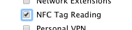
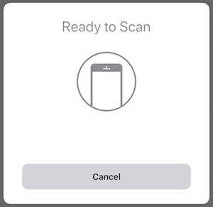

# Core NFC in Xamarin.iOS

_Reading Near Field Communication (NFC) tags using iOS 11_

CoreNFC is a new framework in iOS 11 that provides access to the
_Near Field Communication_ (NFC) radio to read tags from within apps. CoreNFC works on iPhone 7, iPhone 7 Plus, iPhone 8, iPhone 8 Plus, iPhone X, iPhone XS, and iPhone 11 models (while iPhone 6 and iPhone 6 Plus models have NFC payment functionality, they do not support CoreNFC).

The NFC tag reader in iOS devices supports all NFC tag types 1 through 5 that
contain _NFC Data Exchange Format_ (NDEF) information.

There are some restrictions to be aware of:

- CoreNFC only supports tag reading (not writing or formatting).
- Tag scans must be user-initiated, and time-out after 60 seconds.
- Apps must be visible in the foreground for scanning.
- CoreNFC can only be tested on real devices (not on the simulator).

This page describes the configuration required to use CoreNFC
and shows how to use the API using the ["NFCTagReader" sample code](/samples/xamarin/ios-samples/ios11-nfctagreader).

## Configuration

To enable CoreNFC, you must configure three items in your project:

- An **Info.plist** privacy key.
- An **Entitlements.plist** entry.
- A provisioning profile with **NFC Tag Reading** capability.

### Info.plist

Add the **NFCReaderUsageDescription** privacy key and text, which is displayed to the user while scanning is occurring. Use a message appropriate
for your application (for example, explain the purpose of the scan):

```xml
<key>NFCReaderUsageDescription</key>
<string>NFC tag to read NDEF messages into the application</string>
```

### Entitlements.plist

Your app must request the **Near Field Communications Tag Reading**
capability using the following key/value pair in your **Entitlements.plist**:

```xml
<key>com.apple.developer.nfc.readersession.formats</key>
<array>
  <string>NDEF</string>
</array>
```

### Provisioning Profile

Create a new **App ID** and ensure that the **NFC Tag Reading** service is ticked:

[](corenfc-images/app-services-nfc.png#lightbox)

You should then create a new provisioning profile for this App ID, then download and install it on your development Mac.

## Reading a Tag

Once your project is configured, add `using CoreNFC;` to the top of the file
and follow these three steps to implement NFC tag reading functionality:

### 1. Implement `INFCNdefReaderSessionDelegate`

The interface has two methods to be implemented:

- `DidDetect` – Called when a tag is successfully read.
- `DidInvalidate` – Called when an error occurs or the 60 second timeout is reached.

#### DidDetect

In the sample code, each scanned message is added to a table view:

```csharp
public void DidDetect(NFCNdefReaderSession session, NFCNdefMessage[] messages)
{
    foreach (NFCNdefMessage msg in messages)
    {  // adds the messages to a list view
        DetectedMessages.Add(msg);
    }
    DispatchQueue.MainQueue.DispatchAsync(() =>
    {
        this.TableView.ReloadData();
    });
}
```

This method may be called multiple times (and an array of messages may be passed in) if the session allows for multiple tag reads. This is set using the third parameter of the `Start` method (explained in [step 2](#step2)).

#### DidInvalidate

Invalidation can occur for a number of reasons:

- An error occurred while scanning.
- The app ceased to be in the foreground.
- The user chose to cancel the scan.
- The scan was cancelled by the app.

The code below shows how to handle an error:

```csharp
public void DidInvalidate(NFCNdefReaderSession session, NSError error)
{
    var readerError = (NFCReaderError)(long)error.Code;
    if (readerError != NFCReaderError.ReaderSessionInvalidationErrorFirstNDEFTagRead &&
        readerError != NFCReaderError.ReaderSessionInvalidationErrorUserCanceled)
    {
      // some error handling
    }
}
```

Once a session has been invalidated, a new session object must
be created to scan again.

<a name="step2"></a>

### 2. Start an `NFCNdefReaderSession`

Scanning should start with a user request, such as a button press.
The following code creates and starts a scanning session:

```csharp
Session = new NFCNdefReaderSession(this, null, true);
Session?.BeginSession();
```

The parameters for the `NFCNdefReaderSession` constructor are as follows:

- `delegate` – An implementation of `INFCNdefReaderSessionDelegate`. In the sample code, the delegate is implemented in the table view controller, therefore `this` is used as the delegate parameter.
- `queue` – The queue that callbacks are handled on. It can be `null`, in which case be sure to use the `DispatchQueue.MainQueue` when updating user interface controls (as shown in the sample).
- `invalidateAfterFirstRead` – When `true`, the scan stops after the first successful scan; when `false` scanning will continue and multiple results returned until the scan is cancelled or the 60 second timeout is reached.

### 3. Cancel the scanning session

The user can cancel the scanning session via a system-provided
button in the user-interface:



The app can programmatically cancel the scan by calling the
`InvalidateSession` method:

```csharp
Session.InvalidateSession();
```

In both cases, the delegate's `DidInvalidate` method will
be called.

## Summary

CoreNFC enables your app to read data from NFC tags. It supports
reading a variety of tag formats (NDEF types 1 through 5), but does
not support writing or formatting.

## Related Links

- [NFCTagReader (sample)](/samples/xamarin/ios-samples/ios11-nfctagreader)
- [Introducing Core NFC (WWDC) (video)](https://developer.apple.com/videos/play/wwdc2017/718/)