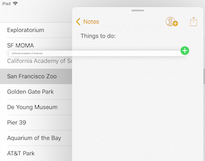

# Drag and Drop in Xamarin.iOS

_Implementing drag and drop for iOS 11_

iOS 11 includes drag and drop support to copy data between applications
on the iPad. Users can select and drag all types of content from apps
positioned side-by-side, or by dragging over an app icon which will
trigger the app to open and to allow the data to be dropped:



> [!NOTE]
> Prior to iOS 15, drag and drop is only available within the same app on iPhone. iOS 15 introduces cross-app drag and drop.

Consider supporting drag and drop operations anywhere content can be
created or edited:

- Text controls support drag and drop for all apps built against iOS 11, without any additional work.
- Table views and collection views include enhancements in iOS 11 that simplify
adding drag and drop behavior.
- Any other view can be made to support drag and drop with additional customization.

When adding drag and drop support to your apps, you can provide different levels
of content fidelity; for example, you might provide both a formatted text and plain
text version of the data so that the receiving app can choose which fits best into
the drag target. It is also possible to customize the drag visualization, and also
to enable dragging multiple items at once.

## Drag and Drop with text controls

`UITextView` and `UITextField` automatically support dragging selected
text out, and dropping text content in.

<a name="uitableview"></a>

## Drag and Drop with UITableView

`UITableView` has built-in handling for drag and drop interactions
with table rows, requiring only a few methods to enable the default behavior.

There are two interfaces involved:

- `IUITableViewDragDelegate` – Packages information when a drag is initiated in the table view.
- `IUITableViewDropDelegate` – Processes information when a drop is being attempted and completed.

In the [DragAndDropTableView sample](/samples/xamarin/ios-samples/ios11-draganddroptableview)
these two interfaces are both implemented on the `UITableViewController`
class, along with the delegate and data source. They're assigned in the
`ViewDidLoad` method:

```csharp
this.TableView.DragDelegate = this;
this.TableView.DropDelegate = this;
```

The minimal required code for these two interfaces is explained below.

### Table View Drag Delegate

The only method _required_ to support dragging a row
from a table view is `GetItemsForBeginningDragSession`. If the user starts to drag a row, this method will be called.

An implementation is shown below. It retrieves the data associated with the dragged row,
encodes it, and configures an `NSItemProvider` which determines
how applications will handle the "drop" part of the operation (for example,
whether they can handle the data type, `PlainText`, in the example):

```csharp
public UIDragItem[] GetItemsForBeginningDragSession (UITableView tableView,
  IUIDragSession session, NSIndexPath indexPath)
{
  // gets the 'information' to be dragged
  var placeName = model.PlaceNames[indexPath.Row];
  // convert to NSData representation
  var data = NSData.FromString(placeName, NSStringEncoding.UTF8);
  // create an NSItemProvider to describe the data
  var itemProvider = new NSItemProvider();
  itemProvider.RegisterDataRepresentation(UTType.PlainText,
                                NSItemProviderRepresentationVisibility.All,
                                (completion) =>
  {
    completion(data, null);
    return null;
  });
  // wrap in a UIDragItem
  return new UIDragItem[] { new UIDragItem(itemProvider) };
}
```

There are many optional methods on the drag delegate that can be
implemented to customize the drag behavior, such as providing multiple
data representations which can be taken advantage of in target apps (such
as formatted text as well as plain text, or a vector and bitmap versions
of a drawing). You can also provide custom data representations to
be used when dragging and dropping within the same app.

### Table View Drop Delegate

The methods on the drop delegate are called when a drag operation
occurs over a table view, or completes above it. The required methods determine
whether the data is allowed to be dropped, and what actions are taken
if the drop is completed:

- `CanHandleDropSession` – While a drag is in progress, and potentially being dropped
on the application, this method determines whether the data being dragged is allowed to be dropped.
- `DropSessionDidUpdate` – While the drag is in progress, this method is called to determine what action is intended. Information from the table view being dragged over, the drag session, and the possible index path can all be used to determine the behavior and visual feedback provided to the user.
- `PerformDrop` – When the user completes the drop (by lifting their finger), this method extracts the data being dragged and modifies the table view to add the data in a new row (or rows).

#### CanHandleDropSession

`CanHandleDropSession` indicates whether the table view can accept the data being
dragged. In this code snippet, `CanLoadObjects` is used
to confirm that this table view can accept string data.

```csharp
public bool CanHandleDropSession(UITableView tableView, IUIDropSession session)
{
  return session.CanLoadObjects(typeof(NSString));
}
```

#### DropSessionDidUpdate

The `DropSessionDidUpdate` method is called repeatedly while the drag operation is in progress,
to provide visual cues to the user.

In the code below, `HasActiveDrag` is used to determine whether the operation
originated in the current table view. If so, only single rows are allowed to be moved.
If the drag is from another source, a copy operation will be indicated:

```csharp
public UITableViewDropProposal DropSessionDidUpdate(UITableView tableView, IUIDropSession session, NSIndexPath destinationIndexPath)
{
  // The UIDropOperation.Move operation is available only for dragging within a single app.
  if (tableView.HasActiveDrag)
  {
    if (session.Items.Length > 1)
    {
        return new UITableViewDropProposal(UIDropOperation.Cancel);
    } else {
        return new UITableViewDropProposal(UIDropOperation.Move, UITableViewDropIntent.InsertAtDestinationIndexPath);
    }
  } else {
    return new UITableViewDropProposal(UIDropOperation.Copy, UITableViewDropIntent.InsertAtDestinationIndexPath);
  }
}
```

The drop operation can be one of `Cancel`, `Move`, or `Copy`.

The drop intent can be to insert a new row, or add/append data to
an existing row.

#### PerformDrop

The `PerformDrop` method is called when the user completes the operation,
and modifies the table view and data source to reflect the dropped data.

```csharp
public void PerformDrop(UITableView tableView, IUITableViewDropCoordinator coordinator)
{
  NSIndexPath indexPath, destinationIndexPath;
  if (coordinator.DestinationIndexPath != null)
  {
    indexPath = coordinator.DestinationIndexPath;
    destinationIndexPath = indexPath;
  }
  else
  {
    // Get last index path of table view
    var section = tableView.NumberOfSections() - 1;
    var row = tableView.NumberOfRowsInSection(section);
    destinationIndexPath = NSIndexPath.FromRowSection(row, section);
  }
  coordinator.Session.LoadObjects(typeof(NSString), (items) =>
  {
    // Consume drag items
    List<string> stringItems = new List<string>();
    foreach (var i in items)
    {
      var q = NSString.FromHandle(i.Handle);
      stringItems.Add(q.ToString());
    }
    var indexPaths = new List<NSIndexPath>();
    for (var j = 0; j < stringItems.Count; j++)
    {
      var indexPath1 = NSIndexPath.FromRowSection(destinationIndexPath.Row + j, destinationIndexPath.Section);
      model.AddItem(stringItems[j], indexPath1.Row);
      indexPaths.Add(indexPath1);
    }
    tableView.InsertRows(indexPaths.ToArray(), UITableViewRowAnimation.Automatic);
  });
}
```

Additional code can be added to asynchronously load large data objects.

### Testing Drag and Drop

You must use an iPad to test the [sample](/samples/xamarin/ios-samples/ios11-draganddroptableview).
Open the sample alongside another app (such as Notes) and
drag rows and text between them:


## Related Links

- [Drag and Drop Human Interface Guidelines (Apple)](https://developer.apple.com/design/human-interface-guidelines/drag-and-drop)
- [Drag and Drop Table View Sample](/samples/xamarin/ios-samples/ios11-draganddroptableview)
- [Drag and Drop Collection View Sample](/samples/xamarin/ios-samples/ios11-draganddropcollectionview)
- [Introducing Drag and Drop (WWDC) (video)](https://developer.apple.com/videos/play/wwdc2017/203/)
- [Drag and Drop with Collection and Table View (WWDC) (video)](https://developer.apple.com/videos/play/wwdc2017/223/)
