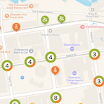
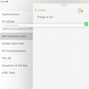
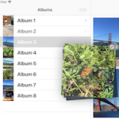
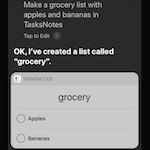

# Introduction to iOS 11

        

iOS 11 includes many brand-new features and enhancements across a variety of frameworks:

## [Preparing Your App for iOS 11](updating-your-app/index.md)

Apple has introduced architecture updates, new visual changes, and an updated iTunes Connect process for iOS 11. Use this guide to make sure your Xamarin.iOS app is prepared for the new release.

## [ARKit](arkit/index.md)

ARKit brings Augmented Reality to iOS, allowing users to interact with the world through the device's camera.

## [CoreML](coreml.md)

Machine learning models can be integrated into iOS 11 apps with CoreML. The CoreML framework provides simple API to incorporate existing models into app projects to allow problems to be analyzed right in the app.

## [CoreNFC](corenfc.md)

iPhone 7 and newer devices can read Near Field Communication (NFC) tags,
enabling apps to detect tagged products, places, or things in the
world around them.

## [Drag and Drop](drag-and-drop.md)

The drag and drop framework brings iOS-wide support for moving data around by touch. On iPad, you can drag both within and between different apps; while on iPhone, you can drag only within the same app. There is support for many types of customization, including rich data types, animations, and handling multitouch gestures.

## [MapKit](mapkit.md)

MapKit has a number of improvements, including support for automatic marker grouping
and adding a compass to the view.

## PDFKit

PDFKit is now available on iOS 11, bringing PDF creation and editing capabilities to your apps.

## [SiriKit](sirikit.md)

Siri now supports even more interactions, including lists and notes, and other enhancements such as alternative app names.

## [Vision](vision.md)

Brings a variety of image processing and analysis features to iOS, including face detection and recognition, CoreML models, new barcode detection APIs, text and horizon detection, and more general object detection and tracking.

## Samples

We have a number of C# [samples](/samples/browse/?products=xamarin&term=Xamarin.iOS%2biOS11) to get you started:

- [ARKit Sample](/samples/xamarin/ios-samples/ios11-arkitsample)
- [ARKit Placing Objects](/samples/xamarin/ios-samples/ios11-arkitplacingobjects)
- [CoreML Image Recognition Sample](/samples/xamarin/ios-samples/ios11-coremlimagerecognition)
- [CoreML with Azure Custom Model](/samples/xamarin/ios-samples/ios11-coremlazuremodel)
- [CoreNFC Tag Reader Sample](/samples/xamarin/ios-samples/ios11-nfctagreader)
- [Drag & Drop Table View](/samples/xamarin/ios-samples/ios11-draganddroptableview)
- [Drag & Drop Collection View](/samples/xamarin/ios-samples/ios11-draganddropcollectionview)
- [Drag & Drop Custom View](/samples/xamarin/ios-samples/ios11-draganddropcustomview)
- [DragBoard Drag & Drop Sample](/samples/xamarin/ios-samples/ios11-draganddropdragboard)
- [MapKit Sample](/samples/xamarin/ios-samples/ios11-mapkitsample)
- [SiriKit Sample](/samples/xamarin/ios-samples/ios11-sirikitsample)
- [Updated Photos framework sample](/samples/xamarin/ios-samples/ios11-samplephotoapp)
- [Vision & CoreML Sample](/samples/xamarin/ios-samples/ios11-coremlvision)
- [Vision Rectangles Detection Sample](/samples/xamarin/ios-samples/ios11-visionrectangles/)
- [Vision Faces Detection Sample](/samples/xamarin/ios-samples/ios11-visionfaces)
- [PDKFit Widgets Sample](/samples/xamarin/ios-samples/ios11-pdfannotationwidgetsadvanced)
- [PDFKit Watermark Sample](/samples/xamarin/ios-samples/ios11-pdfdocumentwatermark)

## Related Links

- [Xamarin iOS 11 Samples](/samples/browse/?products=xamarin&term=Xamarin.iOS%2biOS11)
