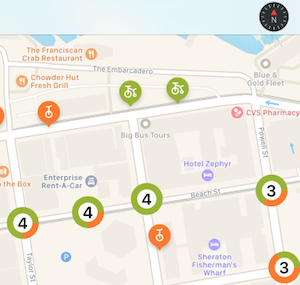
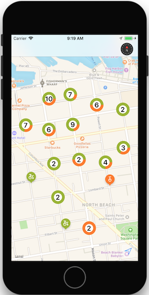
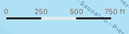
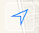

# New Features in MapKit on iOS 11

iOS 11 adds the following new features to MapKit:

- [Annotation Clustering](#clustering)
- [Compass Button](#compass)
- [Scale View](#scale)
- [User Tracking Button](#user-tracking)



<a name="clustering"></a>

## Automatically grouping markers while zooming

The sample [MapKit Sample "Tandm"](/samples/xamarin/ios-samples/ios11-mapkitsample) shows how to implement the new iOS 11 annotation clustering feature.

### 1. Create an `MKPointAnnotation` subclass

The point annotation class represents each marker on the map. They can be added individually using `MapView.AddAnnotation()` or from an array using `MapView.AddAnnotations()`.

Point annotation classes do not have a visual representation, they are only required to represent the data associated with the marker (most importantly, the `Coordinate` property which is its latitude and longitude on the map), and any custom properties:

```csharp
public class Bike : MKPointAnnotation
{
  public BikeType Type { get; set; } = BikeType.Tricycle;
  public Bike(){}
  public Bike(NSNumber lat, NSNumber lgn, NSNumber type)
  {
    Coordinate = new CLLocationCoordinate2D(lat.NFloatValue, lgn.NFloatValue);
    switch(type.NUIntValue) {
      case 0:
        Type = BikeType.Unicycle;
        break;
      case 1:
        Type = BikeType.Tricycle;
        break;
    }
  }
}
```

### 2. Create an `MKMarkerAnnotationView` subclass for single markers

The marker annotation view is the visual representation of each annotation, and is styled using properties such as:

- **MarkerTintColor** – The color for the marker.
- **GlyphText** – Text displayed in the marker.
- **GlyphImage** – Sets the image that is displayed in the marker.
- **DisplayPriority** – Determines z-order (stacking behavior) when the map is crowded with markers. Use one of `Required`, `DefaultHigh`, or `DefaultLow`.

To support automatic clustering, you must also set:

- **ClusteringIdentifier** – This controls which markers get clustered together. You can use the same identifier for all your markers, or use different identifiers to control the way they are grouped together.

```csharp
[Register("BikeView")]
public class BikeView : MKMarkerAnnotationView
{
  public static UIColor UnicycleColor = UIColor.FromRGB(254, 122, 36);
  public static UIColor TricycleColor = UIColor.FromRGB(153, 180, 44);
  public override IMKAnnotation Annotation
  {
    get {
      return base.Annotation;
    }
    set {
      base.Annotation = value;

      var bike = value as Bike;
      if (bike != null){
        ClusteringIdentifier = "bike";
        switch(bike.Type){
          case BikeType.Unicycle:
            MarkerTintColor = UnicycleColor;
            GlyphImage = UIImage.FromBundle("Unicycle");
            DisplayPriority = MKFeatureDisplayPriority.DefaultLow;
            break;
          case BikeType.Tricycle:
            MarkerTintColor = TricycleColor;
            GlyphImage = UIImage.FromBundle("Tricycle");
            DisplayPriority = MKFeatureDisplayPriority.DefaultHigh;
            break;
        }
      }
    }
  }
```

### 3. Create an `MKAnnotationView` to represent clusters of markers

While the annotation view that represents a cluster of markers _could_ be a simple image, users expect the app to provide visual cues about how many markers have been grouped together.

The [sample code](/samples/xamarin/ios-samples/ios11-mapkitsample) uses CoreGraphics to render the number of markers in the cluster, as well as a circle-graph representation of the proportion of each marker type.

You should also set:

- **DisplayPriority** – Determines z-order (stacking behavior) when the map is crowded with markers. Use one of `Required`, `DefaultHigh`, or `DefaultLow`.
- **CollisionMode** – `Circle` or `Rectangle`.

```csharp
[Register("ClusterView")]
public class ClusterView : MKAnnotationView
{
  public static UIColor ClusterColor = UIColor.FromRGB(202, 150, 38);
  public override IMKAnnotation Annotation
  {
    get {
      return base.Annotation;
    }
    set {
      base.Annotation = value;
      var cluster = MKAnnotationWrapperExtensions.UnwrapClusterAnnotation(value);
      if (cluster != null)
      {
        var renderer = new UIGraphicsImageRenderer(new CGSize(40, 40));
        var count = cluster.MemberAnnotations.Length;
        var unicycleCount = CountBikeType(cluster.MemberAnnotations, BikeType.Unicycle);

        Image = renderer.CreateImage((context) => {
          // Fill full circle with tricycle color
          BikeView.TricycleColor.SetFill();
          UIBezierPath.FromOval(new CGRect(0, 0, 40, 40)).Fill();
          // Fill pie with unicycle color
          BikeView.UnicycleColor.SetFill();
          var piePath = new UIBezierPath();
          piePath.AddArc(new CGPoint(20,20), 20, 0, (nfloat)(Math.PI * 2.0 * unicycleCount / count), true);
          piePath.AddLineTo(new CGPoint(20, 20));
          piePath.ClosePath();
          piePath.Fill();
          // Fill inner circle with white color
          UIColor.White.SetFill();
          UIBezierPath.FromOval(new CGRect(8, 8, 24, 24)).Fill();
          // Finally draw count text vertically and horizontally centered
          var attributes = new UIStringAttributes() {
            ForegroundColor = UIColor.Black,
            Font = UIFont.BoldSystemFontOfSize(20)
          };
          var text = new NSString($"{count}");
          var size = text.GetSizeUsingAttributes(attributes);
          var rect = new CGRect(20 - size.Width / 2, 20 - size.Height / 2, size.Width, size.Height);
          text.DrawString(rect, attributes);
        });
      }
    }
  }
  public ClusterView(){}
  public ClusterView(MKAnnotation annotation, string reuseIdentifier) : base(annotation, reuseIdentifier)
  {
    DisplayPriority = MKFeatureDisplayPriority.DefaultHigh;
    CollisionMode = MKAnnotationViewCollisionMode.Circle;
    // Offset center point to animate better with marker annotations
    CenterOffset = new CoreGraphics.CGPoint(0, -10);
  }
  private nuint CountBikeType(IMKAnnotation[] members, BikeType type) {
    nuint count = 0;
    foreach(Bike member in members){
      if (member.Type == type) ++count;
    }
    return count;
  }
}
```

### 4. Register the view classes

When the map view control is being created and added to a view, register the annotation view types to enable the automatic clustering behavior as the map is zoomed in and out:

```csharp
MapView.Register(typeof(BikeView), MKMapViewDefault.AnnotationViewReuseIdentifier);
MapView.Register(typeof(ClusterView), MKMapViewDefault.ClusterAnnotationViewReuseIdentifier);
```

### 5. Render the map!

When the map is rendered, annotation markers will be clustered or rendered
depending on the zoom level. As the zoom level changes, markers animate
in and out of clusters.



Refer to the [Maps section](~/ios/user-interface/controls/ios-maps/index.md)
for more information on displaying data with MapKit.

<a name="compass"></a>

## Compass Button

iOS 11 adds the ability to pop the compass out of the map and render it elsewhere in the view. See the [Tandm sample app](/samples/xamarin/ios-samples/ios11-mapkitsample) for an example.

Create a button that looks like a compass (including live animation when the map orientation is changed), and renders it on another control.


The code below creates a compass button and renders it on the navigation bar:

```csharp
var compass = MKCompassButton.FromMapView(MapView);
compass.CompassVisibility = MKFeatureVisibility.Visible;
NavigationItem.RightBarButtonItem = new UIBarButtonItem(compass);
MapView.ShowsCompass = false; // so we don't have two compasses!
```

The `ShowsCompass` property can be used to control visibility of the default compass inside the map view.

<a name="scale"></a>

## Scale View

Add the scale elsewhere in the view using the `MKScaleView.FromMapView()` method
to get an instance of the scale view to add elsewhere in the view hierarchy.



```csharp
var scale = MKScaleView.FromMapView(MapView);
scale.LegendAlignment = MKScaleViewAlignment.Trailing;
scale.TranslatesAutoresizingMaskIntoConstraints = false;
View.AddSubview(scale); // constraints omitted for simplicity
MapView.ShowsScale = false; // so we don't have two scale displays!
```

The `ShowsScale` property can be used to control visibility of the default compass inside the map view.

<a name="user-tracking"></a>

## User Tracking Button

The user tracking button centers the map on the user's current location. Use the
`MKUserTrackingButton.FromMapView()` method to get an instance of the button,
apply formatting changes, and add elsewhere in the view hierarchy.



```csharp
var button = MKUserTrackingButton.FromMapView(MapView);
button.Layer.BackgroundColor = UIColor.FromRGBA(255,255,255,80).CGColor;
button.Layer.BorderColor = UIColor.White.CGColor;
button.Layer.BorderWidth = 1;
button.Layer.CornerRadius = 5;
button.TranslatesAutoresizingMaskIntoConstraints = false;
View.AddSubview(button); // constraints omitted for simplicity
```

## Related Links

- [MapKit Sample 'Tandm'](/samples/xamarin/ios-samples/ios11-mapkitsample)
- [MKCompassButton](https://developer.apple.com/documentation/mapkit/mkcompassbutton)
- [What's New in MapKit (WWDC) (video)](https://developer.apple.com/videos/play/wwdc2017/237/)