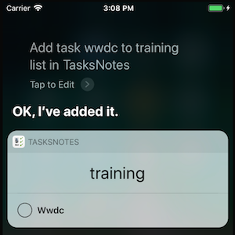
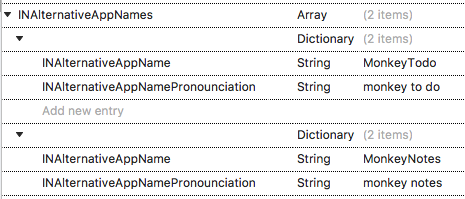
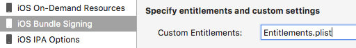

# SiriKit Updates in iOS 11

SiriKit was introduced in iOS 10, with a number of service domains
(including workouts, ride booking, and making calls). Refer to the
[SiriKit section](~/ios/platform/sirikit/index.md) for SiriKit
concepts and how to implement SiriKit in your app.



SiriKit in iOS 11 adds these new and updated intent domains:

- [**Lists and Notes**](#listsnotes) – New! Provides an API for apps to process tasks and notes.
- **Visual Codes** – New! Siri can display QR codes to share contact information or participate in payment transactions.
- **Payments** – Added search and transfer intents for Payment interactions.
- **Ride booking** – Added cancel ride and feedback intents.

Other new features include:

- [**Alternative app names**](#alternativenames) – Provides aliases that help customers tell Siri to target your app by offering alternative names/pronunciations.
- **Starting Workouts** – Provides the ability to start a workout in the background.

Some of these features are explained below. For more details on the others, refer to [Apple's SiriKit documentation](https://developer.apple.com/documentation/sirikit).

<a name="listsnotes"></a>

## Lists and Notes

The new lists and notes domain provides an API for apps to process
tasks and notes via Siri voice requests.

**Tasks**

- Have a title and a completion status.
- Optionally include a deadline and a location.

**Notes**

- Have a title and a content field.

Both tasks and notes can be organized into groups. The rest of this section
describes how to implement this new domain with SiriKit, using the
[TasksNotes SiriKit Example](/samples/xamarin/ios-samples/ios11-sirikitsample).

### How to Process a SiriKit Request

Process a SiriKit request by following these steps:

1. **Resolve** – Validate parameters and request further information from the user (if required).
2. **Confirm** – Final validation and verification that the request can be processed.
3. **Handle** – Perform the operation (updating data or performing network operations).

The first two steps are optional (although encouraged), and the final step is required.
There are more detailed instructions in the [SiriKit section](~/ios/platform/sirikit/index.md).

### Resolve and Confirm Methods

These optional methods let your code perform validation, select defaults,
or request additional information from the user.

As an example, for the `IINCreateTaskListIntent` interface, the required method
is `HandleCreateTaskList`. There are four optional methods that
provide more control over the Siri interaction:

- `ResolveTitle` – Validates the title, sets a default title (if appropriate), or signals that the data is not required.
- `ResolveTaskTitles` – Validates the list of tasks spoken by the user.
- `ResolveGroupName` – Validates the group name, chooses a default group, or signals that the data is not required.
- `ConfirmCreateTaskList` – Validates that your code can perform the requested
operation, but does not perform it (only the `Handle*` methods should modify data).

### Handle the Intent

There are six intents in the lists and notes domain, three for tasks and three for notes.
The methods that you must implement to handle these intents are:

- For tasks:
  - `HandleAddTasks`
  - `HandleCreateTaskList`
  - `HandleSetTaskAttribute`
- For notes:
  - `HandleCreateNote`
  - `HandleAppendToNote`
  - `HandleSearchForNotebookItems`

Each method has a specific intent type passed to it, which contains all the information Siri
has parsed from the user's request (and possibly updated in the `Resolve*` and `Confirm*` methods).
Your app must parse the data provided, then perform some actions
to store or otherwise process the data, and return a result that Siri speaks and shows to
the user.

### Response Codes

The required `Handle*` and optional `Confirm*` methods indicate a response code by setting a value on the object that they pass to their completion handler. Responses come from the `INCreateTaskListIntentResponseCode` enumeration:

- `Ready` – Returns during the confirmation phase (ie. from a `Confirm*` method, but not from a `Handle*` method).
- `InProgress` – Used for long-running tasks (such as a network/server operation).
- `Success` – Responds with the details of the successful operation (only from a `Handle*` method).
- `Failure` – Means that an error occurred, and the operation could not be completed.
- `RequiringAppLaunch` – Cannot be processed by the intent, but the operation is possible in the app.
- `Unspecified` – Do not use: error message will be displayed to the user.

Learn more about these methods and responses in Apple's [SiriKit lists and notes documentation](https://developer.apple.com/documentation/sirikit/lists_and_notes).

### Implementing Lists and Notes

The [TasksNotes SiriKit Example](/samples/xamarin/ios-samples/ios11-sirikitsample) was
created using the following steps to add SiriKit support to a blank iOS app.

First, to add SiriKit support, follow these steps for your iOS app:

1. Tick **SiriKit** in **Entitlements.plist**.
2. Add the **Privacy – Siri Usage Description** key to **Info.plist**, along with a message for your customers.
3. Call the `INPreferences.RequestSiriAuthorization` method in the app, to prompt the user to allow Siri interactions.
4. Add SiriKit to your App ID on the Developer Portal, and re-create your provisioning profiles to include the new entitlement.

Then add a new extension project to your app to handle Siri requests:

1. Right-click on your solution and choose **Add > Add New Project...**.
2. Choose the **iOS > Extension > Intents Extension** template.
3. Two new projects will be added: Intent and IntentUI. Customizing the UI is optional, so the sample only includes code in the **Intent** project.

The extension project is where all SiriKit requests will be processed. As a separate extension,
it does not automatically have any way to communicate with your main app – this
is typically resolved by implementing shared file storage using app groups.

#### Configure the IntentHandler

The `IntentHandler` class is the entry-point for Siri requests – every intent
is passed to the `GetHandler` method, which returns an object that can handle
the request.

The code below shows a simple implementation:

```csharp
[Register("IntentHandler")]
public partial class IntentHandler : INExtension, IINNotebookDomainHandling
{
  protected IntentHandler(IntPtr handle) : base(handle)
  {}
  public override NSObject GetHandler(INIntent intent)
  {
    // This is the default implementation.  If you want different objects to handle different intents,
    // you can override this and return the handler you want for that particular intent.
    return this;
  }
  // add intent handlers here!
}
```

The class must inherit from `INExtension`, and because the sample is
going to handling lists and notes intents, it also implements
`IINNotebookDomainHandling`.

> [!NOTE]
>
> - There is a convention in .NET for interfaces to be prefixed with a
>   capital `I`, which Xamarin adheres to when binding protocols from the 
>   iOS SDK.
> - Xamarin also preserves type names from iOS, and Apple uses the first two 
>   characters in type names to reflect the framework that a type belongs 
>   to.
> - For the `Intents` framework, types are prefixed with `IN*` 
>   (eg. `INExtension`) but these are _not_ interfaces.
> - It also follows that protocols (which become interfaces in C#) end up 
>   with two `I`s, such as `IINAddTasksIntentHandling`.

#### Handling Intents

Each intent (Add Task, Set Task Attribute, etc) is implemented in a single method
similar to the one shown below. The method should perform three main functions:

1. **Process the intent** – The data parsed by Siri is made available in an `intent`
object specific to the type of intent. Your app may have validated that data using
optional `Resolve*` methods.
2. **Validate and update data store** – Save data to the filesystem (using App Groups
so that the main iOS app can also access it), or via a network request.
3. **Provide response** – Use the `completion` handler to send a response back to Siri
to read/display to the user:

```csharp
public void HandleCreateTaskList(INCreateTaskListIntent intent, Action<INCreateTaskListIntentResponse> completion)
{
  var list = TaskList.FromIntent(intent);
  // TODO: have to create the list and tasks... in your app data store
  var response = new INCreateTaskListIntentResponse(INCreateTaskListIntentResponseCode.Success, null)
  {
    CreatedTaskList = list
  };
  completion(response);
}
```

Notice that `null` is passed as the second parameter to the response – this is the
user activity parameter, and when it is not supplied, a default value will be used.
You can set a custom activity type so long as your iOS app supports it via
the `NSUserActivityTypes` key in **Info.plist**. You can then handle this case
when your app is opened, and perform specific operations (such as opening to
a relevant view controller and loading the data from the Siri operation).

The example also hardcodes the `Success` result, but in real scenarios, proper
error reporting should be added.

### Test Phrases

The following test phrases should work in the sample app:

- "Make a grocery list with apples, bananas, and pears in TasksNotes"
- "Add task WWDC in TasksNotes"
- "Add task WWDC to training list in TasksNotes"
- "Mark attend WWDC as complete in TasksNotes"
- "In TasksNotes remind me to buy an iphone when I get home"
- "Mark buy iPhone as completed in TasksNotes"
- "Remind me to leave home at 8am in TasksNotes"

 

> [!NOTE]
> The iOS 11 Simulator supports testing with Siri (unlike earlier versions).
>
> If testing on real devices, don't forget to configure your App ID and
> provisioning profiles for SiriKit support.

<a name="alternativenames"></a>

## Alternative Names

This new iOS 11 feature means that you can configure alternative names for your app
to help users trigger it correctly with Siri. Add the following keys to the
**Info.plist** file of the iOS app project:



With the alternative app names set, the following phrases will
also work for the sample app (which is actually named **TasksNotes**):

- "Make a grocery list with apples, bananas, and pears in _MonkeyNotes_"
- "Add task WWDC in _MonkeyTodo_"

## Troubleshooting

Some errors that you might encounter while running the sample or
adding SiriKit to your own applications:

### NSInternalInconsistencyException

_Objective-C exception thrown.  Name: NSInternalInconsistencyException Reason: Use of the class <INPreferences: 0x60400082ff00> from an app requires the entitlement com.apple.developer.siri. Did you enable the Siri capability in your Xcode project?_

- SiriKit is ticked in **Entitlements.plist**.
- **Entitlements.plist** is configured in the **Project Options > Build > iOS  Bundle Signing**.

  [](sirikit-images/set-entitlements.png#lightbox)

- (for device deployment) App ID has SiriKit enabled and provisioning profile downloaded.

## Related Links

- [SiriKit (Apple)](https://developer.apple.com/documentation/sirikit)
- [TasksNotes SiriKit Sample](/samples/xamarin/ios-samples/ios11-sirikitsample)
- [What's New in SiriKit (WWDC) (video)](https://developer.apple.com/videos/play/wwdc2017/214/)