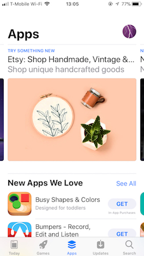
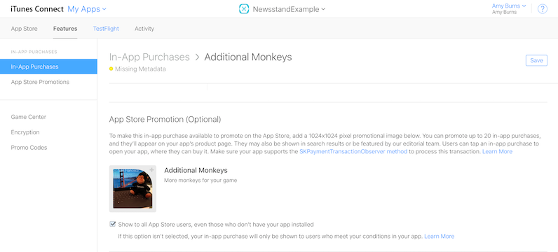
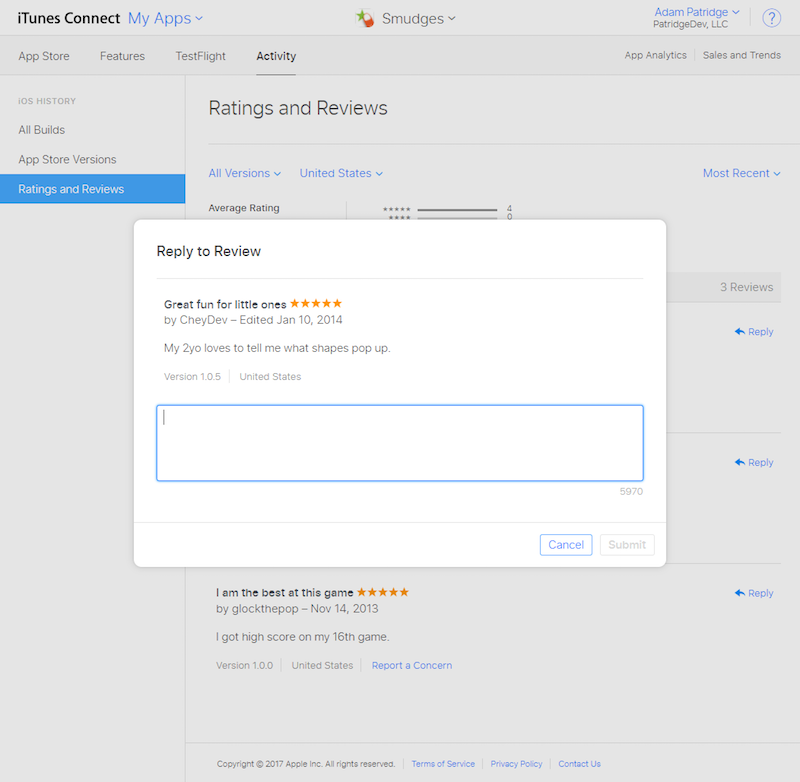
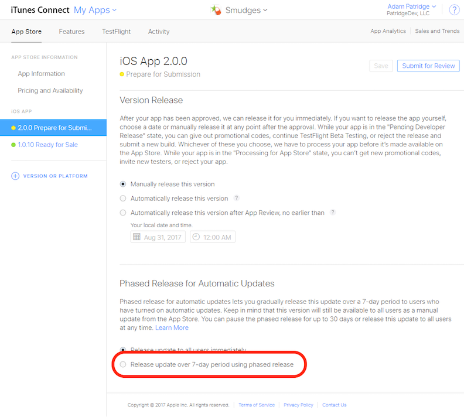

# App Store Changes in iOS 11

The iOS App Store has had a complete redesign, which not only allows users to efficiently navigate the store, but also allows you, as a developer, to promote your app to users. These promotions include updates to in-app purchases and updates to the product page. iOS 11 also adds updates regarding how to communicate with users, how to add your app icon, and how to release your app to the public.

The redesigned app store has the following sections:

- **Today** – This tab includes apps that are an "editor's pick" or featured app. To promote your app here fill in information on the [promote](https://developer.apple.com//contact/app-store/promote/) page.
- **Games** – Any apps that is set to the **Game** category in iTunes Connect can be found under this tab.
- **Apps** – This tab features all other apps. Users can browse by featured apps, categories, top paid/free.
- **Updates** – This app displays the updates to your apps. Even if you release an app via [phased release](#Phased_Release), users can still go to this tab and download the latest version.
- **Search** – This tab allows users to search for your app.

## Store Icon

Store icons (or marketing icons) are no longer managed in iTunes Connect, and instead must be contained as an [asset catalog](~/ios/app-fundamentals/images-icons/app-icons.md) in your app binary, similar to app icons. A 1024 x 1024 store icon in PNG format must be included in an asset catalog for successful submission of iOS 11 apps.

App thinning makes sure that this additional asset catalog doesn't increase the app size.

## In-App Purchases promoted in the App Store

Apple has made in-app purchases more discoverable in the App Store. You can now add up to 20 _App Store promoted_ in-app purchases that can now be found on the Apps page, on your app's product page, or by searching.

To have your in-app purchases displayed in the App Store you must include the following data:

- **Image** – You need to provide a specially designed image for the icon that describes what the in-app purchase does. This image must be different from the app icon and cannot be a screenshot.
- **Name** – The name can only be a maximum of 30 characters.
- **Description** – The description can only be a maximum of 45 characters.

Any in-app purchase promotions are subject to an app store review before it can be published.

To make your in-app purchases available to promote, open your app and browse to **Features > In-App Purchases**. Go to the **App Store Promotion (Optional)** section and add a 1024 x 1024 image and **Save**, as illustrated in the following image:

You also need to add the `ShouldAddStorePayment` method to the `SKPaymentTransactionObserver` protocol in your app.

For more information on in-app purchase promotions, see Apple's [Promoting Your In-App Purchases](https://developer.apple.com/app-store/promoting-in-app-purchases/) page.

## Redesigned Product Page

The following changes have been made to the product page:

- Titles are now set to a maximum of 30 characters
- A Subtitle has been added
  - It should be a brief summary that compliments the title.
  - Subtitle should have a maximum of 30 characters
- App Previews
  - You can now have three videos or screenshots.
  - Videos autoplay when a user visits the page.
  - For more information, see Apple's [App Preview](https://developer.apple.com/app-store/app-previews/) page.
- Promotional text
  - This new feature provides 170 characters of text allowing you to describe frequently changing information about your app.
  - It can be updated at any time without needing to submit a new version of the app.

## Customer Communication

In 10.3, Apple launched a new way for developers to communicate directly with app users through the ability to respond to reviews. You can access this new functionality in iTunes connect by browsing to **App > Activity > Ratings and Reviews**, as illustrated in the following image:

There are a few things to be aware of when replying to users:

- You can only reply once, but both parties can edit their comments as much as they want.
- Users get a notification when you respond to a comment.
- A new Customer Support role has been created in iTunes connect. Users with this role or an Admin role can respond to comments.

For more information, see Apple's [Responding to Reviews](https://developer.apple.com/app-store/responding-to-reviews/) page.

## Phased Release

With iOS 11, Apple has implemented the option of phased releases for updates to your app. You can enable phased releases to allow your app update to be gradually released to customers, ensuring that the demand does not overload your production environment.

Phased Releases are enabled in iTunes Connect. Click on your app in the sidebar, scroll to the **Phased Release for Automatic Updates** section at the bottom, and select **Release update over 7-day period using phased release**:

Your update is available immediately for download in the Updates tab of the App Store. Phased releases are only available for users who have automatic downloads selected.

## Related Links

- [What’s New in iOS 11 (Apple)](https://developer.apple.com/ios/)
- [Updated App Store Product Page (Apple)](https://developer.apple.com/app-store/product-page/)
- [Updating Your App for iOS 11 (WWDC) (video)](https://developer.apple.com/videos/play/wwdc2017/204/)
