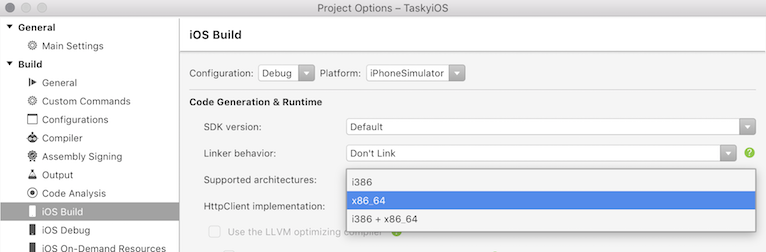
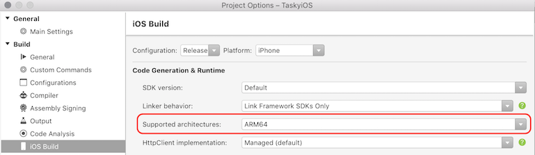

# Architecture Changes in iOS 11

One of the biggest changes that you should be aware of with iOS 11 is the deprecation of 32-bit support for apps, as detailed in [Apple's](https://developer.apple.com/news/?id=06282017b) press release. All new apps and updates to existing apps must support 64-bit. 32-bit apps **will not launch** in iOS 11.

To update your app in Visual Studio for Mac, use the following steps:

1. Right-click on the project name to open **Project Options**.
2. Browse to the **iOS Build** tab.
3. Set the **Supported architectures** drop-down to **x86_64** for the **Debug|iPhoneSimulator** and **Release|iPhoneSimulator**:

    

4. For iOS devices, change the configuration to **Debug|iPhone** and set the **Supported architectures** drop-down to **ARM64**:

    

5. Change the configuration to **Release|iPhone** and set the **Supported architectures** drop-down to **ARM64**.

For more information on 32-bit and 64-bit architectures, see the [32/64 bit Platform Considerations](~/cross-platform/macios/32-and-64/index.md#ios) guide.

## Related Links

- [What’s New in iOS 11 (Apple)](https://developer.apple.com/ios/)
- [Updated App Store Product Page (Apple)](https://developer.apple.com/app-store/product-page/)
- [Updating Your App for iOS 11 (WWDC) (video)](https://developer.apple.com/videos/play/wwdc2017/204/)
