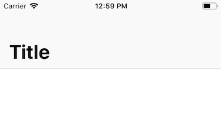
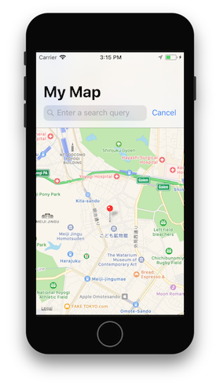
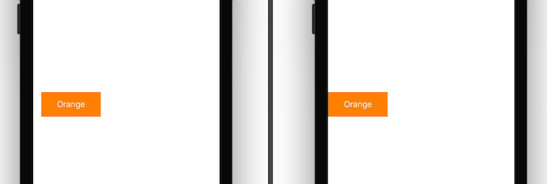
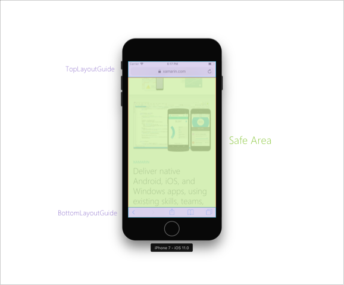

# Visual Design Updates in iOS 11

In iOS 11, Apple introduced new visual changes including updates to the navigation bar, search bar, and table views. In addition improvements have been made to allow for more flexibility over margins and full screen content. These changes are covered in this guide. 

For information specifically about designing for iPhone X, watch 
Apple's [Designing for iPhone X](https://developer.apple.com/videos/play/fall2017/801/) 
video.

## UIKit

UIKit bars have been adapted in iOS 11 to make them more accessible for end users.

One such change is a new HUD display that appears when a user long-presses on a bar item. To enable this, set the `largeContentSizeImage` property on `UIBarItem` and add a larger image via an [asset catalog](~/ios/app-fundamentals/images-icons/displaying-an-image.md):

```csharp
barItem.LargeContentSizeImage = UIImage.FromBundle("AccessibleImage");
```

### Navigation Bar
iOS 11 introduced new functionality to make navigation bar titles easier to read. Apps can display this larger title by assigning the `PrefersLargeTitles` property to true:

```csharp
NavigationController.NavigationBar.PrefersLargeTitles = true;
```

Setting larger titles in your app makes _all_ navigation bars titles across your app appear larger, as illustrated in following screenshot:



To control when a large title is displayed on a navigation bar, set the `LargeTitleDisplayMode` on the navigation item to `Always`, `Never`, or `Automatic`.

### Search Controller

iOS 11 has made it easier to add a search controller directly to the navigation bar. Once you have created a search controller, add it to your navigation bar with the `SearchController` property:

```csharp
NavigationItem.SearchController = searchController;
```

[](visual-design-images/image8-sml.png#lightbox)

Depending on the functionality of your app, you may or may not want the search bar to hide when a user scrolls through a list. You can adjust this using the `HidesSearchBarWhenScrolling` property.

## Margins

Apple has created a new property – `directionalLayoutMargins` – that can be used to set the space between views and subviews. Use `directionalLayoutMargins` with `leading` or `trailing` insets. Regardless of whether the system is a Left-to-Right or Right-to-Left language, the spacing in your app is set appropriately by iOS.

In iOS 10 and before, all views had a minimum margin size to which they would align. iOS 11 introduced the option to override that using `ViewRespectsSystemMinimumLayoutMargins`. For example, setting this property to false allows you to adjust your edge insets to zero:

```csharp
ViewRespectsSystemMinimumLayoutMargins = false;
View.LayoutMargins = UIEdgeInsets.Zero;
```



<a name="fullscreen"></a>

## Full Screen Content

iOS 7 [introduced](~/ios/platform/introduction-to-ios7/ios7-ui.md#fullscreen) `topLayoutGuide` and `bottomLayoutGuide` as a way of constraining your views so that they are not hidden by UIKit bars and are in a visible area of your screen. These have been deprecated in iOS 11 in favor of the _safe area_.

The safe area is a new way of thinking about the visible space of your application and how constraints are added between a view and a super view. For example, consider the following image:

[](visual-design-images/image10.png#lightbox)

Previously, if you had added a view and wanted it to be visible in the green area above, you would constrain it to the _bottom_ of the `TopLayoutGuide` and the _top_ of the `BottomLayoutGuide`. In iOS 11, you would instead constrain it to the _top_ and the _bottom_ of the Safe Area. An example follows:

```csharp
var safeGuide = View.SafeAreaLayoutGuide;
imageView.TopAnchor.ConstraintEqualTo(safeGuide.TopAnchor).Active = true;
safeGuide.BottomAnchor.ConstraintEqualTo(imageView.BottomAnchor).Active = true;
```

## Table View

The UITableView has had a number of small, but significant, changes in iOS 11.

By default, headers, footers, and cells are now automatically sized based on their content. To opt out of this auto-sizing behavior set the `EstimatedRowHeight`, `EstimatedSectionHeaderHeight`, or `EstimatedSectionFooterHeight` to zero.

However, in some circumstances (such as when adding UITableViewController in the iOS Designer or when using existing Storboards in Interface Builder) you may need to manually enable self-sizing cells. To do this, ensure that you have set the following properties on the table view for Cells, Headers, and Footers, respectively:

```csharp
// Cells
TableView.RowHeight = UITableView.AutomaticDimension;
TableView.EstimatedRowHeight = UITableView.AutomaticDimension;

// Header
TableView.SectionHeaderHeight = UITableView.AutomaticDimension;
TableView.EstimatedSectionHeaderHeight = 40f;

//Footer
TableView.SectionFooterHeight = UITableView.AutomaticDimension;
TableView.EstimatedSectionFooterHeight = 40f;

```

iOS 11 has expanded the functionality of row actions. `UISwipeActionsConfiguration` was introduced to define a set of actions that should take place when the user swipes in either direction on a row in a table view. This behavior is similar to that of the native Mail.app. For more information, see the [Row Actions](~/ios/user-interface/controls/tables/row-action.md) guide.

Table Views have support for drag and drop in iOS 11. For more information, see the [Drag and Drop](~/ios/platform/introduction-to-ios11/drag-and-drop.md#uitableview) guide.

## Related Links

- [What’s New in iOS 11 (Apple)](https://developer.apple.com/ios/)
- [Updated App Store Product Page (Apple)](https://developer.apple.com/app-store/product-page/)
- [Designing for iPhone X (Apple) (video)](https://developer.apple.com/videos/play/fall2017/801/)
- [Updating Your App for iOS 11 (WWDC) (video)](https://developer.apple.com/videos/play/wwdc2017/204/)
