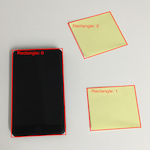
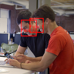
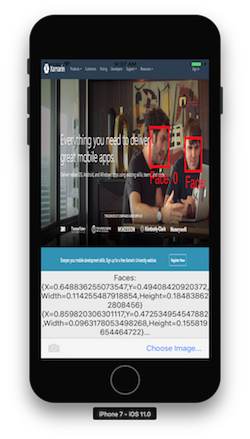

# Vision Framework in Xamarin.iOS

The Vision framework adds a number of new image processing features to iOS 11,
including:

- [Rectangle Detection](#rectangles)
- [Face Detection](#faces)
- Machine Learning Image Analysis (discussed in [CoreML](~/ios/platform/introduction-to-ios11/coreml.md))
- Barcode Detection
- Image Alignment Analysis
- Text Detection
- Horizon Detection
- Object Detection & Tracking

 

Rectangle Detection and Face Detection are discussed in more detail below.

<a name="rectangles"></a>

## Rectangle Detection

The [VisionRects sample](/samples/xamarin/ios-samples/ios11-visionrectangles) shows
how to process an image and draw the detected rectangles on it.

### 1. Initialize the Vision request

In `ViewDidLoad`, create a `VNDetectRectanglesRequest` that references
the `HandleRectangles` method which will be called at the end of each request:

The `MaximumObservations` property should also be set, otherwise it will default to 1 and only a single result will be returned.

```csharp
RectangleRequest = new VNDetectRectanglesRequest(HandleRectangles);
RectangleRequest.MaximumObservations = 10;
```

### 2. Start the Vision processing

The following code starts processing the request. In the **VisionRects** sample, this code runs after the user has selected an image:

```csharp
// Run the rectangle detector
var handler = new VNImageRequestHandler(ciImage, uiImage.Orientation.ToCGImagePropertyOrientation(), new VNImageOptions());
DispatchQueue.DefaultGlobalQueue.DispatchAsync(()=>{
  handler.Perform(new VNRequest[] {RectangleRequest}, out NSError error);
});
```

This handler passes the `ciImage` to the Vision framework `VNDetectRectanglesRequest` that was created in step 1.

### 3. Handle the results of Vision processing

Once the rectangle detection is complete, the framework executes the `HandleRectangles` method,
a summary of which is shown below:

```csharp
private void HandleRectangles(VNRequest request, NSError error){
  var observations = request.GetResults<VNRectangleObservation>();
  // ... omitted error handling ...
  bool atLeastOneValid = false;
  foreach (var o in observations){
    if (InputImage.Extent.Contains(boundingBox)) {
      atLeastOneValid |= true;
    }
  }
  if (!atLeastOneValid) return;
  // Show the pre-processed image
  DispatchQueue.MainQueue.DispatchAsync(() =>
  {
    ClassificationLabel.Text = summary;
    ImageView.Image = OverlayRectangles(RawImage, imageSize, observations);
  });
}
```

### 4. Display the results

The `OverlayRectangles` method in the **VisionRectangles** sample has three functions:

- Rendering the source image,
- Drawing a rectangle to indicate where each one was detected, and
- Adding a text label for each rectangle using CoreGraphics.

View the [sample's source](/samples/xamarin/ios-samples/ios11-visionrectangles)
for the exact CoreGraphics method.


### 5. Further processing

Rectangle detection is often just the first step in a chain of operations,
such as with [this CoreMLVision example](~/ios/platform/introduction-to-ios11/coreml.md#coremlvision),
where the rectangles are passed to a CoreML model to parse handwritten digits.

<a name="faces"></a>

## Face Detection

The [VisionFaces sample](/samples/xamarin/ios-samples/ios11-visionfaces) works in
a similar fashion to the **VisionRectangles** sample, using a different
Vision request class.

### 1. Initialize the Vision request

In `ViewDidLoad`, create a `VNDetectFaceRectanglesRequest` that references the `HandleRectangles` method which will be called at the end of each request.

```csharp
FaceRectangleRequest = new VNDetectFaceRectanglesRequest(HandleRectangles);
```

### 2. Start the Vision processing

The following code starts processing the request. In the **VisionFaces** sample this code runs after the user has selected an image:

```csharp
// Run the face detector
var handler = new VNImageRequestHandler(ciImage, uiImage.Orientation.ToCGImagePropertyOrientation(), new VNImageOptions());
DispatchQueue.DefaultGlobalQueue.DispatchAsync(()=>{
  handler.Perform(new VNRequest[] {FaceRectangleRequest}, out NSError error);
});
```

This handler passes the `ciImage` to the Vision framework `VNDetectFaceRectanglesRequest` that was created in step 1.

### 3. Handle the results of Vision processing

Once the face detection is complete, the handler executes the `HandleRectangles` method
which performs error handling and displays the bounds of the detected faces, and calls the
`OverlayRectangles` to draw bounding rectangles on the original picture:

```csharp
private void HandleRectangles(VNRequest request, NSError error){
  var observations = request.GetResults<VNFaceObservation>();
  // ... omitted error handling...
  var summary = "";
  var imageSize = InputImage.Extent.Size;
  bool atLeastOneValid = false;
  Console.WriteLine("Faces:");
  summary += "Faces:";
  foreach (var o in observations) {
    // Verify detected rectangle is valid. omitted
    var boundingBox = o.BoundingBox.Scaled(imageSize);
    if (InputImage.Extent.Contains(boundingBox)) {
      atLeastOneValid |= true;
    }
  }
  // Show the pre-processed image (on UI thread)
  DispatchQueue.MainQueue.DispatchAsync(() =>
  {
    ClassificationLabel.Text = summary;
    ImageView.Image = OverlayRectangles(RawImage, imageSize, observations);
  });
}
```

### 4. Display the results

The `OverlayRectangles` method in the **VisionFaces** sample has three functions:

- Rendering the source image,
- Drawing a rectangle for each face detected, and
- Adding a text label for each face using CoreGraphics.

View the [sample's source](/samples/xamarin/ios-samples/ios11-visionfaces) for the exact CoreGraphics method.



### 5. Further processing

The Vision framework includes additional capabilities to detect
facial features, such as the eyes and mouth. Use the
`VNDetectFaceLandmarksRequest` type, which will return
`VNFaceObservation` results as in step 3 above, but with additional
`VNFaceLandmark` data.

## Related Links

- [Vision Rectangles (sample)](/samples/xamarin/ios-samples/ios11-visionrectangles)
- [Vision Faces (sample)](/samples/xamarin/ios-samples/ios11-visionfaces)
- [Advances in Core Image - Filters, Metal, Vision, and More (WWDC) (video)](https://developer.apple.com/videos/play/wwdc2017/510/)