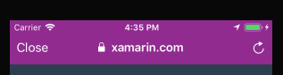

# Web Changes in iOS 11

iOS 11 introduces a new version of the Safari web browser – Safari 11.0 – which includes changes to WebKit and SafariServices. This guide explores these changes.

## SafariServices

`SFSafariViewController` was introduced in iOS 9 as an option for displaying web content or authenticating users from your app. More information on its features can be found in the [Web Views](~/ios/user-interface/controls/uiwebview.md#safariviewcontroller) guide.

iOS 11 has introduced style updates to the Safari View Controller, giving your users a more seamless experience between an app and the web. For example, the removal of the address bar now gives the Safari View Controller the feel of an in-app browser, rather than a mini-browser. You can also customize the color scheme to fit in with the color scheme of your app by setting the `preferredBarTintColor` and `PreferredControlTintColor` properties:

```csharp
sfViewController.PreferredControlTintColor = UIColor.White;
sfViewController.PreferredBarTintColor = UIColor.Purple;
```

The following code snippet renders the bars in purple and white, as displayed in the following image:


The Dismiss button presented in the Safari View Controller can also be changed by setting the `DismissButtonStyle` property to either `Done`, `Close`, or `Cancel`:

```csharp
sfViewController.DismissButtonStyle = SFSafariViewControllerDismissButtonStyle.Close;
```



This value can be changed while `SFSafariViewController` is presented.


Depending on the content that is displayed inside a Safari View Controller, it might be necessary to ensure that the menu bars don't collapse as the user scrolls. This is enabled by setting the new `BarCollapsedEnabled` property to `false`:

```csharp
var config = new SFSafariViewControllerConfiguration();
config.BarCollapsingEnabled = false;

var sfViewController = new SFSafariViewController(url, config);
```


Apple has also made updates to privacy in the Safari View Controller in iOS 11. Now, browsing data such as cookies and local storage only exist on a per-app basis, rather than across all instances of Safari view controller. This keeps user browsing activity private within your app.

Additional features such as drag and drop support for URLs and support for `window.open()` have also been added to `SFSafariViewController` in iOS 11. You can find more information about these new features in [Apple's SFSafariViewController documentation](https://developer.apple.com/documentation/safariservices/sfsafariviewcontroller?changes=latest_minor).


## WebKit

`WKWebView` was introduced as part of WebKit in iOS 8 as a means of displaying web content to your user. It's much more customizable than `SFSafariViewController`, allowing you to create your own navigation and user interface.

Apple has introduced three main improvements for `WKWebView` with iOS 11: 

- The ability to manage cookies
- Content filtering
- Custom resource loading. 

Cookie management is done through the new [`WKHttpCookieStore`](https://developer.apple.com/documentation/webkit/wkhttpcookiestore) class, which allows you to add and delete cookies, to get all the cookies stored in a WKWebView, and to observe the cookie store for changes.

Content filtering allows you to manage the type of content that your user will see, allowing you to make sure it's secure, family friendly, and, if necessary, only available to a select group of users. This is implemented through the new [`WKContentRuleList`](https://developer.apple.com/documentation/webkit/wkcontentrulelist) class, by providing pairs of triggers and actions in JSON. More information on these triggers and actions can be found in Apple's [Content Blocking Rules](https://developer.apple.com/library/content/documentation/Extensions/Conceptual/ContentBlockingRules/Introduction/Introduction.html) guide.

iOS 11 now allows you to customize `WKWebView` with custom resource loading for your web content. This is implemented through the `IWKUrlSchemeHandler` interface, which lets you handle URL Schemes that are not native to Web Kit. This interface has a start and stop method that must be implemented:

```csharp
public class MyHandler : NSObject, IWKUrlSchemeHandler {

    [Export("webView:startURLSchemeTask:")]
    public void StartUrlSchemeTask(WKWebView webView, IWKUrlSchemeTask urlSchemeTask){
        
        // Implement a IWKUrlSchemeTask here
        var response = new NSUrlResponse(urlSchemeTask.Request.Url, "text/html", ContentLength, null);
        urlSchemeTask.DidReceiveResponse(response);
        urlSchemeTask.DidReceiveData(someData);
        urlSchemeTask.DidFinish();
    }

    [Export("webView:stopURLSchemeTask:")]
    public void StopUrlSchemeTask(WKWebView webView, IWKUrlSchemeTask urlSchemeTask){
        throw new NotImplementedException();
    }

}
``` 

Once the handler has been implemented, use it to set the `SetUrlSchemeHandler` property on the `WKWebViewConfiguration`. Then, load the URL of something that uses the custom scheme:

```csharp
var config = new WKWebViewConfiguration();
config.SetUrlSchemeHandler(new MyHandler(), "xamarin-asset");

webView = new WKWebView (View.Frame, config);
webView.LoadRequest (new NSUrlRequest("xamarin-asset://xamarin.com"));
```

