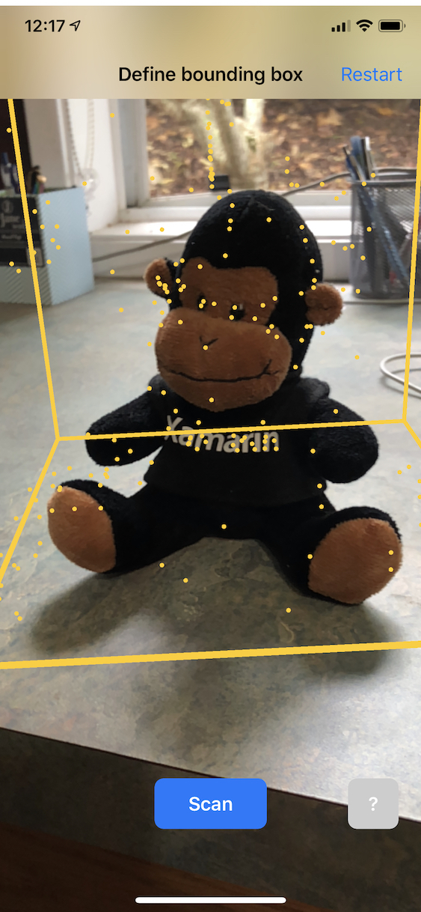
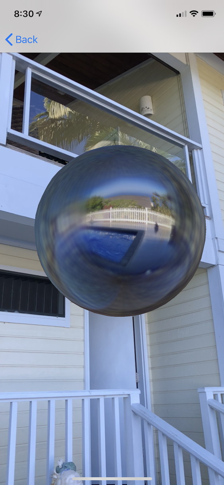
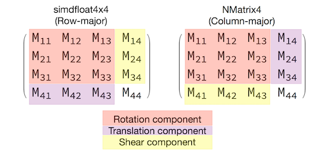

# ARKit 2 in Xamarin.iOS

ARKit has matured considerably since its introduction last year in iOS 11. First and foremost, you can now detect vertical as well as horizontal planes, which greatly improves the practicality of indoor augmented reality experiences. In addition, there are new capabilities:

- Recognizing reference images and objects as the junction between the real world and digital imagery
- A new lighting mode that simulates real-world lighting
- The ability to share and persist AR environments
- A new file format preferred for storing AR content

## Recognizing reference objects

One showcase feature in ARKit 2 is the ability to recognize reference images and objects. Reference images can be loaded from normal image files ([discussed later](#more-tracking-configurations)), but reference objects must be scanned, using the developer-focused [`ARObjectScanningConfiguration`](xref:ARKit.ARObjectScanningConfiguration).

### Sample app: Scanning and detecting 3D objects

The [Scanning and Detecting 3D Objects](/samples/xamarin/ios-samples/ios12-scanninganddetecting3dobjects) sample is a port of an [Apple project](https://developer.apple.com/documentation/arkit/scanning_and_detecting_3d_objects?language=objc) that demonstrates:

- Application state management using [`NSNotification`](xref:Foundation.NSNotification) objects
- Custom visualization
- Complex gestures
- Object scanning
- Storing an [`ARReferenceObject`](xref:ARKit.ARReferenceObject)

Scanning a reference object is battery- and processor- intensive and older devices will often have trouble achieving stable tracking.

### State management using NSNotification objects

This application uses a state machine that transitions between the following states:

- `AppState.StartARSession`
- `AppState.NotReady`
- `AppState.Scanning`
- `AppState.Testing`

And additionally uses an embedded set of states and transitions when in `AppState.Scanning`:

- `Scan.ScanState.Ready`
- `Scan.ScanState.DefineBoundingBox`
- `Scan.ScanState.Scanning`
- `Scan.ScanState.AdjustingOrigin`

The app uses a reactive architecture that posts state-transition notifications to [`NSNotificationCenter`](xref:Foundation.NSNotificationCenter) and subscribes to these notifications. The setup looks like this snippet from `ViewController.cs`:

```csharp
// Configure notifications for application state changes
var notificationCenter = NSNotificationCenter.DefaultCenter;

notificationCenter.AddObserver(Scan.ScanningStateChangedNotificationName, State.ScanningStateChanged);
notificationCenter.AddObserver(ScannedObject.GhostBoundingBoxCreatedNotificationName, State.GhostBoundingBoxWasCreated);
notificationCenter.AddObserver(ScannedObject.GhostBoundingBoxRemovedNotificationName, State.GhostBoundingBoxWasRemoved);
notificationCenter.AddObserver(ScannedObject.BoundingBoxCreatedNotificationName, State.BoundingBoxWasCreated);
notificationCenter.AddObserver(BoundingBox.ScanPercentageChangedNotificationName, ScanPercentageChanged);
notificationCenter.AddObserver(BoundingBox.ExtentChangedNotificationName, BoundingBoxExtentChanged);
notificationCenter.AddObserver(BoundingBox.PositionChangedNotificationName, BoundingBoxPositionChanged);
notificationCenter.AddObserver(ObjectOrigin.PositionChangedNotificationName, ObjectOriginPositionChanged);
notificationCenter.AddObserver(NSProcessInfo.PowerStateDidChangeNotification, DisplayWarningIfInLowPowerMode);

```

A typical notification handler will update the UI and possibly modify the application state, such as this handler that updates as the object is scanned:

```csharp
private void ScanPercentageChanged(NSNotification notification)
{
    var pctNum = TryGet<NSNumber>(notification.UserInfo, BoundingBox.ScanPercentageUserKey);
    if (pctNum == null)
    {
        return;
    }
    double percentage = pctNum.DoubleValue;
    // Switch to the next state if scan is complete
    if (percentage >= 100.0)
    {
        State.SwitchToNextState();
    }
    else
    {
        DispatchQueue.MainQueue.DispatchAsync(() => navigationBarController.SetNavigationBarTitle($"Scan ({percentage})"));
    }
}

```

Finally, `Enter{State}` methods modify the model and UX as appropriate to the new state:

```csharp
internal void EnterStateTesting()
{
    navigationBarController.SetNavigationBarTitle("Testing");
    navigationBarController.ShowBackButton(false);
    loadModelButton.Hidden = true;
    flashlightButton.Hidden = false;
    nextButton.Enabled = true;
    nextButton.SetTitle("Share", UIControlState.Normal);

    testRun = new TestRun(sessionInfo, sceneView);
    TestObjectDetection();
    CancelMaxScanTimeTimer();
}
```

### Custom visualization

The app shows the low-level “point cloud” of the object contained within a bounding box projected onto a detected horizontal plane.

This point cloud is available to developers in the [`ARFrame.RawFeaturePoints`](xref:ARKit.ARFrame.RawFeaturePoints) property. Visualizing the point cloud efficiently can be a tricky problem. Iterating over the points, then creating and placing a new SceneKit node for each point would kill the frame rate. Alternatively, if done asynchronously, there would be a lag. The sample maintains performance with a three-part strategy:

- Using unsafe code to pin the data in place and interpret the data as a raw buffer of bytes.
- Converting that raw buffer into an [`SCNGeometrySource`](xref:SceneKit.SCNGeometrySource) and creating a “template” [`SCNGeometryElement`](xref:SceneKit.SCNGeometryElement) object.
- Rapidly “stitching together” the raw data and the template using [`SCNGeometry.Create(SCNGeometrySource[], SCNGeometryElement[])`](xref:SceneKit.SCNGeometry.Create(SceneKit.SCNGeometrySource[],SceneKit.SCNGeometryElement[]))

```csharp
internal static SCNGeometry CreateVisualization(NVector3[] points, UIColor color, float size)
{
  if (points.Length == 0)
  {
    return null;
  }

  unsafe
  {
    var stride = sizeof(float) * 3;

    // Pin the data down so that it doesn't move
    fixed (NVector3* pPoints = &amp;points[0])
    {
      // Important: Don't unpin until after `SCNGeometry.Create`, because geometry creation is lazy

      // Grab a pointer to the data and treat it as a byte buffer of the appropriate length
      var intPtr = new IntPtr(pPoints);
      var pointData = NSData.FromBytes(intPtr, (System.nuint) (stride * points.Length));

      // Create a geometry source (factory) configured properly for the data (3 vertices)
      var source = SCNGeometrySource.FromData(
        pointData,
        SCNGeometrySourceSemantics.Vertex,
        points.Length,
        true,
        3,
        sizeof(float),
        0,
        stride
      );

      // Create geometry element
      // The null and bytesPerElement = 0 look odd, but this is just a template object
      var template = SCNGeometryElement.FromData(null, SCNGeometryPrimitiveType.Point, points.Length, 0);
      template.PointSize = 0.001F;
      template.MinimumPointScreenSpaceRadius = size;
      template.MaximumPointScreenSpaceRadius = size;

      // Stitch the data (source) together with the template to create the new object
      var pointsGeometry = SCNGeometry.Create(new[] { source }, new[] { template });
      pointsGeometry.Materials = new[] { Utilities.Material(color) };
      return pointsGeometry;
    }
  }
}
```

The result looks like this:



### Complex gestures

The user can scale, rotate, and drag the bounding box that surrounds the target object. There are two interesting things in the associated gesture recognizers.

First, all of the gesture recognizers activate only after a threshold has been passed; for example, a finger has dragged so many pixels or the rotation exceeds some angle. The technique is to accumulate the move until the threshold has been exceeded, then apply it incrementally:

```csharp
// A custom rotation gesture recognizer that fires only when a threshold is passed
internal partial class ThresholdRotationGestureRecognizer : UIRotationGestureRecognizer
{
    // The threshold after which this gesture is detected.
    const double threshold = Math.PI / 15; // (12°)

    // Indicates whether the currently active gesture has exceeded the threshold
    private bool thresholdExceeded = false;

    private double previousRotation = 0;
    internal double RotationDelta { get; private set; }

    internal ThresholdRotationGestureRecognizer(IntPtr handle) : base(handle)
    {
    }

    // Observe when the gesture's state changes to reset the threshold
    public override UIGestureRecognizerState State
    {
        get => base.State;
        set
        {
            base.State = value;

            switch(value)
            {
                case UIGestureRecognizerState.Began :
                case UIGestureRecognizerState.Changed :
                    break;
                default :
                    // Reset threshold check
                    thresholdExceeded = false;
                    previousRotation = 0;
                    RotationDelta = 0;
                    break;
            }
        }
    }

    public override void TouchesMoved(NSSet touches, UIEvent evt)
    {
        base.TouchesMoved(touches, evt);

        if (thresholdExceeded)
        {
            RotationDelta = Rotation - previousRotation;
            previousRotation = Rotation;
        }

        if (! thresholdExceeded && Math.Abs(Rotation) > threshold)
        {
            thresholdExceeded = true;
            previousRotation = Rotation;
        }
    }
}
```

The second interesting thing being done in relation to gestures is the way that the bounding box is moved in relation to detected real-world planes. This aspect is discussed in [this Xamarin blog post](https://blog.xamarin.com/exploring-new-ios-12-arkit-capabilities-with-xamarin/).

## Other new features in ARKit 2

### More tracking configurations

Now, you can use any of the following as the basis for a mixed-reality experience:

- Only the device accelerometer ([`AROrientationTrackingConfiguration`](xref:ARKit.AROrientationTrackingConfiguration), iOS 11)
- Faces ([`ARFaceTrackingConfiguration`](xref:ARKit.ARFaceTrackingConfiguration), iOS 11)
- Reference Images ([`ARImageTrackingConfiguration`](xref:ARKit.ARImageTrackingConfiguration), iOS 12)
- Scanning 3D objects ([`ARObjectScanningConfiguration`](xref:ARKit.ARObjectScanningConfiguration), iOS 12)
- Visual inertial odometry ([`ARWorldTrackingConfiguration`](xref:ARKit.ARWorldTrackingConfiguration), improved in iOS 12)

`AROrientationTrackingConfiguration`, discussed in [this blog post and F# sample](https://github.com/lobrien/FSharp_Face_AR), is the most limited and provides a poor mixed-reality experience, as it only places digital objects in relation to the device's motion, without trying to tie the device and screen into the real world.

The `ARImageTrackingConfiguration` allows you to recognize real-world 2D images (paintings, logos, etc.) and use those to anchor digital imagery:

```csharp
var imagesAndWidths = new[] {
    ("cover1.jpg", 0.185F),
    ("cover2.jpg", 0.185F),
     //...etc...
    ("cover100.jpg", 0.185F),
};

var referenceImages = new NSSet<ARReferenceImage>(
    imagesAndWidths.Select( imageAndWidth =>
    {
      // Tuples cannot be destructured in lambda arguments
        var (image, width) = imageAndWidth;
        // Read the image
        var img = UIImage.FromFile(image).CGImage;
        return new ARReferenceImage(img, ImageIO.CGImagePropertyOrientation.Up, width);
    }).ToArray());

configuration.TrackingImages = referenceImages;
```

There are two interesting aspects to this configuration:

- It's efficient and can be used with a potentially large number of reference images
- The digital imagery is anchored to the image, even if that image moves in the real world (for example, if the cover of a book is recognized, it will track the book as it is pulled off the shelf, laid down, etc.).

The `ARObjectScanningConfiguration` was discussed [previously](#recognizing-reference-objects) and is a developer-centric configuration for scanning 3D objects. It is highly processor and battery intensive and should not be used in end-user applications. The sample [Scanning and Detecting 3D Objects](/samples/xamarin/ios-samples/ios12-scanninganddetecting3dobjects) demonstrates the use of this configuration.

The final tracking configuration, `ARWorldTrackingConfiguration` , is the workhorse of most mixed-reality experiences. This configuration uses "visual inertial odometry" to relate real-world "feature points" to digital imagery. Digital geometry or sprites are anchored relative to real-world horizontal and vertical planes or relative to detected `ARReferenceObject` instances. In this configuration, the world origin is the camera's original position in space with the Z-axis aligned to gravity, and digital objects "stay in place" relative to objects in the real world.

### Environmental texturing

ARKit 2 supports "environmental texturing" that uses captured imagery to estimate lighting and even apply specular highlights to shiny objects. The environmental cubemap is built up dynamically and, once the camera has looked in all directions, can produce an impressively realistic experience:



In order to use environmental texturing:

- Your [`SCNMaterial`](xref:SceneKit.SCNMaterial) objects must use [`SCNLightingModel.PhysicallyBased`](xref:SceneKit.SCNLightingModel.PhysicallyBased) and assign a value in the range of 0 to 1 for [`Metalness.Contents`](xref:SceneKit.SCNMaterial.Metalness) and [`Roughness.Contents`](xref:SceneKit.SCNMaterialProperty.Contents) and
- Your tracking configuration must set [`EnvironmentTexturing`](xref:ARKit.ARWorldTrackingConfiguration.EnvironmentTexturing) = [`AREnvironmentTexturing.Automatic`](xref:ARKit.AREnvironmentTexturing.Automatic) :

```csharp
var sphere = SCNSphere.Create(0.33F);
sphere.FirstMaterial.LightingModelName = SCNLightingModel.PhysicallyBased;
// Shiny metallic sphere
sphere.FirstMaterial.Metalness.Contents = new NSNumber(1.0F);
sphere.FirstMaterial.Roughness.Contents = new NSNumber(0.0F);

// Session configuration:
var configuration = new ARWorldTrackingConfiguration
{
    PlaneDetection = ARPlaneDetection.Horizontal | ARPlaneDetection.Vertical,
    LightEstimationEnabled = true,
    EnvironmentTexturing = AREnvironmentTexturing.Automatic
};
```

Although the perfectly reflective texture shown in the preceding code snippet is fun in a sample, environmental texturing is probably better used with restraint lest it trigger an "uncanny valley" response (the texture is only an estimate based on what the camera recorded).

### Shared and persistent AR experiences

Another major addition to ARKit 2 is the [`ARWorldMap`](xref:ARKit.ARWorldMap) class, which allows you to share or store world-tracking data. You get the current world map with [`ARSession.GetCurrentWorldMapAsync`](xref:ARKit.ARSession.GetCurrentWorldMapAsync) or [`GetCurrentWorldMap(Action<ARWorldMap,NSError>)`](xref:ARKit.ARSession.GetCurrentWorldMap(System.Action{ARKit.ARWorldMap,Foundation.NSError})) :

```csharp
// Local storage
var PersistentWorldPath => Environment.GetFolderPath(Environment.SpecialFolder.Personal) + "/arworldmap";

// Later, after scanning the environment thoroughly...
var worldMap = await Session.GetCurrentWorldMapAsync();
if (worldMap != null)
{
    var data = NSKeyedArchiver.ArchivedDataWithRootObject(worldMap, true, out var err);
    if (err != null)
    {
        Console.WriteLine(err);
    }
    File.WriteAllBytes(PersistentWorldPath, data.ToArray());
}
```

To share or restore the world map:

1. Load the data from the file,
2. Unarchive it into an `ARWorldMap` object,
3. Use that as the value for the [`ARWorldTrackingConfiguration.InitialWorldMap`](xref:ARKit.ARWorldTrackingConfiguration.InitialWorldMap) property:

```csharp
var data = NSData.FromArray(File.ReadAllBytes(PersistentWorldController.PersistenWorldPath));
var worldMap = (ARWorldMap)NSKeyedUnarchiver.GetUnarchivedObject(typeof(ARWorldMap), data, out var err);

var configuration = new ARWorldTrackingConfiguration
{
    PlaneDetection = ARPlaneDetection.Horizontal | ARPlaneDetection.Vertical,
    LightEstimationEnabled = true,
    EnvironmentTexturing = AREnvironmentTexturing.Automatic,
    InitialWorldMap = worldMap
};
```

The `ARWorldMap` only contains non-visible world-tracking data and the [`ARAnchor`](xref:ARKit.ARAnchor) objects, it does _not_ contain digital assets. To share geometry or imagery, you'll have to develop your own strategy appropriate to your use-case (perhaps by storing/transmitting only the location and orientation of the geometry and applying it to static `SCNGeometry` or perhaps by storing/transmitting serialized objects). The benefit of the `ARWorldMap` is that assets, once placed relative to a shared `ARAnchor`, will appear consistently between devices or sessions.

### Universal Scene Description file format

The final headline feature of ARKit 2 is Apple's adoption of Pixar's [Universal Scene Description](https://graphics.pixar.com/usd/docs/Introduction-to-USD.html) file format. This format replaces Collada's DAE format as the preferred format for sharing and storing ARKit assets. Support for visualizing assets is built into iOS 12 and Mojave. The USDZ file extension is an uncompressed and unencrypted zip archive containing USD files. Pixar [provides tools for working with USD files](https://graphics.pixar.com/usd/docs/USD-Toolset.html#USDToolset-usdedit) but there is not yet much third-party support.

## ARKit programming tips

### Manual resource management

In ARKit, it's crucial to manually manage resources. Not only does this allow high frame-rates, it actually is _necessary_ to avoid a confusing "screen freeze." The ARKit framework is lazy about supplying a new camera frame ([`ARSession.CurrentFrame`](xref:ARKit.ARSession.CurrentFrame). Until the current [`ARFrame`](xref:ARKit.ARFrame) has had `Dispose()` called on it, ARKit will not supply a new frame! This causes the video to "freeze" even though the rest of the app is responsive. The solution is to always access `ARSession.CurrentFrame` with a `using` block or manually call `Dispose()` on it.

All objects derived from `NSObject` are `IDisposable` and `NSObject` implements the [Dispose pattern](/dotnet/standard/design-guidelines/dispose-pattern), so you should typically follow [this pattern for implementing `Dispose` on a derived class](/dotnet/standard/garbage-collection/implementing-dispose).

### Manipulating transform matrices

In any 3D application, you're going to be dealing with 4x4 transformation matrices that compactly describe how to move, rotate, and shear an object through 3D space. In SceneKit, these are [`SCNMatrix4`](xref:SceneKit.SCNMatrix4) objects.  

The [`SCNNode.Transform`](xref:SceneKit.SCNNode.Transform) property returns the `SCNMatrix4` transform matrix for the [`SCNNode`](xref:SceneKit.SCNNode) _as backed by_ the row-major `simdfloat4x4` type. So, for instance:

```csharp
var node = new SCNNode { Position = new SCNVector3(2, 3, 4) };  
var xform = node.Transform;
Console.WriteLine(xform);
// Output is: "(1, 0, 0, 0)\n(0, 1, 0, 0)\n(0, 0, 1, 0)\n(2, 3, 4, 1)"
```  

As you can see, the position is encoded in the bottom row's first three elements.

In Xamarin, the common type for manipulating transformation matrices is `NVector4`, which by convention is interpreted in a column-major way. That is to say, the translation/position component is expected in M14, M24, M34, not M41, M42, M43:



Being consistent with the choice of matrix interpretation is vital to proper behavior. Since 3D transform matrices are 4x4, consistency mistakes will not produce any kind of compile-time or even run-time exception — it's just that operations will act unexpectedly. If your SceneKit / ARKit objects seem to be stuck, fly away, or jitter, an incorrect transform matrix is a good possibility. The solution is simple: [`NMatrix4.Transpose`](xref:OpenTK.NMatrix4.Transpose*) will perform an in-place transposition of elements.

## Related links

- [Sample app – Scanning and Detecting 3D Objects](/samples/xamarin/ios-samples/ios12-scanninganddetecting3dobjects)
- [What's new in ARKit 2 (WWDC 2018)](https://developer.apple.com/videos/play/wwdc2018/602/)
- [Understanding ARKit Tracking and Detection (WWDC 2018)](https://developer.apple.com/videos/play/wwdc2018/610/)
- [Introduction to ARKit in Xamarin.iOS](../introduction-to-ios11/arkit/index.md)