# Changes to StoreKit in iOS 6

_iOS 6 introduced two changes to the Store Kit API: the ability to display iTunes (and App Store/iBookstore) products from within your app and a new in-app purchase option where Apple will host your downloadable files. This document explains how to implement those features with Xamarin.iOS._

The main changes to Store Kit in iOS6 are these two new features:

- **In-App Content Display & Purchasing** – users can buy and download apps, music, books, and other iTunes content without leaving your app. You can also link to your own apps to promote purchasing or just encourage reviews and ratings.
- **In-App Purchase Hosted Content** – Apple will store and deliver the content associated with your in-app purchase products, which removes the need for a separate server to host your files, automatically supports background downloading and lets you write less code.

Refer to the [In-App Purchase](~/ios/platform/in-app-purchasing/index.md) guides for detailed coverage of the StoreKit APIs.

## Requirements

The Store Kit features discussed in this document require iOS 6 and Xcode
4.5, along with Xamarin.iOS 6.0.

## In-App Content Display & Purchasing

The new in-app purchasing feature in iOS allows users to view product
information and purchase or download the product from within your app.
Previously applications would have to trigger iTunes, the App Store, or the
iBookstore, which would result in the user leaving the original application. This
new feature automatically returns the user to your app when they are done.

[](changes-to-storekit-images/image1.png#lightbox)

Examples of how this could be used include:

- **Encouraging users to rate your app** – You can open the App Store page so that the user can rate and review your app without leaving it.
- **Cross-promoting apps** – Allow the user to see other apps that you publish, with the ability to buy/download immediately.
- **Helping users find and download content** – Help users buy content that your app finds, manages, or aggregates (eg. a music-related app could provide a playlist of songs and allow each song to be purchased from within the app).

Once the `SKStoreProductViewController` has been displayed the
user can interact with the product information as though they were in iTunes,
the App Store, or the iBookstore. The user can:

- View screenshots (for apps),
- Sample songs or video (for music, TV shows and movies),
- Read (and write) reviews,
- Purchase & download, which happens entirely within the view controller and Store Kit.

Some options within the `SKStoreProductViewController` will still force the user to leave
your app and open the relevant store app, such as clicking on **Related Products** or an app’s **Support**
link.

### SKStoreProductViewController

The API to show a product within any app is simple: it only requires
that you create and display a `SKStoreProductViewController`. Follow
these steps to create and show a product:

1. Create a  `StoreProductParameters` object to pass parameters to the view controller, including the `productId` in the constructor.
1. Instantiate the `SKProductViewController`. Assign it to a class level field.
1. Assign a handler to the view controller’s  `Finished` event, which should dismiss the view controller. This event is called when the user presses cancel; or otherwise finalizes a transaction inside the view controller.
1. Call the  `LoadProduct` method passing in the  `StoreProductParameters` and a completion handler. The completion handler should check that the product request was successfully, and if so, present the  `SKProductViewController` modally. Appropriate error handling should be added in case the product cannot be retrieved.

### Example

The *ProductView* project in the *StoreKit* sample code for
this article implements a `Buy` method that accepts any product’s
Apple ID and displays the `SKStoreProductViewController`. The
following code displays the product information for any given Apple ID:

```csharp
void Buy (int productId)
{
    var spp = new StoreProductParameters(productId);
    var productViewController = new SKStoreProductViewController ();
    // must set the Finished handler before displaying the view controller
    productViewController.Finished += (sender, err) => {
        // Apple's docs says to use this method to close the view controller
        this.DismissModalViewControllerAnimated (true);
    };
    productViewController.LoadProduct (spp, (ok, err) => { // ASYNC !!!
        if (ok) {
            PresentModalViewController (productViewController, true);
        } else {
            Console.WriteLine (" failed ");
            if (err != null)
                Console.WriteLine (" with error " + err);
        }
    });
}
```

The app looks like the screenshot below when running – download or purchasing occurs
entirely within the `SKStoreProductViewController`:

[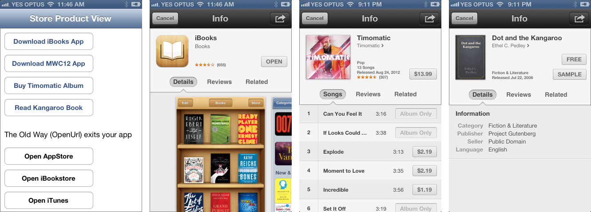](changes-to-storekit-images/image2.png#lightbox)

### Supporting Older Operating Systems

The sample application includes code that shows how to open the App Store,
iTunes, or the iBookstore in earlier versions of iOS. Use the `OpenUrl` method to open a properly crafted **itunes.com** URL.

You can implement a version check to determine which code to run, as shown here:

```csharp
if (UIDevice.CurrentDevice.CheckSystemVersion (6,0)) {
    // do iOS6+ stuff, using SKStoreProductViewController as shown above
} else {
    // don't do stuff requiring iOS 6.0, use the old syntax
    // (which will take the user out of your app)
    var nsurl = new NSUrl("http://itunes.apple.com/us/app/angry-birds/id343200656?mt=8");
    UIApplication.SharedApplication.OpenUrl (nsurl);
}
```

### Errors

The following error will occur if the Apple ID you use is not valid, which
can be confusing since it implies a network or authentication problem of some
sort.

 `Error Domain=SKErrorDomain Code=5 "Cannot connect to iTunes Store"`

### Reading Objective-C Documentation

Developers reading about Store Kit on Apple’s Developer Portal will see a
protocol – [SKStoreProductViewControllerDelegate](https://developer.apple.com/library/prerelease/ios/#documentation/StoreKit/Reference/SKITunesProductViewControllerDelegate_ProtocolRef/Reference/Reference.html) – discussed in
relation to this new feature. The delegate protocol has only one method –
productViewControllerDidFinish – which has been exposed as the `Finished` event on the `SKStoreProductViewController` in
Xamarin.iOS.

## Determining Apple IDs

The Apple ID required by the `SKStoreProductViewController` is a *number* (not to be confused with Bundle IDs like
“com.xamarin.mwc2012”). There are a few different ways you can find out the
Apple ID for products that you wish to display, listed below:

### iTunesConnect

For applications that you publish, it is easy to find the **Apple ID** in iTunes Connect:

[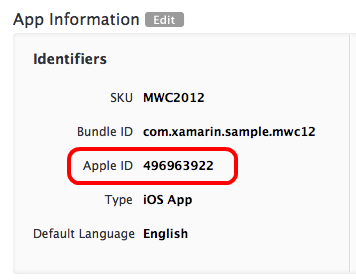](changes-to-storekit-images/image3.png#lightbox)

 <a name="Search_API"></a>

### Search API

Apple provides a dynamic search API to query all the products in the App
Store, iTunes, and the iBookstore. Information on how to access the search API
can be found in Apple's Affiliate Resources, although the API is exposed to
anyone (not just registered affiliates). The resulting JSON can be parsed to
discover the `trackId` that is the Apple ID to use with `SKStoreProductViewController`.

The results will also include other metadata including display information
and artwork URLs that can be used to render the product in your app.

Here are some examples:

- **iBooks app** – [https://itunes.apple.com/search?term=ibooks&amp;entity=software&amp;country=us](https://itunes.apple.com/search?term=ibooks&amp;entity=software&amp;country=us)
- **Dot and the Kangaroo iBook** – [https://itunes.apple.com/search?term=dot+and+the+kangaroo&amp;entity=ebook&amp;country=us](https://itunes.apple.com/search?term=dot+and+the+kangaroo&amp;entity=ebook&amp;country=us)

### Enterprise Partner Feed

Apple provides approved partners with a complete data dump of all their
products, in the form of downloadable database-ready flat files. If you qualify
for access to the Enterprise Partner Feed,
then the Apple ID for any product can be found in that dataset.

Many users of the Enterprise Partner Feed are members of the [Affiliate Program](https://www.apple.com/itunes/affiliates) that allows commissions to be earned on product sales. `SKStoreProductViewController` does not support Affiliate IDs (at the
time of writing).

### Direct Product Links

The Apple ID for a product can be inferred from its iTunes Preview URL link.
In any iTunes product links (for apps, music or books) find the part of the URL
beginning with `id` and use the number that follows.

For example, the direct link to iBooks is

```csharp
http://itunes.apple.com/us/app/ibooks/id364709193?mt=8
```

and the Apple ID is **364709193**. Similarly for the MWC2012
app, the direct link is

```csharp
http://itunes.apple.com/us/app/mwc-2012-unofficial/id496963922?mt=8
```

and the Apple ID is **496963922**.

## In-App Purchase Hosted Content

If your in-app purchases consist of downloadable content (such as books or
other media, game level art and configuration, or other large files) then these
files used to be hosted on your web server, and apps had to incorporate code to
securely download them after purchase. Beginning with iOS 6,
Apple will host your files on their servers, removing the need for a
separate server. The feature is only available for Non-Consumable products (not
Consumable or Subscriptions). Advantages of using Apple’s hosting service
include:

- Save hosting & bandwidth costs.
- Probably more scalable than whatever server host you are currently using.
- Less code to write, since you don’t have to build any server-side processing.
- Background downloading is implemented for you.

Note: testing hosted in-app purchase content in iOS Simulator is not
supported, so you must test with a real device.

### Hosted Content Basics

Prior to iOS 6, there were two ways to provide a product (described in more
detail in [Xamarin’s In-App Purchase](~/ios/platform/in-app-purchasing/index.md) documentation):

- **Built-In Products** – Features that are ‘unlocked’ by purchasing, but that are built into the application (either as code, or embedded resources). Examples of built-in products include unlocked photo-filters or in-game power-ups.
- **Server-Delivered Products** – After purchase, the application must download content from a server that you operate. This content is downloaded during purchase, stored on the device and then rendered as part of providing the product. Examples include books, magazine issues, or game levels that consist of background art and configuration files.

In iOS 6 Apple offers a variation of server-delivered products: they will
host your content files on their servers. This makes it much simpler to build
server-delivered products because you are not required to operate a separate
server, and Store Kit provides background-downloading functionality that you
previously had to write yourself. To take advantage of Apple’s hosting, enable
content hosting for new in-app purchase products and modify your Store Kit code
to take advantage of it. Product content files are then built using Xcode and
uploaded to Apple’s servers for review and release.

[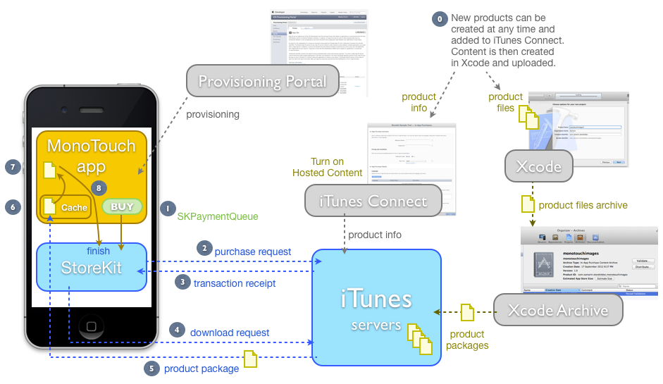](changes-to-storekit-images/image4.png#lightbox)

Using the App Store to provide in-app purchasing *with hosted content*
requires the following setup and configuration:

- **iTunes Connect** – You *must* have provided your banking and tax information to Apple so they can remit funds collected on your behalf. You can then configure products to sell, and set up sandbox user accounts to test purchasing.  _You must also configure Hosted Content for those non-consumable products that you wish to host with Apple_.
- **iOS Provisioning Portal** – Creating a Bundle Identifier and enabling App Store access for your app, as you would for any application that supports in-app purchasing.
- **Store Kit** – Adding code to your app for displaying products, purchasing products, and restoring transactions.  _In iOS 6 Store Kit will also manage the downloading of your product content, in the background, with progress updates._
- **Custom code** – To track purchases made by customers and provide the products or services they’ve purchased. Utilize new iOS 6 Store Kit classes like  `SKDownload` to retrieve the content hosted by Apple.

The following sections explain how to implement hosted content, from creating
and uploading the package to managing the purchase and download process, using
the sample code for this article.

### Sample Code

The sample project *HostedNonConsumables* (in StoreKitiOS6.zip)
uses hosted content. The app offers two
“book chapters” for sale, the content for which is hosted on Apple’s
servers. The content consists of a text file and an image, although much more
complex content could be used in a real application.

The app looks like this before, during and after a purchase:

 [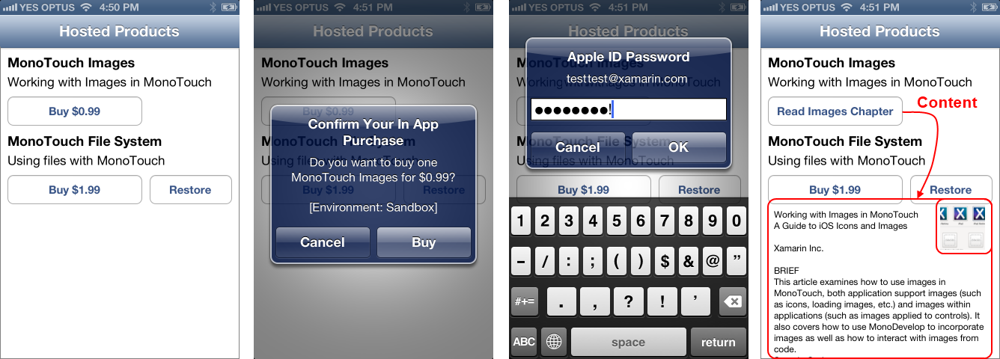](changes-to-storekit-images/image5.png#lightbox)

The text file and image are downloaded and copied into the application’s
Documents directory. For more information on the different
directories available for application storage, see the [file system documentation](~/ios/app-fundamentals/file-system.md).

## iTunes Connect

When creating new products that will use Apple’s content hosting, be sure to
select the **Non-Consumable** product type. Other product
types do not support content hosting. Also, you should not enable content
hosting for *existing* products that you sell; only turn on content
hosting for new products.

 [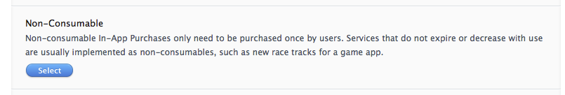](changes-to-storekit-images/image6.png#lightbox)

Enter a **Product ID**. This ID will be required later when
you create the content for this product.

 [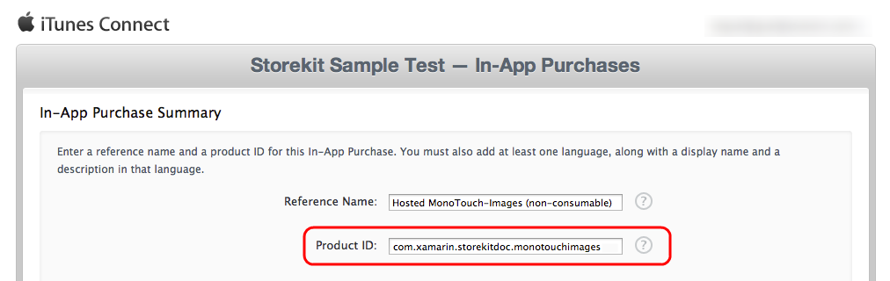](changes-to-storekit-images/image7.png#lightbox)

Content hosting is set in the Details section. Prior to the in-app purchase
going live, uncheck the **Host Content with Apple** checkbox if you
wish to cancel (even if you have uploaded some test content). However content
hosting cannot be removed after the in-app purchase has gone live.

 [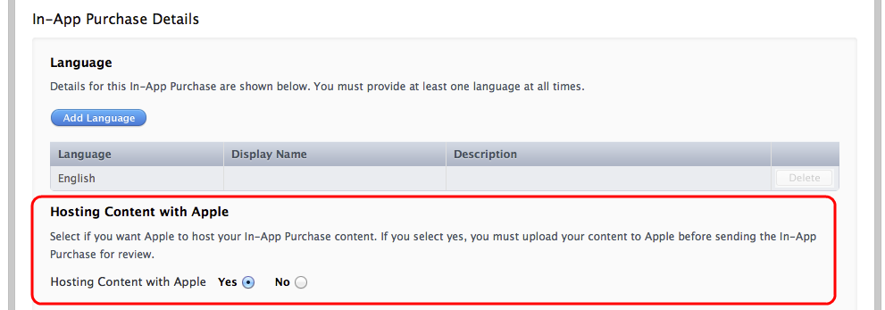](changes-to-storekit-images/image8.png#lightbox)

Once you have turned on hosting content, the product will enter **Waiting for Upload** status and show this message:

 [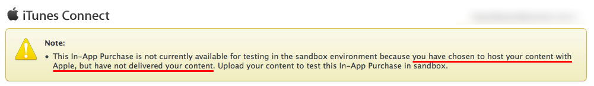](changes-to-storekit-images/image9.png#lightbox)

The content package should be created with Xcode and uploaded using the Archive
tool. Instructions for creating content packages are given in the next section **Creating .PKG Files**.

## Creating .PKG Files

The content files that you upload to Apple must meet the following
restrictions:

- Cannot exceed 2 GB in size.
- Cannot contain executable code (or symlinks that point outside the content).
- Must be properly formatted (including a **.plist** file) and have a **.pkg** file extension. This will be done automatically if you follow these instructions using Xcode.

You can add many different files, and types of files, as long as they meet
these restrictions. The content is zipped before delivery to your application
and unzipped by Store Kit before your code accesses it.

After uploading a content package, it can be replaced with newer content. New
content must be uploaded and submitted for review/approval via the normal
process. Increment the `ContentVersion` field in updated
content packages to indicate that it is newer.

### Xcode In-App Purchase Content projects

Creating packages of content for in-app purchase products currently requires
Xcode. There is NO OBJECTIVE-C CODING required; Xcode has a new project type for
these packages that just contains your files and a plist.

Our sample application has book chapters for sale – each chapter content
package will contain:

- a text file, and
- an image to represent the chapter.

Start by selecting **File > New Project** from the
menu, and choosing **In-App Purchase Content**:

 [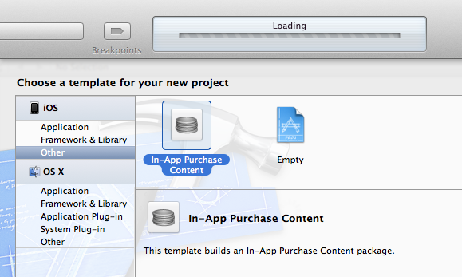](changes-to-storekit-images/image10.png#lightbox)

Enter the **Product Name** and **Company
Identifier** such that the **Bundle Identifier**
matches the **Product ID** you entered in iTunes Connect for
this product.

[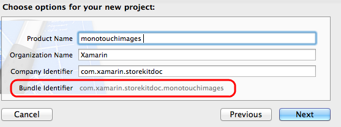](changes-to-storekit-images/image11.png#lightbox)

Now you will have a blank **In-App Purchase Content**
project. You can right-click and **Add Files…** or drag
them into the **Project Navigator**. Ensure that the **ContentVersion** is correct (it should start at 1.0, but if you
later choose to update your content, remember to increment it).

This screenshot shows Xcode with the content files included in the project
and the plist entries visible in the main window:

[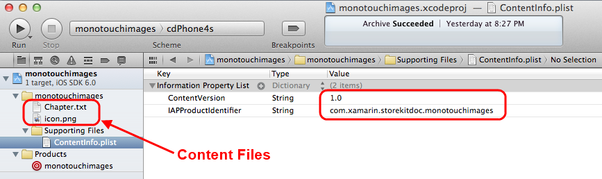](changes-to-storekit-images/image12.png#lightbox)

Once you have added all your content files you can save this project and edit
it again later, or begin the upload process.

## Uploading .PKG Files

The easiest way to upload content packages is with the **Xcode
Archive Tool**. Choose **Product > Archive** from
the menu to begin:

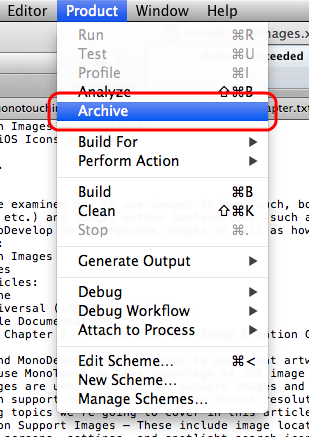

The content package will then appear in the archive as shown below.
The archive type and icon show this line is an **In-App Purchase
Content Archive**. Click **Validate…** to check our
content package for errors without actually performing the upload.

[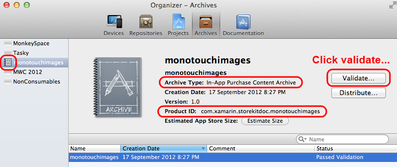](changes-to-storekit-images/image14.png#lightbox)

Login with your iTunes Connect credentials:

[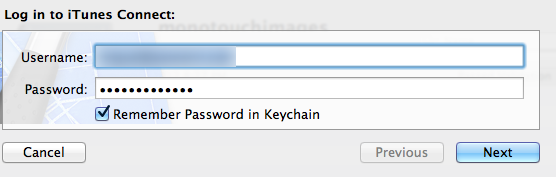](changes-to-storekit-images/image15.png#lightbox)

Choose the correct application and in-app purchase to associate this content
with:

[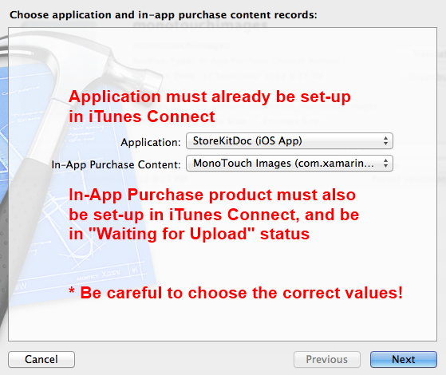](changes-to-storekit-images/image16.png#lightbox)

You should see a message like this screenshot:

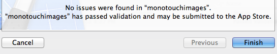

Now go through a similar process, but clicking **Distribute…** will actually upload the content.

[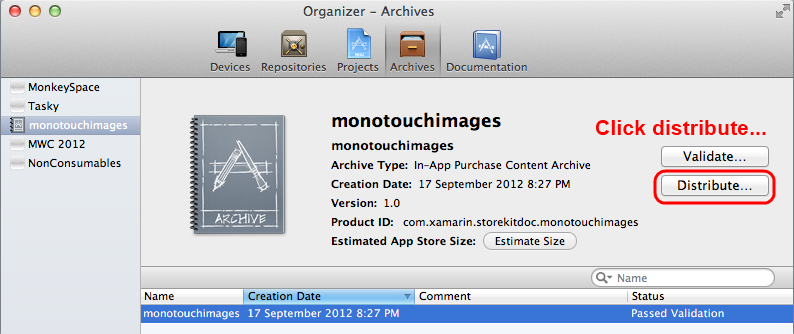](changes-to-storekit-images/image18.png#lightbox)

Select the first option, to upload the content:

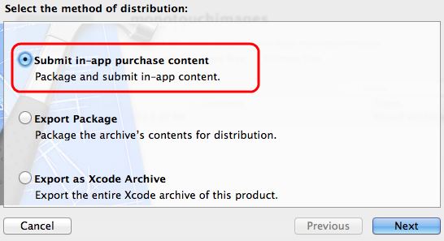

Sign in again:

[](changes-to-storekit-images/image15.png#lightbox)

Choose the correct application and in-app purchase record to upload the
content to:

[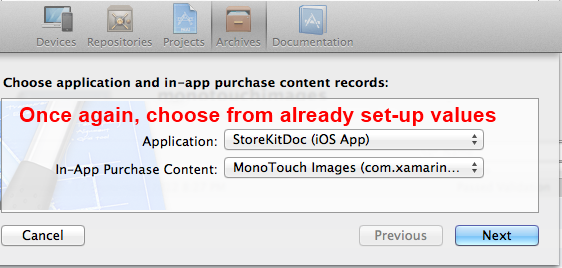](changes-to-storekit-images/image20.png#lightbox)

Wait while your files are uploaded:

[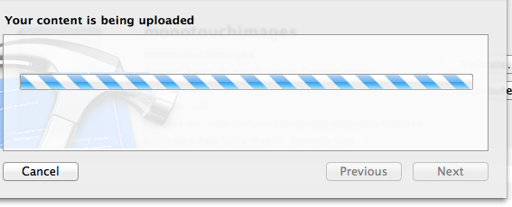](changes-to-storekit-images/image21.png#lightbox)

When the upload is complete, a message will appear to advise you that the
content has been submitted to the App Store.

[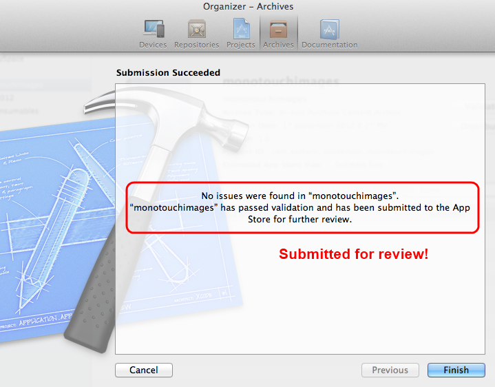](changes-to-storekit-images/image22.png#lightbox)

Once that has been done, when you return to the product page on iTunes
Connect it will show the package details and be in **Ready to
Submit** status. When the product is in this status, you can begin testing
in the sandbox environment. You do NOT need to ‘submit’ the product for
testing in the sandbox.

[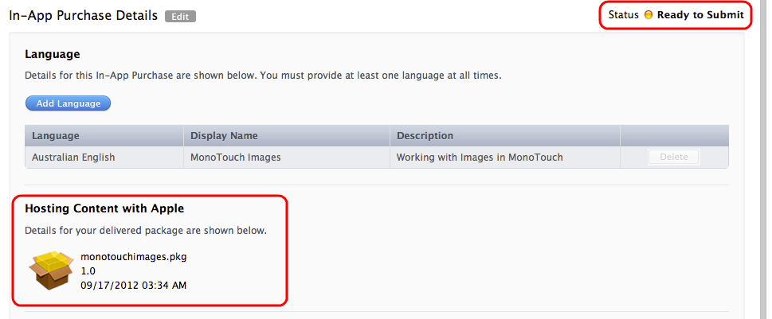](changes-to-storekit-images/image23.png#lightbox)

It can take some time (eg. a few minutes) between uploading the archive and
the iTunes Connect status being updated. You can submit the product for review
separately, or submit it in conjunction with an application binary. Only after
Apple has officially approved the content will it be available in the production
App Store for purchase in your app.

### PKG File Format

Using Xcode and the Archive Tool to create and upload a hosted content
package means that you never see the contents of the package itself. The files
and directories in the packages created for the sample app look like the screenshot below, with
the **plist** file in the root and the product files in a **Contents** subdirectory:

[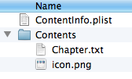](changes-to-storekit-images/image24.png#lightbox)

Note the directory structure of the package (especially the location of the
files in the `Contents` subdirectory) because you will need to
understand this information to extract the files from the package on the
device.

### Updating Package Content

The procedure for updating content after it has been approved:

- Edit the In-App Purchase Content project in Xcode.
- Bump version number up.
- Upload to iTunes Connect again. Subsequent purchasers will automatically get the latest version BUT users who already have the old version will not receive any notification.
- Your app is responsible for notifying users and encouraging them to retrieve a newer version of the content. The app must also build a function that downloads the new version, using the Restore feature of Store Kit.
- To determine if a newer version exists, you can build a feature into your app to fetch SKProducts (eg. same process that is used to retrieve product prices) and compare the ContentVersion property.

## Purchasing Overview

Before reading this section, review the existing [In-App Purchase documentation](~/ios/platform/in-app-purchasing/index.md).

The sequence of events that occurs when a product with hosted content is
purchased and download is illustrated in this diagram:

[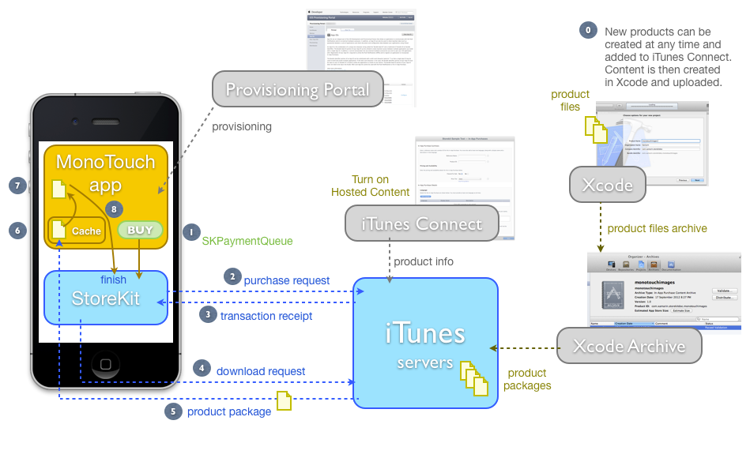](changes-to-storekit-images/image25.png#lightbox)

1. New products can be created in iTunes Connect with Hosted Content enabled. The actual content is constructed separately in Xcode (as simply as dragging files into a folder) and then Archived and uploaded to iTunes (no coding is required). Each product is then submitted for approval, after which it becomes available for purchase. In the sample code these Product IDs are hardcoded, but hosting content with Apple is more flexible if you store the available product list on a remote server so that it can be updated when you submit new products and content to iTunes Connect.
1. When the user purchases a product, a transaction is placed in the payment queue for processing.
1. Store Kit forwards the purchase request to iTunes servers for processing.
1. Transaction is completed on the iTunes servers (eg. customer is charged) and a receipt is returned to the app, with product information attached including whether it is downloadable (and if so, the file size and other metadata).
1. Your code should check if the product is downloadable, and if so make a content download request that is also placed on the payment queue. Store Kit sends this request to the iTunes servers.
1. Server returns content file to Store Kit, which provides a callback to return download progress and time remaining estimates to your code.
1. Once complete, you get notified and passed a file location in the Cache folder.
1. Your code should copy out the files and verify them, save any state that you need to remember that the product has been purchased. Take this opportunity to set the backup flag correctly on the new files (hint: if they come from a server and are never edited by the user, you should probably skip backing them up, since the user can always retrieve them from Apple’s servers in future).
1. Call FinishTransaction. This step is IMPORTANT as it removes the transaction from the Payment Queue. It is also important that you do NOT call FinishTransaction until AFTER you have copied the content out of the Cache directory. Once you call FinishTransaction, the Cached files are likely to be quickly purged.

## Implementing Hosted Content Purchase

The following information should be read in conjunction with the complete [In-App Purchases documentation](~/ios/platform/in-app-purchasing/index.md). The information in this document focuses on the differences
between hosted content and the previous implementation.

### Classes

The following classes have been added or altered to support hosted content in
iOS 6:

- **SKDownload** – New class that represents a download in progress. The API allows for more than one per-product, however initially only one has been implemented.
- **SKProduct** – New properties added: `Downloadable`, `ContentVersion`, `ContentLengths` array.
- **SKPaymentTransaction** – New property added: `Downloads`, which contains a collection of  `SKDownload` objects if this product has hosted content available for download.
- **SKPaymentQueue** – New method added: `StartDownloads`. Call this method with `SKDownload` objects to fetch their hosted content. Downloading can occur in the background.
- **SKPaymentTransactionObserver** – New method: `UpdateDownloads`. Store Kit calls this method with progress information about current download operations.

Details of the new `SKDownload` class:

- **Progress** – A value between 0-1 that you can use to display a percent-complete indicator to the user. Do NOT use Progress == 1 to detect whether the download is complete, check for State == Finished.
- **TimeRemaining** – Estimate of the download time remaining, in seconds. -1 means it is still calculating estimate.
- **State** – Active, Waiting, Finished, Failed, Paused, Cancelled.
- **ContentURL** – File location where the content was put on disk, in the  `Cache` directory. ONLY populated once the download has Finished.
- **Error** – Check this property if the State is Failed.

The interactions between the classes in the sample code are shown in this
diagram (the code specific to hosted content purchases is shown in green):

[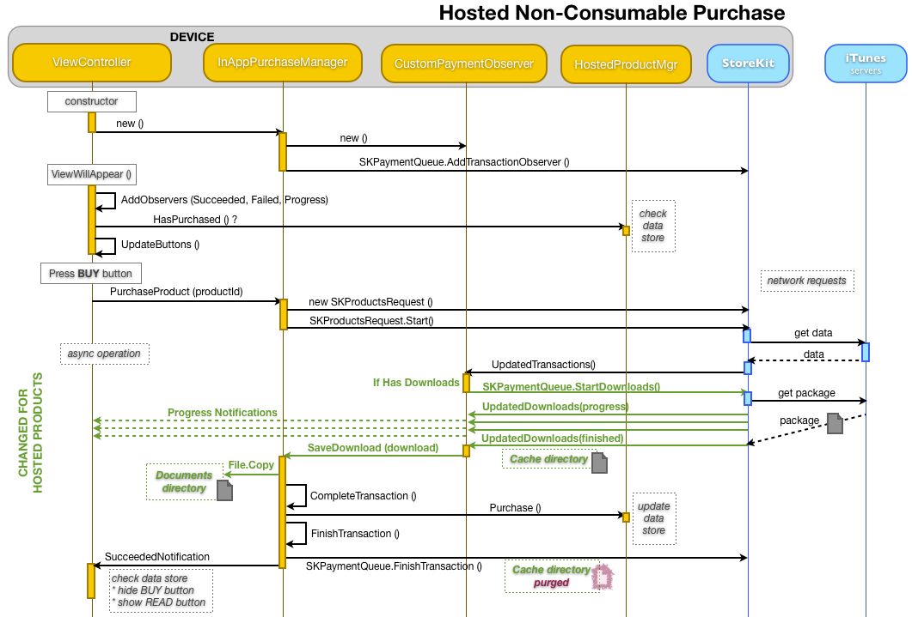](changes-to-storekit-images/image26.png#lightbox)

The sample code where these classes have been used is shown in the remainder
of this section:

### CustomPaymentObserver (SKPaymentTransactionObserver)

Change the existing `UpdatedTransactions` override to check for
downloadable content, and call `StartDownloads` if necessary:

```csharp
public override void UpdatedTransactions (SKPaymentQueue queue, SKPaymentTransaction[] transactions)
{
    foreach (SKPaymentTransaction transaction in transactions) {
        switch (transaction.TransactionState) {
        case SKPaymentTransactionState.Purchased:
            // UPDATED FOR iOS 6
            if (transaction.Downloads != null && transaction.Downloads.Length > 0) {
                // Purchase complete, and it has downloads... so download them!
                SKPaymentQueue.DefaultQueue.StartDownloads (transaction.Downloads);
                // CompleteTransaction() call has moved after downloads complete
            } else {
                // complete the transaction now
                theManager.CompleteTransaction(transaction);
            }
            break;
        case SKPaymentTransactionState.Failed:
            theManager.FailedTransaction(transaction);
            break;
        case SKPaymentTransactionState.Restored:
            // TODO: you must decide how to handle restored transactions.
            // Triggering all the downloads at once is not advisable.
            theManager.RestoreTransaction(transaction);
            break;
        default:
            break;
        }
    }
}
```

New overridden method `UpdatedDownloads` is shown below. Store Kit
calls this method after `StartDownloads` is triggered in `UpdatedTransactions`. This method is called *multiple times*
at indeterminate intervals to provide you with download progress and then again
when the download has finished. Notice the method accepts an array of `SKDownload` objects, so each method call can provide you with the
status of multiple downloads in the queue. As shown in the implementation below
the download statuses are checked every time and appropriate action taken.

```csharp
// ENTIRELY NEW METHOD IN iOS6
public override void PaymentQueueUpdatedDownloads (SKPaymentQueue queue, SKDownload[] downloads)
{
    Console.WriteLine (" -- PaymentQueueUpdatedDownloads");
    foreach (SKDownload download in downloads) {
        switch (download.DownloadState) {
        case SKDownloadState.Active:
            // TODO: implement a notification to the UI (progress bar or something?)
            Console.WriteLine ("Download progress:" + download.Progress);
            Console.WriteLine ("Time remaining:   " + download.TimeRemaining); // -1 means 'still calculating'
            break;
        case SKDownloadState.Finished:
            Console.WriteLine ("Finished!!!!");
            Console.WriteLine ("Content URL:" + download.ContentUrl);

            // UNPACK HERE! Calls FinishTransaction when it's done
            theManager.SaveDownload (download);

            break;
        case SKDownloadState.Failed:
            Console.WriteLine ("Failed"); // TODO: UI?
            break;
        case SKDownloadState.Cancelled:
            Console.WriteLine ("Canceled"); // TODO: UI?
            break;
        case SKDownloadState.Paused:
        case SKDownloadState.Waiting:
            break;
        default:
            break;
        }
    }
}
```

### InAppPurchaseManager (SKProductsRequestDelegate)

This class contains a new method `SaveDownload` that is called
after each download completes successfully.

The hosted content has been downloaded successfully and unzipped into the `Cache` directory. The structure of the .PKG file requires all files
to be saved in a `Contents` subdirectory, so the code below extracts
files from within the `Contents` subdirectory.

The code iterates through all the files in the content package and copies
them into the `Documents` directory, in a subfolder named for the `ProductIdentifier`. Finally it calls `CompleteTransaction`, which calls `FinishTransaction` to
remove the transaction from the payment queue.

```csharp
// ENTIRELY NEW METHOD IN iOS 6
public void SaveDownload (SKDownload download)
{
    var documentsPath = Environment.GetFolderPath (Environment.SpecialFolder.Personal); // Documents folder
    var targetfolder = System.IO.Path.Combine (documentsPath, download.Transaction.Payment.ProductIdentifier);
    // targetfolder will be "/Documents/com.xamarin.storekitdoc.montouchimages/" or something like that
    if (!System.IO.Directory.Exists (targetfolder))
        System.IO.Directory.CreateDirectory (targetfolder);
    foreach (var file in System.IO.Directory.EnumerateFiles
             (System.IO.Path.Combine(download.ContentUrl.Path, "Contents"))) { // Contents directory is the default in .PKG files
        var fileName = file.Substring (file.LastIndexOf ("/") + 1);
        var newFilePath = System.IO.Path.Combine(targetfolder, fileName);
        if (!System.IO.File.Exists(newFilePath)) // HACK: this won't support new versions...
            System.IO.File.Copy (file, newFilePath);
        else
            Console.WriteLine ("already exists " + newFilePath);
    }
    CompleteTransaction (download.Transaction); // so it gets 'finished'
}
```

When `FinishTransaction` is called, the downloaded files are no
longer guaranteed to be in the `Cache` directory. All files should be
copied before calling `FinishTransaction`.

## Other Considerations

The example code above demonstrates a fairly simple implementation of hosted
content purchasing. There are some additional points that you must consider:

### Detecting Updated Content

While it is possible to update your hosted content packages, Store Kit does
not provide any mechanism to push these updates out to users who have already
downloaded and purchased the product. To implement this functionality your code
may check the new `SKProduct.ContentVersion` property (if the `SKProduct` is `Downloadable`) regularly, and detect if
the value is incremented. Alternatively you could build a push-notification
system.

### Installing Updated Content Versions

The sample code above skips file copying if the file already exists. This is
NOT a good idea if you wish to support newer versions of the content being
downloaded.

An alternative might be to copy the content into a folder named for the
version, and keep track of which is the current version (eg. in `NSUserDefaults` or wherever you store completed purchase
records).

### Restoring Transactions

When `SKPaymentQueue.DefaultQueue.RestoreCompletedTransactions` is
called, Store Kit returns all previous transactions for the user. If they have
purchased a large number of items, or if each purchase has large content
packages, then the restore could result in a lot of network traffic as
everything gets queued up for download at once.

Consider keeping track of whether a product has been purchased separately
from the actual download of the associated content package.

### Pausing, Restarting And Canceling Downloads

Although the sample code does not demonstrate this feature, it is possible to
pause and restart hosted content downloads. The `SKPaymentQueue.DefaultQueue` has methods for `PauseDownloads`, `ResumeDownloads` and `CancelDownloads`.

If the code calls `FinishTransaction` on the payment queue prior
to the download being `Finished` then that download is cancelled
automatically.

### Setting the SKIP-Backup Flag on the Downloaded Content

Apple’s iCloud Backup Guidelines suggest that non-user content that is
easily restored from a server should *not* be backed-up (because it would
unnecessarily use up iCloud storage). For more information on setting the backup
attribute, see the [file system](~/ios/app-fundamentals/file-system.md) documentation.

## Summary

This article has introduced two new features of Store Kit in iOS6: purchasing
iTunes and other content from within your app, and utilizing Apple’s server to
host your own in-app purchases. This introduction should be read in conjunction
with the existing [In-App Purchase documentation](~/ios/platform/in-app-purchasing/index.md) for complete coverage of implementing Store Kit
functionality.

## Related Links

- [StoreKit (sample)](/samples/xamarin/ios-samples/storekit)
- [In-App Purchasing](~/ios/platform/in-app-purchasing/index.md)
- [StoreKit Framework Reference](https://developer.apple.com/library/prerelease/ios/#documentation/StoreKit/Reference/StoreKit_Collection/_index.html)
- [SKStoreProductViewController Class Reference](https://developer.apple.com/library/ios/documentation/StoreKit/Reference/SKITunesProductViewController_Ref/SKStoreProductViewController.html)
- [SKDownload](https://developer.apple.com/library/prerelease/ios/#documentation/StoreKit/Reference/SKDownload_Ref/Introduction/Introduction.html)
- [SKPaymentQueue](https://developer.apple.com/library/prerelease/ios/documentation/StoreKit/Reference/SKPaymentQueue_Class/Reference/Reference.html#/apple_ref/occ/instm/SKPaymentQueue/cancelDownloads:)
- [SKProduct](https://developer.apple.com/library/prerelease/ios/documentation/StoreKit/Reference/SKProduct_Reference/Reference/Reference.html#/apple_ref/occ/instp/SKProduct/downloadable)
- [WWDC Video: Selling Products with Store Kit](https://developer.apple.com/videos/wwdc/2012/?include=302#302)