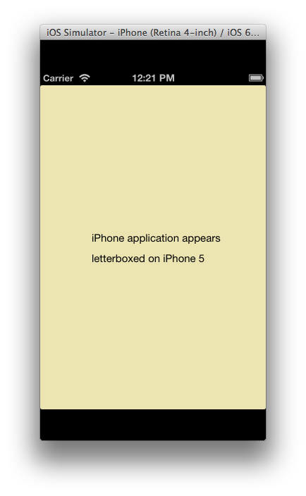
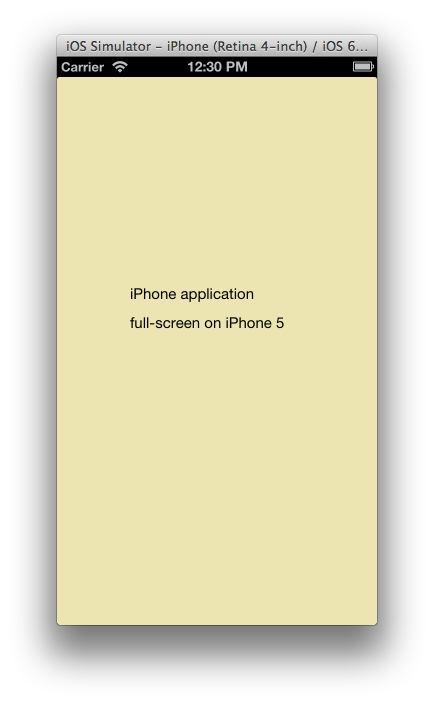
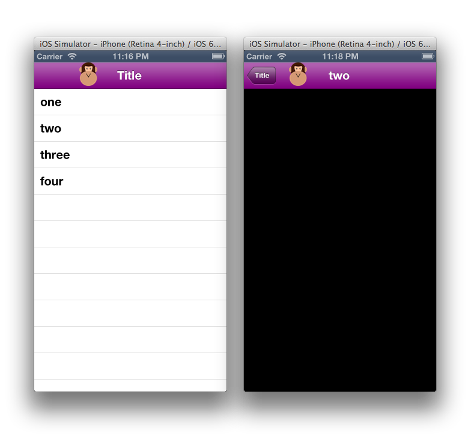

# Introduction to iOS 6

_iOS 6 includes a variety of new technologies for developing apps, which Xamarin.iOS 6 brings to C# developers._

[](images/ios6-large.jpg#lightbox)

With iOS 6 and Xamarin.iOS 6, developers now have a wealth of capability at
their disposal to create iOS applications, including ones that target iPhone 5.
This document lists some of the more exciting new features that are available
and links to articles for each topic. In addition it touches on a couple changes
that will be important as developers move to iOS 6 and the new resolution of
iPhone 5.

## [Introduction to Collection Views](~/ios/user-interface/controls/uicollectionview.md)

Collection Views allow content to be displayed using arbitrary layouts. They
allow easily creating grid-like layouts out of the box, while supporting custom
layouts as well. For more information see, the [Introduction to Collection Views](~/ios/user-interface/controls/uicollectionview.md) guide.

## [Introduction to PassKit](~/ios/platform/passkit.md)

The PassKit framework allows applications to interact with digital passes
that are managed in the Passbook app. For more information see, the [Introduction to Pass Kit guide](~/ios/platform/passkit.md).

## [Introduction to EventKit](~/ios/platform/eventkit.md)

The EventKit framework provides a way to access the Calendars, Calendar
Events, and Reminders data that Calendar Database stores. Access to the
calendars and calendar events has been available since iOS 4, but iOS 6 now
exposes access to reminders data. For more information, see the [I](~/ios/platform/eventkit.md) [ntroduction to EventKit](~/ios/platform/eventkit.md) guide.

## [Introduction to the Social Framework](~/ios/platform/social-framework.md)

The Social Framework provides a unified API for interacting with social
networks including Twitter and Facebook, as well as SinaWeibo for users in
China. For more information see, the [Introduction to the Social Framework](~/ios/platform/social-framework.md) guide.

## [Changes to StoreKit](changes-to-storekit.md)

Apple has introduced two new features in Store Kit: purchasing and
downloading iTunes or App Store content from within your app, and hosting your
content files for in-app purchases!. For more information see, the [Changes to Store Kit](changes-to-storekit.md) guide.

## Other Changes

### ViewWillUnload and ViewDidUnload Deprecated

The `ViewWillUnload` and `ViewDidUnload` methods of `UIViewController` are no longer called in iOS 6. In previous
versions of iOS, these methods may have been used by applications for saving
state before a view unloads, and cleanup code respectively.

For example, Visual Studio for Mac would create a method called `ReleaseDesignerOutlets`, shown below, which would then be called
from `ViewDidUnload`:

```csharp
void ReleaseDesignerOutlets ()
{
    if (myOutlet != null) {
        myOutlet.Dispose ();
        myOutlet = null;
    }
}
```

However, in iOS 6, it is no longer necessary to call `ReleaseDesignerOutlets`.   

For cleanup code, iOS 6 applications should use `DidReceiveMemoryWarning`. However, code that
calls `Dispose` should be used sparingly and only for memory
intensive objects as shown below:

```csharp
if (myImageView != null){
    if (myImageView.Superview == null){
        myImageView.Dispose();
        myImageView = null;
    }
}
```

Again, calling `Dispose` as above should rarely be needed. In
general the most applications should do is to remove event handlers.

For the case of saving state, applications can perform this in `ViewWillDisappear` and `ViewDidDisappear` instead of `ViewWillUnload`.

### iPhone 5 Resolution

iPhone 5 devices have a 640x1136 resolution. Applications that targeted
previous versions of iOS will appear letterboxed when run on an iPhone 5, as
shown below:

 [](images/01-letterboxed.png#lightbox)

In order for the application to appear full-screen on iPhone 5, simply add an
image named `Default-568h@2x.png` having a resolution of 640x1136. The
following screenshot shows the application running after this image has been
included:

 [](images/02-fullscreen.png#lightbox)

### Subclassing UINavigationBar

In iOS 6 `UINavigationBar` can be subclassed. This allows
additional control of the look and feel of the `UINavigationBar`. For
example, applications can subclass to add subviews, animate those views and
modify the Bounds of the `UINavigationBar`.

The code below shows an example of a subclassed `UINavigationBar`
that adds a `UIImageView`:

```csharp
public class CustomNavBar : UINavigationBar
{
​    UIImageView iv;
    public CustomNavBar (IntPtr h) : base(h)
​    {
​​        iv = new UIImageView (UIImage.FromFile ("monkey.png"));
​​        iv.Frame = new CGRect (75, 0, 30, 39);
​    }
    public override void Draw (RectangleF rect)
​    {
​​        base.Draw (rect);
        TintColor = UIColor.Purple;
​​        AddSubview (iv);
​    }
}
```

To add a subclassed `UINavigationBar` to a `UINavigationController`, use the `UINavigationController`
constructor that takes the type of the `UINavigationBar` and `UIToolbar`, as shown below:

```csharp
navController = new UINavigationController (typeof(CustomNavBar), typeof(UIToolbar));
```

Using this `UINavigationBar` subclass results in the image view
being displayed as shown in the following screenshot:

 [](images/03-navbar.png#lightbox)

### Interface Orientation

Prior to iOS 6 applications could override `ShouldAutorotateToInterfaceOrientation`, returning true for any
orientations the particular controller supported. For example, the following
code would be used to support only portrait:

```csharp
public override bool ShouldAutorotateToInterfaceOrientation (UIInterfaceOrientation toInterfaceOrientation)
    {
        return (toInterfaceOrientation == UIInterfaceOrientation.Portrait);
    }
```

In iOS 6 `ShouldAutorotateToInterfaceOrientation` is deprecated.
Instead applications can override `GetSupportedInterfaceOrientations`
on the root view controller as shown below:

```csharp
public override UIInterfaceOrientationMask GetSupportedInterfaceOrientations ()
    {
        return UIInterfaceOrientationMask.Portrait;
    }
```

On iPad, this defaults to all four orientations if `GetSupportedInterfaceOrientation` is not implemented. On iPhone and
iPod Touch, the default is all orientations except `PortraitUpsideDown`.
