# iOS 7 User Interface Overview

_iOS 7 introduces a plethora of user interface changes. This article highlights some of the larger changes, both in the visual appearance of controls and in the APIs that support the new design._

iOS 7 focuses on content over chrome. User interface elements in iOS 7 de-emphasize chrome by removing attributes such as extraneous borders, status bars, and navigation bars, which reduce the amount of screen space used by content views. In iOS 7, content is designed to use the entire screen.

iOS 7 introduces several other changes: color is used to distinguish user interface elements, in lieu of attributes such as button borders. Many elements, such as navigation bars and status bars, are now either blurred and translucent or transparent, with content views taking area beneath them. These content views render through the blurred bars, conveying a feeling of depth in the user interface.

This article covers several of the changes to user interface elements in iOS 7 as well as various APIs related to the new user interface design.

## View and Control Changes

All of the views in UIKit conform to the new look and feel of iOS 7. This section highlights some of the changes to these views, as well as the related APIs that have changed to support the new UI.

### UIButton

Buttons created from the `UIButton` class are now borderless, with no background by default, as shown below:

 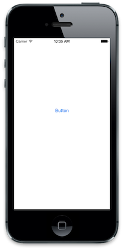

The `UIButtonType.RoundedRect` style has been deprecated. If used in iOS 7, `UIButtonType.RoundedRect` will result in `UIButtonType.System` being used, which produces the default button style with no background or visible edges, as shown above.

### UIBarButtonItem

Similar to `UIButton`, bar buttons are also borderless, defaulting to the new `UIBarButtonItemStyle.Plain` style shown below:

 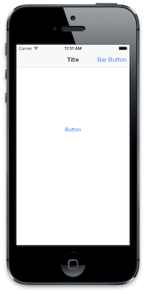

Additionally, the `UIBarButtonItemStyle.Bordered` style has been deprecated. Setting `UIBarButtonItemStyle.Bordered` in iOS 7 will result in the `UIBarButtonItemStyle.Plain` style being used.

The `UIBarButtonItemStyle.Done` style has not been deprecated. However, it will also create a borderless button, only with a bold text style as shown:

 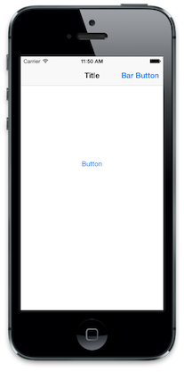

### UIAlertView

In addition to the style change for the new iOS 7 look and feel, alert views no longer support customization via subview. Even though `UIAlertView` inherits from `UIView`, calling `AddSubview` on a `UIAlertView` has no effect. For example, consider the following code:

```csharp
UIBarButtonItem button = new UIBarButtonItem ("Bar Button", UIBarButtonItemStyle.Plain, (s,e) =>
{
    UIAlertView alert = new UIAlertView ("Title", "Message", null, "Cancel", "OK");

    alert.AddSubview (new UIView () {
        Frame = new CGRect(50, 50,100, 100),
        BackgroundColor = UIColor.Green
    });

    alert.Show ();
});
```

This produces a standard alert view, with the subview being ignored, as shown below:

 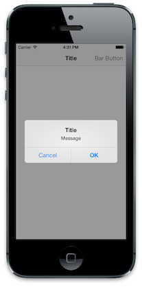

 Note: UIAlertView was deprecated in iOS 8. View the [Alert Controller](https://github.com/xamarin/recipes/tree/master/Recipes/ios/standard_controls/alertcontroller) recipe on using an Alert View in iOS 8 and above.

### UISegmentedControl

Segmented controls in iOS 7 are transparent and support tint color. The tint color is used for the text and border color. When a segment is selected, the color is swapped between the background and the text, with the tint color used to highlight the selected segment, as shown below:

 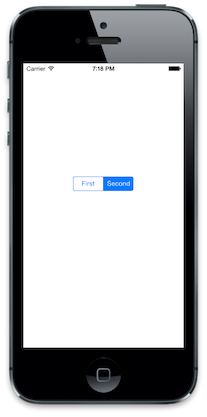

Additionally, the `UISegmentedControlStyle` has been deprecated in iOS 7.

### Picker Views

The API for picker views is largely unchanged; however, iOS 7 design guidelines now state picker views should be presented inline rather than as input views animated from the bottom of the screen or via a new controller pushed onto a navigation controller’s stack, as in previous iOS versions. This can be seen in the system calendar app:

 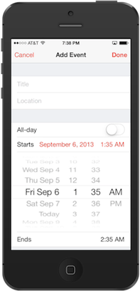

### UISearchDisplayController

The search bar is now shown inside the navigation bar when the `UISearchDisplayController.DisplaysSearchBarInNavigationBar` property is set to true. When set to false - the default - the navigation bar is hidden when the search controller is displayed.

The following screenshot shows the search bar within a `UISearchDisplayController`:

 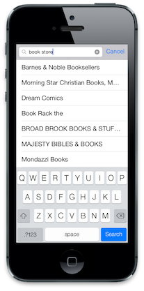

### UITableView

The APIs around `UITableView` are mainly unchanged; however, the style has changed dramatically to conform to the new user interface design. The internal view hierarchy is also somewhat different. This change won't affect most apps, but it is something to be aware of.

#### Grouped Table Style

The grouped style changed has updated, with the content now extending to the edges of the screen as shown below:

 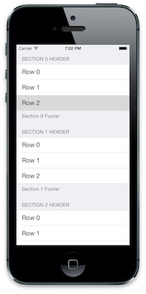

#### SeparatorInset

Row separators can now be indented by setting the `UITableVIewCell.SeparatorInset` property. For example, the following code would be used to indent the cells from the left edge:

```csharp
cell.SeparatorInset = new UIEdgeInsets (0, 50, 0, 0);
```

This produces in the table view with indented cells as shown below:

 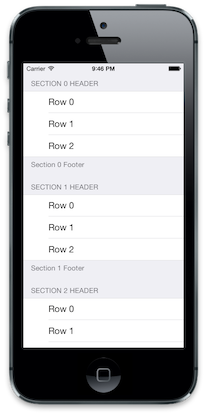

#### Table Button Styles

The various buttons used in table views have all changed. The following screenshot presents a table view in editing mode:

 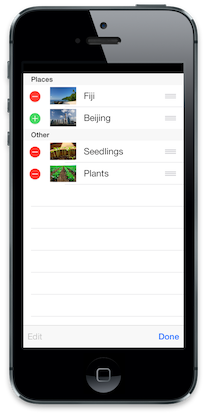

### Additional Control Changes

Other UIKit controls have changed as well, including sliders, switches and steppers. These changes are purely visual. For more information, refer to Apple’s [iOS 7 UI Transition Guide](https://developer.apple.com/library/prerelease/ios/documentation/UserExperience/Conceptual/TransitionGuide/index.html).

## General User Interface Changes

In addition to the changes in UIKit, iOS 7 introduces a variety of visual changes to the UI, including:

- Full Screen Content
- Bar Appearance
- Tint Color

<a name="fullscreen"></a>

### Full-Screen Content

iOS 7 is designed to let applications take advantage of the entire screen. View controllers now appear overlapped by a status bar and navigation bar - if one exists - as opposed to appearing below the status and navigation bars.

As you prepare your application for iOS 7, you can realign subviews visually using *Interface Builder* or the *Xamarin iOS Designer*. You can also use one of the new APIs to help handle full-screen content programmatically. These APIs are introduced below.

#### TopLayoutGuide and BottomLayoutGuide

 `TopLayoutGuide` and `BottomLayoutGuide` serve as a reference for where views should begin or end, so that the content is not overlapped by a translucent `UIKit` bar, as in the following example:

 [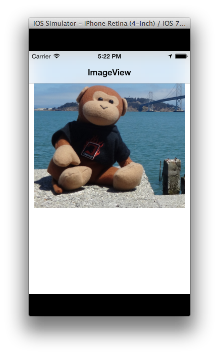](ios7-ui-images/clipped.png#lightbox)

These APIs can be used to calculate a view's displacement from the top or bottom of the screen, and adjust content placement accordingly:

```csharp
public override void ViewDidLayoutSubviews ()
{
    base.ViewDidLayoutSubviews ();

    if (UIDevice.CurrentDevice.CheckSystemVersion (7, 0)) { 
        nfloat displacement_y = this.TopLayoutGuide.Length;

        //load subviews with displacement
    }

}
```

We can use the value calculated above to set our `ImageView`'s displacement from the top of the screen, so the whole image is visible:

 [](ios7-ui-images/good2.png#lightbox)

Refer to the [ImageViewer](/samples/xamarin/ios-samples/ios7-ui-updates/) for a working sample.

The displacement value is generated dynamically after the View has been added to the hierarchy, so attempting to read `TopLayoutGuide` and `BottomLayoutGuide` values in `ViewDidLoad` will return 0. Calculate the value after the View has loaded - for example, in the `ViewDidLayoutSubviews`.

> [!IMPORTANT]
> `TopLayoutGuide` and `BottomLayoutGuide` are deprecated in iOS 11 in favor of the new safe area layout. Apple have stated that using the safe area is compatible with iOS version earlier than iOS 11. For more information, see the [Updating your app for iOS 11](~/ios/platform/introduction-to-ios11/updating-your-app/visual-design.md#fullscreen) guide.

#### EdgesForExtendedLayout

This API specifies which edges of a view should be extended to full screen, regardless of bar translucency. In iOS 7, navigation bars and toolbars appear layered above the controller’s view - unlike in previous iOS versions, where they didn’t take up the same space. The iOS 7 Photos application illustrates the default `UIViewController.EdgesForExtendedLayout` value, `UIRectEdge.All`. This setting fills all four edges in the view with content, creating the overlapping and full-screen effect:

 [](ios7-ui-images/photos.png#lightbox)

Tapping the image removes the bars and shows the image full-screen:

 [](ios7-ui-images/photos2.png#lightbox)

Because full-screen content is the default, applications configured for iOS 6 will have part of the view clipped, as in the screenshot below:

 [](ios7-ui-images/clipped.png#lightbox)

Modifying the `UIViewController.EdgesForExtendedLayout` property adjusts for this behavior. We can specify that the view not fill any edges, so our view will avoid displaying content in the space occupied by navigation or toolbars (at every orientation):

```csharp
if (UIDevice.CurrentDevice.CheckSystemVersion (7, 0)) { 
    this.EdgesForExtendedLayout = UIRectEdge.None;
}
```

In our app, we'll see the view is again repositioned, so the whole image is visible:

 [](ios7-ui-images/good.png#lightbox)

Note that while the effects of the `TopLayoutGuide/BottomLayoutGuide` and `EdgesForExtendedLayout` APIs are similar, they are meant to fill different goals. Changing the `EdgesForExtendedLayout` setting from the default may fix clipped views in applications designed for iOS 6, but a good iOS 7 design should honor the full-screen aesthetic and provide a full-screen viewing experience, relying on `TopLayoutGuide` and `BottomLayoutGuide` to properly position content that's meant to be manipulated into a comfortable place for the user.

Refer to the [ImageViewer](/samples/xamarin/ios-samples/ios7-ui-updates/) for a working sample.

### Status and Navigation Bars

The status bar and navigation bars are rendered with transparency. Status bars are transparent, while toolbars and navigation bars are translucent and blurred to convey the feeling of depth in the user interface. The following screenshot shows this blurring and transparency, where the blue background color of the collection view shows through both the status and navigation bars, giving them a light blue appearance:

 

#### Status Bar Styles

Along with blurring and transparency, the foreground of a status bar can be either light or dark (dark being the default). The status bar style can be set from the view controller. A view controller can also set whether the status bar is hidden or displayed.

For example, the following code overrides the `PreferredStatusBarStyle` method of a view controller to make the status bar display a light foreground:

```csharp
public override UIStatusBarStyle PreferredStatusBarStyle ()
{
    return UIStatusBarStyle.LightContent;
}
```

This causes the status bar to appear as below:

 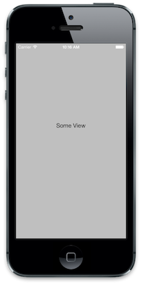

To hide the status bar from the view controller’s code, override `PrefersStatusBarHidden`, as shown below:

```csharp
public override bool PrefersStatusBarHidden ()
{
    return true;
}
```

This hides the status bar:

 

### Tint Color

Buttons are now displayed as chrome-less text. The text color can be controlled using the new `TintColor` property on `UIView`. Setting the `TintColor` applies the color to the entire view hierarchy for the view that sets it. To apply a `TintColor`throughout an app, set it on the `Window`. You can also detect when the tint color changes via the `UIView.TintColorDidChange` method.

For example, the following screenshot shows the effect of changing the tint color on a navigation controller’s view to purple:

 

The tint color can be applied to images as well when the `RenderingMode` is set to `UIImageRenderingMode.AlwaysTemplate`.

> [!IMPORTANT]
> Tint color cannot be set using `UIAppearance`.

### Dynamic Type

In iOS 7, the user can specify text size in the system settings. With dynamic type, the font is adjusted dynamically to look good regardless of the size. `UIFont.PreferredFontForTextStyle` should be used to get a font that is optimized for the user-controlled size.

## Summary

This article covers the changes to user interface elements in iOS 7. It examines several of the changes made to views and controls in UIKit, highlighting both the visual changes as well as changes to related APIs. Finally, it introduces new APIs to work with full screen content, new tint color support, and dynamic type.

## Related Links

- [ImageViewer (sample)](/samples/xamarin/ios-samples/ios7-ui-updates)