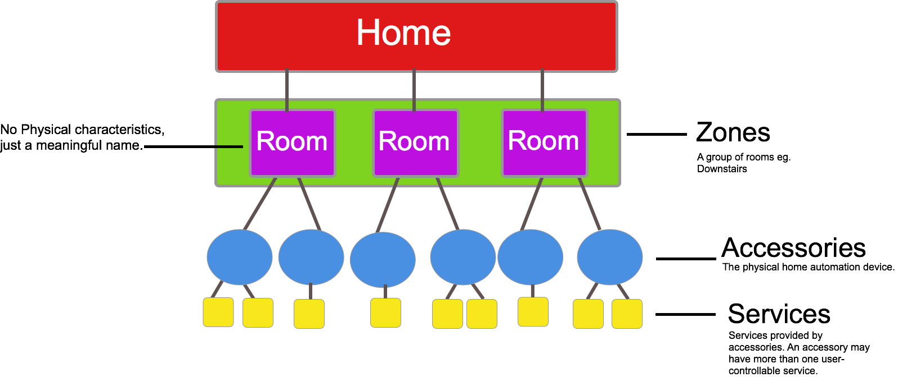
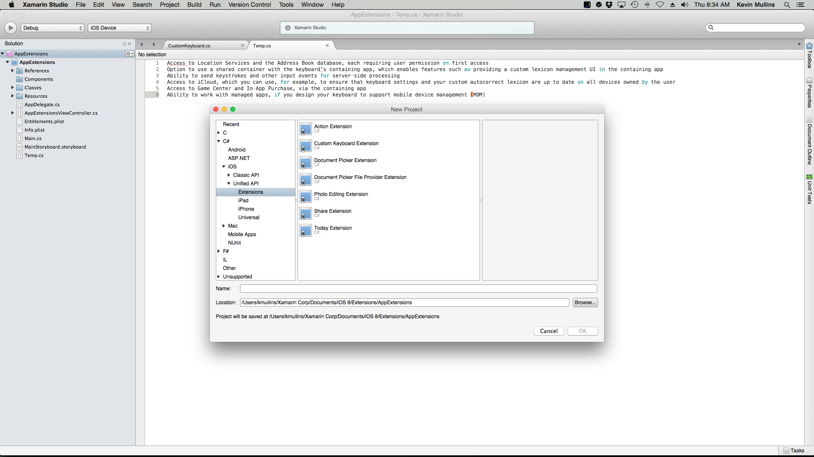

# Introduction to iOS 8

_With iOS 8, Apple has provided a plethora of new frameworks and APIs to excite and delight developers. In this guide we will introduce these new APIs and see how iOS 8 can benefit both developers and users._

iOS 7 visually changed the entire iOS user interface from what users and developers had come to expect, right from the first iPhone OS. IOS 8 continues  with this by providing many frameworks for developers, which allows users to control almost every aspect of their life straight from their iPhone. For example health and fitness can be analyzed with *HealthKit*, passcodes are obsolescent with biometric authentication using *LocalAuthentication*, *App extensions* open up a communication channel between 3rd party apps, and *HomeKit* allows the ability to turn your house into a Home of the Future. 

If iOS 7 was about delighting users, iOS 8 focuses on delighting developers with a whole range of these tasty new tools. 

This guide introduces the new APIs for Xamarin.iOS developers.  

There are also a few APIs that have been deprecated in iOS 8, which are detailed at the end of this document.

## Requirements

The following are required to create iOS 8 apps in Visual Studio for Mac:

- **Xcode 7 and iOS 8 or newer** – Apple’s latest Xcode and iOS APIs need to be installed and configured on the developer’s computer.
- **Visual Studio for Mac** – The latest version of Visual Studio for Mac should be installed and configured on the user device.
- **iOS 8 Device or Simulator** – An iOS device running the latest version of iOS 8 for testing.

## Home and Leisure

iOS 8 has helped to firmly plant Apple, and the iOS device straight into the heart of your home through the use of HomeKit and HealthKit. In this section, we will look at how both these new frameworks work, and how they can be integrated into your Xamarin.iOS application.

## HomeKit

Controlling your appliances from your iPhone is not a new application of technology; many connected-home products can be controlled via an iOS app. However HomeKit now takes this a step further by promoting a common protocol for home automation devices, and by making a public API available to certain manufacturers, such as iHome, Philips and Honeywell. To the user, this means that they can control almost every aspect of their home seamlessly from inside one application. It is irrelevant for them to know they are using a Philips Hue lightbulb, or a Nest alarm. Users can also chain numerous smart home processes together into "Scenes".

With HomeKit, third-party apps and Siri can discover accessories and add them to their personal home configuration database, edit and act upon this data, and communicate with accessories and their services to perform an action.

### Configuration

The diagram below shows the basic hierarchy of the configuration of HomeKit accessories:

To get started with HomeKit, developers will need to make sure that their provisioning profile has the HomeKit service selected. Apple has also provided developers with a HomeKit simulator add-in for Xcode. This can be found in the [Apple Developer Center](https://developer.apple.com/downloads/index.action), under `Hardware IO Tools for Xcode`. 

For more information, please see our [HomeKit](~/ios/platform/homekit.md) guide.

## HealthKit

HealthKit is a framework introduced in iOS 8 that provides a centralized, coordinated, and secure datastore for health-related information. The operating system ensures the privacy and security of health information and, with the Health app, a dashboard for the user. With the user’s permission, applications can read and write a broad variety of health information.

For more information on using this in your Xamarin.iOS app, refer to the [Introduction to HealthKit](~/ios/platform/healthkit.md) guide.

## Extending iPhone Functionality
With iOS8, developers are being given much more control over who can use their app, and increased capability for more open communication between third party apps. Features such as App Extensions and Document Picker open a world of possibilities for how applications can be used in Apple’s ecosystem.

### App Extensions
App Extensions, to oversimplify, are a way for third party apps to communicate with one another. To maintain high security standards and to uphold the integrity of the sandboxed apps, this communication doesn’t happen directly between applications. Instead, it is carried out by an *Extension* in the middle.

The first step in creating an App Extension is to define the correct extension point—this is important in ensuring the behavior and availability of the correct APIs. To create an App Extension in Visual Studio for Mac, add it to an existing application by adding a new project to your solution.

In the **New Project** dialog navigate to **C#** > **iOS** > **Unified API** > **Extensions**, as illustrated in the screenshot below:

The New Project dialog provides seven new project templates for creating App Extensions, and are discussed below. Notice that many of the extensions relate to other new APIs in iOS, such as Document Picker:

- **Action** – This allows developers to create unique custom action buttons allowing users to performs certain tasks
- **Custom Keyboard** – This allows developers to add to the range of built in Apple Keyboards by adding their own custom one. The popular keyboard, Swype uses this to bring their keyboard to iOS.
- **Document Picker** – This contains a Document Picker View Controller which allows users to access files outside the application’s sandbox.
- **Document Picker File Provider** – This provides secure storage for files using the Document Picker.
- **Photo Editing** – This expands on the filters and editing tools already provided by Apple in the Photos application to give users more control and more options when editing their photos.
- **Today** – This gives applications the ability to display widgets in the Today section of Notification Center.

For more information on using App Extensions in Xamarin, refer to the [Introduction to App Extensions](~/ios/platform/extensions.md) guide.

### Touch ID

Touch ID was introduced in iOS 7 as a means of authenticating the user—similar to a passcode. However, it was limited to unlocking the device, using the App Store, using iTunes, and authenticating the iCloud keychain only 

There are now two ways to use Touch ID as an authentication mechanism in iOS 8 applications using the Local Authentication API. It is currently not possible to use Local Authentication to authenticate remotely.

Firstly, it aids the existing Keychain services through the use of new Keychain Access Control Lists (ACLs). Keychain data can be unlocked with the successful authentication of a users fingerprint.

Secondly, LocalAuthentication provides two methods to authenticate your application locally. Developers should use `CanEvaluatePolicy` to determine if the device is capable of accepting Touch ID, and then `EvaluatePolicy` to start the authentication operation.

For more information on Touch ID and to learn how to integrate it into a Xamarin.iOS application, see [Touch ID and Face ID in Xamarin.iOS](~/ios/platform/touch-id-face-id.md) guides.

### Document Picker

Document Picker works with a users iCloud drive to allow the user to open files that have been created in a different app, import and manipulate them and export them back out again. This creates an intuitive workflow, and therefore a much better experience, for users. iCloud syncing takes this one step further—any changes made in one application will also be reflect consistently across all your devices.

To learn about the Document Picker in more depth, and to learn how to integrate it into a Xamarin.iOS application, refer to the [Introduction to The Document Picker](~/ios/platform/document-picker.md) guide.

### Handoff

Handoff, which is part of the larger Continuity feature, takes a step further towards integrating OS X and iOS. This includes cross-platform AirDrop, the ability to take iPhone calls, SMS on the iPad and Mac, and improvements in tethering from your iPhone.

Handoff works with iOS 8 and Yosemite, and requires an iCloud account to be logged in to all the different devices you want to use. It should work with most pre-installed Apple apps, including Safari, iWork, Maps, Calendars, and Contacts.

For more information, please see our [Handoff](~/ios/platform/handoff.md) guide.

## Unified Storyboards
iOS 8 includes a new simpler to use mechanism for creating the user interface—the unified storyboard. With a single storyboard to cover all of the different hardware screen sizes, fast and responsive views can be created in a true "design once, use many" style.

Prior to iOS8, developers used `UIInterfaceOrientation` to distinguish between portrait and landscape modes, and `UIInterfaceIdiom` to distinguish between iOS devices. In iOS8 it is no longer necessary to create separate storyboards for iPhone and iPad devices—orientation and device are determined by using *Size Classes*.

Every device is defined by a Size Class, in both the vertical and the horizontal axis, and there are two types of size classes in iOS 8:

- **Regular** - this is for either a large screen size (such as an iPad) or a gadget that gives the impression of a large size (such as a UIScrollView
- **Compact** - this is for smaller devices (such as the iPhone). This size takes into account the orientation of the device.

If the two concepts are used together, the result is a 2 x 2 grid that defines the different possible sizes that can be used in both the differing orientations, as seen in the following diagram:

For more information about size classes, refer to the [Introduction to Unified Storyboards](~/ios/user-interface/storyboards/unified-storyboards.md).

## Photo Kit
Photo Kit is a new framework that allows applications to query the system image library and create custom user interfaces to view and modify its contents. It includes a number of classes that represent image and video assets, as well as collections of assets such as albums and folders.

For more information, please see our [PhotoKit](~/ios/platform/photokit.md) guide.

## Games

### Scene Kit

Scene Kit is a 3D scene graph API that simplifies working with 3D graphics. It was first introduced in OS X 10.8, and has now come to iOS 8. With Scene Kit creating immersive 3D visualizations and casual 3D games does not require expertise in OpenGL. Building on common scene graph concepts, Scene Kit abstracts away the complexities of OpenGL and OpenGL ES, making it very easy to add 3D content to an application. However, if you are an OpenGL expert, Scene Kit has great support for tying in directly with OpenGL as well. It also includes numerous features that complement 3D graphics, such as physics, and integrates very well with several other Apple frameworks, such as Core Animation, Core Image and Sprite Kit.

For more information, please see our [SceneKit](~/ios/platform/gaming/scenekit.md) documentation.

### Sprite Kit

Sprite Kit, the 2D game framework from Apple, has some interesting new features in iOS 8 and OS X Yosemite. These include integration with Scene Kit, shader support, lighting, shadows, constraints, normal map generation, and physics enhancements. In particular, the new physics features make it very easy to add realistic effects to a game.

For more information, please see our [SpriteKit](~/ios/platform/gaming/spritekit.md) documentation.

## Other Changes
As well as the major changes in iOS 8 that are described above, Apple has additionally updated many existing frameworks. These are detailed below:

- **[Core Image](https://developer.apple.com/library/prerelease/ios/documentation/GraphicsImaging/Reference/CoreImagingRef/index.html#//apple_ref/doc/uid/TP40001171)** – Apple has expanded upon its image processing framework by adding better support for the detection of rectangular regions, and QR codes inside images. Mike Bluestein explores this in his blog post entitled [Image Detection in iOS 8](https://blog.xamarin.com/image-detection-in-ios-8/)

## Deprecated APIs
With all the improvements made in iOS 8, a number of APIs have deprecated. Some of these are detailed below.

- **[UIApplication](https://developer.apple.com/library/prerelease/ios/documentation/UIKit/Reference/UIApplication_Class/index.html#//apple_ref/occ/cl/UIApplication)** – The methods and properties used for registering remote notifications have deprecated. These are registerForRemoteNotificationTypes and enabledRemoteNotificationTypes.
- **[UIViewController](https://developer.apple.com/library/prerelease/ios/documentation/UIKit/Reference/UIViewController_Class/index.html#//apple_ref/occ/cl/UIViewController)** – Traits and size classes have replaced the methods and properties used to describe interface orientation. Refer to the [Introduction to Unified Storyboards](~/ios/user-interface/storyboards/unified-storyboards.md) for more information on how to use these.

- **[UISearchDisplayController](https://developer.apple.com/library/prerelease/ios/documentation/UIKit/Reference/UISearchDisplayController_Class/index.html#//apple_ref/occ/cl/UISearchDisplayController)** – This has been replaced by UISearchController in iOS8.

## Summary
In this article we looked at some of the new features introduced by Apple in iOS 8.

## Related Links

- [UIKitEnhancements (sample)](/samples/xamarin/ios-samples/ios8-uikitenhancements)
- [Introduction to App Extensions](~/ios/platform/extensions.md)
- [Introduction to CloudKit](~/ios/data-cloud/intro-to-cloudkit.md)
- [Introduction to the Document Picker](~/ios/platform/document-picker.md)
- [Introduction to HealthKit](~/ios/platform/healthkit.md)
- [Introduction to Manual Camera Controls](~/ios/user-interface/controls/intro-to-manual-camera-controls.md)
- [Touch ID and Face ID with Xamarin.iOS](~/ios/platform/touch-id-face-id.md)
- [Introduction to Unified Storyboards](~/ios/user-interface/storyboards/unified-storyboards.md)