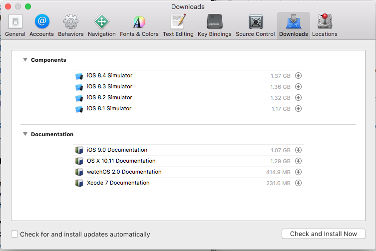
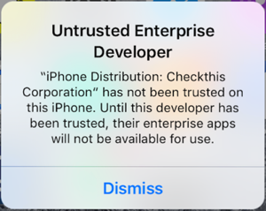
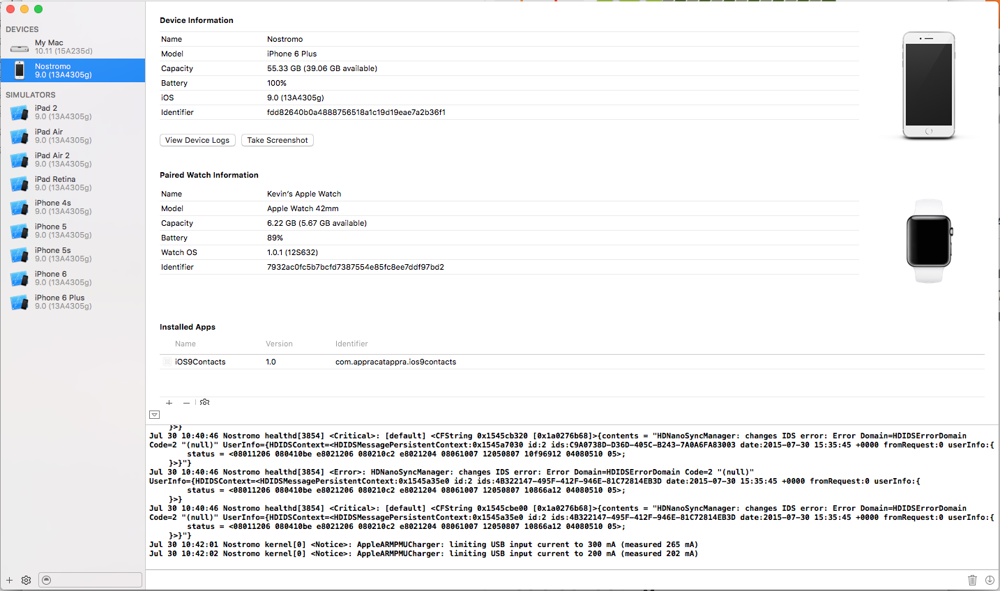
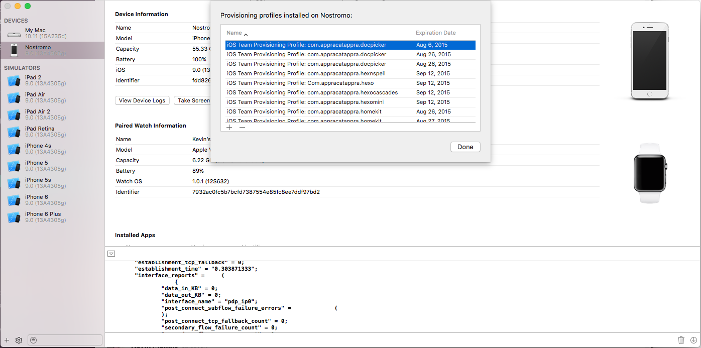
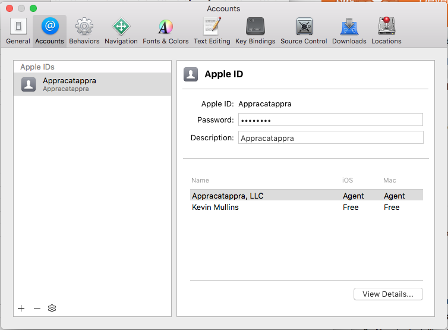
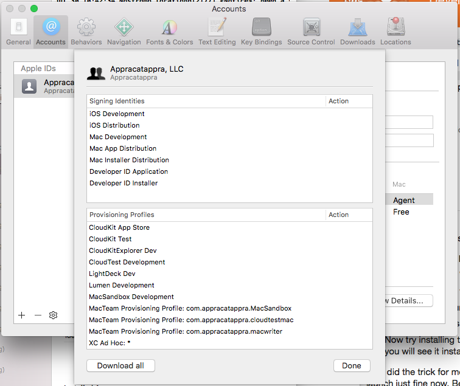

# Xamarin.iOS 9 – Troubleshooting

_This article provides several troubleshooting tips for working with iOS 9 in Xamarin.iOS apps._

## There was a problem parsing the XML

The Xamarin iOS Designer does not yet support Xcode 7 features. Storyboards will fail to load in designer with _"There was a problem parsing the XML"_ when attempting to use new iOS 9 (Xcode 7) designer elements such as StackView.

iOS Designer support for Xcode 7 features is targeted for the upcoming Cycle 6 feature release. The preview version of Cycle 6 is currently available in the Alpha channel and has limited support for the new Xcode 7 features.

Partial workaround for Visual Studio for Mac: Right-click the storyboard and choose **Open With** > **Xcode Interface Builder**.

## Where are the iOS 8 Simulators?

If you have installed Xcode 7 (or greater) it will automatically replace all of the iOS 8 simulators with iOS 9 simulators by default. If you still need to test on iOS 8, you can start Xcode, then download and install the iOS 8 simulators.

In Xcode, select the **Xcode** menu then **Preferences...** > **Downloads**:

[](troubleshooting-images/ios8.png#lightbox)

Click the **Check and Install Now** button to reinstall the iOS 8 simulators.

## Layout Constraint with Left/Right Attribute Errors

In iOS 8 (and prior), UI elements in Storyboards could use a mix of both **Right** & **Left** Attributes (`NSLayoutAttributeRight` & `NSLayoutAttributeLeft`) and **Leading** & **Trailing** Attributes (`NSLayoutAttributeLeading` & `NSLayoutAttributeTrailing`) in the same layout.

If the same Storyboard in run in iOS 9, it will result in an exception in the following form:

> Terminating app due to uncaught exception 'NSInvalidArgumentException', reason: '*** +[NSLayoutConstraint constraintWithItem:attribute:relatedBy:toItem:attribute:multiplier:constant:]: A constraint cannot be made between a leading/trailing attribute and a right/left attribute. Use leading/trailing for both or neither.'

iOS 9 enforces layouts to use either **Right** & **Left** _or_ **Leading** & **Trailing** attributes but *not* both. To fix this issue, change all layout constraints to use the same attribute set inside your Storyboard file.

For more information, please see the [iOS 9 constraint error](https://stackoverflow.com/questions/32692841/ios-9-constraint-error) Stack Overflow discussion.

## ERROR ITMS-90535: Unexpected CFBundleExecutable Key

After switching to iOS 9, from an app uses 3rd party components (specifically our existing Google Maps component) that compiled and ran on iOS 8 (or earlier), when trying to submit the new build to iTunes Connect you can get an error in the form:

> ERROR ITMS-90535: Unexpected CFBundleExecutable Key. The bundle at 'Payload/app-name.app/component.bundle' does not contain a bundle executable...

This issues can usually be solved by finding the named bundle in the project then - just as the error message suggests - edited the `Info.plist` that is in the bundle by removing the `CFBundleExecutable` key. The `CFBundlePackageType` key should be set to `BNDL` as well.

After making these changes, do a clean and rebuild the entire project. You should be able to submit to iTunes Connect without issue after making these changes.

For more information, please see this [Stack Overflow](https://stackoverflow.com/questions/32096130/unexpected-cfbundleexecutable-key) discussion.

## CFNetwork SSLHandshake failed (-9824) Error

When attempting to connect to the internet, either directly or from a web view in iOS 9, you might get an error in the form:

```csharp
2015-09-04 14:38:05.757 FormsWebViewiOS[2553:30362] CFNetwork SSLHandshake failed (-9824)
2015-09-04 14:38:05.758 FormsWebViewiOS[2553:30363] NSURLSession/NSURLConnection HTTP load failed (kCFStreamErrorDomainSSL, -9824)
```

Or in the form:

```csharp
2015-09-04 14:39:17.881 FormsWebViewiOS[2568:30974] App Transport Security has blocked a cleartext HTTP (http://) resource load since it is insecure.
Temporary exceptions can be configured via your app's Info.plist file.
```

In iOS9, App Transport Security (ATS) enforces secure connections between internet resources (such as the app's back-end server) and your app. Additionally, ATS requires communication using the `HTTPS` protocol and high-level API communication to be encrypted using TLS version 1.2 with forward secrecy.

Since ATS is enabled by default in apps built for iOS 9 and OS X 10.11 (El Capitan), all connections using `NSURLConnection`, `CFURL` or `NSURLSession` will be subject to ATS security requirements. If your connections do not meet these requirement, they will fail with an exception.

Please see the [Opting-Out of ATS](~/ios/app-fundamentals/ats.md) section of our [App Transport Security](~/ios/app-fundamentals/ats.md) guide for information on how to solve this issue.

## My existing apps don't run on iOS 9

See our [iOS 9 compatibility information](~/ios/platform/introduction-to-ios9/ios9.md) for instructions
on re-building and re-deploying your existing apps to run on iOS 9.

<a name="UICollectionViewCell.ContentView-is-null-in-constructors"></a>

## UICollectionViewCell.ContentView is Null in Constructors

**Reason:** In iOS 9 the `initWithFrame:` constructor is now required, due to behavior changes in iOS 9 as the [UICollectionView documentation states](https://developer.apple.com/library/ios/documentation/UIKit/Reference/UICollectionView_class/#//apple_ref/occ/instm/UICollectionView/dequeueReusableCellWithReuseIdentifier:forIndexPath). If you registered a class for the specified identifier and a new cell must be created, the cell is now initialized by calling its `initWithFrame:` method.

**Fix:** Add the `initWithFrame:` constructor like this:

```csharp
[Export ("initWithFrame:")]
public YourCellClassName (CGRect frame) : base (frame)
{
    Initialize (); // refactor initialize code into a method
}
```

Related samples: [MotionGraph](https://github.com/xamarin/monotouch-samples/commit/3c1b7a4170c001e7290db9babb2b7a6dddeb8bcb), [TextKitDemo](https://github.com/xamarin/monotouch-samples/commit/23ea01b37326963b5ebf68bbcc1edd51c66a28d6)

<a name="UIView-fails-to-Init-with-Coder-when-Loading-a-View-from-a-Xib/Nib"></a>

## UIView fails to Init with Coder when Loading a View from a Xib/Nib

**Reason:** The `initWithCoder:` constructor is the one called when loading a view from an Interface Builder Xib file. If this constructor is not exported unmanaged code can’t call our managed version of it. Previously (eg. in iOS 8) the `IntPtr` constructor was invoked to initialize view.

**Fix:** Create and export the `initWithCoder:` constructor like this:

```csharp
[Export ("initWithCoder:")]
public YourClassName (NSCoder coder) : base (coder)
{
    Initialize (); // refactor initialize code into a method
}
```

Related sample: [Chat](https://github.com/xamarin/monotouch-samples/commit/7b81138d52e5f3f1aa3769fcb08f46122e9b6a88)

## Dyld Message: No Cache Image with Name...

You might experience a crash with the following information in the log:

```csharp
Dyld Error Message:
Dyld Message: no cach image with name (/System/Library/PrivateFrameworks/JavaScriptCore.framework/JavaScriptCore)
```

**Reason:** This is a bug in Apple's native linker, which happens when they make a private framework public
(JavaScriptCore was made public in iOS 7, before that it was a private framework), and the deployment target
of the app is for an iOS version when the framework was private. In this case Apple's linker will link with the
private version of the framework instead of the public version.

**Fix:** This will be addressed for iOS 9, but there is an easy workaround you can apply yourself in the meantime:
just target a later iOS version in your project (you can try iOS 7 in this case). Other frameworks might exhibit
similar problems, for example the WebKit framework was made public in iOS 8 (and so targeting iOS 7 will result in
this error; you should target iOS 8 to use WebKit in your app).

## Untrusted Enterprise Developer

When attempting to run the iOS 9 version of your Xamarin.iOS app on real iOS hardware, you might get a message saying that your developer account has not been trusted on the device. For example:

[](troubleshooting-images/untrusted01.png#lightbox)

To solve this issue, do the following:

1. Start Xcode (the latest beta version) on the development Mac.
2. Select **Devices** from the **Window** menu to open the Devices Window: 

    [](troubleshooting-images/untrusted02.png#lightbox)
3. Under the **DEVICES** side panel, select your device, right-click and select **Show Provisioning Profiles...**: 

    [](troubleshooting-images/untrusted03.png#lightbox)
4. Select each provisioning profile currently on the device and click the **-** button to delete it: 

    [](troubleshooting-images/untrusted04.png#lightbox)
5. From the **Xcode** menu, select **Preferences...** and **Accounts**: 

    [](troubleshooting-images/untrusted05.png#lightbox)
6. Click the **View Details...** button, then click the **Download all** button: 

    [](troubleshooting-images/untrusted06.png#lightbox)
7. When the list has finished updating, click the **Done** button and close the Preferences window.
8. Remove the existing version of the Xamarin.iOS app that you were trying to test from the iOS device.
9. Return to Visual Studio for Mac, do a clean build and try to re-run the app on the device.

You might have to stop and restart Visual Studio for Mac before the new provisioning profiles loaded by Xcode are seen. You might also have to adjust the **iOS Bundle Signing** options for your Xamarin.iOS app to select the new provisioning profiles.

## Launch Screen Issues

iOS 9 now enforces the Launch Screen requirements so that the same launch image can no longer be reused to support different interface orientations. See Apple's [UILanchImage Reference](https://developer.apple.com/library/prerelease/ios/documentation/General/Reference/InfoPlistKeyReference/Articles/iPhoneOSKeys.html#//apple_ref/doc/uid/TP40009252-SW28) for more information.

Optionally, you can use a storyboard file to present your app's Launch Screen as opposed to using a set of **.png** image files. This is now Apple's preferred way to present Launch Screens. Please see our [Introduction to Unified Storyboards](~/ios/user-interface/storyboards/unified-storyboards.md) guide for more information.

Finally, your app must use a storyboard file for its Launch Screen and support all four interface orientations (Portrait, Upside-down Portrait, Landscape Left and Landscape Right) to be considered for running in a Slide Over panel or in Split View mode. To find out more about the new multitasking abilities of iOS 9, please see our [Multitasking for iPad](~/ios/platform/multitasking.md) guide.

## NSInternalInconsistencyException Exception

When compiling and running an existing Xamarin.iOS app for iOS 9 you might get an error in the form:

> Objective-C exception thrown.  Name: NSInternalInconsistencyException Reason: Application windows are expected to have a root view controller at the end of application launch

This is error is being raised because app Windows are expected to have a Root View Controller at the end of application launch and your existing app doesn't.

There are at least two possible workarounds for this problem:

1. Update app to use storyboard file instead of `xib` files to define its User Interface. This one requires quite a lot of time depending on size of your app and knowledge of how to use the iOS Designer (or Xcode's Interface Builder) to layout storyboards. For more information, see our [Introduction to Unified Storyboards](~/ios/user-interface/storyboards/unified-storyboards.md) documentation.
2. Setup `RootViewController` property of app Window in `FinishedLaunching` method in `AppDelegate` class to point to a View Controller in your app's UI.

## When to Initialize Views and View Controllers

With Xamarin.iOS it’s possible to make View or View Controller initialization inside constructors which are called when something is exposed into managed code but it breaks iOS design.

In general you should not initialize anything that can call back Objective-C code from the constructor since you can't be sure when it will be called. That also means there's a better places (other .ctor) or calls to override (as Objective-C has no events) where this initialization should be done.

## Related Links

- [iOS 9 for Developers](https://developer.apple.com/ios/pre-release/)
- [What's New in iOS 9.0](https://developer.apple.com/library/prerelease/ios/releasenotes/General/WhatsNewIniOS/Articles/iOS9.html)
- [Updating your Xamarin.iOS apps to iOS9 (video)](https://university.xamarin.com/lightninglectures/Updating-your-XamariniOS-apps-to-iOS9)
