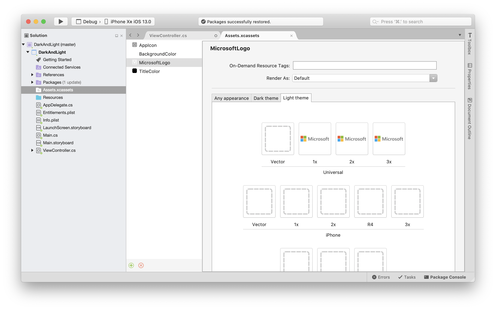

# Dark Mode in Xamarin.iOS

Dark Mode is a system-wide option for light and dark themes. iOS users may now choose the theme or allow iOS to dynamically change appearance based on the environment and time of day.

This document introduces dark mode and supporting dark mode in iOS 13 applications.

## Requirements

Dark Mode requires iOS 13 and Xcode 11, Xamarin.iOS 12.99, and Visual Studio 2019 or Visual Studio 2019 for Mac with Xcode 11 support.

## Turning on Dark Mode

Apple provides a developer menu in iOS 13 to toggle between dark and light modes. In the iOS 13 simulator open **Settings** and choose the **Developer** section, then scroll to the **Dark Appearance** switch. The change will be reflected across the entire simulator environment:

## Assets for Light and Dark Modes

The Asset Catalog in Visual Studio now supports optional images and colors for each appearance mode: Universal, Dark, and Light. When defining your images and colors this way, iOS will automatically choose the appropriate image and color.

Open your **Assets.xcassets** file in your iOS project and add a new image set. Notice you can specify universal, dark, and light images at any of the target resolutions. In the screenshot below, there is an image for dark and for light with the name of “MicrosoftLogo”:

**Assets.xcassets** also contains entries for **BackgroundColor** and **TitleColor**, which are color definitions. Those colors are now available by name to be used throughout the application. The **BackgroundColor** has been assigned to the background of the view, and the **TitleColor** to the label, as shown in this screenshot:

## Dynamic system colors

Apple has introduced new semantic colors that adjust their appearance dynamically based on the new dark mode setting.

## Summary

This article introduced Dark Mode for iOS and specifying images and colors for each mode using the asset catalog.

## Related links

- [Dark Mode Design Guidelines](https://developer.apple.com/design/human-interface-guidelines/ios/visual-design/dark-mode/)
- [Semantic Colors](https://developer.apple.com/design/human-interface-guidelines/ios/visual-design/color/#dynamic-system-colors)
