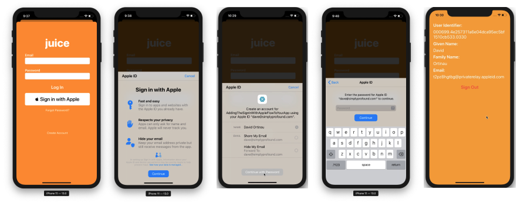

# Sign In with Apple in Xamarin.iOS

[ Download the sample](/samples/xamarin/ios-samples/ios13-addingthesigninwithappleflowtoyourapp/)

Sign In with Apple is a new service that provides identity protection for users of third-party authentication services. Beginning with iOS 13, Apple requires that any new app using a third-party authentication services should also provide Sign In with Apple. Existing apps being updated do not need to add Sign In with Apple until April 2020.

This document introduces how you can add Sign In with Apple to iOS 13 applications.

## Apple developer setup

Before building and running an app using Sign In with Apple, you need to complete these steps. On [Apple Developer Certificates, Identifiers & Profiles][5] portal:

1. Create a new **App Ids** Identifier.
2. Set a description in the **Description** field.
3. Choose an **Explicit** Bundle ID and set `com.xamarin.AddingTheSignInWithAppleFlowToYourApp` in the field.
4. Enable **Sign In with Apple** capability and register the new Identity.
5. Create a new Provisioning Profile with the new Identity.
6. Download and install it on your device.
7. In Visual Studio, enable the **Sign In with Apple** capability in **Entitlements.plist** file.

## Check sign in status

When your app begins, or when you first need to check the authentication status of a user, instantiate an `ASAuthorizationAppleIdProvider` and check the current state:

```csharp
var appleIdProvider = new ASAuthorizationAppleIdProvider ();
appleIdProvider.GetCredentialState (KeychainItem.CurrentUserIdentifier, (credentialState, error) => {
    switch (credentialState) {
    case ASAuthorizationAppleIdProviderCredentialState.Authorized:
        // The Apple ID credential is valid.
        break;
    case ASAuthorizationAppleIdProviderCredentialState.Revoked:
        // The Apple ID credential is revoked.
        break;
    case ASAuthorizationAppleIdProviderCredentialState.NotFound:
        // No credential was found, so show the sign-in UI.
        InvokeOnMainThread (() => {
            var storyboard = UIStoryboard.FromName ("Main", null);

            if (!(storyboard.InstantiateViewController (nameof (LoginViewController)) is LoginViewController viewController))
                return;

            viewController.ModalPresentationStyle = UIModalPresentationStyle.FormSheet;
            viewController.ModalInPresentation = true;
            Window?.RootViewController?.PresentViewController (viewController, true, null);
        });
        break;
    }
});
```

In this code, called during `FinishedLaunching` in the `AppDelegate.cs`, the app will handle when a state is `NotFound` and present the `LoginViewController` to the user. If the state had return `Authorized` or `Revoked`, a different action may be presented to the user.

## A LoginViewController for Sign In with Apple

The `UIViewController` that implements login logic and offers Sign In with Apple needs to implement `IASAuthorizationControllerDelegate` and `IASAuthorizationControllerPresentationContextProviding` as in the `LoginViewController` example below.

```csharp
public partial class LoginViewController : UIViewController, IASAuthorizationControllerDelegate, IASAuthorizationControllerPresentationContextProviding {
    public LoginViewController (IntPtr handle) : base (handle)
    {
    }

    public override void ViewDidLoad ()
    {
        base.ViewDidLoad ();
        // Perform any additional setup after loading the view, typically from a nib.

        SetupProviderLoginView ();
    }

    public override void ViewDidAppear (bool animated)
    {
        base.ViewDidAppear (animated);

        PerformExistingAccountSetupFlows ();
    }

    void SetupProviderLoginView ()
    {
        var authorizationButton = new ASAuthorizationAppleIdButton (ASAuthorizationAppleIdButtonType.Default, ASAuthorizationAppleIdButtonStyle.White);
        authorizationButton.TouchUpInside += HandleAuthorizationAppleIDButtonPress;
        loginProviderStackView.AddArrangedSubview (authorizationButton);
    }

    // Prompts the user if an existing iCloud Keychain credential or Apple ID credential is found.
    void PerformExistingAccountSetupFlows ()
    {
        // Prepare requests for both Apple ID and password providers.
        ASAuthorizationRequest [] requests = {
            new ASAuthorizationAppleIdProvider ().CreateRequest (),
            new ASAuthorizationPasswordProvider ().CreateRequest ()
        };

        // Create an authorization controller with the given requests.
        var authorizationController = new ASAuthorizationController (requests);
        authorizationController.Delegate = this;
        authorizationController.PresentationContextProvider = this;
        authorizationController.PerformRequests ();
    }

    private void HandleAuthorizationAppleIDButtonPress (object sender, EventArgs e)
    {
        var appleIdProvider = new ASAuthorizationAppleIdProvider ();
        var request = appleIdProvider.CreateRequest ();
        request.RequestedScopes = new [] { ASAuthorizationScope.Email, ASAuthorizationScope.FullName };

        var authorizationController = new ASAuthorizationController (new [] { request });
        authorizationController.Delegate = this;
        authorizationController.PresentationContextProvider = this;
        authorizationController.PerformRequests ();
    }
}
```



This example code checks the current login status in `PerformExistingAccountSetupFlows` and connects to the current view as a delegate. If an existing iCloud Keychain credential or Apple ID credential is found, the user will be prompted to use that.

Apple provides `ASAuthorizationAppleIdButton`, a button specifically for this purpose. When touched, the button will trigger the workflow handled in the method `HandleAuthorizationAppleIDButtonPress`.

## Handling authorization

In the `IASAuthorizationController` implement any custom logic to store the user's account. The example below stores the user's account in Keychain, Apple's own storage service.

```csharp
#region IASAuthorizationController Delegate

[Export ("authorizationController:didCompleteWithAuthorization:")]
public void DidComplete (ASAuthorizationController controller, ASAuthorization authorization)
{
    if (authorization.GetCredential<ASAuthorizationAppleIdCredential> () is ASAuthorizationAppleIdCredential appleIdCredential) {
        var userIdentifier = appleIdCredential.User;
        var fullName = appleIdCredential.FullName;
        var email = appleIdCredential.Email;

        // Create an account in your system.
        // For the purpose of this demo app, store the userIdentifier in the keychain.
        try {
            new KeychainItem ("com.example.apple-samplecode.juice", "userIdentifier").SaveItem (userIdentifier);
        } catch (Exception) {
            Console.WriteLine ("Unable to save userIdentifier to keychain.");
        }

        // For the purpose of this demo app, show the Apple ID credential information in the ResultViewController.
        if (!(PresentingViewController is ResultViewController viewController))
            return;

        InvokeOnMainThread (() => {
            viewController.UserIdentifierText = userIdentifier;
            viewController.GivenNameText = fullName?.GivenName ?? "";
            viewController.FamilyNameText = fullName?.FamilyName ?? "";
            viewController.EmailText = email ?? "";

            DismissViewController (true, null);
        });
    } else if (authorization.GetCredential<ASPasswordCredential> () is ASPasswordCredential passwordCredential) {
        // Sign in using an existing iCloud Keychain credential.
        var username = passwordCredential.User;
        var password = passwordCredential.Password;

        // For the purpose of this demo app, show the password credential as an alert.
        InvokeOnMainThread (() => {
            var message = $"The app has received your selected credential from the keychain. \n\n Username: {username}\n Password: {password}";
            var alertController = UIAlertController.Create ("Keychain Credential Received", message, UIAlertControllerStyle.Alert);
            alertController.AddAction (UIAlertAction.Create ("Dismiss", UIAlertActionStyle.Cancel, null));

            PresentViewController (alertController, true, null);
        });
    }
}

[Export ("authorizationController:didCompleteWithError:")]
public void DidComplete (ASAuthorizationController controller, NSError error)
{
    Console.WriteLine (error);
}

#endregion
```

## Authorization Controller

The final piece in this implementation is the `ASAuthorizationController` which manages authorization requests for the provider.

```csharp
#region IASAuthorizationControllerPresentation Context Providing

public UIWindow GetPresentationAnchor (ASAuthorizationController controller) => View.Window;

#endregion
```

## Related links

* [Sign In with Apple Guidelines](https://developer.apple.com/design/human-interface-guidelines/sign-in-with-apple/overview/)
* [Sign In with Apple Entitlement.][2]
* [WWDC 2019 session 706: Introducing Sign In with Apple.][3]
* [Setup Sign In with Apple for Xamarin.Forms][4]

[1]: https://developer.apple.com/documentation/authenticationservices/adding_the_sign_in_with_apple_flow_to_your_app
[2]: https://developer.apple.com/documentation/bundleresources/entitlements/com_apple_developer_applesignin
[3]: https://developer.apple.com/videos/play/wwdc19/706/
[4]: ~/xamarin-forms/platform/sign-in-with-apple/setup.md
[5]: https://developer.apple.com/account/resources/identifiers/list