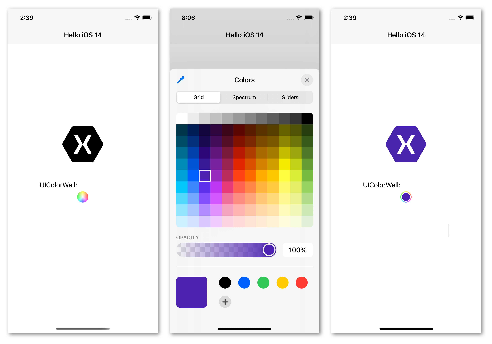
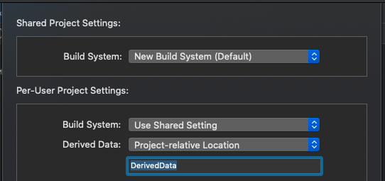

# Introduction to iOS 14

Follow these [instructions](~/ios/platform/ios14/get-started.md) to get started.

## New Control: UIColorWell

[`UIColorWell`](https://developer.apple.com/documentation/uikit/uicolorwell) is a new UIKit control for selecting colors from a selection of swatches, using a dropper, or by entering values manually. The control displays a circular color button that launches a modal form when tapped.



```xaml
<ios:UIColorWell
    SelectedColor="{x:Static ios:UIColor.Red}"
    ValueChanged="OnColorChanged" />
```

```csharp
private void OnColorChanged(object sender, EventArgs e)
{
    var colorWell = (UIColorWell)sender; 
    Debug.WriteLine(colorWell.SelectedColor);
}
```

## Modified Controls

Several controls have received updates, most notably:

- [UIBarButtonItem](https://developer.apple.com/documentation/uikit/uibarbuttonitem) can now add a UIMenu that will be displayed as a popover.
- [UIDatePicker](https://developer.apple.com/documentation/uikit/uidatepicker) now supports multiple styles: Automatic (default), Compact, Inline, and Wheel.
- [UISplitViewController](https://developer.apple.com/documentation/uikit/uisplitviewcontroller) now supports three columns: Primary, Secondary, and Supplementary.
 


## Embedded WidgetKit Support

This release of the SDK adds support for embedding WidgetKit extensions written in Swift into your main Xamarin.iOS application. This enables you to build apps with Widget support today.

With this method you create a “hybrid” application, building your Widget extension with SwiftUI and embedding it in a Xamarin.iOS application.

Leveraging WidgetKit support will require a few manual changes to your project file.

Add a section like this to your project:

```xml
<AdditionalAppExtensions Include="$(MSBuildProjectDirectory)/../../native">
     <Name>NativeTodayExtension</Name>
     <BuildOutput Condition="'$(Platform)' == 'iPhone'">build/Debug-iphoneos</BuildOutput>
     <BuildOutput Condition="'$(Platform)' == 'iPhoneSimulator'">build/Debug-iphonesimulator</BuildOutput>
</AdditionalAppExtensions>
```

Change the path included on the first link to point to the build directory of your Swift UI extension.

It may be helpful to enable a project relative output location in your Xcode project (File → Project Settings) to have a simpler path to locate:



This [sample application](https://github.com/chamons/xamarin-ios-swift-extension/blob/master/App/TestApplication/TestApplication.csproj#L143) uses JSON serialization to transfer data from a Xamarin.iOS app to a sample Widget for display.

Those interested in WidgetKit are invited to provide their [feedback here](https://github.com/xamarin/xamarin-macios/issues/8933).

## Related links

- [Xamarin.iOS 14 release notes](/xamarin/ios/release-notes/14/14.0)
- [UIColorWell documentation](https://developer.apple.com/documentation/uikit/uicolorwell)
