# Advanced Message App Extensions in Xamarin.iOS

_This article shows advanced techniques for working with Message App Extensions in a Xamarin.iOS solution that integrates with the Messages app and presents new functionality to the user._

New to iOS 10, a Message App Extension integrates with the **Messages** app and presents new functionality to the user. The extension can send text, stickers, media files and interactive messages.

## About Message App Extensions

As stated above, a Message App Extension integrates with the **Messages** app and presents new functionality to the user. The extension can send text, stickers, media files and interactive messages. Two types of Message App Extension are available:

- **Sticker Packs** - Contains a collection of stickers that the user can add to a message. Sticker Packs can be created without writing any code.
- **iMessage App** - Can present a custom User Interface within the Messages app for selecting stickers, entering text, including media files (with optional type conversions) and creating, editing and sending interaction messages.

Message Apps Extensions provide three main content types:

- **Interactive Messages** - Are a type of custom message content that an app generates, when the user taps on the message, the app will be launched in the foreground.
- **Stickers** - Are images generated by the app that can be included in the messages sent between users. See our [Ice cream Builder](/samples/xamarin/ios-samples/ios10-icecreambuilder) sample app for an example implementation of a Sticker Pack app.
- **Other Supported Content** - The app can provide content such as photos, videos, text or links of the type that has always been supported by the Messages app.

New to iOS 10, the Message app now includes its own dedicated, built-in App Store. Any apps that include Message Apps Extensions will be displayed and promoted in this store. The new Messages App Drawer will display any apps that have been downloaded from the Messages App Store to provide quick access to the users.

Also new in iOS 10, Apple has added Inline App Attribution which allows the user to easily discover an app. For example, if one user sends content to another from an app that the 2nd user doesn't have installed (like a sticker for example), the name of the sending app is listed under the content in the message history. If the user taps the app's name, the Message App Store we be opened and the app selected in the store.

Message Apps Extensions are similar to existing iOS apps that the developer is familiar to creating and they will have access to all the standard frameworks and features of a standard iOS app. For example:

- They have access to In-App Purchase.
- They have access to Apple Pay.
- They have access to device hardware such as the Camera.

Message Apps Extensions are only supported on iOS 10, however, the content that these Extensions send is viewable on watchOS and macOS devices. The new _Recents Page_ added to watchOS 3, will display recent stickers that have been sent from the phone, including those from Message Apps Extensions, and allow the user to send those stickers from the watch.

## About Interactive Messages

Interactive Messages present a Custom Message Bubble and are provided by a Message App Extension. They allow the user to create Interactive Message Content, insert it in the Message Input Field and send it.

[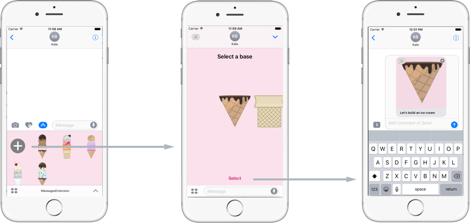](advanced-message-app-extensions-images/interactive01.png#lightbox)

The receiving user can reply to an Interactive Message by tapping its Message Bubble in the Message History to load the Message App Extension that created it. The Extension will be launched full-screen and allow the user to compose a reply and send it back to the originating user.

[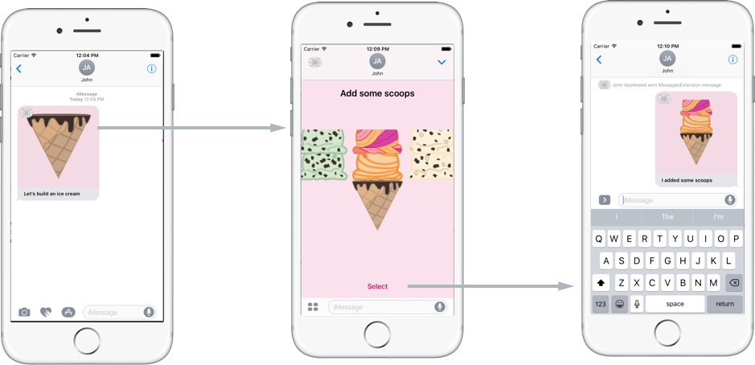](advanced-message-app-extensions-images/interactive02.png#lightbox)

The following topics will be covered in detail below:

- Messages API Overview
- The Extension Lifecycle
- Composing a Message
- Sending a Message

## Messages API Overview

When invoked by the user, a Message App Extension will be displayed at the bottom of the Message history in the compact view mode:

[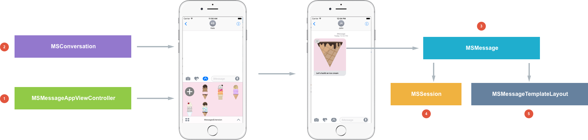](advanced-message-app-extensions-images/interactive03.png#lightbox)

1. The `MSMessageAppViewController` object in the Message App Extension is the main class that is called when the extension's view is displayed to the user.
2. The conversation is presented to the user as a `MSConversation` object instance.
3. The `MSMessage` class represents a given Message Bubble in the conversation.
4. `MSSession` controls how a message is sent.
5. `MSMessageTemplateLayout` controls how the message is displayed

## The Extension Lifecycle

Take a look at the process of a Message App Extension becoming active:

[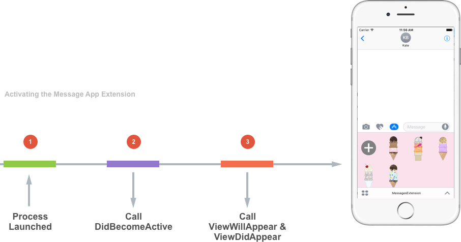](advanced-message-app-extensions-images/interactive04.png#lightbox)

1. When an extension is launched (for example from the App Drawer), the Message app will launch a process.
2. The `DidBecomeActive` method is called and passed a `MSConversation` that represents the conversation that the Message App Extension is running in.
3. Because the extension is based off of a `UIViewController` both `ViewWillAppear` and `ViewDidAppear` are called.

Next, take a look at the process of a Message App Extension becoming deactivated:

[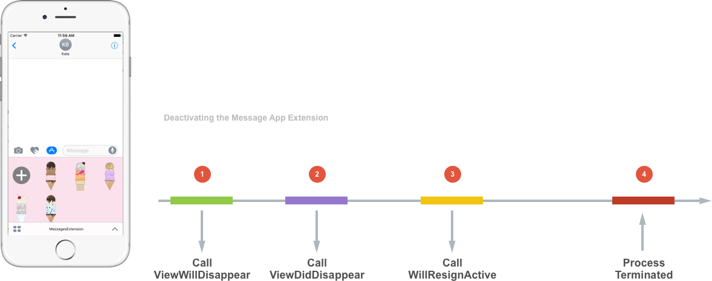](advanced-message-app-extensions-images/interactive05.png#lightbox)

1. When the Message App Extension is being deactivated, the `ViewWillDisappear` method will be called first.
2. Then the `ViewDidDisappear` method will be called.
3. The `WillResignActive` method is called and passed a `MSConversation` that represents the conversation that the Message App Extension is running in. At this point, the connection between the Messages app and the extension are about to be released.
4. At some later point, the process is terminated by the Messages app.

Since an extension is a short lived process, it is terminated aggressively by the system to conserve processing and battery power. The developer should keep this in mind when designing and implementing a Message App Extension.

## Composing a Message

Once the Message App Extension is running in a process and has displayed its User Interface, the following code can be used to compose a new message:

```csharp
MSMessage ComposeMessage (IceCream iceCream, string caption, MSSession session = null)
{
    var components = new NSUrlComponents {
        QueryItems = iceCream.QueryItems
    };

    var layout = new MSMessageTemplateLayout {
        Image = iceCream.RenderSticker (true),
        Caption = caption
    };

    var message = new MSMessage (session ?? new MSSession()) {
        Url = components.Url,
        Layout = layout
    };

    return message;
}
```

This code creates a new `MSMessage` and sets several properties (such as `Url`). While the message can only be created on iOS, it can be sent to both iOS and macOS to be displayed.

If the user clicks on the Message Bubble in the conversation on macOS, the Mac will try to open the address specified in the URL in the web browser. As a result, the developer's website should be able to show some representation of the message in the web browser on macOS based machines.

The `AccessibilityLabel` property is used by screen readers to read the transcript of the conversation to the user. The `Layout` property specifies how the message will be displayed, currently only the `MSMessageTemplateLayout` is supported and looks like the following:

[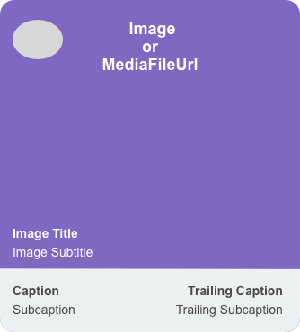](advanced-message-app-extensions-images/interactive06.png#lightbox)

The `Image` property of the `MSMessageTemplateLayout` provides content for the main body of the MessageBubble on screen. The `MediaFileUrl` property also provides content for the body of the Message Bubble, but allows for content that is not supported by `UIImage` (such as a video file that would loop in the background). If both the `Image` and `MediaFileUrl` properties are provided, the `Image` property will take precedence. The `MediaFileUrl` supports the PNG, JPEG, GIF and video (in any format that can be played by the Media Player framework) media formats.

The recommended media size is 300 x 300 pixels at the 3x resolution. Slightly larger and smaller assets are also accepted and Apple suggests testing with a few different sizes to get the best results. The Message App will down-sample and scale this media as required.

When the assets are sent to the receiver, any media attached will be automatically transcoded by the Messages app to optimize them from transfer over the networks. Because of this, Apple discourages including text in the media that is attached to the message because media will be scaled down and compressed for transmission, thus potentially rendering the text illegible.

The `ImageTitle` and `ImageSubtitle` properties provide a description for the media that is presented in the Message Bubble. These properties will be sent as text to the receiving device where they will be crisply rendered in the lower left hand corner of the image.

The `Caption`, `SubCaption`, `TrailingCaption` and `TrailingSubcaption` properties further describe the image and will be rendered in a section below the image. Setting all of these properties to `null` will create a Message Bubble without the Caption Area:

[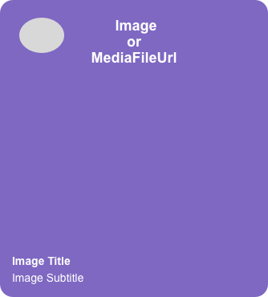](advanced-message-app-extensions-images/interactive07.png#lightbox)

The last thing to note is that the Messages app will draw the Message App Extension's icon in the upper left hand corner of the Message Bubble.

## Sending a Message

Once a `MSMessage` has been composed, the following code can be used to send it:

```csharp
public void SendMessage (MSMessage message)
{
    // Insert the message into the conversation
    ActiveConversation.InsertMessage (message, (error) => {
        // Did the message send successfully?
        if (error == null) {
            // Handle successful send
        } else {
            // Report Error
            Console.WriteLine ("Error: {0}", error);
        }
    };

}
```

The `ActiveConversation` property of the `MSMessagesAppViewController` will hold the current conversation that the Message App Extension was launched in.

Call the `InsertMessage` of the `MSConversation` to include the message in the conversation and handle any errors that might arise. If the message is successfully included, the Message Bubble will be displayed in the Input Field.

Additionally, the extension can send different types of data to the conversation such as:

- **Text** - `ActiveConversation.InsertText ("Message", (error) => {...});`
- **Attachments** - `ActiveConversation.InsertAttachment (new NSUrl ("path"), "filename", (error) => {...});`
- **Stickers** - `ActiveConversation.InsertSticker (sticker, (obj) => {...});` where `sticker` is a `MSSticker`.

Once the new content is on the Input Field, the user is able to send the message by tapping the blue **Send** button (just as they would any typical message). There is no way for the Message App Extension to automatically send content, this process is totally under the control of the user.

## Handling the Compact and Expanded Modes

A Message App Extension can be displayed in one of two different view modes:

[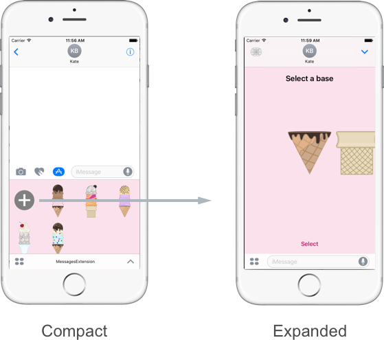](advanced-message-app-extensions-images/interactive08.png#lightbox)

- **Compact** - This is the default mode where the Message App Extension takes up the bottom 25% of the Message View. In Compact mode, the app does not have access to the keyboard, horizontal scrolling or Swipe Gesture Recognizers. The app does have access to the Input Field and calls to `InsertMessage` will instantly be displayed to the user there.
- **Expanded** -The Message App Extension fills the entire Message View. It does not have access to the Input Field, but does have access to the keyboard, horizontal scrolling and Swipe Gesture Recognizers.

A Message App Extension can be switched between these modes either programmatically or manually by the user at any time and should be instantly responsive to any changes in view mode.

Take a look at the following example of handling the switch between the two different view modes. Two different View Controllers will be required for each state. The `StickerBrowserViewController` handles the **Compact** view and the `AddStickerViewController` will handle the **Expanded** view:

```csharp
using System;

using Messages;
using Foundation;
using UIKit;

namespace MessagesExtension {
    public partial class MessagesViewController : MSMessagesAppViewController, IIceCreamsViewControllerDelegate, IBuildIceCreamViewControllerDelegate {
        public MessagesViewController (IntPtr handle) : base (handle)
        {
        }

        public override void WillBecomeActive (MSConversation conversation)
        {
            base.WillBecomeActive (conversation);

            // Present the view controller appropriate for the conversation and presentation style.
            PresentViewController (conversation, PresentationStyle);
        }

        public override void WillTransition (MSMessagesAppPresentationStyle presentationStyle)
        {
            var conversation = ActiveConversation;
            if (conversation == null)
                throw new Exception ("Expected an active converstation");

            // Present the view controller appropriate for the conversation and presentation style.
            PresentViewController (conversation, presentationStyle);
        }

        void PresentViewController (MSConversation conversation, MSMessagesAppPresentationStyle presentationStyle)
        {
            // Determine the controller to present.
            UIViewController controller;

            if (presentationStyle == MSMessagesAppPresentationStyle.Compact) {
                // Show a list of previously created ice creams.
                controller = InstantiateIceCreamsController ();
            } else {
                var iceCream = new IceCream (conversation.SelectedMessage);
                controller = iceCream.IsComplete ? InstantiateCompletedIceCreamController (iceCream) : InstantiateBuildIceCreamController (iceCream);
            }

            foreach (var child in ChildViewControllers) {
                child.WillMoveToParentViewController (null);
                child.View.RemoveFromSuperview ();
                child.RemoveFromParentViewController ();
            }

            AddChildViewController (controller);
            controller.View.Frame = View.Bounds;
            controller.View.TranslatesAutoresizingMaskIntoConstraints = false;
            View.AddSubview (controller.View);

            controller.View.LeftAnchor.ConstraintEqualTo (View.LeftAnchor).Active = true;
            controller.View.RightAnchor.ConstraintEqualTo (View.RightAnchor).Active = true;
            controller.View.TopAnchor.ConstraintEqualTo (View.TopAnchor).Active = true;
            controller.View.BottomAnchor.ConstraintEqualTo (View.BottomAnchor).Active = true;

            controller.DidMoveToParentViewController (this);
        }

        UIViewController InstantiateIceCreamsController ()
        {
            // Instantiate a `IceCreamsViewController` and present it.
            var controller = Storyboard.InstantiateViewController (IceCreamsViewController.StoryboardIdentifier) as IceCreamsViewController;
            if (controller == null)
                throw new Exception ("Unable to instantiate an IceCreamsViewController from the storyboard");

            controller.Builder = this;
            return controller;
        }

        UIViewController InstantiateBuildIceCreamController (IceCream iceCream)
        {
            // Instantiate a `BuildIceCreamViewController` and present it.
            var controller = Storyboard.InstantiateViewController (BuildIceCreamViewController.StoryboardIdentifier) as BuildIceCreamViewController;
            if (controller == null)
                throw new Exception ("Unable to instantiate an BuildIceCreamViewController from the storyboard");

            controller.IceCream = iceCream;
            controller.Builder = this;

            return controller;
        }

        public UIViewController InstantiateCompletedIceCreamController (IceCream iceCream)
        {
            // Instantiate a `BuildIceCreamViewController` and present it.
            var controller = Storyboard.InstantiateViewController (CompletedIceCreamViewController.StoryboardIdentifier) as CompletedIceCreamViewController;
            if (controller == null)
                throw new Exception ("Unable to instantiate an CompletedIceCreamViewController from the storyboard");

            controller.IceCream = iceCream;
            return controller;
        }

        public void DidSelectAdd (IceCreamsViewController controller)
        {
            Request (MSMessagesAppPresentationStyle.Expanded);
        }

        public void Build (BuildIceCreamViewController controller, IceCreamPart iceCreamPart)
        {
            var conversation = ActiveConversation;
            if (conversation == null)
                throw new Exception ("Expected a conversation");

            var iceCream = controller.IceCream;
            if (iceCream == null)
                throw new Exception ("Expected the controller to be displaying an ice cream");

            string messageCaption = string.Empty;
            var b = iceCreamPart as Base;
            var s = iceCreamPart as Scoops;
            var t = iceCreamPart as Topping;

            if (b != null) {
                iceCream.Base = b;
                messageCaption = "Let's build an ice cream";
            } else if (s != null) {
                iceCream.Scoops = s;
                messageCaption = "I added some scoops";
            } else if (t != null) {
                iceCream.Topping = t;
                messageCaption = "Our finished ice cream";
            } else {
                throw new Exception ("Unexpected type of ice cream part selected.");
            }

            // Create a new message with the same session as any currently selected message.
            var message = ComposeMessage (iceCream, messageCaption, conversation.SelectedMessage?.Session);

            // Add the message to the conversation.
            conversation.InsertMessage (message, null);

            // If the ice cream is complete, save it in the history.
            if (iceCream.IsComplete) {
                var history = IceCreamHistory.Load ();
                history.Append (iceCream);
                history.Save ();
            }

            Dismiss ();
        }

        MSMessage ComposeMessage (IceCream iceCream, string caption, MSSession session = null)
        {
            var components = new NSUrlComponents {
                QueryItems = iceCream.QueryItems
            };

            var layout = new MSMessageTemplateLayout {
                Image = iceCream.RenderSticker (true),
                Caption = caption
            };

            var message = new MSMessage (session ?? new MSSession()) {
                Url = components.Url,
                Layout = layout
            };

            return message;
        }
    }
}
```

The `DidTransition` method is overridden to handle switching between the two modes:

```csharp
public override void DidTransition (MSMessagesAppPresentationStyle presentationStyle)
{
    base.DidTransition (presentationStyle);

    // Take action based on style
    switch (presentationStyle) {
    case MSMessagesAppPresentationStyle.Compact:
        PresentStickerBrowser ();
        break;
    case MSMessagesAppPresentationStyle.Expanded:
        PresentAddSticker ();
        break;
    }
}
```

Optionally, the app could have used the `WillTransition` method to handle the view mode change before it is presented to the user (as is done in the Icecream Builder example above). For more information, please see our [Further Sticker Customization](~/ios/platform/message-app-integration/intro-to-message-app-extensions.md) documentation.

## Replying to a Message

There are two cases that a Message App Extension will need to handle when replying to a message:

[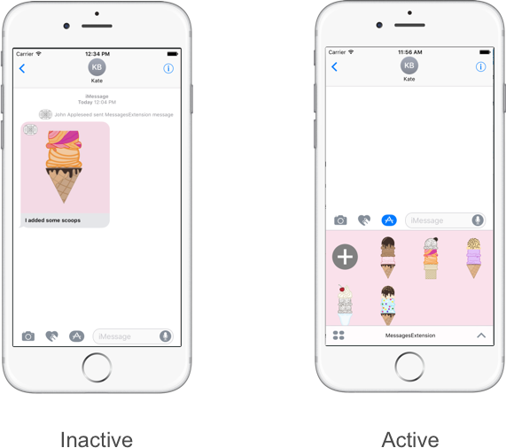](advanced-message-app-extensions-images/interactive09.png#lightbox)

- **Extension is Inactive** - There is one of the Message App Extension's Message Bubbles in the Message Transcript that the user can tap to activate the extensions and continue the interactive conversation.
- **Extension is Active** - The user can tap the Message App Extension's Message Bubble in the Message Transcript to enter the Expanded view mode and continue the interactive process from where they left off.

### The Extension is Inactive

When a Message Bubble is tapped by the user in the Message Transcript and the Message App Extension is inactive, the following process will happen:

[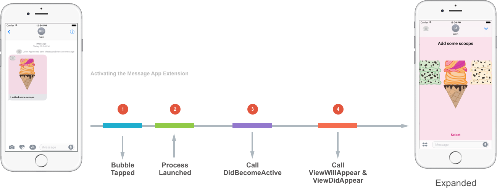](advanced-message-app-extensions-images/interactive10.png#lightbox)

1. The User taps the extension's Message Bubble.
2. When an extension is launched, the Message app will launch a process.
3. The `DidBecomeActive` method is called and passed a `MSConversation` that represents the conversation that the Message App Extension is running in.
4. Because the extension is based off of a `UIViewController` both `ViewWillAppear` and `ViewDidAppear` are called.

When the process is complete, the Message App Extension will be presented in the Expanded view mode.

### The Extension is Active

When a Message Bubble is tapped by the user in the Message Transcript and the Message App Extension is active, the following process will happen:

[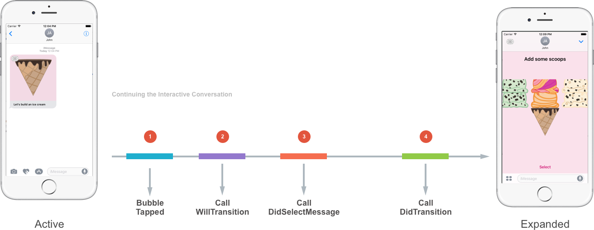](advanced-message-app-extensions-images/interactive11.png#lightbox)

1. The User taps the extension's Message Bubble.
2. Because the Message App Extension is already active, the `WillTransition` method of the `MSMessagesAppViewController` is called to handle switching from the Compact to the Expanded view mode.
3. The `DidSelectMessage` method of the `MSMessagesAppViewController` is called and passed the `MSMessage` and `MSConversation` that the Message Bubble belongs to.
4. The `DidTransition` method of the `MSMessagesAppViewController` is called to handle switching from the Compact to the Expanded view mode.

Again, when the process is complete, the Message App Extension will be presented in the Expanded view mode.

### Accessing the Selected Message

In either case, when the user taps a Message Bubble belonging to the Message App Extension, it will need to gain access to the `MSMessage` that was tapped using the `SelectedMessage` property of the `MSConversation`.

For example:

```csharp
using System;
using Foundation;
using Messages;
using UIKit;

namespace MessageExtension
{
    public partial class MessagesViewController : MSMessagesAppViewController
    {
        ...

        #region Override Methods
        public override void DidSelectMessage (MSMessage message, MSConversation conversation)
        {
            base.DidSelectMessage (message, conversation);

            // Get selected message
            var selected = conversation.SelectedMessage;

            // Present the user interface to continue editing
            // the conversation
            ...
        }
        #endregion
    }
}
```

The selected message should be shown in the Message App Extension's UI and the user should be allowed to compose a response.

## Removing Partially Completed Messages

In the process of sending the different steps of an interactive conversation between the two user's in the conversation, the partially completed Message Bubbles can start to clutter the Message Transcript:

[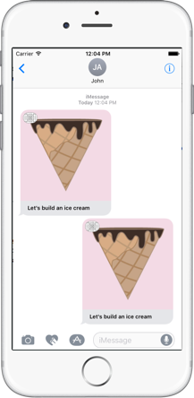](advanced-message-app-extensions-images/interactive12.png#lightbox)

Instead, the Message App Extension should collapse the previous Message Bubbles into a succinct comment in the Message Transcript:

[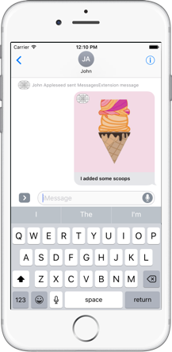](advanced-message-app-extensions-images/interactive13.png#lightbox)

This is handled using an `MSSession` to collapse all of the existing steps. So the `DidSelectMessage` method of the `MSMessagesAppViewController` class could be modified to look like the following:

```csharp
public override void DidSelectMessage (MSMessage message, MSConversation conversation)
{
    base.DidSelectMessage (message, conversation);

    MSSession session;
    var summary = "";

    // Get selected message
    var selected = conversation.SelectedMessage;

    // Does the selected message already have a session?
    if (selected.Session == null) {
        // No, create a new session
        session = new MSSession ();
        summary = "Let's build an ice cream";
    } else {
        // Yes, use the existing session
        session = selected.Session;
        summary = "I added some scoops";
    }

    // Create an instance of the message being composed
    var existingMessage = new MSMessage (session);
    message.SummaryText = summary;
    ...

    // Present the user interface to continue editing
    // the conversation
    ...
}
```

If the selected message already has an exiting `MSSession`, it is used else a new `MSSession` is created. The `SummaryText` property of the `MSMessage` is used to add a caption to the collapsed previous steps. If the `SummaryText` property is set to `null`, the previous steps in the conversation will be completely removed from the Conversation Transcript.

## Advanced Message API Features

With the basic features of the new Message API covered in detail above, next examine some of the more advanced features that Apple has built into the framework.

First, there are several other override methods in the `MSMessagesAppViewController` class that provide deeper access to the conversation:

- `DidStartSendingMessage` - This is called when the user taps the send button. This does not mean that the message has actually been delivery to the recipient, just that the send process has been started.
- `DidCancelSendingMessage` - This happens when the user taps the *X* button in the upper right hand corner of the Message Bubble in the Conversation Transcript.
- `DidReceiveMessage` - This method is called when the Message App Extension is active an a new message was received from one of the participants in the conversation.

### Group Conversations

A Message App Extension can be used while the users are involved in group conversations (with 3 or more individuals) and this will have to be taken into consideration when designing and implementing a Message App Extension.

Take a look at the following interaction in a group conversation with three users:

[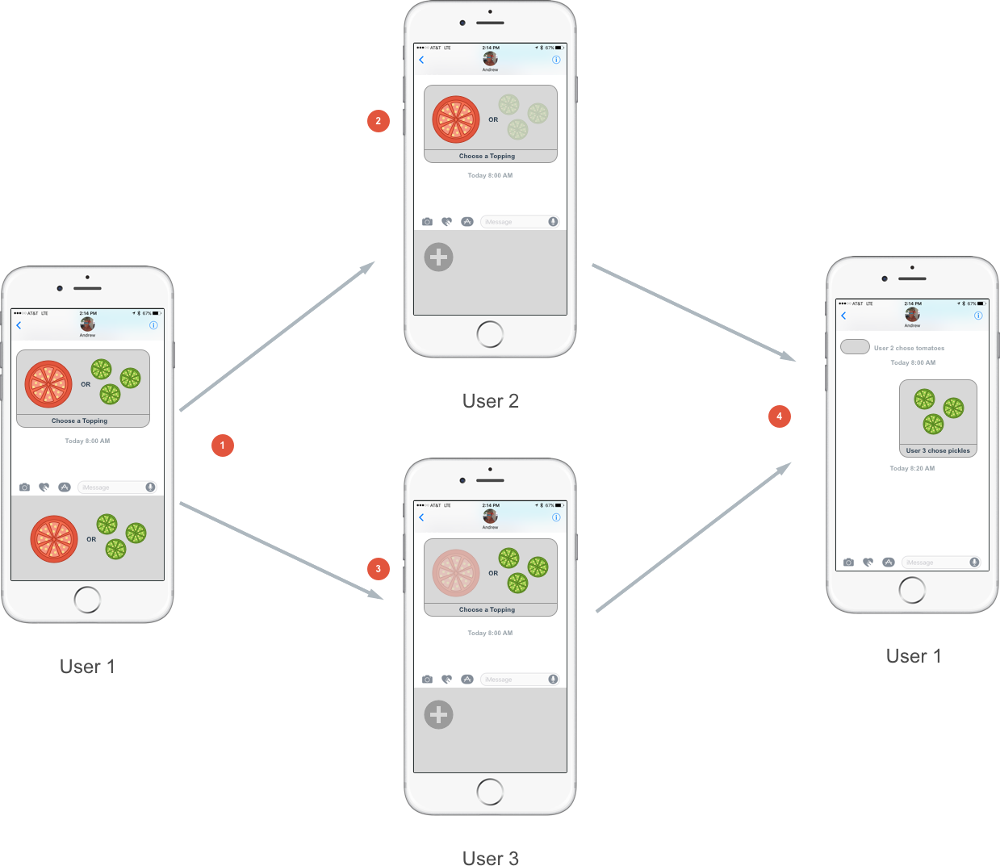](advanced-message-app-extensions-images/interactive14.png#lightbox)

1. User 1 sends a group Interactive Message asking User 2 and User 3 to choose a burger topping.
2. User 2 chooses tomatoes.
3. User 3 chooses pickles.
4. Both User 2's and User 3's choices arrive back to User 1 at almost the same time. As a result, User 2's choice is collapsed into a summary line and is unavailable. This case could have also been flipped, with User 2's choice being shown and User 3's being collapsed.

In either case, this behavior is undesired as User 1 should be able to access both User 2's and User 3's choices. To handle this situation, Apple is suggesting that the Message App Extension stores the message state in the cloud and use the URL property of the `MSMessage` (that gets sent between the users) to access this state.

When the user sends a message, a session token is generated and pushed to the cloud with the current message state. When a user taps on a Message Bubble in the Conversation Transcript, the session token is used to retrieve the current session state from the cloud.

### Sender Identifiers

To discuss accessing the identifier of the sender of a message, take the example of a group conversation given above:

[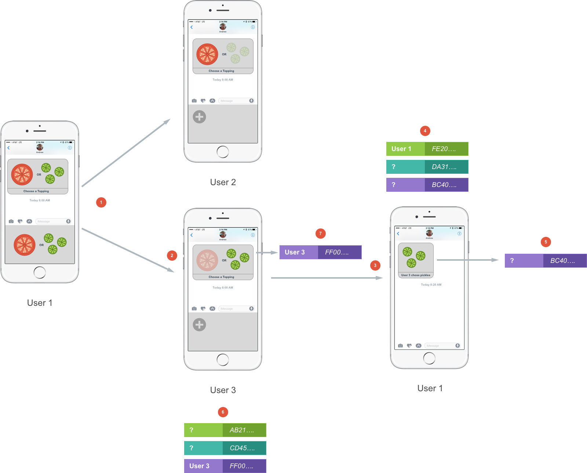](advanced-message-app-extensions-images/interactive15.png#lightbox)

1. Again, User 1 sends a group Interactive Message asking User 2 and User 3 to choose a burger topping.
2. User 3 picks pickles.
3. User 3's choice arrives back to User 1 and User 2 has not yet replied.
4. Because Apple is very concerned with user privacy, the Message App Extension only knows about a Unique Identifier (as a `NSUUID`) that is assigned each participant in the conversation. On the local device, only the current user's Identifier is known.
5. The `MSMessage` has a `SenderIdentifier` property that matches one of the user's in the Participant List known to the extension.
6. Each user device has its own copy of the Participant List where again, only the local user's Identifier is known.
7. When a message is sent, its `SenderIdentifier` property is also known to be that of the local user.

The Sender Identifiers can be used in the following ways:

- By looking at the Participant List the extension can get the number of users in the conversation.
- When the extension receives a message from a user, it can keep track of the Sender Identifier. If it receives another message with the same Sender Identifier, the extension knows that it is from the same user.
- They can be used to help identify a specific user in the conversation.

The Sender Identifier can be used in any of the text fields of the `MSMessageTemplateLayout` by prefixing it with a dollar sign (`$`). For example:

```csharp
// Pass along the sender identifier
var layout = new MSMessageTemplateLayout()
layout.Caption = string.format("${0} wants pickles.",Conversation.LocalParticipantIdentifier.UuidString);
```

When the Messages app displays a Message Bubble with this type of formatting, it will replace the `$uuid...` with the contact name of the participant in the conversation that sent the message.

The Sender Identifier is unique on each device, so looking at the diagram above again, note that User 1's device and User 3's device has a different unique Sender Identifier for each participant in the conversation.

The Sender Identifiers are scoped to the install of the Message App Extension. So if a user uninstalls and reinstalls the Message App Extension new Sender Identifiers will be generated for the new install.

To access the Sender Identifiers, the extension can use the following code:

```csharp
public override void DidStartSendingMessage (MSMessage message, MSConversation conversation)
{
    base.DidStartSendingMessage (message, conversation);

    // Get the sender's participant ID
    var senderID = message.SenderParticipantIdentifier;

    // Get the local participant ID
    var localID = conversation.LocalParticipantIdentifier;

    // Get the remote participant IDs
    var remoteIDs = conversation.RemoteParticipantIdentifiers;
}
```

## Supported Platforms

The Interactive Messages generated by a Message App Extension will be delivered on the following Apple platforms:

- watchOS 3
- macOS Sierra
- iOS 10

Of the three platforms, only iOS 10 will allow the user to generate an interactive message. On macOS Sierra, if the user clicks on an interactive Message Bubble, the URL attached to the `MSMessage` will be opened in Safari and a representation of the message should be displayed there.

On watchOS, the Messages app can handoff a interactive message to an attached iOS device where the user can compose a reply.

The new Messages API has support for fallback if the interactive message is received on older Apple platforms:

- watchOS 2 +
- OS X 10.11 +
- iOS 9 +

They will be delivered in a fallback format as two separate messages:

- One will be the image as provided by the Template Layout.
- The other will be the URL as provided in the `MSMessage`.

## Summary

This article has presented advanced techniques for working with Message App Extensions in a Xamarin.iOS solution that integrates with the **Messages** app and present new functionality to the user.

## Related Links

- [Ice cream Builder (sample)](/samples/xamarin/ios-samples/ios10-icecreambuilder)
- [Messages Reference](https://developer.apple.com/reference/messages)
- [App Extension Programming Guide](https://developer.apple.com/library/prerelease/content/documentation/General/Conceptual/ExtensibilityPG/index.html#//apple_ref/doc/uid/TP40014214)