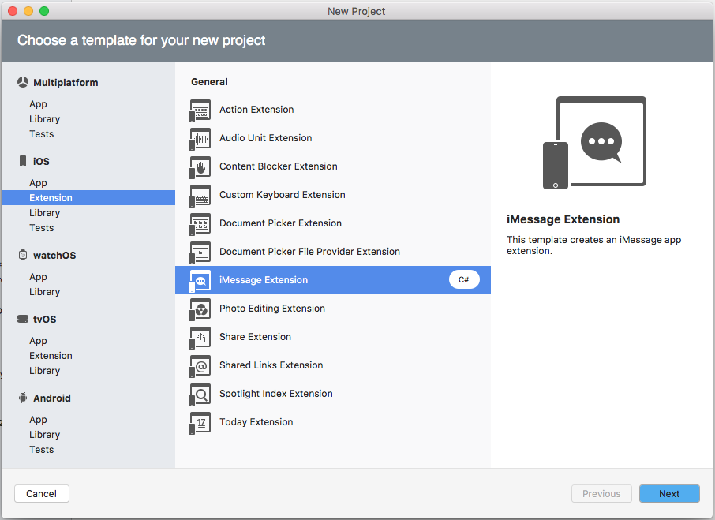
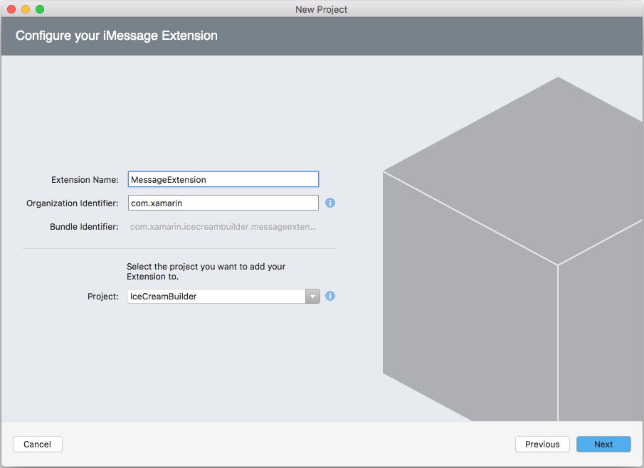
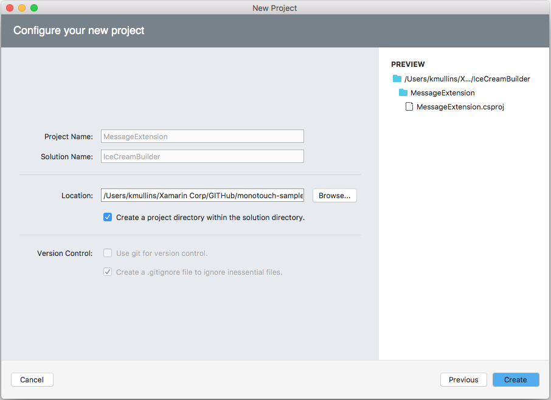
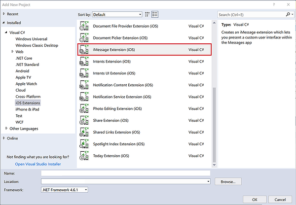
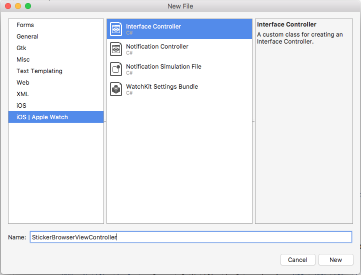
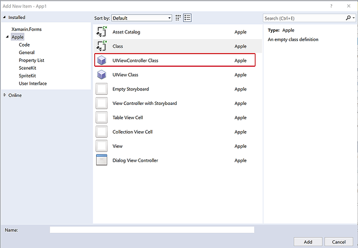

# Message App Extension Basics in Xamarin.iOS

_This article shows how include a Message App Extension in a Xamarin.iOS solution that integrates with the Messages app and presents new functionality to the user._

New to iOS 10, a Message App Extension integrates with the **Messages** app and presents new functionality to the user. The extension can send text, stickers, media files and interactive messages.

## About Message App Extensions

As stated above, a Message App Extension integrates with the **Messages** app and presents new functionality to the user. The extension can send text, stickers, media files and interactive messages. Two types of Message App Extension are available:

- **Sticker Packs** - Contains a collection of stickers that the user can add to a message. Sticker Packs can be created without writing any code.
- **iMessage App** - Can present a custom User Interface within the Messages app for selecting stickers, entering text, including media files (with optional type conversions) and creating, editing and sending interaction messages.

Message Apps Extensions provide three main content types:

- **Interactive Messages** - Are a type of custom message content that an app generates, when the user taps on the message, the app will be launched in the foreground.
- **Stickers** - Are images generated by the app that can be included in the messages sent between users.
- **Other Supported Content** - The app can provide content such as photos, videos, text or links to any other content types that have always been supported by the Messages app.

New to iOS 10, the Message app now includes its own dedicated, built-in App Store. Any apps that include Message Apps Extensions will be displayed and promoted in this store. The new Messages App Drawer will display any apps that have been downloaded from the Messages App Store to provide quick access to the users.

Also new in iOS 10, Apple has added Inline App Attribution which allows the user to easily discover an app. For example, if one user sends content to another from an app that the 2nd user doesn't have installed (like a sticker for example), the name of the sending app is listed under the content in the message history. If the user taps the app's name, the Message App Store we be opened and the app selected in the store.

Message Apps Extensions are similar to existing iOS apps that the developer is familiar with creating and they will have access to all the standard frameworks and features of a standard iOS app. For example:

- They have access to In-App Purchase.
- They have access to Apple Pay.
- They have access to device hardware such as the Camera.

Message Apps Extensions are only supported on iOS 10, however, the content that these Extensions send is viewable on watchOS and macOS devices. The new _Recents Page_ added to watchOS 3, will display recent stickers that have been sent from the phone, including those from Message Apps Extensions, and allow the user to send those stickers from the watch.

## About the Messages Framework

New to iOS 10, the Messages framework provides the interface between the Message Apps Extension and the Message app on the user's iOS device. When the user launches an App from inside the Messages app, this framework allows the app to be discovered and provides the data and context required to lay out its UI.

Once the app is launched, the user interacts with it to create new content to share via a message. The app then uses the Messages framework to transfer the newly created content to the Messages app for processing.

The Messages framework and Message Apps Extensions are built on top of pre-existing iOS App Extensions technologies. For more information on App Extensions, please see Apple's [App Extension Programming Guide](https://developer.apple.com/library/prerelease/content/documentation/General/Conceptual/ExtensibilityPG/index.html#//apple_ref/doc/uid/TP40014214).

Unlike other Extension Points that Apple has provided throughout the system, the developer does not need to provide a host app for their Message Apps Extensions since the Message app itself is acting as the container. However, the developer has the option of including the Message Apps Extension inside of a new or existing iOS app and shipping it along with the bundle.

If the Message Apps Extensions is included in an iOS app's bundle, the app's icon will be displayed both on the device's home screen and in the Message App Drawer from within the Messages app. If it is not included in a app bundle, the Message Apps Extension will only be displayed in the Message App Drawer.

Even if the Message Apps Extensions is not included in a host app bundle, the developer will need to provide an app icon in the Message Apps Extension's bundle, as this is the icon that will be displayed in other parts of the system such as the Message App Drawer or Settings, for the Extension.

## About Stickers

Apple designed stickers as a new way for iMessage users to communicate by allowing stickers to be sent inline as any other message content or they can be attached to previous message bubbles inside of the conversation.

What are Stickers?

- They are images that the Message Apps Extension provides.
- They can be either animated or static images.
- They provide a new way to share image content from inside of an app.

There are two ways to create Stickers:

1. A Sticker Pack Message Apps Extensions can be created from inside of Xcode without including any code. All that is required is the assets for the stickers and the app icons.
2. By creating a standard Message Apps Extension that provides stickers from code via the Messages framework.

### Creating Sticker Packs

Sticker Packs are created from a special template inside of Xcode and simply provide a static set of image assets that can be used as stickers. As stated above, they do not require any code, the developer simply drags image files into the Sticker Pack folder inside of the Stickers Asset Catalog.

For an image to be included in a Sticker Pack, it must meet the following requirements:

- Images must be in a PNG, APNG, GIF or JPEG format. Apple suggests using only the PNG and APNG formats when providing Sticker assets.
- Animated Stickers only support the APNG and GIF formats.
- Sticker images should provide a transparent background since they can be placed over message bubbles in the conversation by the user.
- The individual image files must be less than 500kb.
- Images cannot be smaller than 100x100 points, or larger that 206 x 206 points.

> [!IMPORTANT]
> Sticker images should always be provided at the `@3x` resolution in the 300 x 300 to 618 x 618 pixel range. The system will automatically generate the `@2x` and `@1x` versions at runtime as required.

Apple suggests testing the Sticker Image Assets against various different colored backgrounds (such as white, black, red, yellow and multi-colored) and over photos, to ensure that they look the best in all possible situations.

Sticker Packs can provide stickers in one of three available sizes:

- **Small** - 100 x 100 points.
- **Medium** - 136 x 136 points. This is the default size.
- **Large** - 206 x 206 points.

Use Xcode's Attributes Inspector to set the size for the entire Sticker Pack and only provide image assets that match the requested size, for the best results in the Sticker Browser inside of the Messages app.

For more information, please see our [Ice cream Builder](/samples/xamarin/ios-samples/ios10-icecreambuilder) app and Apple's [Messages Reference](https://developer.apple.com/reference/messages).

## Creating a Custom Sticker Experience

If the app requires more control or flexibility than is provided by a Sticker Pack, it can include a Message App Extension and provide the Stickers via the Messages framework for a Custom Sticker Experience.

What are the benefits of creating a Custom Sticker Experience?

1. Allows the app to customize how Stickers are displayed to the users of the app. For example, to present Stickers in a format other than the standard grid layout or on a different colored background.
2. Allows Stickers to be dynamically created from code instead of being included as static image assets.
3. Allows Sticker image assets to be dynamically downloaded from the developer's web server without having to release a new version to the App Store.
4. Allows for access of the device's camera to create Stickers on-the-fly.
5. Allows for In-App Purchases so the user can purchase more Stickers from inside of the app.

To creating a Custom Sticker Experience, do the following:

<!-- markdownlint-disable MD001 -->

# [Visual Studio for Mac](#tab/macos)

1. Start Visual Studio for Mac.
2. Open the solution to add a Message App Extension to.
3. Select **iOS** > **Extensions** > **iMessage Extension** and click the **Next** button:

    [](intro-to-message-app-extensions-images/message01.png#lightbox)
4. Enter an **Extension Name** and click the **Next** button:

    [](intro-to-message-app-extensions-images/message02.png#lightbox)
5. Click the **Create** button to build the Extension:

    [](intro-to-message-app-extensions-images/message03.png#lightbox)

# [Visual Studio](#tab/windows)

1. Start Visual Studio.
2. Open the solution to add a Message App Extension.
3. Select **iOS Extensions > iMessage Extension (iOS)** and click the **Next** button:

    [](intro-to-message-app-extensions-images/message01.w157.png#lightbox)

4. Enter a **Name** and click the **OK** button

-----

By default, the `MessagesViewController.cs` file will be added to the solution. This is the main entry point into the Extension and it inherits from the `MSMessageAppViewController` class.

The Messages framework provides classes for presenting available Stickers to the user:

- `MSStickerBrowserViewController` - Controls the view that the Stickers will be presented in. It also conforms to the `IMSStickerBrowserViewDataSource` interface to return the Sticker Count and the Sticker for a given browser index.
- `MSStickerBrowserView` - This is the view that the available Stickers will be displayed in.
- `MSStickerSize` - Decides the individual cell sizes for the grid of Stickers presented in the browser view.

### Creating a Custom Sticker Browser

The developer can further customize the sticker experience for the user by providing a Custom Sticker Browser (`MSMessageAppBrowserViewController`) in the Message App Extension. The Custom Sticker Browser changes how stickers are presented to the user when they are selecting a sticker to include in the message stream.

Do the following:

# [Visual Studio for Mac](#tab/macos)

1. In the **Solution Pad**, right-click on the Extension's project name and select **Add** > **New File...** > **iOS | Apple Watch** > **Interface Controller**.
2. Enter `StickerBrowserViewController` for the **Name** and click the **New** button:

    [](intro-to-message-app-extensions-images/browser01.png#lightbox)
3. Open the `StickerBrowserViewController.cs` file for editing.

# [Visual Studio](#tab/windows)

1. In the **Solution Explorer**, right-click on the Extension's project name and select **Add** > **New File...** > **iOS | Apple Watch** > **Interface Controller**.
2. Enter `StickerBrowserViewController` for the **Name** and click the **New** button:

    [](intro-to-message-app-extensions-images/browser01.w157.png#lightbox)
3. Open the `StickerBrowserViewController.cs` file for editing.

-----

Make the `StickerBrowserViewController.cs` look like the following:

```csharp
using System;
using System.Collections.Generic;
using UIKit;
using Messages;
using Foundation;

namespace MonkeyStickers
{
    public partial class StickerBrowserViewController : MSStickerBrowserViewController
    {
        #region Computed Properties
        public List<MSSticker> Stickers { get; set; } = new List<MSSticker> ();
        #endregion

        #region Constructors
        public StickerBrowserViewController (MSStickerSize stickerSize) : base (stickerSize)
        {
        }
        #endregion

        #region Private Methods
        private void CreateSticker (string assetName, string localizedDescription)
        {

            // Get path to asset
            var path = NSBundle.MainBundle.PathForResource (assetName, "png");
            if (path == null) {
                Console.WriteLine ("Couldn't create sticker {0}.", assetName);
                return;
            }

            // Build new sticker
            var stickerURL = new NSUrl (path);
            NSError error = null;
            var sticker = new MSSticker (stickerURL, localizedDescription, out error);
            if (error == null) {
                // Add to collection
                Stickers.Add (sticker);
            } else {
                // Report error
                Console.WriteLine ("Error, couldn't create sticker {0}: {1}", assetName, error);
            }
        }

        private void LoadStickers ()
        {

            // Load sticker assets from disk
            CreateSticker ("canada", "Canada Sticker");
            CreateSticker ("clouds", "Clouds Sticker");
            ...
            CreateSticker ("tree", "Tree Sticker");
        }
        #endregion

        #region Public Methods
        public void ChangeBackgroundColor (UIColor color)
        {
            StickerBrowserView.BackgroundColor = color;

        }
        #endregion

        #region Override Methods
        public override void ViewDidLoad ()
        {
            base.ViewDidLoad ();

            // Initialize
            LoadStickers ();
        }

        public override nint GetNumberOfStickers (MSStickerBrowserView stickerBrowserView)
        {
            return Stickers.Count;
        }

        public override MSSticker GetSticker (MSStickerBrowserView stickerBrowserView, nint index)
        {
            return Stickers[(int)index];
        }
        #endregion
    }
}
```

Take a look at the code above in detail. It creates storage for the Stickers that the Extension provides:

```csharp
public List<MSSticker> Stickers { get; set; } = new List<MSSticker> ();
```

And overrides two methods of the `MSStickerBrowserViewController` class to provide data for the browser from this data store:

```csharp
public override nint GetNumberOfStickers (MSStickerBrowserView stickerBrowserView)
{
    return Stickers.Count;
}

public override MSSticker GetSticker (MSStickerBrowserView stickerBrowserView, nint index)
{
    return Stickers[(int)index];
}
```

The `CreateSticker` method gets the path of an image asset from the Extension's bundle and uses it to create a new instance of a `MSSticker` from this asset, which it adds to the collection:

```csharp
private void CreateSticker (string assetName, string localizedDescription)
{

    // Get path to asset
    var path = NSBundle.MainBundle.PathForResource (assetName, "png");
    if (path == null) {
        Console.WriteLine ("Couldn't create sticker {0}.", assetName);
        return;
    }

    // Build new sticker
    var stickerURL = new NSUrl (path);
    NSError error = null;
    var sticker = new MSSticker (stickerURL, localizedDescription, out error);
    if (error == null) {
        // Add to collection
        Stickers.Add (sticker);
    } else {
        // Report error
        Console.WriteLine ("Error, couldn't create sticker {0}: {1}", assetName, error);
    }
}
```

The `LoadSticker` method is called from `ViewDidLoad` to create a sticker from the named image asset (included in the app's bundle) and add it to the collection of stickers.

To implement the Custom Sticker Browser, edit the `MessagesViewController.cs` file and make it look like the following:

```csharp
using System;
using UIKit;
using Messages;

namespace MonkeyStickers
{
    public partial class MessagesViewController : MSMessagesAppViewController
    {
        #region Computed Properties
        public StickerBrowserViewController BrowserViewController { get; set;}
        #endregion

        #region Constructors
        protected ViewController (IntPtr handle) : base (handle)
        {
            // Note: this .ctor should not contain any initialization logic.
        }
        #endregion

        #region Override Methods
        public override void ViewDidLoad ()
        {
            base.ViewDidLoad ();

            // Create new browser and configure it
            BrowserViewController = new StickerBrowserViewController (MSStickerSize.Regular);
            BrowserViewController.View.Frame = View.Frame;
            BrowserViewController.ChangeBackgroundColor (UIColor.Gray);

            // Add to view
            AddChildViewController (BrowserViewController);
            BrowserViewController.DidMoveToParentViewController (this);
            View.AddSubview (BrowserViewController.View);
        }
        #endregion
    }
}
```

Taking a look at this code in detail, it creates storage for the custom browser:

```csharp
public StickerBrowserViewController BrowserViewController { get; set;}
```

And in the `ViewDidLoad` method, it instantiates and configures a new browser:

```csharp
// Create new browser and configure it
BrowserViewController = new StickerBrowserViewController (MSStickerSize.Regular);
BrowserViewController.View.Frame = View.Frame;
BrowserViewController.ChangeBackgroundColor (UIColor.Gray);
```

Then it adds the browser to the view to display it:

```csharp
// Add to view
AddChildViewController (BrowserViewController);
BrowserViewController.DidMoveToParentViewController (this);
View.AddSubview (BrowserViewController.View);
```

### Further Sticker Customization

Further Sticker customization is possible by including just two classes in the Message App Extension:

- `MSStickerView`
- `MSSticker`

Using the above methods, the Extension can support sticker selection that does not rely on the standard Sticker Browser method. Additionally, the sticker display can be switched between two different view modes:

- **Compact** - This is the default mode where the Sticker View takes up the bottom 25% of the Message View.
- **Expanded** -The Sticker View fills the entire Message View.

This Sticker View can be switched between these modes either programmatically or manually by the user.

Take a look at the following example of handling the switch between the two different view modes. Two different View Controllers will be required for each state. The `StickerBrowserViewController` handles the **Compact** view and looks like the following:

```csharp
using System;
using System.Collections.Generic;
using UIKit;
using Messages;
using Foundation;

namespace MessageExtension
{
    public partial class StickerBrowserViewController : MSStickerBrowserViewController
    {
        #region Computed Properties
        public MessagesViewController MessagesAppViewController { get; set; }
        public List<MSSticker> Stickers { get; set; } = new List<MSSticker> ();
        #endregion

        #region Constructors
        public StickerBrowserViewController (MessagesViewController messagesAppViewController, MSStickerSize stickerSize) : base (stickerSize)
        {
            // Initialize
            this.MessagesAppViewController = messagesAppViewController;
        }
        #endregion

        #region Private Methods
        private void CreateSticker (string assetName, string localizedDescription)
        {

            // Get path to asset
            var path = NSBundle.MainBundle.PathForResource (assetName, "png");
            if (path == null) {
                Console.WriteLine ("Couldn't create sticker {0}.", assetName);
                return;
            }

            // Build new sticker
            var stickerURL = new NSUrl (path);
            NSError error = null;
            var sticker = new MSSticker (stickerURL, localizedDescription, out error);
            if (error == null) {
                // Add to collection
                Stickers.Add (sticker);
            } else {
                // Report error
                Console.WriteLine ("Error, couldn't create sticker {0}: {1}", assetName, error);
            }
        }

        private void LoadStickers ()
        {

            // Load sticker assets from disk
            CreateSticker ("add", "Add New Sticker");
            CreateSticker ("canada", "Canada Sticker");
            CreateSticker ("clouds", "Clouds Sticker");
            CreateSticker ("tree", "Tree Sticker");
        }
        #endregion

        #region Public Methods
        public void ChangeBackgroundColor (UIColor color)
        {
            StickerBrowserView.BackgroundColor = color;

        }
        #endregion

        #region Override Methods
        public override void ViewDidLoad ()
        {
            base.ViewDidLoad ();

            // Initialize
            LoadStickers ();

        }

        public override nint GetNumberOfStickers (MSStickerBrowserView stickerBrowserView)
        {
            return Stickers.Count;
        }

        public override MSSticker GetSticker (MSStickerBrowserView stickerBrowserView, nint index)
        {
            // Wanting to add a new sticker?
            if (index == 0) {
                // Yes, ask controller to present add sticker interface
                MessagesAppViewController.AddNewSticker ();
                return null;
            } else {
                // No, return existing sticker
                return Stickers [(int)index];
            }
        }
        #endregion
    }
}
```

The `AddStickerViewController` will handle the **Expanded** Sticker View and look like the following:

```csharp
using System;
using Foundation;
using UIKit;
using Messages;

namespace MessageExtension
{
    public class AddStickerViewController : UIViewController
    {
        #region Computed Properties
        public MessagesViewController MessagesAppViewController { get; set;}
        public MSSticker NewSticker { get; set;}
        #endregion

        #region Constructors
        public AddStickerViewController (MessagesViewController messagesAppViewController)
        {
            // Initialize
            this.MessagesAppViewController = messagesAppViewController;
        }
        #endregion

        #region Override Method
        public override void ViewDidLoad ()
        {
            base.ViewDidLoad ();

            // Build interface to create new sticker
            var cancelButton = new UIButton (UIButtonType.RoundedRect);
            cancelButton.TouchDown += (sender, e) => {
                // Cancel add new sticker
                MessagesAppViewController.CancelAddNewSticker ();
            };
            View.AddSubview (cancelButton);

            var doneButton = new UIButton (UIButtonType.RoundedRect);
            doneButton.TouchDown += (sender, e) => {
                // Add new sticker to collection
                MessagesAppViewController.AddStickerToCollection (NewSticker);
            };
            View.AddSubview (doneButton);

            ...
        }
        #endregion
    }
}
```

The `MessageViewController` implements these View Controllers to drive the requested state:

```csharp
using System;
using UIKit;
using Messages;

namespace MessageExtension
{
    public partial class MessagesViewController : MSMessagesAppViewController
    {
        #region Computed Properties
        public bool IsAddingSticker { get; set;}
        public StickerBrowserViewController BrowserViewController { get; set; }
        public AddStickerViewController AddStickerController { get; set;}
        #endregion

        #region Constructors
        protected MessagesViewController (IntPtr handle) : base (handle)
        {
            // Note: this .ctor should not contain any initialization logic.
        }
        #endregion

        #region Public Methods
        public void PresentStickerBrowser ()
        {
            // Is the Add sticker view being displayed?
            if (IsAddingSticker) {
                // Yes, remove it from view
                AddStickerController.RemoveFromParentViewController ();
                AddStickerController.View.RemoveFromSuperview ();
            }

            // Add to view
            AddChildViewController (BrowserViewController);
            BrowserViewController.DidMoveToParentViewController (this);
            View.AddSubview (BrowserViewController.View);

            // Save mode
            IsAddingSticker = false;
        }

        public void PresentAddSticker ()
        {
            // Is the sticker browser being displayed?
            if (!IsAddingSticker) {
                // Yes, remove it from view
                BrowserViewController.RemoveFromParentViewController ();
                BrowserViewController.View.RemoveFromSuperview ();
            }

            // Add to view
            AddChildViewController (AddStickerController);
            AddStickerController.DidMoveToParentViewController (this);
            View.AddSubview (AddStickerController.View);

            // Save mode
            IsAddingSticker = true;
        }

        public void AddNewSticker ()
        {
            // Switch to expanded view mode
            Request (MSMessagesAppPresentationStyle.Expanded);
        }

        public void CancelAddNewSticker ()
        {
            // Switch to compact view mode
            Request (MSMessagesAppPresentationStyle.Compact);
        }

        public void AddStickerToCollection (MSSticker sticker)
        {
            // Add sticker to collection
            BrowserViewController.Stickers.Add (sticker);

            // Switch to compact view mode
            Request (MSMessagesAppPresentationStyle.Compact);
        }
        #endregion

        #region Override Methods
        public override void ViewDidLoad ()
        {
            base.ViewDidLoad ();

            // Create new browser and configure it
            BrowserViewController = new StickerBrowserViewController (this, MSStickerSize.Regular);
            BrowserViewController.View.Frame = View.Frame;
            BrowserViewController.ChangeBackgroundColor (UIColor.Gray);

            // Create new Add controller and configure it as well
            AddStickerController = new AddStickerViewController (this);
            AddStickerController.View.Frame = View.Frame;

            // Initially present the sticker browser
            PresentStickerBrowser ();
        }

        public override void DidTransition (MSMessagesAppPresentationStyle presentationStyle)
        {
            base.DidTransition (presentationStyle);

            // Take action based on style
            switch (presentationStyle) {
            case MSMessagesAppPresentationStyle.Compact:
                PresentStickerBrowser ();
                break;
            case MSMessagesAppPresentationStyle.Expanded:
                PresentAddSticker ();
                break;
            }
        }
        #endregion
    }
}
```

When the user requests to add a new Sticker to their available collection, a new `AddStickerViewController` is made the visible controller and the Sticker View enters the **Expanded** view:

```csharp
// Switch to expanded view mode
Request (MSMessagesAppPresentationStyle.Expanded);
```

When the user, chooses a sticker to add, it's added to their available collection and the **Compact** view is requested:

```csharp
public void AddStickerToCollection (MSSticker sticker)
{
    // Add sticker to collection
    BrowserViewController.Stickers.Add (sticker);

    // Switch to compact view mode
    Request (MSMessagesAppPresentationStyle.Compact);
}
```

The `DidTransition` method is overridden to handle switching between the two modes:

```csharp
public override void DidTransition (MSMessagesAppPresentationStyle presentationStyle)
{
    base.DidTransition (presentationStyle);

    // Take action based on style
    switch (presentationStyle) {
    case MSMessagesAppPresentationStyle.Compact:
        PresentStickerBrowser ();
        break;
    case MSMessagesAppPresentationStyle.Expanded:
        PresentAddSticker ();
        break;
    }
}
```

## Summary

This article has covered include a Message App Extension in a Xamarin.iOS solution that integrates with the **Messages** app and present new functionality to the user. It covered using the extension to send text, stickers, media files and interactive messages.

## Related Links

- [Ice cream Builder (sample)](/samples/xamarin/ios-samples/ios10-icecreambuilder)
- [Messages Reference](https://developer.apple.com/reference/messages)
- [App Extension Programming Guide](https://developer.apple.com/library/prerelease/content/documentation/General/Conceptual/ExtensibilityPG/index.html#//apple_ref/doc/uid/TP40014214)