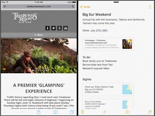
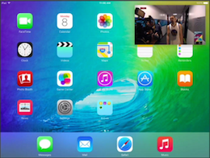
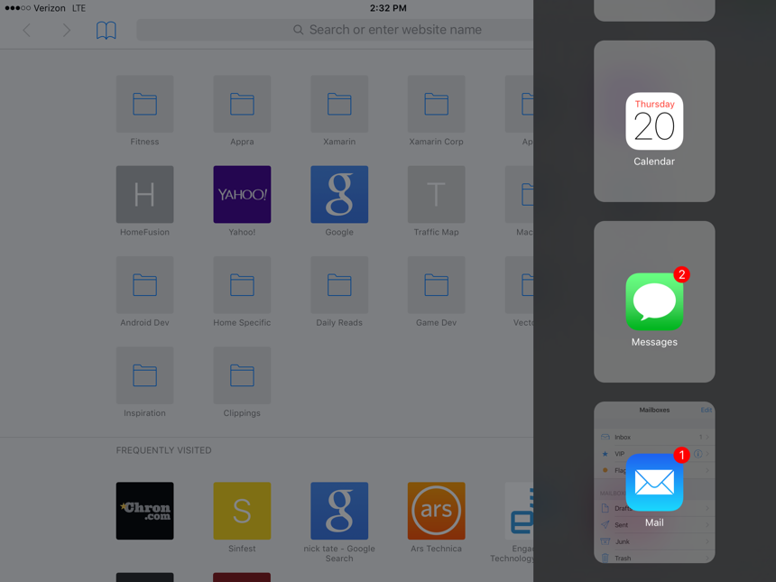
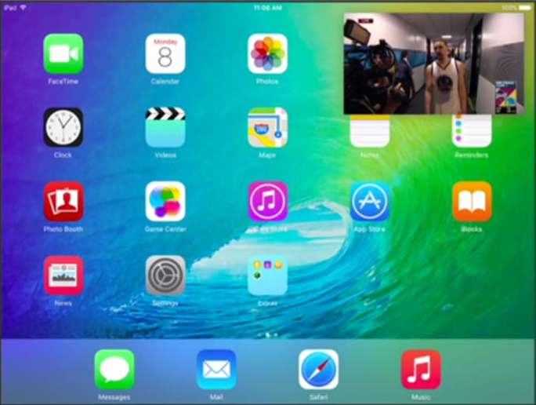
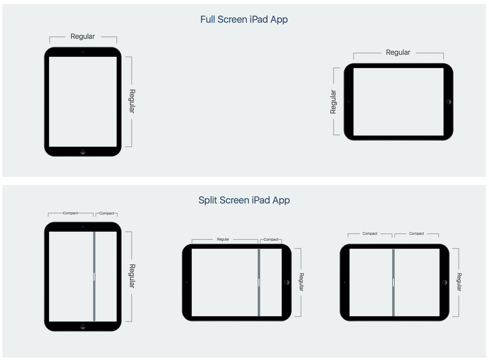
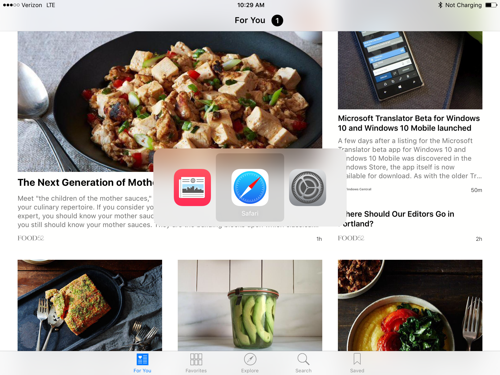
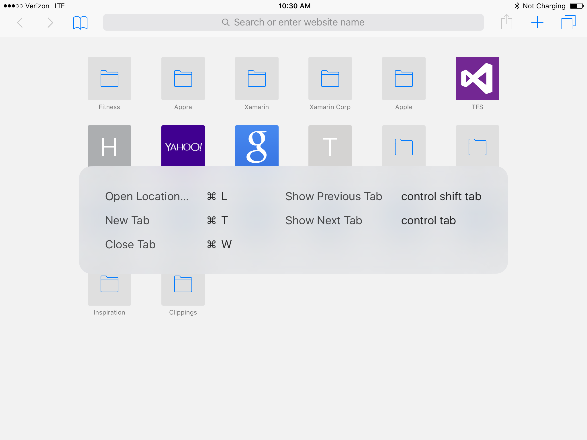
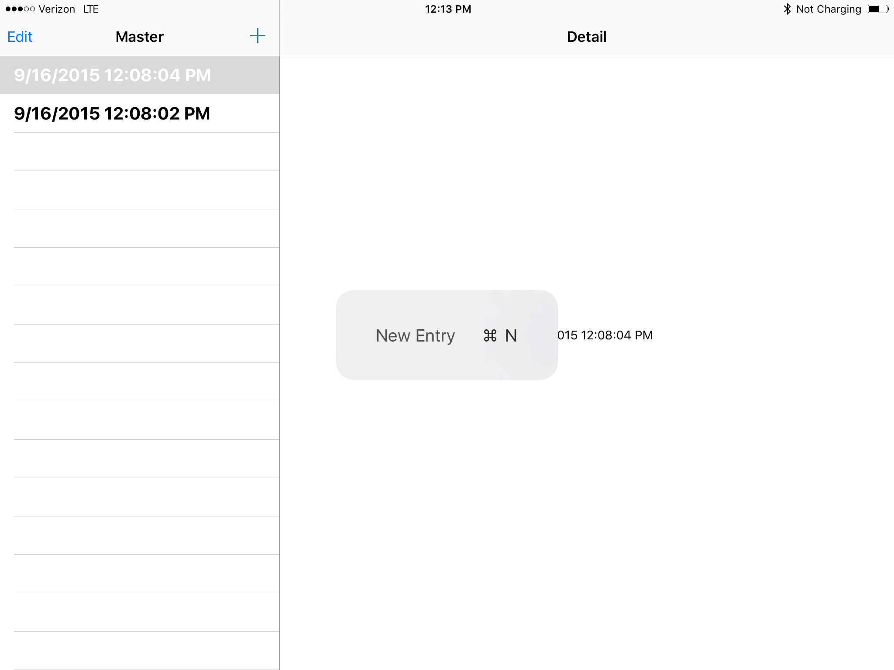
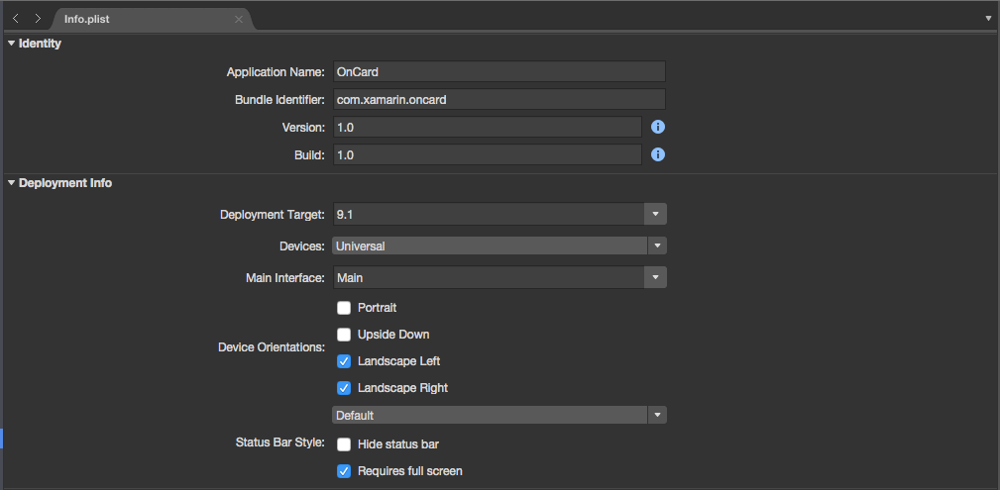

# Multitasking for iPad in Xamarin.iOS

_iOS 9 supports two apps running at the same time, using slide over or split view. It also supports video playing Picture-In-Picture._

 

iOS 9 adds multitasking support for running two apps at the same time on specific iPad hardware. Multitasking for iPad is supported via the following features:

- [**Slide Over**](#Slide-Over) - Allows the user to temporarily run a second iOS app in a slide out panel (either on the right or left side of the screen based on language direction) that covers approximately 25% of the main app currently running. Slide Over is available only on an iPad Pro, iPad Air, iPad Air 2, iPad Mini 2, iPad Mini 3, or iPad Mini 4.
- [**Split View**](#Split-View) - On supported iPad hardware (iPad Air 2, iPad Mini 4 and iPad Pro only), the user can pick a second app and run it side-by-side with the currently running app in a split screen mode. The user can control the percentage of the main screen that each app occupies.
- [**Picture in Picture**](#Picture-in-Picture) - For apps that playback video content, the video can now be played in a moveable and resizable window that floats over the other apps currently running on the iOS device. The user has full control over the size and position of this window. Picture in Picture is available only on an iPad Pro, iPad Air, iPad Air 2, iPad Mini 2, iPad Mini 3, or iPad Mini 4.

There are a number of things to consider when [supporting multitasking in your app](#Supporting-Multitasking-in-your-App), including:

- [Screen Size and Orientation](#Screen-Size-Considerations)
- [Custom Hardware Keyboard Shortcuts](#Custom-Hardware-Keyboard-Shortcuts)
- [Resource Management](#Resource-Management-Considerations)

As an app developer you can also [opt out of multitasking](#Opting-Out-of-Multitasking), including [disabling PIP Video Playback](#Disabling-PIP-Video-Playback).

This article will cover the steps required to ensure that your Xamarin.iOS app runs correctly in a multitasking environment or how to opt out of multitasking if it is not a good fit for your app.

> [!VIDEO https://youtube.com/embed/GctYAozoLr8]

**Multitasking for iPad video**

<a name="Multitasking-QuickStart"></a>

## Multitasking QuickStart

To support **Slide Over** or **Split View** your app must do the following:

- Be built against iOS 9 (or greater).
- Use a Storyboard for its Launch Screen (and not image assets).
- Use a Storyboard with Autolayout and Size Classes for its UI.
- Support all 4 iOS device orientations (Portrait, Upside-down Portrait, Landscape Left & Landscape Right).

<a name="Multitasking"></a>

## About Multitasking for iPad

iOS 9 offers new multitasking abilities on iPad with the introduction of _Slide Over_, _Split View_ (iPad Air 2, iPad Mini 4 and iPad Pro only) and _Picture in Picture_. We'll take a closer look at these features in the following sections.

<a name="Slide-Over"></a>

### Slide Over

The Slide Over feature allows the user to pick a second app and display it in a small sliding panel to provide quick interaction. The Slide Over panel is temporary, and will close when the user goes back to working with the main app again.

[](multitasking-images/about01.png#lightbox)

The main thing to remember is that the user decides which two apps will be running side-by-side and that the developer has no control over this process. As a result, there are a few things that you will need to do to ensure your Xamarin.iOS app runs correctly in a Slide Over panel:

- **Use Autolayout and Size Classes** — Because your Xamarin.iOS app can now be run in the slide-out side panel, you can no longer rely on the device, its screen size or its orientation to layout your UI. To ensure that your app scales it's interface correctly, you'll need to use Autolayout and Size Classes. For more information, see our [Introduction to Unified Storyboards](~/ios/user-interface/storyboards/unified-storyboards.md) documentation.
- **Use Resources Efficiently** — Because your app can now be sharing the system with another running app, it is critical that your app uses system resources efficiently. When memory becomes sparse, the system will automatically terminate the app that's consuming the most memory. See Apple's [Energy Efficiency Guide for iOS Apps](https://developer.apple.com/library/prerelease/ios/documentation/Performance/Conceptual/EnergyGuide-iOS/index.html#//apple_ref/doc/uid/TP40015243) for more details.

Slide Over is available only on an iPad Pro, iPad Air, iPad Air 2, iPad Mini 2, iPad Mini 3, or iPad Mini 4. To learn more about preparing your app for Slide Over, please see Apple's [Adopting Multitasking Enhancements on iPad](https://developer.apple.com/library/prerelease/ios/documentation/WindowsViews/Conceptual/AdoptingMultitaskingOniPad/index.html#//apple_ref/doc/uid/TP40015145) documentation.

<a name="Split-View"></a>

### Split View

On supported iPad hardware (iPad Air 2, iPad Mini 4 and iPad Pro only), the user can pick a second app and run it side-by-side with the currently running app in a split screen mode. The user can control the percentage of the main screen that each app occupies by dragging an on-screen divider.

[](multitasking-images/about02.png#lightbox)

Like Slide Over, the user decides which two apps will be running side-by-side and again, the developer has no control over this process. As a result, Split View places similar requirements on a Xamarin.iOS app:

- **Use Autolayout and Size Classes** — Because your Xamarin.iOS app can now be run in a split screen mode at the user's specified size, you can no longer rely on the device, its screen size or its orientation to layout your UI. To ensure that your app scales it's interface correctly, you'll need to use Autolayout and Size Classes. For more information, see our [Introduction to Unified Storyboards](~/ios/user-interface/storyboards/unified-storyboards.md) documentation.
- **Use Resources Efficiently** — Because your app can now be sharing the system with another running app, it is critical that your app uses system resources efficiently. When memory becomes sparse, the system will automatically terminate the app that's consuming the most memory. See Apple's [Energy Efficiency Guide for iOS Apps](https://developer.apple.com/library/prerelease/ios/documentation/Performance/Conceptual/EnergyGuide-iOS/index.html#//apple_ref/doc/uid/TP40015243) for more details.

To learn more about preparing your app for Split View, please see Apple's [Adopting Multitasking Enhancements on iPad](https://developer.apple.com/library/prerelease/ios/documentation/WindowsViews/Conceptual/AdoptingMultitaskingOniPad/index.html#//apple_ref/doc/uid/TP40015145) documentation.

<a name="Picture-in-Picture"></a>

### Picture in Picture

The new Picture in Picture feature (also known as _PIP_) allows the user to watch a video in a small, floating window that the user can position anywhere on screen above other running apps.

[](multitasking-images/about03.png#lightbox)

As with Slide Over and Split View, the user has full control over watching a video in the Picture in Picture mode. If your app's main function is to watch video, it will need some modification to behave correctly in PIP mode. Otherwise, no changes are required to support PIP.

For your app to display PIP video at the user's request, you will need to be using either _AVKit_ or the _AV Foundation APIs_. The Media Player framework has been depreciated in iOS 9 and does not support PIP.

Picture in Picture is available only on an iPad Pro, iPad Air, iPad Air 2, iPad Mini 2, iPad Mini 3, or iPad Mini 4. For more information, please see our [PictureInPicture Sample App](/samples/browse/?products=xamarin&term=Xamarin.iOS%2biOS9) and  Apple's [Picture in Picture Quick Start](https://developer.apple.com/library/prerelease/ios/documentation/WindowsViews/Conceptual/AdoptingMultitaskingOniPad/QuickStartForPictureInPicture.html#//apple_ref/doc/uid/TP40015145-CH14) documentation.

<a name="Supporting-Multitasking-in-your-App"></a>

## Supporting Multitasking in your App

For any existing Xamarin.iOS app, supporting multitasking is a transparent task as long as your app already follows Apple's design guides and best practices for iOS 8. This means that the app should be using storyboards with Autolayout and Size Classes for its User Interface layouts (see our [Introduction to Unified Storyboards](~/ios/user-interface/storyboards/unified-storyboards.md) for more information).

For these apps, little or no changes are required to support multitasking and to behave well within it. If your app's UI, was created using other methods such as directly positioning and sizing UI elements in C# code or if it relies on specific device screen sizes or orientations, it will need significant modification to support iOS 9 multitasking correctly.

To support iOS 9 multitasking on any new Xamarin.iOS app, again use storyboards with Autolayout and Size Classes for all of the app's User Interface layouts and implement the instructions in the following sections.

<a name="Screen-Size-Considerations"></a>

### Screen Size and Orientation Considerations

Before iOS 9, you could design your app against specific device screen sizes and orientations. Because an app can now be run in a Slide Out panel or in Split View mode, it can find itself running in either a compact or regular horizontal size class on iPad, regardless of the device's physical orientation or screen size.

[](multitasking-images/sizeclasses01.png#lightbox)

On an iPad, a full screen app has Regular horizontal and vertical Size Classes. All iPhones but the iPhone 6 Plus and iPhone 6s Plus, have Compact Size classes in both directions in any orientation. The iPhone 6 Plus and iPhone 6s Plus in Landscape mode have a Regular horizontal Size Class and a Compact vertical Size Class (much like an iPad Mini).

On iPads that support Slide Over and Split View, you can end up with the following combinations:

| **Orientation** | **Primary App** | **Secondary App** |
|--- |--- |--- |
| **Portrait** |75% of Screen<br />Compact Horizontal<br />Regular Vertical|25% of Screen<br />Compact Horizontal<br />Regular Vertical|
| **Landscape** |75% of Screen<br />Regular Horizontal<br />Regular Vertical|25% of Screen<br />Compact Horizontal<br />Regular Vertical|
| **Landscape** |50% of Screen<br />Compact Horizontal<br />Regular Vertical|50% of Screen<br />Compact Horizontal<br />Regular Vertical|

In the example [MuliTask](/samples/xamarin/ios-samples/ios9-multitask) app, if it is run full screen on an iPad in the landscape mode, it will present both the list and the detail view at the same time:

[](multitasking-images/sizeclasses03.png#lightbox)

If the same app is run in a Slide Over panel, it is laid out as a Compact Horizontal Size Class and displays only the list:

[](multitasking-images/sizeclasses04.png#lightbox)

To ensure that your app behaves correctly in these situations, you should adopt Trait Collections along with Size Classes and conform to the `IUIContentContainer` and `IUITraitEnvironment` interfaces. See Apple's [UITraitCollection Class Reference](https://developer.apple.com/library/prerelease/ios/documentation/UIKit/Reference/UITraitCollection_ClassReference/index.html#//apple_ref/doc/uid/TP40014202) and our [Introduction to Unified Storyboards](~/ios/user-interface/storyboards/unified-storyboards.md) guide for more information.

Additionally, you can no longer rely on the devices screen bounds to define the app's visible area, you'll need to use your app's window bounds instead. Since the window bounds are fully under the control of the user, you cannot programmatically adjust them or prevent the user from changing these bounds.

Finally, your app must use a storyboard file to present its Launch Screen as opposed to using a set of **.png** image files and support all four interface orientations (Portrait, Upside-down Portrait, Landscape Left and Landscape Right) to be considered for running in a Slide Over panel or in Split View mode.

<a name="Custom-Hardware-Keyboard-Shortcuts"></a>

### Custom Hardware Keyboard Shortcuts

In iOS 9 running on an iPad, Apple has extended support for hardware keyboards. iPads have always included basic external keyboard support via Bluetooth and some keyboard manufacturers created keyboards that included hard-wired iOS-specific keys.

Now, with iOS 9, apps can create their own custom keyboard shortcuts. Additionally, some basic keyboard shortcuts are available like **Command-C** (copy), **Command-X** (cut), **Command-V** (paste) and **Command-Shift-H** (home), without an app being specifically written respond to them.

**Command-Tab** will bring up an app switcher that allows the user to quickly switch between apps from the keyboard, much like the Mac OS:

[](multitasking-images/keyboard01.png#lightbox)

If an iOS 9 app includes keyboard shortcuts, the user can hold down on the **Command**, **Option** or **Control** keys to display them in a popup:

[](multitasking-images/keyboard02.png#lightbox)

#### Defining Custom Keyboard Shortcuts

If we add the following code to a View or View Controller in our app, when that view or controller is visible, a custom keyboard shortcut will be available:

```csharp
#region Custom Keyboard Shortcut
public override bool CanBecomeFirstResponder {
    get { return true; }
}

public override UIKeyCommand[] KeyCommands {
    get {

        var keyCommand = UIKeyCommand.Create (new NSString("n"), UIKeyModifierFlags.Command, new Selector ("NewEntry"), new NSString("New Entry"));
        return new UIKeyCommand[]{ keyCommand };
    }
}

[Export("NewEntry")]
public void NewEntry() {

    // Add a new entry
    ...

}
#endregion
```

First, we override the `CanBecomeFirstResponder` property and return `true` so the View or View Controller can receive keyboard input. 

Next, we override the `KeyCommands` property and create a new `UIKeyCommand` for the **Command-N** keystroke. When the keystroke is activated, we call the `NewEntry` method (that we expose to iOS 9 using the `Export` command) to perform the requested action.

If we run this app on an iPad with an hardware keyboard attached and the user types **Command-N**, a new entry will be added to the list. If the user holds down on the **Command** key, the list of shortcuts will be displayed:

[](multitasking-images/keyboard03.png#lightbox)

Please see the sample [MultiTask app](/samples/xamarin/ios-samples/ios9-multitask) for an example implementation.

<a name="Resource-Management-Considerations"></a>

### Resource Management Considerations

Even for apps that are already using iOS 8's design guides and best practices, efficient resource management might still be an issue. In iOS 9, apps no longer have exclusive use of memory, CPU or other system resources.

As a result, you must fine-tune your Xamarin.iOS app to use system resources effectively or it faces termination under low memory situations. This is equally true of apps that opt out of multitasking, since a second app might still be run in a Slide Over panel or a Picture in Picture window requiring extra resources or causing the refresh rate to fall below 60 frames per second.

Consider the following user actions and their implications:

- **Entering Text in a Slide Over panel** - Even if your app has no text input, the system keyboard can now be displayed over its UI. As a result, the app might need to respond to keyboard display notifications (such as showing and hiding the keyboard).
- **Running a Second App in a Slide Over panel** - The new app is now running in the foreground and competing with the existing app for system resources such as memory and CPU cycles.
- **Playing a Video in a PIP Window** - Not only can this window cover part of your app's interface, but the app that launched the video is still running in the background and consuming CPU and memory resources.

To ensure that your app is using resources efficiently, you should do the following:

- **Profile the App with Instruments** - Check for memory leaks, overt CPU usage and areas where the app might be blocking the main thread.
- **Respond to State Transitions Methods** - In your **AppDelegate.cs** file override and response to state change methods such as the app entering or returning from the background. Release any unrequired assets such as images, data or views and view controller.
- **Test Side-by-Side with Memory Intensive Apps** - Run your app using both Slide Out and Split View on physical iOS hardware with a memory intensive app such as Maps (in Satellite view mode) and test that both apps remain responsive and do not crash.

See Apple's [Energy Efficiency Guide for iOS Apps](https://developer.apple.com/library/prerelease/ios/documentation/Performance/Conceptual/EnergyGuide-iOS/index.html#//apple_ref/doc/uid/TP40015243) for more information on resource management.

<a name="Opting-Out-of-Multitasking"></a>

## Opting Out of Multitasking

While Apple suggests that all iOS 9 apps support multitasking, there might very specific reasons for an app not too, such as games or camera apps that require the full screen to work correctly.

For your Xamarin.iOS app to opt out of being run in either a Slide Out panel or in Split View mode, edit the project's **Info.plist** file and check **Requires Full Screen**:

[](multitasking-images/fullscreen01.png#lightbox)

> [!IMPORTANT]
> While opting out of multitasking prevents your app from being run in Slide
> Out or Split View, it does not prevent another app from being run in Slide
> Out or a Picture in Picture video from displaying along with your app.

<a name="Disabling-PIP-Video-Playback"></a>

### Disabling PIP Video Playback

In most situations, your app should allow the user to play any video content it displays in a Picture in Picture floating window. However, there might be situations where this might not be desired, such as game cut scene videos.

To opt out of PIP video playback, do the following in your app:

- If you are using a `AVPlayerViewController` to display video, set the `AllowsPictureInPicturePlayback` property to `false`.
- If you are using the `AVPlayerLayer` to display video, don't instantiate an `AVPictureInPictureController`.
- If you are using a `WKWebView` to display video, set the `AllowsPictureInPictureMediaPlayback` property to `false`.

<a name="Summary"></a>

## Summary

This article has covered the steps required to ensure that a Xamarin.iOS app will run and behave correctly in iOS 9's new multitasking ability for iPads. In addition, it covered opting-out of multitasking for apps where it is not a good fit.

## Related Links

- [iOS 9 Samples](/samples/browse/?products=xamarin&term=Xamarin.iOS%2biOS9)
- [MultiTask (sample)](/samples/xamarin/ios-samples/ios9-multitask)
- [Introduction to Unified Storyboards](~/ios/user-interface/storyboards/unified-storyboards.md)
- [iOS 9.0](https://developer.apple.com/library/prerelease/ios/releasenotes/General/WhatsNewIniOS/Articles/iOS9.html)
- [Adopting Multitasking Enhancements on iPad](https://developer.apple.com/library/prerelease/ios/documentation/WindowsViews/Conceptual/AdoptingMultitaskingOniPad/index.html#//apple_ref/doc/uid/TP40015145)
- [Blog post](https://blog.xamarin.com/using-auto-layouts-for-ios-9-splitview/)