# PassKit

_Wallet is a system iOS app that stores and displays barcodes and other information to link customer transactions on their phone with the ‘real world’._

Wallet is an app for iPhones and iPod touches with iOS 6. It stores and
displays barcodes and other information to link customer transactions on their
phone with the ‘real world’. Passes are generated by merchants and sent to
the customer via email, URLs or from within a merchant’s own iOS app. Wallet
stores and organizes all the Passes on a phone, and displays Pass reminders on
the lock-screen depending on the date/time or the location of the device.

This document introduces Wallet, using the Pass Kit API with Xamarin.iOS, and
discusses how to implement Passes on your server.

 [ 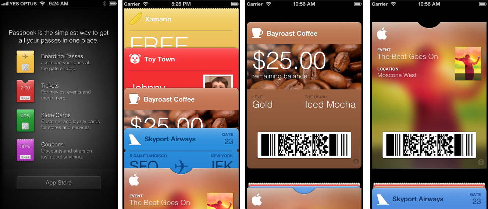](passkit-images/image1.png)


## Requirements

The Store Kit features discussed in this document require iOS 6 and Xcode
4.5, along with Xamarin.iOS 6.0.


## Introduction

The key problem that Pass Kit solves is the distribution and management of
barcodes. Some real-world examples of how barcodes are currently used
include:

-   **Buying movie tickets online** – Customers are typically emailed a barcode that represents their tickets. This barcode is printed and taken to the cinema to be scanned for entry.
-   **Loyalty cards** – Customers carry a number of different store-specific cards in their wallet or purse, for display and scanning when they purchase goods.
-   **Coupons** – Coupons are distributed via email, as printable web pages, through letterboxes and as barcodes in newspapers and magazines. Customers bring them to a store for scanning, to receive goods, services or discounts in return.
-   **Boarding passes** – Similar to buying a movie ticket.


Pass Kit offers an alternative for each of these scenarios:

-   **Movie tickets** – After purchase, the customer adds an Event Ticket Pass (via email or a website link). As the time for the movie approaches, the Pass will automatically appear on the lock-screen as a reminder, and on arrival at the cinema the Pass is easily retrieved and displayed in Wallet for scanning.
-   **Loyalty cards** – Rather than (or in addition to) providing a physical card, stores can issue (via email or after a website login) a Store Card Pass. The store can provide additional features such as updating the balance of the account on the Pass via push notifications, and using geolocation services the Pass could automatically appear on the lock-screen when the customer is near a store location.
-   **Coupons** – Coupon Passes can easily be generated with unique characteristics to help with tracking, and distributed via email or website links. Downloaded coupons can automatically appear on the lock-screen when the user is near a specific location, and/or on a given date (such as when the expiry date is approaching). Because the coupons are stored on the user’s phone, they are always handy and do not get misplaced. Coupons might encourage customers to download Companion Apps because App Store links can be incorporated into the Pass, increasing engagement with the customer.
-   **Boarding passes** – After an online check-in process, the customer would receive their Boarding Pass via email or a link. A Companion App provided by the transport provider could include the check-in process, and also allow the customer to perform additional functions like choosing their seat or meal. The transport provider can use push notifications to update the pass if transport is delayed or canceled. As the boarding time approaches the Pass will appear on the lock-screen as a reminder and to provide quick access to the Pass.


At its core, Pass Kit provides a simple and convenient way to store and
display barcodes on your iPhone or iPod touch device. With the additional time
and location lock-screen integration, push notifications and Companion
Application integrate it offers a foundation for very sophisticated sales,
ticketing and billing services.


## Pass Kit Ecosystem

Pass Kit is not just an API within CocoaTouch, rather it is part of a larger
ecosystem of apps, data and services that facilitate the secure sharing and
management of barcodes and other data. This high level diagram shows the
different entities that can be involved in creating and using Passes:

 [ 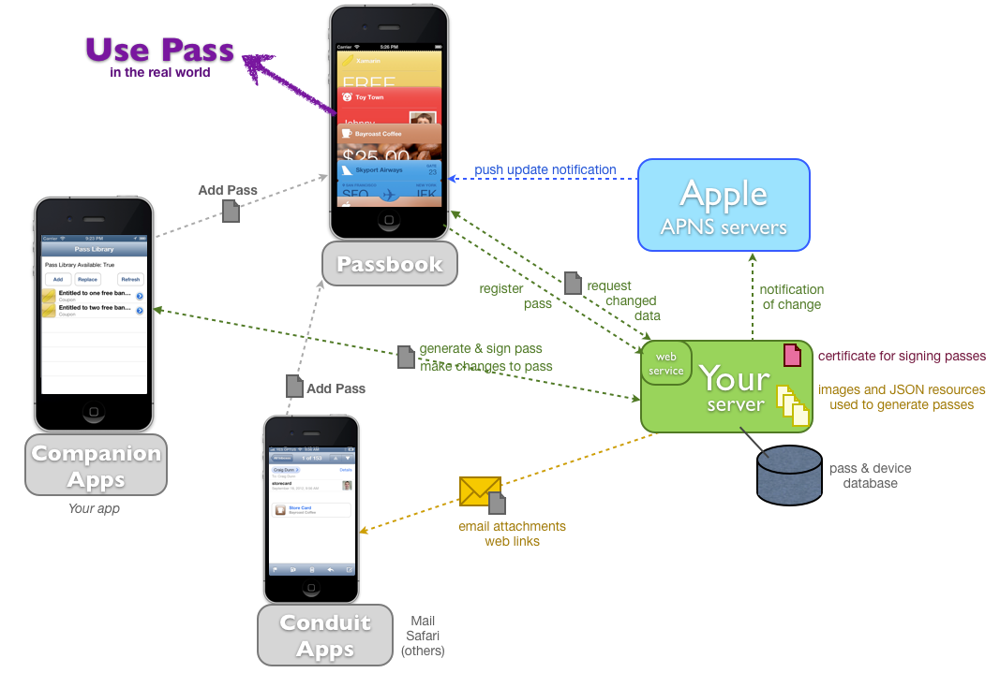](passkit-images/image2.png)

Each piece of the ecosystem has a clearly defined role:

-   **Wallet** – Apple’s built-in iOS app (for iPhone and iPod touch) that stores and displays Passes. This is the only place that Passes are rendered for use in the real world (ie the barcode is displayed, along with all the localized data in the pass).
-   **Companion Apps** – iOS 6 apps built by Pass providers to extend the functionality of the passes they issue, such as adding value to a store card, changing the seat on a boarding pass or other business-specific function. Companion Apps are not required for a Pass to be useful.
-   **Your server** – A secure server where passes can be generated and signed for distribution. Your Companion App may connect to your server to generate new passes or request updates to existing Passes. You may optionally implement the web service API that Wallet would call to update Passes.
-   **APNS Servers** – Your server has the ability to notify Wallet of updates to a pass on a given device using APNS. Push a notification to Wallet which will then contact your server for details of the change. Companion apps do not need to implement APNS for this feature (they can listen to the  `PKPassLibraryDidChangeNotification` ).
-   **Conduit Apps** – Applications that don’t directly manipulate Passes (like Companion apps do), but which can improve their utility by recognizing Passes and allowing them to be added to Wallet. Mail clients, social network browsers and other data aggregation apps may all encounter attachments or links to passes.


The entire ecosystem looks complex, so it’s worth noting that some
components are optional and much simpler Pass Kit implementations are
possible.

## What is a Pass?

A Pass is a collection of data representing a ticket, coupon or card. It may
be intended for a single use by an individual (and therefore contain details
such as a flight number and seat allocation) or it may a multiple use token that
can be shared by any number of users (such as a discount coupon). A detailed
description is available in Apple’s [About Pass Files](https://developer.apple.com/library/prerelease/ios/#documentation/UserExperience/Reference/PassKit_Bundle/Chapters/Introduction.html) document.


### Types

Currently five supported types, which can be distinguished in the Wallet
app by the layout and top edge of the pass:

-  **Event Ticket** – small semicircular cutout.
-   **Boarding Pass** – notches in side, transport-specific icon can be specified (eg. bus, train, airplane).
-   **Store Card** – rounded top, like a credit or debit card.
-  **Coupon** – perforated along the top.
-  **Generic** – same as Store Card, rounded top.


The five pass types are shown in this screenshot (in order: coupon, generic,
store card, boarding pass and event ticket):

 [ 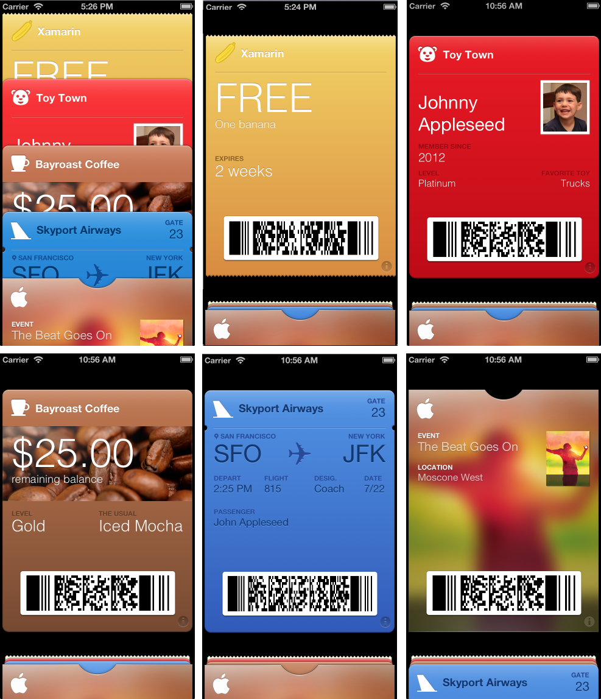](passkit-images/image3.png)

### File Structure

A Pass file is actually a ZIP archive with a **.pkpass** extension, containing
some specific JSON files (required), a variety of image files (optional) as well
as localized strings (also optional).

-   **pass.json** – required. Contains all the information for the pass.
-   **manifest.json** – required. Contains SHA1 hashes for each file in the pass except the signature file and this file (manifest.json).
-   **signature** – required. Created by signing the  `manifest.json` file with the certificate generated in the iOS Provisioning Portal.
-  **logo.png** – optional.
-  **background.png** – optional.
-  **icon.png** – optional.
-  **Localizable strings files** – optional.


Directory structure of a pass file is shown below (this is the contents of
the ZIP archive):

 [ 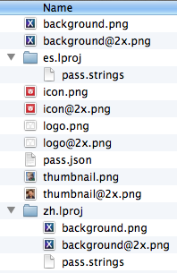](passkit-images/image4.png)

### pass.json

JSON is the format because passes are typically created on a server – it
means that the generation code is platform-agnostic on the server. The three key
pieces of information in every Pass are:

-   **teamIdentifier** – This links all Passes you generate to your App Store account. This value is visible in the iOS Provisioning Portal.
-   **passTypeIdentifier** – Register in Provisioning Portal to group passes together (if you produce more than one type). For example, a coffee shop might create a Store Card Pass Type to allow their customers to earn loyalty credits, but also a separate Coupon Pass Type to create and distribute discount coupons. That same coffee shop might even hold live music events and issue Event Ticket Passes for those.
-   **serialNumber** – A unique string within this  `passTypeidentifier` . The value is opaque to Wallet, but is important for tracking specific passes when communicating with your server.


There is a large number of other JSON keys in each Pass, an example of which
is shown below:

``` 
{
   "passTypeIdentifier":"com.xamarin.passkitdoc.banana",  //Type Identifier (iOS Provisioning Portal)
   "formatVersion":1,                                     //Always 1 (for now)
   "organizationName":"Xamarin",                          //The name which appears on push notifications
   "serialNumber":"12345436XYZ",                          //A number for you to identify this pass
   "teamIdentifier":"XXXAAA1234",                         //Your Team ID
   "description":"Xamarin Demo",                          //
   "foregroundColor":"rgb(54,80,255)",                    //color of the data text (note the syntax)
   "backgroundColor":"rgb(209,255,247)",                  //color of the background
   "labelColor":"rgb(255,15,15)",                         //color of label text and icons
   "logoText":"Banana ",                                  //Text that appears next to logo on top
   "barcode":{                                            //Specification of the barcode (optional)
      "format":"PKBarcodeFormatQR",                       //Format can be QR, Text, Aztec, PDF417
      "message":"FREE-BANANA",                            //What to encode in barcode
      "messageEncoding":"iso-8859-1"                      //Encoding of the message
   },
   "relevantDate":"2012-09-15T15:15Z",                    //When to show pass on screen. ISO8601 formatted.
  /* The following fields are specific to which type of pass. The name of this object specifies the type, e.g., boardingPass below implies this is a boarding pass. Other options include storeCard, generic, coupon, and eventTicket */
   "boardingPass":{
/*headerFields, primaryFields, secondaryFields, and auxiliaryFields are arrays of field object. Each field has a key, label, and value*/
      "headerFields":[          //Header fields appear next to logoText
         {
            "key":"h1-label",   //Must be unique. Used by iOS apps to get the data.
            "label":"H1-label", //Label of the field
            "value":"H1"        //The actual data in the field
         },
         {
            "key":"h2-label",
            "label":"H2-label",
            "value":"H2"
         }
      ],
      "primaryFields":[       //Appearance differs based on pass type
         {
            "key":"p1-label",
            "label":"P1-label",
            "value":"P1"
         }
      ],
      "secondaryFields":[     //Typically appear below primaryFields
         {
            "key":"s1-label",
            "label":"S1-label",
            "value":"S1"
         }
      ],
      "auxiliaryFields":[    //Appear below secondary fields
         {
            "key":"a1-label",
            "label":"A1-label",
            "value":"A1"
         }
      ],
      "transitType":"PKTransitTypeAir"  //Only present in boradingPass type. Value can
                                        //Air, Bus, Boat, or Train. Impacts the picture
                                        //that shows in the middle of the pass.
   }
}
```

### Barcodes

Only 2D formats are supported: PDF417, Aztec, QR. Apple claims that 1D
barcodes are unsuited to scanning on a backlit phone screen.

Alternate text displayed below the barcode is optional – some merchants
want to be able to read/type manually.

ISO-8859-1 encoding is the most common, check which encoding is used by the
scanning systems that will read your Passes.

### Relevancy (Lock Screen)

There are two types of data that can cause a Pass to be displayed on the
lock-screen:

 **Location**

Up to 10 locations can be specified in a Pass, eg stores that a customer
frequently visits, or the location of a cinema or airport. A customer could set
these locations via a Companion App or the provider could determine them from
usage data (if collected with the customer’s permission).

When the Pass is displayed on the lock-screen, a fence is calculated so that
when the user leaves the area the Pass is hidden from the lock-screen. The radius
is tied to pass style to prevent abuse.

 **Date and Time**

Only one date/time can be specified in a Pass. The date and time is useful
for triggering lock-screen reminders for boarding passes and event tickets.

Can be updated via push or via PassKit API, so that the date/time could be
updated in the case of a multiple-use ticket (such as a season ticket to a
theatre or sporting complex).

### Localization

Translating a Pass into multiple languages is similar to localizing an iOS
application – create language specific directories with the `.lproj` extension and place the localized elements inside. Text
translations should be entered into a `pass.strings` file, while
localized images should have the same name as the image they replace in the Pass
root.

## Security

Passes are signed with a private certificate that you generate in the iOS
Provisioning Portal. The steps to sign the pass are:

1.  Calculate a SHA1 hash for each file in the pass directory (do not include the  `manifest.json` or  `signature` file, neither of which should exist at this stage anyway).
1.  Write  `manifest.json` as a JSON key/value list of each filename with its hash.
1.  Use the certificate to sign the  `manifest.json` file and write the result to a file called  `signature` .
1.  ZIP the everything up and give the resulting file a `.pkpass` file extension.


Because your private key is required to sign the pass, this process should
only be done on a secure server that you control. DO NOT distribute your keys to
try and generate passes in an application.

 
## Configuration and Setup

This section contains instructions to help setup your provisioning details
and create your first pass.

### Provisioning PassKit

In order for a Pass to enter the App Store, it must be linked to a developer account. This requires two steps:

1.  The Pass must be registered using a unique identifier, called the Pass Type ID.
1.  A valid Certificate must be generated to sign the Pass with the developer's digital signature.

To create a Pass Type ID do the following.


<a name="create-passid"/>

#### Create a Pass Type ID

The first step is to set up a Pass Type ID for each different _type_ of Pass to be supported. The Pass ID (or Pass Type identifier) creates a unique identifier for the Pass. We will use this ID to link the Pass with your developer account using a Certificate.

1. In the  [Certificates, Identifiers, and Profiles section of the iOS Provisioning Portal](https://developer.apple.com/account/overview.action), navigate to  **Identifiers** and select  **Pass Type IDs** . Then select the **+** button to create a new pass type:
  [ 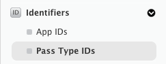](passkit-images/passid.png)

2.   Provide a **Description** (name) and **Identifier** (unique string) for the Pass. Note that all Pass Type IDs must begin with the string `pass.` In this example we use `pass.com.xamarin.coupon.banana` :
  [ 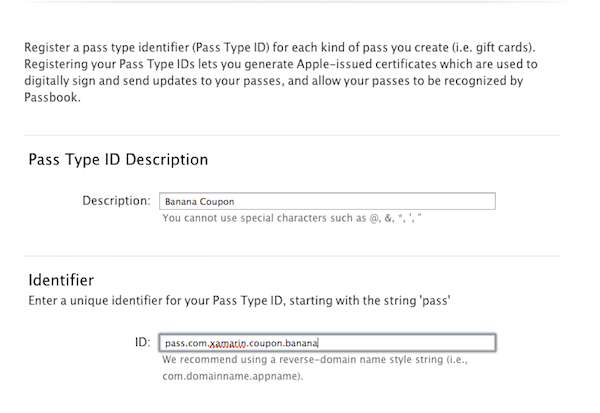](passkit-images/register.png)


3.   Confirm the Pass ID by pressing the **Register** button.


<a name="generate" />

#### Generate A Certificate

To create a new Certificate for this Pass Type ID, do the following:

1.  Select the newly created Pass ID from the list, and click **Edit** :
  [ 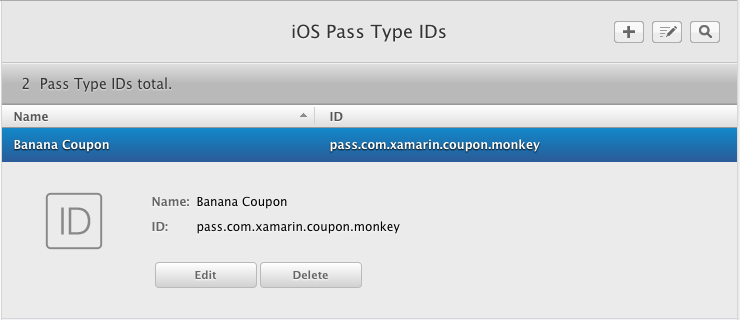](passkit-images/pass-done.png)

    Then, select  **Create Certificate…** :

    [ 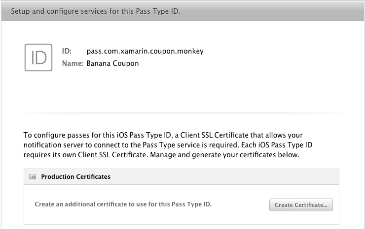](passkit-images/cert-dist.png)


2.  Follow the steps to create a Certificate Signing Request (CSR).
  
3. Press the **Continue** button on the developer portal and upload the CSR to generate your certificate.

4. Download the certificate and double-click on it to install it in your keychain.


Now that we have created a certificate for this Pass Type ID, the next
section describes how to build a Pass manually.

For more information on Provisioning for Wallet, refer to the [Working with Capabilities](~/ios/deploy-test/provisioning/capabilities/wallet-capabilities.md) guide.

 <a name="Create_a_Pass_Manually" />

### Create a Pass Manually

Now that we’ve created the Pass Type we can manually craft a Pass to test
on the simulator or a device. The steps to create a Pass are:

-  Create a directory to contain the Pass files.
-  Create a pass.json file that contains all the required data.
-  Include images in folder (if required).
-  Calculate SHA1 hashes for every file in the folder, and write to manifest.json.
-  Sign manifest.json with the downloaded certificate .p12 file.
-  ZIP the directory’s contents and rename with .pkpass extension.


There are some source files in the sample code for this article that can be
used to generate a pass. Use the files in the `CouponBanana.raw`
directory of the CreateAPassManually directory. The following files are
present:

 [ ](passkit-images/image18.png)

Open pass.json and edit the JSON. You must at least update the `passTypeIdentifier` and `teamIdentifer` to match your
Apple Developer account.

```csharp
"passTypeIdentifier" : "pass.com.xamarin.coupon.banana",
"teamIdentifier" : "?????????",
```

You must then calculate the hashes for each file and create the `manifest.json` file. It will look something like this when you’re
done:

```csharp
{
  "icon@2x.png" : "30806547dcc6ee084a90210e2dc042d5d7d92a41",
  "icon.png" : "87e9ffb203beb2cce5de76113f8e9503aeab6ecc",
  "pass.json" : "c83cd1441c17ecc6c5911bae530d54500f57d9eb",
  "logo.png" : "b3cd8a488b0674ef4e7d941d5edbb4b5b0e6823f",
  "logo@2x.png" : "3ccd214765507f9eab7244acc54cc4ac733baf87"
}
```

Next a signature must be generated for this file using the certificate (.p12
file) that was generated for this Pass Type ID.

 <a name="Signing_On_a_Mac" />


#### Signing On a Mac

Download the **Wallet Seed Support Materials** from the [Apple Downloads](https://developer.apple.com/downloads/index.action?name=Passbook) site. Use the `signpass` tool to turn your folder into a Pass (this will also calculate the SHA1 hashes and ZIP
the output into a .pkpass file).

 <a name="Signing_On_a_PC" />


#### Signing On a PC

In the sample code for this article there is a project called `signpassnet` that runs in .NET on Windows. It attempts to mimic
Apple’s tool however it includes much less validation code.

 <a name="Testing" />


#### Testing

If you were to examine the output of these tools (by setting the filename to
.zip and then opening it), you would see the following files (note the addition
of the `manifest.json` and `signature` files):

 [ 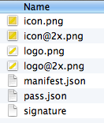](passkit-images/image19.png)

Once you have signed, ZIPped and renamed the file (eg. to `BananaCoupon.pkpass`) you can drag it into the simulator to test, or
email it to yourself to retrieve on a real device. You should see a screen to **Add** the pass, like this:

 [ 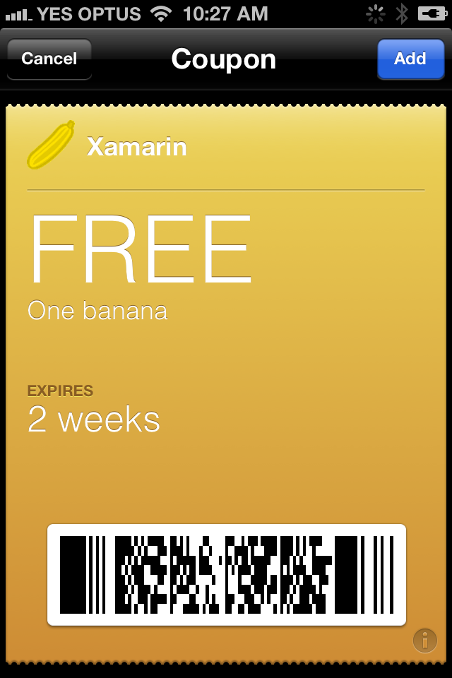](passkit-images/image20.png)

Normally that process would be automated on a server, however manual pass
creation might be an option for small businesses that are only creating coupons
that do not require the support of a back-end server.

 <a name="Wallet" />

## Wallet

Wallet is the central piece of the Pass Kit ecosystem. This screenshot
shows the empty Wallet, and how the Pass list and individual Passes look:

 [ 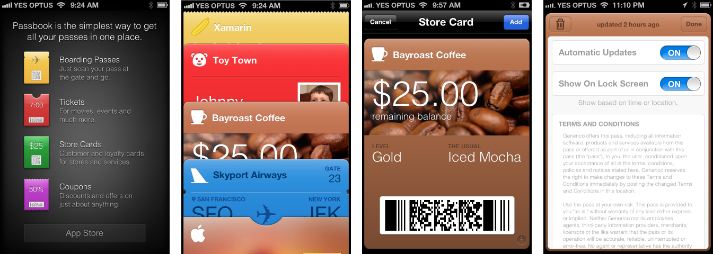](passkit-images/image21.png)

Features of Wallet include:

-  It is the only place that Passes are rendered with their barcode for scanning.
-  User can change the settings for updates. If enabled, push notifications can trigger updates to the data in the Pass.
-  User can enable or disable lock-screen integration. If enabled, this allows the Pass to automatically appear on their lock screen, based on relevant time and location data embedded in the pass.
-  The reverse side of the pass supports pull-to-refresh, if a web-server-URL is supplied in the Pass JSON.
-  Companion Apps can be opened (or downloaded) if the app’s ID is supplied in the Pass JSON.
-  Passes can be deleted (with a cute shredding animation).


 <a name="Getting_Passes_into_Wallet" />

## Adding Passes into Wallet

Passes can be added to Wallet in the following ways:

* **Conduit Apps** – These do not manipulate Passes directly, they simply load Pass files
and present the user with the option of adding them to Wallet. 

* **Companion Apps** – These are written by providers to distribute Passes and offer
additional functionality to browse or edit them. Xamarin.iOS applications have
complete access to the Pass Kit API to create and manipulate passes. Passes can
then be added to Wallet using the `PKAddPassesViewController`. This
process is described in more detail in the **Companion Applications** section of this document.

### Conduit Applications

Conduit applications are intermediate apps that might receive passes on
behalf of a user, and should be programmed to recognize their content-type and
provide functionality to add to the Wallet. Examples of conduit apps
include:

-   **Mail** – Recognizes attachment as a Pass.
-   **Safari** – Recognizes the Pass Content-Type when a Pass URL link is clicked.
-   **Other custom apps** – Any app that receive attachments or open links (social media clients, mail readers, etc).


This screenshot shows how **Mail** in iOS 6 recognizes a
Pass attachment and (when touched) offers to **Add** it to
Wallet.

 [ 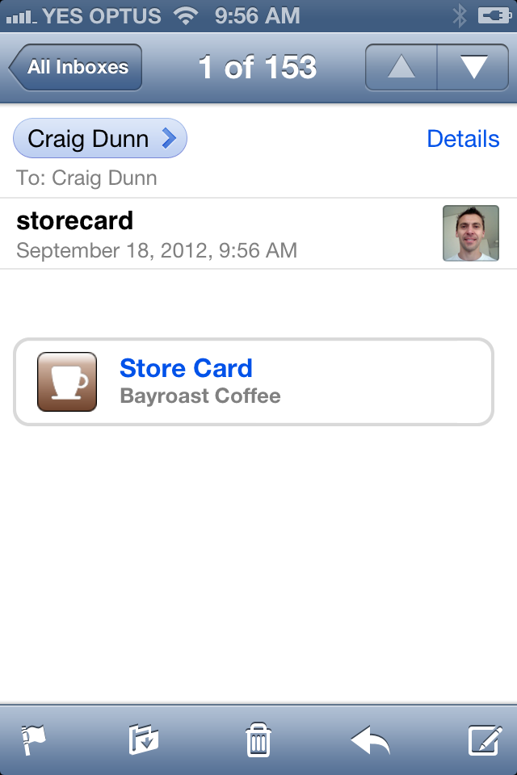](passkit-images/image22.png)

 [ 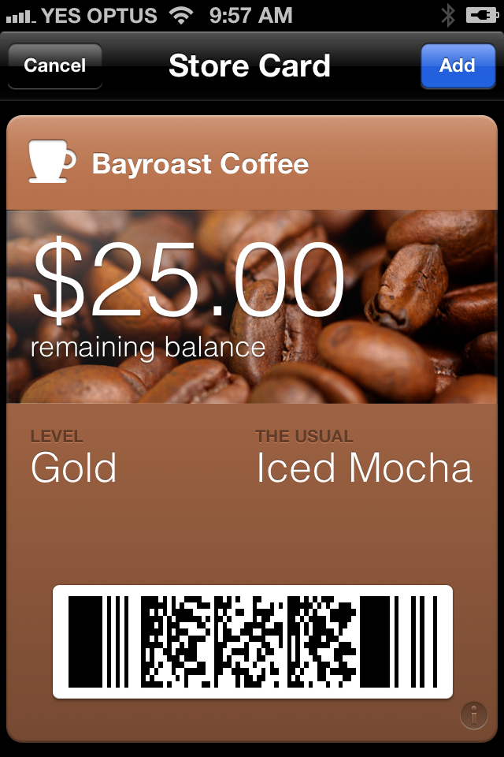](passkit-images/image23.png)

If you are building an app that could be a conduit for Passes, they can be
recognized by:

-  **File extension** - .pkpass
-  **MIME Type** - application/vnd.apple.pkpass
-  **UTI** – com.apple.pkpass


The basic operation of a conduit application is to retrieve the Pass file and
call Pass Kit’s `PKAddPassesViewController` to give the user the
option to add the Pass to their Wallet. The implementation of this view
controller is covered in the next section on **Companion Applications**.

Conduit Applications do not need to be provisioned for a specific Pass Type
ID in the same way that Companion Applications do.

## Companion Applications

A companion application provides additional functionality for working with
passes, including creating a Pass, updating information associated with a Pass
and otherwise managing Passes associated with the application.

Companion applications should not attempt to duplicate the features of
Wallet. They are not intended to display Passes for scanning.

This remainder of this section describes how to build a basic Companion App
that interacts with Pass Kit.

### Provisioning

Because Wallet is a store technology, the application needs to be provisioned separately and cannot use Team Provisioning Profile or Wildcard App ID. Refer to the [Working with Capabilities](~/ios/deploy-test/provisioning/capabilities/wallet-capabilities.md) guide to create a unique App ID and Provisioning Profile for the Wallet application.

### Entitlements

The **Entitlements.plist** file should be included in all recent Xamarin.iOS project. To add a new Entitlements.plist file, follow the steps in the [Working with Entitlements](~/ios/deploy-test/provisioning/entitlements.md) guide.

To set entitlements do the following:

# [Visual Studio for Mac](#tab/vsmac)

Double-click on the **Entitlements.plist** file in the Solution Pad to open the Entitlements.plist editor:

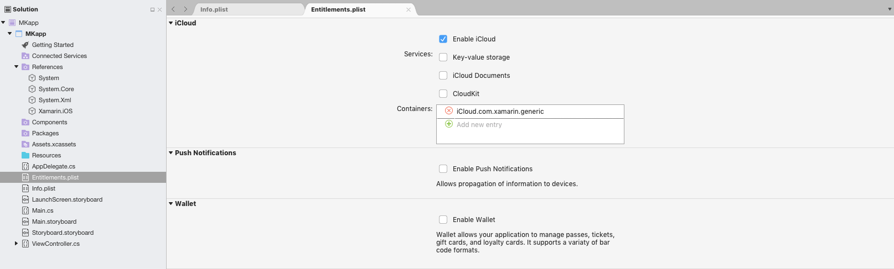

Under the Wallet section, select the **Enable Wallet** option

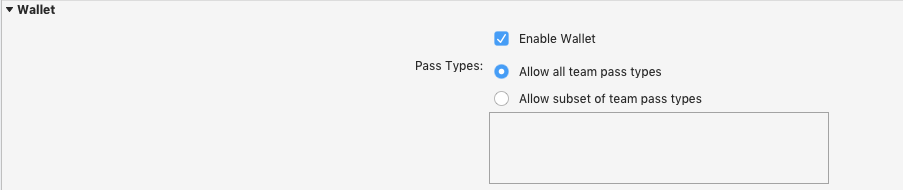


The default option is for your app to allow all pass types. However, it is possible to restrict your app and only allow a subset of team pass types. To enable this select the **Allow subset of team pass types** and enter the pass type identifier of the subset that you wish to allow.

# [Visual Studio](#tab/vswin)

Double-click the **Entitlements.plist** file to open the XML source file.

To add the Wallet entitlement, set the **Property** to `Passbook Identifiers` in the dropdown, which will automatically set the **Type** `Array`. Then, set the String **Value** to `$(TeamIdentifierPrefix)*`:


This will enable your app to allow all pass types. To restrict your app and only allow a subset of team pass types, set the string value to:

`$(TeamIdentifierPrefix)pass.$(CFBundleIdentifier)`

Where `pass.$(CFBundleIdentifier)` is the Pass ID that has been created [above](~/ios/platform/passkit.md)

-----

### Debugging

If you have problems deploying your application, check that you are using the
correct **Provisioning Profile** and that the `Entitlements.plist` is selected as the **Custom
entitlements** file in the **iPhone Bundle Signing**
options.

If you experience this error when deploying:

```csharp
Installation failed: Your code signing/provisioning profiles are not correctly configured (error: 0xe8008016)
```

then the `pass-type-identifiers` entitlements array is incorrect
(or does not match the **Provisioning Profile**). Verify the
Pass Type IDs and your Team ID are correct.

 <a name="Classes" />

## Classes

The following Pass Kit classes are available for apps to access Passes:

-  **PKPass** – An instance of a Pass.
-  **PKPassLibrary** – Provides the API to access the Passes on the device.
-  **PKAddPassesViewController** – Used to display a Pass for the user to save in their Wallet.
-  **PKAddPassesViewControllerDelegate** – Xamarin.iOS developers


## Example

Refer to the PassLibrary project in the sample code for this article. It
demonstrates the following common functions that would be required in a Wallet
Companion Application:

### Check that Wallet is Available

Wallet is not available on the iPad, so applications should check before
attempting to access Pass Kit features.

```csharp
if (PKPassLibrary.IsAvailable) {
    // create an instance and do stuff...
}
```

### Creating a Pass Library Instance

The Pass Kit library is not a singleton, applications should create and store
and instance to access the Pass Kit API.

```csharp
if (PKPassLibrary.IsAvailable) {
    library = new PKPassLibrary ();
    // do stuff...
}
```

### Get a List of Passes

Applications can request a list of Passes from the library. This list is
automatically filtered by Pass Kit, so that you can only see Passes that have
been created with your Team ID and which are listed in your Entitlements.

```csharp
var passes = library.GetPasses ();  // returns PKPass[]
```

Note that the simulator does not filter the list of Passes returned, so this
method should always be tested on real devices. This list can be displayed in a
UITableView, the sample app look like this after two coupons have been
added:

 [ ](passkit-images/image29.png)


### Displaying Passes

A limited set of information is available for rendering of passes within
companion apps.

Choose from this set of standard properties to display lists of passes, as
the example code does.

```csharp
string passInfo =
                "Desc:" + pass.LocalizedDescription
                + "\nOrg:" + pass.OrganizationName
                + "\nID:" + pass.PassTypeIdentifier
                + "\nDate:" + pass.RelevantDate
                + "\nWSUrl:" + pass.WebServiceUrl
                + "\n#" + pass.SerialNumber
                + "\nPassUrl:" + pass.PassUrl;
```

This string is shown as an alert in the sample:

 [ 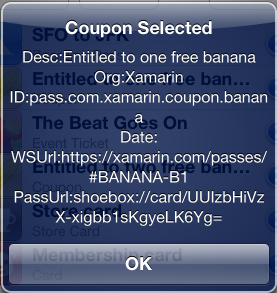](passkit-images/image30.png)

You can also use the `LocalizedValueForFieldKey()` method to
retrieve data from fields in the passes you have designed (since you will know
what fields should be present). The example code does not show this.

### Loading a Pass from a File

Because a Pass can only be added to Wallet with the user’s permission, a
view controller must be presented to let them decide. This code is used in the **Add** button in the example, to load a pre-built Pass that
is embedded in the app (you should replace this with one that you have
signed):

```csharp
NSData nsdata;
using ( FileStream oStream = File.Open (newFilePath, FileMode.Open ) ) {
        nsdata = NSData.FromStream ( oStream );
}
var err = new NSError(new NSString("42"), -42);
var newPass = new PKPass(nsdata,out err);
var pkapvc = new PKAddPassesViewController(newPass);
NavigationController.PresentModalViewController (pkapvc, true);
```

The pass is presented with **Add** and **Cancel** options:

 [ ](passkit-images/image20.png)

### Replace an Existing Pass

Replacing an existing Pass does not require the user’s permission, however
it will fail if the Pass does not already exist.

```csharp
if (library.Contains (newPass)) {
     library.Replace (newPass);
}
```

### Editing a Pass

PKPass isn’t mutable, so you cannot update Pass objects in your code. To
alter the data in a Pass an application must have access to a web server that
can keep a record of Passes and generate a new Pass file with updated values
which the application can download.

Pass file creation must be done on a server because Passes must be signed
with a certificate that must be kept private and secure.

Once an updated Pass file has been generated, use the `Replace`
method to overwrite the old data on the device.

### Display a Pass for scanning

As previously noted, only Wallet can display a Pass for scanning. A Pass
can be displayed using the `OpenUrl` method as shown:

 `UIApplication.SharedApplication.OpenUrl (p.PassUrl);`

### Receiving Notifications Of Changes

Applications can listen for changes being made to the Pass Library using the `PKPassLibraryDidChangeNotification`. Changes could be caused by
notifications triggering updates in the background, so it is good practice to
listen for them in your app.

```csharp
noteCenter = NSNotificationCenter.DefaultCenter.AddObserver (PKPassLibrary.DidChangeNotification, (not) => {
    BeginInvokeOnMainThread (() => {
        new UIAlertView("Pass Library Changed", "Notification Received", null, "OK", null).Show();
        // refresh the list
        var passlist = library.GetPasses ();
        table.Source = new TableSource (passlist, library);
        table.ReloadData ();
    });
}, library);  // IMPORTANT: must pass the library in
```

It is important to pass a library instance when registering for the
notification because PKPassLibrary is not a singleton.

## Server Processing

A detailed discussion of building a server application to support Pass Kit is
beyond the scope of this introductory article.

The .NET code provided in the *signpassnet* sample could be used as
the basis for a server-side method that can generate Passes.

View [WWDC Video: Introducing Passbook, Part 2](https://developer.apple.com/videos/wwdc/2012/?include=309#309) from 27:00 minutes
for more information.

### Other resources

See [dotnet-passbook](https://github.com/tomasmcguinness/dotnet-passbook) open source C# server-side code.

## Push Notifications

A detailed discussion of using push notifications to update Passes is beyond
the scope of this introductory article.

You would be required to implement the REST-like API defined by Apple to
respond to web requests from Wallet when updates are required. The .NET code
provided in the *signpassnet* sample could be used as the basis for
generating new Passes as a result of those requests.

View [WWDC Video: Introducing Passbook, Part 2](https://developer.apple.com/videos/wwdc/2012/?include=309#309) from 27:00 minutes
for more information.

## Summary

This article introduced Pass Kit, outlined some of the reasons why it is
useful and described the different parts that must be implemented for a full
Pass Kit solution. It described the steps required to configure your Apple
Developer account to create Passes, the process to make a Pass manually and also
how to access the Pass Kit APIs from a Xamarin.iOS application.

## Related Links

- [CreateAPassManually (sample)](https://developer.xamarin.com/samples/PassKit/)
- [PassKit Sample](https://developer.xamarin.com/samples/monotouch/PassKit/)
- [Introduction to iOS 6](~/ios/platform/introduction-to-ios6/index.md)
- [Passbook Programming Guide](https://developer.apple.com/library/prerelease/ios/#documentation/UserExperience/Conceptual/PassKit_PG/Chapters/Introduction.html)
- [Passbook for Developers](https://developer.apple.com/passbook/)
- [About Pass Files](https://developer.apple.com/library/prerelease/ios/#documentation/UserExperience/Reference/PassKit_Bundle/Chapters/Introduction.html)
- [Pass Kit Framework Reference](https://developer.apple.com/library/prerelease/ios/#documentation/UserExperience/Reference/PassKit_Framework/_index.html)
- [Pass Kit Framework Reference](https://developer.apple.com/library/prerelease/ios/#documentation/UserExperience/Reference/PassKit_Framework/_index.html)
- [Passbook Web Service Reference](https://developer.apple.com/library/prerelease/ios/#documentation/PassKit/Reference/PassKit_WebService/WebService.html)
