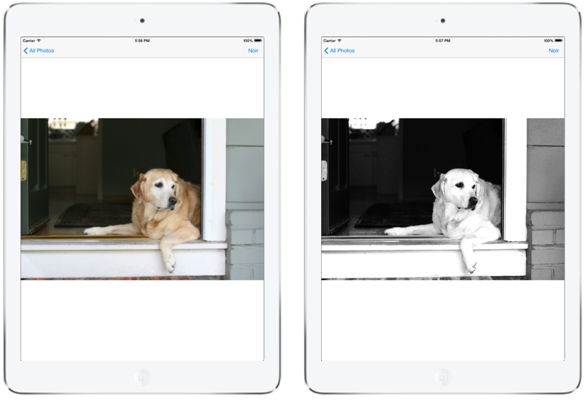

# PhotoKit in Xamarin.iOS

[ Download a code sample](/samples/xamarin/ios-samples/ios11-samplephotoapp/)

PhotoKit is a framework that allows applications to query the system image library and create custom user interfaces to view and modify its contents. It includes a number of classes that represent image and video assets, as well as collections of assets such as albums and folders.

## Permissions

Before your app can access the photo library, the user will be presented with a permissions dialog. You must provide explanatory text in the **Info.plist** file to explain how your app uses the photo library, for example:

```xml
<key>NSPhotoLibraryUsageDescription</key>
<string>Applies filters to photos and updates the original image</string>
```

## Model Objects

PhotoKit represents these assets in what it calls model objects. The model objects that represent the photos and videos themselves are of type `PHAsset`. A `PHAsset` contains metadata such as the asset’s media type and its creation date.
Similarly, the `PHAssetCollection` and `PHCollectionList` classes contain metadata about asset collections and collection lists respectively. Asset collections are groups of assets, such as all the photos and videos for a given year. Likewise, collection lists are groups of asset collections, such as photos and videos grouped by year.

## Querying Model Data

PhotoKit makes it easy to query model data through a variety of fetch methods. For example, to retrieve all images, you would call `PHAsset.Fetch`, passing the `PHAssetMediaType.Image` media type.

```csharp
PHFetchResult fetchResults = PHAsset.FetchAssets (PHAssetMediaType.Image, null);
```

The `PHFetchResult` instance would then contain all the `PHAsset` instances representing images. To get the images themselves, you use the `PHImageManager` (or the caching version, `PHCachingImageManager`) to make a request for the image by calling `RequestImageForAsset`. For example, the following code retrieves an image for each asset in a `PHFetchResult` to display in a collection view cell:

```csharp
public override UICollectionViewCell GetCell (UICollectionView collectionView, NSIndexPath indexPath)
{
    var imageCell = (ImageCell)collectionView.DequeueReusableCell (cellId, indexPath);
    imageMgr.RequestImageForAsset (
        (PHAsset)fetchResults [(uint)indexPath.Item],
        thumbnailSize,
        PHImageContentMode.AspectFill, new PHImageRequestOptions (),
        (img, info) => {
            imageCell.ImageView.Image = img;
        }
    );
    return imageCell;
}
```

This results in a grid of images as shown below:


## Saving Changes to the Photo Library

That’s how to handle querying and reading data. You can also write changes back to the library. Since multiple interested applications are able to interact with the system photo library, you can register an observer to be notified of changes using a `PhotoLibraryObserver`. Then, when changes come in, your application can update accordingly. For example, here’s a simple implementation to reload the collection view above:

```csharp
class PhotoLibraryObserver : PHPhotoLibraryChangeObserver
{
    readonly PhotosViewController controller;
    public PhotoLibraryObserver (PhotosViewController controller)

    {
        this.controller = controller;
    }

    public override void PhotoLibraryDidChange (PHChange changeInstance)
    {
        DispatchQueue.MainQueue.DispatchAsync (() => {
            var changes = changeInstance.GetFetchResultChangeDetails (controller.fetchResults);
            controller.fetchResults = changes.FetchResultAfterChanges;
            controller.CollectionView.ReloadData ();
        });
    }
}
```

To actually write changes back from your application, you create a change request. Each of the model classes has an associated change request class. For example, to change a `PHAsset`, you create a `PHAssetChangeRequest`. The steps to perform changes that are written back to the photo library and sent to observers like the one above are:

1. Perform the editing operation.
2. Save the filtered image data to a `PHContentEditingOutput` instance.
3. Make a change request to publish the changes from the editing output.

Here’s an example that writes back a change to an image that applies a Core Image noir filter:

```csharp
void ApplyNoirFilter (object sender, EventArgs e)
{
    Asset.RequestContentEditingInput (new PHContentEditingInputRequestOptions (), (input, options) => {

        // perform the editing operation, which applies a noir filter in this case
        var image = CIImage.FromUrl (input.FullSizeImageUrl);
        image = image.CreateWithOrientation((CIImageOrientation)input.FullSizeImageOrientation);
        var noir = new CIPhotoEffectNoir {
            Image = image
        };
        var ciContext = CIContext.FromOptions (null);
        var output = noir.OutputImage;
        var uiImage = UIImage.FromImage (ciContext.CreateCGImage (output, output.Extent));
        imageView.Image = uiImage;
        //
        // save the filtered image data to a PHContentEditingOutput instance
        var editingOutput = new PHContentEditingOutput(input);
        var adjustmentData = new PHAdjustmentData();
        var data = uiImage.AsJPEG();
        NSError error;
        data.Save(editingOutput.RenderedContentUrl, false, out error);
        editingOutput.AdjustmentData = adjustmentData;
        //
        // make a change request to publish the changes form the editing output
        PHPhotoLibrary.GetSharedPhotoLibrary.PerformChanges (() => {
            PHAssetChangeRequest request = PHAssetChangeRequest.ChangeRequest(Asset);
            request.ContentEditingOutput = editingOutput;
        },
        (ok, err) => Console.WriteLine ("photo updated successfully: {0}", ok));
    });
}
```

When the user selects the button, the filter is applied:



And thanks to the `PHPhotoLibraryChangeObserver`, the change is reflected in the collection view when the user navigates back:

