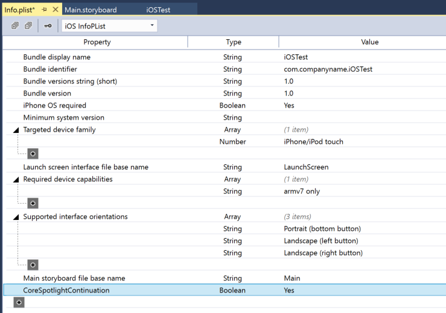

# App Search Enhancements in Xamarin.iOS

_This article covers the enhancements Apple has made to App Search in iOS 10 and how to implement them in Xamarin.iOS._

In iOS 10, Apple has made several enhancements to App Search such as Crowdsourced Deep-Linking, In-App Searching, Search Continuation and Visualization of Validation Results. This article will cover implementing these features in a Xamarin.iOS app.

## About App Search Enhancements

Core Spotlight in iOS 10 provides several enhancements to App Search such as:

- **Crowdsourced Deep-Link Popularity (with differential privacy)** - Provides a way to promote deep-linked app content in search results.
- **In-App Searching** - Use the new `CSSearchQuery` class to provide in-app Spotlight search ability similar to how the Mail, Messages and Notes apps work.
- **Search Continuation** - Allows a user to start a search in Spotlight or Safari, then open an app and continue that search.
- **Visualization of Validation Results** - Apple's [App Search API Validation Tool](https://search.developer.apple.com/appsearch-validation-tool) now displays a visual representation of a website's markup and deep-linking when preforming tests.
- **Message App Image Sharing** - Allows popular in-app images provided for sharing in Messages (via a Message App Extension) to appear in Spotlight searches.

The following sections will cover these topics in more detail.

## Crowdsourced Deep-Link Popularity

iOS 10 provides a mechanism to count the frequency that popular deep-links into an app are followed by the user and uses this information to improve the ranking of an app's content in search results, while still protecting the user's identity by using *Differential Privacy*.

For app's that use `NSUserActivity` objects to provide deep-link URLs and have the `EligibleForPublicIndexing` property set to `true`, iOS 10 submits a subset of *Differential Privacy Hashes* to Apple's servers. This information is then used to promote popular in-app content in search results.

For more information on implementing deep-linking in a Xamarin.iOS app, please see our [Search with NSUserActivity](~/ios/platform/search/nsuseractivity.md) documentation.

## In-App Searching

By implementing the new [CSSearchQuery](https://developer.apple.com/reference/corespotlight/cssearchquery) class, an app can provide Spotlight's search and matching rule technology to find content inside of itself, without the user having to leave the app (similar to how the Mail, Messages and Notes app work).

Typically, apps that support `CSSearchQuery` will not need to maintain their own, separate search index.

## Search Continuation

In iOS 9, Apple introduced the Search APIs (such as Core Spotlight, `NSUserActivity` and web markup) to provide deep-liking of content within an app to allow users to search for that content using both the Spotlight and Safari search interfaces. See our [New Search APIs](~/ios/platform/search/index.md) documentation for more details.

In iOS 10 Apple builds upon this feature by allowing the user to start a search in Spotlight or Safari, then continue the search when they open an app.

To implement this feature, edit the app's `Info.plist` file, add the `CoreSpotlightContinuation` key of type **Boolean** and set its value to `YES`:

# [Visual Studio for Mac](#tab/macos)

[](app-search-enhancements-images/search01.png#lightbox)

# [Visual Studio](#tab/windows)

[](app-search-enhancements-images/search01.png#lightbox)

-----

To respond to the user continuing a search result (`NSUserActivity`), edit the `AppDelegate.cs` file and override the `ContinueUserActivity` method. For example:

```csharp
public override bool ContinueUserActivity (UIApplication application, NSUserActivity userActivity, UIApplicationRestorationHandler completionHandler)
{

    // Take action based on the activity type
    switch (userActivity.ActivityType) {
    case "com.xamarin.platform":
        // Restore the state of the app here...
        break;
    default:
        if (userActivity.ActivityType == CSSearchQuery.ContinuationActionType) {
            var search = userActivity.UserInfo.KeyForValue(CSSearchQuery.QueryString);
            // Continue user's search here...
        }
        break;
    }

    return true;
}
```

This code looks for the query continuation action type (`userActivity.ActivityType == CSSearchQuery.ContinuationActionType`), then reads the user's current query from the `NSUserActivity` class's user info dictionary (`userActivity.UserInfo.KeyForValue(CSSearchQuery.QueryString)`). From here, the app needs to take action to continue the user's search.

For more information on working with searches in a Xamarin.iOS app, please see our [Search with Core Spotlight](~/ios/platform/search/corespotlight.md) documentation.

## Visualization of Validation Results

Apple's [App Search API Validation Tool](https://search.developer.apple.com/appsearch-validation-tool) now displays a visual representation of a website's markup and deep-linking (including markup such as defined at [Schema.org](https://schema.org/)) when preforming tests.

By using the Validation Tool, a developer can see the information that the Applebot Web Crawler has indexed for the site such as title, description, URL and any other supported elements.

For more information on working with Web Markup, please see our [Seach with Web Markup](~/ios/platform/search/web-markup.md) documentation.

## Message App Image Sharing

If a Message App Extension provides images for sharing in Messages, the extension can be configured to allow the user to perform Spotlight searches for popular images from within the Messages, without having to leave the app.

To enable this feature, do the following:

1. Create a Message App Extension.
2. Add the `com.apple.developer.associated-domains` to the app's entitlements and include a list of web domains that host the images the Message App Extension is sharing. For each domain, specify the `spotlight-image-search` service.
3. Add a `apple-app-site-association` file to the website that is hosting the images. This file includes a dictionary for the `spotlight-image-search` service and includes the app's ID, which is the Team ID or App ID prefix followed by the Bundle ID. The file can contain up to 500 paths and patterns that will be indexed by Spotlight and included in popular image searches. For more information, please see Apple's [Creating and Uploading the Association File](https://developer.apple.com/library/prerelease/content/documentation/General/Conceptual/AppSearch/UniversalLinks.html#//apple_ref/doc/uid/TP40016308-CH12-SW4) documentation.
4. Allow the Applebot to crawl the websites. Please see Apple's [About Applebot](https://support.apple.com/HT204683) documentation.

See our [Message App Integration](~/ios/platform/message-app-integration/index.md) documentation for more details.

## Summary

This article has covered the enhancements Apple has made to App Search in iOS 10 and how to implement them in Xamarin.iOS.

## Related Links

- [iOS 10 Samples](/samples/browse/?products=xamarin&term=Xamarin.iOS%2biOS10)