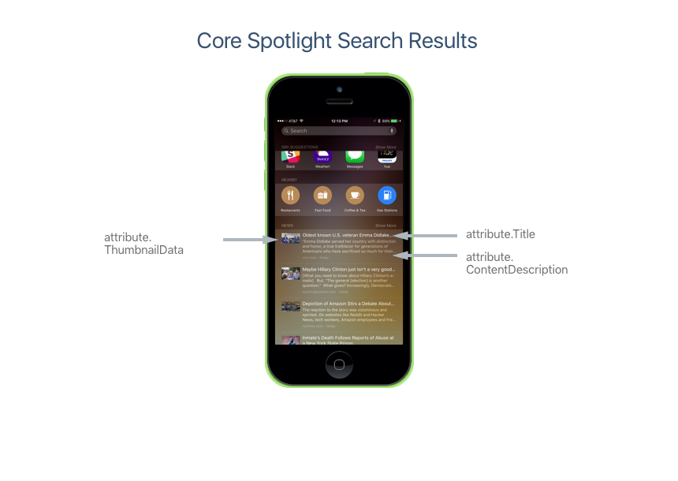
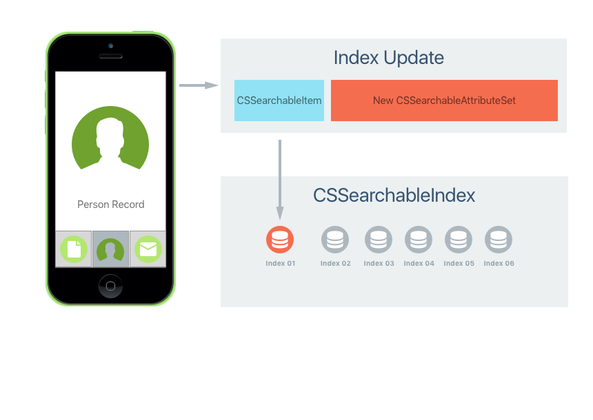

# Search with Core Spotlight in Xamarin.iOS

Core Spotlight is a new framework for iOS 9 that presents a database-like API
to add, edit or delete links to content within your app. Items that have been
added using Core Spotlight will be available in Spotlight search on the iOS device.

For an example of the types of content that can be indexed using Core Spotlight,
look at Apple's Messages, Mail, Calendar and Notes apps. They all currently use
Core Spotlight to provide search results.

## Creating an Item

The following is an example of creating an item and indexing it using Core Spotlight:

```csharp
using CoreSpotlight;
...

// Create attributes to describe an item
var attributes = new CSSearchableItemAttributeSet();
attributes.Title = "App Center Test";
attributes.ContentDescription = "Automatically test your app on 1,000 devices in the cloud.";

// Create item
var item = new CSSearchableItem ("1", "products", attributes);

// Index item
CSSearchableIndex.DefaultSearchableIndex.Index (new CSSearchableItem[]{ item }, (error) => {
    // Successful?
    if (error !=null) {
        Console.WriteLine(error.LocalizedDescription);
    }
});
```

This information would appear like the following in a search result:

[](corespotlight-images/corespotlight01.png#lightbox)

## Restoring an Item

When the user taps on an item added to the Search result via Core Spotlight for
your app, the `AppDelegate` method `ContinueUserActivity` is called (this
method is also used for `NSUserActivity`). For example:

```csharp
public override bool ContinueUserActivity (UIApplication application,
   NSUserActivity userActivity, UIApplicationRestorationHandler completionHandler)
{

    // Take action based on the activity type
    switch (userActivity.ActivityType) {
    case "com.xamarin.platform":
        // Restore the state of the app here...
        break;
    default:
        if (userActivity.ActivityType == CSSearchableItem.ActionType.ToString ()) {
            // Display content for searchable item...
        }
        break;
    }

    return true;
}
```

Note that this time we are check for the activity having an
`ActivityType` of `CSSearchableItem.ActionType`.

## Updating an Item

There might be times when an Index Item we created with Core Spotlight need to
be modified, such as a change in title or thumbnail image is required. To make
this change, we use the same method as was used to initially create the index.
We create a new `CSSearchableItem` using the same ID as was used to create the
item and attach a new `CSSearchableItemAttributeSet` containing the modified attributes:

[](corespotlight-images/corespotlight02.png#lightbox)

When this item is written to the searchable index, the existing item is updated with the new information.

## Deleting an Item

Core Spotlight provides multiple ways to delete an index item when it is no longer required.

First, you can delete an item by its identifier, for example:

```csharp
// Delete Items by ID
CSSearchableIndex.DefaultSearchableIndex.Delete(new string[]{"1","16"},(error) => {
    // Successful?
    if (error !=null) {
        Console.WriteLine(error.LocalizedDescription);
    }
});
```

Next, you can delete a group of index items by their domain name. For example:

```csharp
// Delete by Domain Name
CSSearchableIndex.DefaultSearchableIndex.DeleteWithDomain(new string[]{"domain-name"},(error) => {
    // Successful?
    if (error !=null) {
        Console.WriteLine(error.LocalizedDescription);
    }
});
```

Finally, you can delete all Index Items with the following code:

```csharp
// Delete all index items
CSSearchableIndex.DefaultSearchableIndex.DeleteAll((error) => {
    // Successful?
    if (error !=null) {
        Console.WriteLine(error.LocalizedDescription);
    }
});
```

## Additional Core Spotlight Features

Core Spotlight has the following features that help to keep the index accurate
and up-to-date:

- **Batch Update Support** – If your app needs to create or modify a large group of indexes at the same time, the entire batch can be sent to the `Index` method of the `CSSearchableIndex` class in one call.
- **Respond to Index Changes** – Using the `CSSearchableIndexDelegate` your app can respond to changes and notifications from the searchable index.
- **Apply Data Protection** – Using the data protection classes, you can implement security on the items that you add to the searchable index using Core Spotlight.

## Related Links

- [iOS 9 Samples](/samples/browse/?products=xamarin&term=Xamarin.iOS%2biOS9)
- [iOS 9.0](https://developer.apple.com/library/prerelease/ios/releasenotes/General/WhatsNewIniOS/Articles/iOS9.html)
- [App Search Programming Guide](https://developer.apple.com/library/prerelease/ios/documentation/General/Conceptual/AppSearch/index.html#//apple_ref/doc/uid/TP40016308)