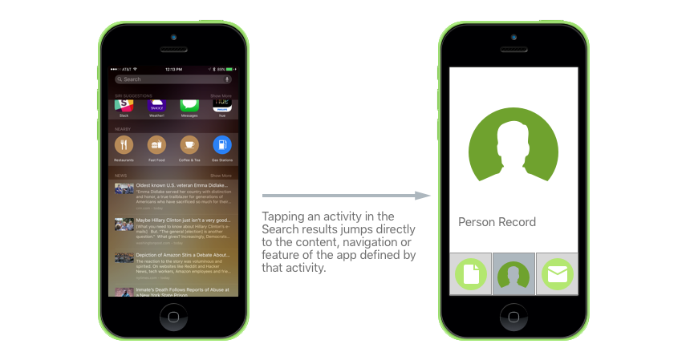

# Search APIs in Xamarin.iOS

_This article covers using the App Search APIs provided by iOS 9 to allow users to search for information and features inside your Xamarin.iOS apps._

Search has been expanded in iOS 9 to provide great new ways to access information
and features inside a Xamarin.iOS app. Using the new App Search APIs, app content
is made searchable through Spotlight and Safari search results, Handoff and Siri
Reminders and Suggestions. This allows users to quickly access activities and
information deep within your app.

Additionally, the new Search APIs make it easier to integrate search in your app
without prior search implementation experience. Because of this, Apple claims
that it typically takes a few hours to make an iOS 9 app's content universally
searchable using App Search.

App Search is composed of three separate APIs:

1. [**NSUserActivity**](nsuseractivity.md) - This is an extension of the Handoff API that Apple
    released in iOS 8. It is used to make app interaction history searchable
    both publicly and privately) by the user.

2. [**Core Spotlight**](corespotlight.md) - Allows an app to index its content to be presented in
    search results. It works like a database API where items can be added and
    removed and it is the best way to index private content within an app.

3. [**WebMarkup**](web-markup.md) - For apps that provide access to their content via a web
    interface (not only from within the app). Web content can be marked up with
    special links that will be crawled by Apple and provide deep linking to your
    app on the user's iOS 9 device.

## Selecting an App Search Approach

Deciding which of these methods to implement depends on the types of interaction
provided by your app and the type of content it presents.

Use the following guidelines:

- [**NSUserActivity**](nsuseractivity.md) – Use this framework to provide searchability for both
  public and private content and also searchability of navigation points within your app.

- [**Core Spotlight**](corespotlight.md) – Use this framework to provide
  searchability for private data stored on the device.

- [**Web Markup**](web-markup.md) – Use this framework to provide searchability for apps that present
  their content not only from within the app, but from the app's website as well.

Each of the App Search approaches are distinct and can be used individually,
however Apple designed them to work together. When using more than one approach
to index a specific item, ensure that you use the same **Item ID** on each approach,
so that individual links work together.

Using more than one approach not only ensures that your content will be found by
the end user but also helps to improve your item's ranking from within search.

While the ranking process in mostly transparent to the developer, user interaction
with a given item weighs heavily upon this rank (for example the user taping a link).
By providing rich, informative items, you can ensure that a user will be enticed to
interact with your content, thus raising its ranking.

## What Content to Index

Apple provides the following suggestions as to what content and actions to provide
search indexes for in your app:

- Any content viewed, created or curated by the user from within your app.
- Navigation points and features within the app.
- Things like new messages, content or other types of items displayed by your app that
have recently been downloaded to the device.

## App Search Enhancements

Core Spotlight in iOS 10 provides several enhancements to App Search such as:

- **Crowdsourced Deep-Link Popularity (with differential privacy)** - Provides a way to promote deep-linked app content in search results.
- **In-App Searching** - Use the new `CSSearchQuery` class to provide in-app Spotlight search ability similar to how the Mail, Messages and Notes apps work.
- **Search Continuation** - Allows a user to start a search in Spotlight or Safari, then open an app and continue that search.
- **Visualization of Validation Results** - Apple's [App Search API Validation Tool](https://search.developer.apple.com/appsearch-validation-tool) now displays a visual representation of a website's markup and deep-linking when preforming tests.
- **Message App Image Sharing** - Allows popular in-app images provided for sharing in Messages (via a Message App Extension) to appear in Spotlight searches.

To find out more, please see our [App Search Enhancements](~/ios/platform/search/app-search-enhancements.md) guide.

### Proactive Suggestions

iOS 10 presents new ways of driving engagement to an app by allowing the system to proactively present helpful information automatically to the user at appropriate times. Just as iOS 9 provided the ability to add deep search to the app using Spotlight, Handoff and Siri Suggestions, with iOS 10 an app can expose functionality that can be presented to the user by the system from within the following locations:

- The App Switcher
- The Lock Screen
- CarPlay
- Maps
- Siri Interactions
- QuickType Suggestions 

An app exposes this functionality to the system using a collection of technologies such as [NSUserActivity](xref:Foundation.NSUserActivity), web markup, Core Spotlight, MapKit, Media Player and UIKit.

To find out more, please see our [Proactive Suggestions](~/ios/platform/search/proactive-suggestions.md) guide.

## Summary

This article has covered the new Search API features that iOS 9 provides for
Xamarin.iOS apps. It covered [NSUserActivity](nsuseractivity.md), [Core Spotlight](corespotlight.md)
and [Web Markup](web-markup.md) methods for indexing content. It finished with a short discussion
of when a given search approach should be used and what types of content should be indexed.

## Related Links

- [iOS 9 Samples](/samples/browse/?products=xamarin&term=Xamarin.iOS%2biOS9)
- [iOS 9.0](https://developer.apple.com/library/prerelease/ios/releasenotes/General/WhatsNewIniOS/Articles/iOS9.html)
- [App Search Programming Guide](https://developer.apple.com/library/prerelease/ios/documentation/General/Conceptual/AppSearch/index.html#//apple_ref/doc/uid/TP40016308)