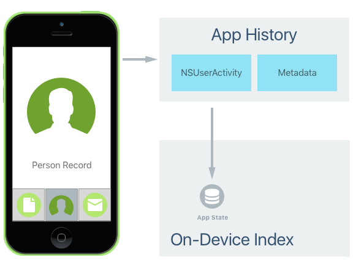
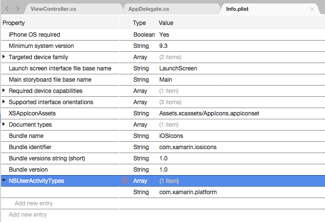
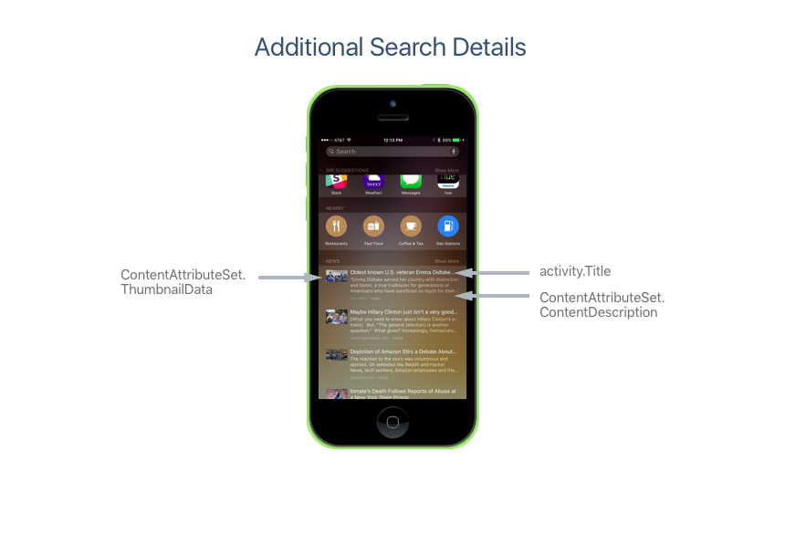
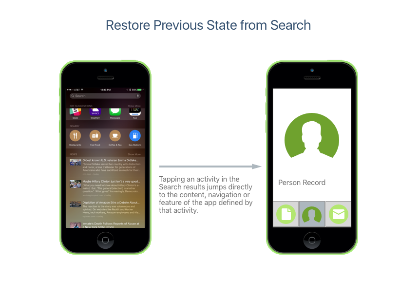

# Search with NSUserActivity in Xamarin.iOS

`NSUserActivity` was introduced in iOS 8 and is used to provide the data for Handoff.
It allows you to create activities in specific parts of your app that can then be
passed off to another instance of your app running on a different iOS device. The
receiving device can then continue the activity started on the previous device,
picking up right where the user left off. For more information on using Handoff,
please see our [Introduction to Handoff](~/ios/platform/handoff.md) documentation.

New to iOS 9, `NSUserActivity` can be indexed (both publicly and privately) and
searched from Spotlight Search and Safari. By marking a `NSUserActivity` as
searchable and adding indexable metadata, the activity can be listed in the
search results  on the iOS device.

[](nsuseractivity-images/apphistory01.png#lightbox)

If the user selects a search result that belongs to an activity from your app,
the app will be launched and the activity described by the `NSUserActivity` will
be restarted and presented to the user.

The following properties of `NSUserActivity` are used to support App Search:

- `EligibleForHandoff` – If `true`, this activity can be used in a Handoff operation.
- `EligibleForSearch` – If `true`, this activity will be added to the on-device index and presented in search results.
- `EligibleForPublicIndexing` – If `true`, this activity will be added to Apple's cloud based index and presented to users (via search) that have not already installed your app on their iOS device. See the [Public Search Indexing](#public-search-indexing) section below for more details.
- `Title` – Provides a title for your activity and is displayed in the search results. Users can also search for the text of the title itself.
- `Keywords` – Is an array of strings used to describe your activity that will be indexed and made searchable by the end user.
- `ContentAttributeSet` – Is a `CSSearchableItemAttributeSet` used to further describe your activity in detail and provide rich content in the search results.
- `ExpirationDate` – If you want an activity to only be shown up to a given date, you can provide that date here.
- `WebpageURL` – If the activity can be viewed on the web or if your app supports Safari's deep links, you can set the link to visit here.

## NSUserActivity Quickstart

Follow these instructions to implement a searchable `NSUserActivity` in your app:

- [Creating Activity Type Identifiers](#creatingtypeid)
- [Creating an Activity](#createactivity)
- [Responding to an Activity](#respondactivity)
- [Public Search Indexing](#indexing)

There are some [additional benefits](#benefits) to using `NSUserActivity`
to make your content searchable.

<a name="creatingtypeid"></a>

## Creating Activity Type Identifiers

Before you can create a Search Activity, you'll need to create an _Activity Type Identifier_ to identify it. The Activity Type Identifier is a short string added to the `NSUserActivityTypes` array of the app's **Info.plist** file used to uniquely identify a given User Activity Type. There will be one entry in the array for each activity that the app supports and exposes to App Search. 

Apple suggests using a reverse-DNS-style notation for the Activity Type Identifier to avoid collisions. For example: `com.company-name.appname.activity` for specific app based activities or `com.company-name.activity` for activities that can run across multiple apps.

The Activity Type Identifier is used when creating a `NSUserActivity` instance to identify the type of activity. When an activity is continued as the result of the user tapping a search result, the Activity Type (along with the app’s Team ID) determines which app to launch to continue the activity.

To create the required Activity Type Identifiers to support this behavior, edit the **Info.plist** file and switch to the **Source** view. Add a `NSUserActivityTypes` key and create identifiers in the following format:

[](nsuseractivity-images/type01.png#lightbox)

In the above example, we created one new Activity Type Identifier for the search activity (`com.xamarin.platform`). When creating your own apps, replace the contents of the `NSUserActivityTypes` array with the Activity Type Identifiers specific to the activities your app supports.

<a name="createactivity"></a>

## Creating an Activity

The following is an example of creating an activity for a on-device index hosted search:

```csharp
// Create App Search Activity
var activity = new NSUserActivity ("com.xamarin.platform");

// Define details
var info = new NSMutableDictionary ();
info.Add(new NSString("link"),new NSString("http://xamarin.com/platform"));

// Populate Activity
activity.Title = "The Xamarin Platform";
activity.UserInfo = info;

// Add App Search ability
activity.EligibleForSearch = true;
activity.BecomeCurrent();
```

We could add further details by setting the `ContentAttributeSet` property of our `NSUserActivity` as follows:

[](nsuseractivity-images/apphistory02.png#lightbox)

By using a `ContentAttributeSet` you can create rich search results that entice the end user to interact with them.

<a name="respondactivity"></a>

## Responding to an Activity

To respond to the user tapping on a search result (`NSUserActivity`) for our app, edit the **AppDelegate.cs** file and override the `ContinueUserActivity` method. For example:

```csharp
public override bool ContinueUserActivity (UIApplication application, NSUserActivity userActivity, UIApplicationRestorationHandler completionHandler)
{

    // Take action based on the activity type
    switch (userActivity.ActivityType) {
    case "com.xamarin.platform":
        // Restore the state of the app here...
        break;
    }

    return true;
}
```

Note that this is the same method override used to respond to Handoff requests. Now if the user clicks on a link from our app in the Spotlight Search results, our app will be brought to the foreground (or started if not already running) and the content, navigation or feature represented by that link will be displayed:

[](nsuseractivity-images/apphistory03.png#lightbox)

<a name="indexing"></a>

## Public Search Indexing

As we saw above, iOS 9 makes it easy to provide search access to app content and features that the user has already discovered and used on a given iOS device. With Public Indexing, iOS 9 provides a way for users who haven't discovered content or features yet (or who haven't even installed the app) to get those results in their searches too.

Public Indexing works in the following way:

1. When you create an activity for your app you can mark it as public.
2. Public activities are sent to Apple and indexed in the cloud.
3. As more users interact with your app on a device and use the specific feature or content represented by the activity, it rises in rank.
4. Popular public results will be available to other users, even if they don't have the app installed.
5. These public results will show up in Spotlight Search and Safari (if the activity includes a URL).

We can take the private search activity that we created above, and expand it to be public:

```csharp
// Create App Search Activity
var activity = new NSUserActivity ("com.xamarin.platform");

// Define details
var info = new NSMutableDictionary ();
info.Add(new NSString("link"),new NSString("http://xamarin.com/platform"));

// Populate Activity
activity.Title = "The Xamarin Platform";
activity.UserInfo = info;

// Add App Search ability
activity.EligibleForSearch = true;
activity.EligibleForPublicIndexing = true;
activity.BecomeCurrent();
```

Just because an activity has been set for public indexing by setting `EligibleForPublicIndexing = true`, it doesn't mean that it will be automatically added to Apple's public cloud index. The following conditions must be met first:

1. It must appear in search results and be selected by many users. The results remain private until an activity engagement threshold has been met.
2. App provisioning prevents any user-specific data from being indexed and made public.

<a name="benefits"></a>

## Additional Benefits

By adopting App Search via `NSUserActivity` in your app, you also get the following features:

- **Handoff** - Since App Search is exposing content, navigation and/or features using the same mechanism as Handoff (`NSUserActivity`), you can easily allow your app's users to start an activity on one device and continue it on another.
- **Siri Suggestions** - Along with the standard suggestions that Siri Suggestions normally makes, actives from your app can be automatically suggested.
- **Siri Smart Reminders** - Users will be able to ask Siri to remind them about activities from your app.

## Related Links

- [iOS 9 Samples](/samples/browse/?products=xamarin&term=Xamarin.iOS%2biOS9)
- [iOS 9.0](https://developer.apple.com/library/prerelease/ios/releasenotes/General/WhatsNewIniOS/Articles/iOS9.html)
- [App Search Programming Guide](https://developer.apple.com/library/prerelease/ios/documentation/General/Conceptual/AppSearch/index.html#//apple_ref/doc/uid/TP40016308)
- [Blog post & sample](https://blog.xamarin.com/improve-discoverability-with-search-in-ios-9/)